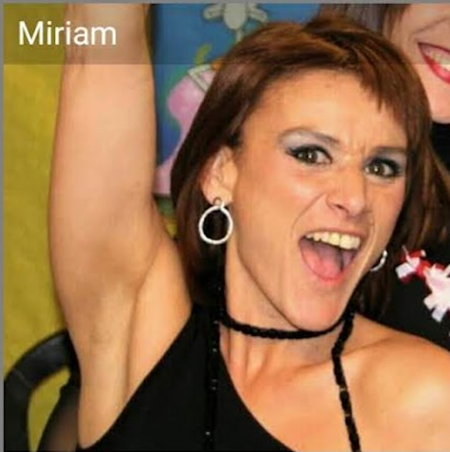

### Denuncia contra  Andreu Casadesus y Adam Marsal Llobet

Apreciada comisaria de los mossos d'Esquadra yo Riccardo Giuntoli con NIE **X9770628K** y domicilio en **c/ Mossen Anton Miret 10 2/1 08810 sant Pere de Ribes** quisiera denunciar que soy victima de **acoso organizado** por parte de un grupo criminal lo cual dueño es **Andreu Casadesus**.

Opera en toda Catalunya  y ha sido contratado por parte de mi ex socio de empresa señor **Adam Marsal Llobet** con DNI **47700400X** para inducirme a suicidio después de haberme substraído a través de una estafa orquestada magistralmente  el cincuenta por ciento de las acciones de la empresa de lo cual era administrador junto a el. Empresa de lo cual había creado el diseño técnico integral siendo yo un informático de telecomunicaciones y el un lampista. Dada su naturaleza de poca cultura es muy probable que haya sido guiado por una tercera persona, a mi manera de ver los hechos probablemente identificable con la figura de su padre, don **Angel Marsal** empresario de reputación en la zona del Vallès Occidental.

Soy victima de un sistema de apuestas remoto donde se pon en juego mi vida y todo lo que hago cada día. Del mismo sistema han muerto suicidas muchos jóvenes y el señor en cuestión  es un criminal peligroso. Pido también protección policial y una orden de alejamiento. 

En esta foto de los años ochenta que he encontrado en su misma casa donde fui victima de un robo con violencia en 2018 se ve el criminal. 

.jpg)

Esta fotografía mas reciente es su perfil de la mensajería social Whatsup del número de teléfono móvil **+34602157743** pertenece al periodo en lo cual lo he conocido y frecuentado entra 2016 y 2017. 

Mi vida ha sido maquinada en una serie de eventos catastróficos por este individuo y una serie de otros participantes a su grupo que se ocupa de hacer suicidar personas bajo contrato. El grupo entero perpetua lo que se llama acoso organizado de forma física a través de lesiones, robos y humillaciones y de forma digital a través de un sistema de radio frecuencia muy complejo que incumple las leyes de atribución de radio frecuencia dictadas por la comisión de mercado de telecomunicaciones. 

En un aplazamiento que yo mismo monté que pertenece al ayuntamiento de sant Fost de Campsentelles he encontrado en fecha 9 de Diciembre 2019 en coordenadas **41.4916667,2.2386111** alquilado por la empresa **MESWIFI S.L**. con CIF **B65674129** los sistemas de radio telecomunicación utilizados por esta banda de criminales que generan dinero utilizando un sistema de apuestas remoto donde las victimas vienen puesta bajo extremo estrés nervioso y continuo **acecho**. 

Se pueden observar dos antenas de bucle magnético que operan en las frecuencias menor de 150Hz, una antena de VHF en 462KHz, y otra de la cual desconozco el utilizo pero seguramente se trate de radar a 2.2GHz.

En sucesión temporal esto los hechos que me han ocurrido:

1.  **28 de Noviembre 2015** un accidente de moto en lo cual he perdido la movilidad de la mano izquierda quedándome parapléjico de por vida. Accidente provocado por un arresto improviso de una furgoneta en la autopista C32 a la altura de Villadecans, Barcelona. Alego documento de Mossos d'Esquadra área regional de Transit. No recuperaré nunca la moto accidentada Yamaha R6 de matricula **5159DDK** y bastidor **JYARJ095000000556** como detallo en anexo "**denuncia contra Hamamatsu motor**".
2. **Noviembre 2016** cese de actividad en la empresa MESWIFI. Desde Agosto 2016 don Adam Marsal Llobet cierra sistemáticamente mi acceso a la empresa tanto por administración remota que ejecutaba diariamente en mi domicilio de av/ de les Palmeres 12 08811 Canyelles cuanto físicamente en las oficinas de Palau solita i Plegamans. No pudiendo mas acceder a la empresa vengo prácticamente obligado a la venta de las acciones aunque defendido por un letrado de pago, don **Francesc Balanya Figuerola**. Adjunto **notas informativas de deposito de cuentas** en las cuales don Adam Marsal Llobet falsifica mi firma como primera prueba de fraude contra mi persona además del repetidor a través de lo cual ha sido perpetuado el acoso organizado hacía mi persona física.
3. **Invierno 2016**:  mi casero cambia la llave de la casa unifamiliar donde vivía en Canyelles y me substrae todos mis bienes como detallo en anexo "**denuncia contra don Jesus Rodero Arto**". Termino prácticamente pidiendo lemosina y sin tener una demora fija. Me ayudan tres chicas que a rotación me dejaron dormir en sus casas. Lo poco que había conseguido llevarme desde mi casa se quede en la de un amigo en zona Barceloneta. Sempre en aquella zona soy victima del **robo de mi carnet de conducir** Italiano correctamente denunciado a la arma de los Carabinieri en Genova como de documento anexo.
4. **Primavera 2017**: En un club musical conozco don Andreu Casadesus y con una aptitud amigable se acerca a mi persona en un momento muy complicado. Me invita a dormir en una nave industrial donde el había arreglado la primera planta. Allí también son presentes otras personas entra la cual doña **Miriam Sevillano Sanchez** con DNI **37379744Y** la cual he previamente denunciado por un hurto lleve como de documento anexo. La nave industrial se encuentra en **c/ Progress 166 Gorg Badalona**.

Aquí la entrada de la nave. Los hechos relativos a la convivencia con estos señores se encuentran  detallados en el libro adjunto. Se pasa de una conciencia positiva a un periodo de situaciones incomodas que culminan con un robo con violencia de un teléfono móvil como de documento anexo. Aquí la fotografía perfil de Whatsup de doña Miriam Sevillano Sanchez que por lo que he podido averiguar se había empadronado dentro de la estructura ocupada. Estructura cuya función es muy dudosa.

5. **Otoño 2017**: vivo por las calles de Barcelona una practica fascista muy grotesca en la cual participan cienes de ciudadanos coordenados por un sistema de radio frecuencia presente en Barcelona en frecuencia de VHF. Este sistema toma el nombre de "**luz de gas**" o acoso organizado. Su magnitud es inmensa y tiene como fine último el volver enfermo mental la victima, yo mismo. Obviamente al empezar no consigo entender el porqué he estado puesto en dicho infierno y por esto no conecto los varios hechos con lo que me estaba pasando.
6. **2018**: vivo un año de **acoso organizado** continuo en Barcelona. Torturas psicológicas y aislamiento de cualquier persona haya conocido hasta la fecha. Alguien me quería muerto suicida, obviamente es mi ex socio de empresa comisionando el trabajo al grupo encabezado por don Andreu Casadesus.
7. **Mayo 2018**: soy victima de un caso claro de mala sanidad con violencia en lo cual termino una planta del hospital Clinic de Barcelona en modo forzoso. Adjunto documento.
8. **11 de Junio 2019**: doña Miriam Sevillano Sanchez perpetua un **hurto leve** en la casas de mis padres en c/ sant Ramon 8 bj 3 de san Pere de Ribes. Hurto sentenciado el **25 de Noviembre 2019** como de documento anexo. 

En fe, Riccardo Giuntoli X9770628K  

​	