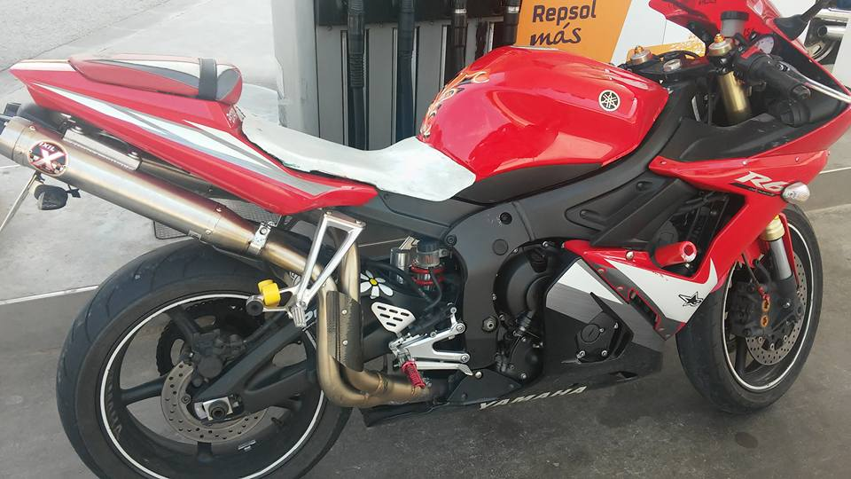

### Denuncia contra  Hamamatsu Motor

Apreciada comisaria de los mossos d'Esquadra yo Riccardo Giuntoli con NIE **X9770628K** y domicilio en **c/ Mossen Anton Miret 10 2/1 08810 sant Pere de Ribes** quisiera denunciar el robo de una moto Yamaha R6 de matricula **5169DDK** y bastidor **JYARJ095000000556** por parte del taller de reparación **Hamamatsu Motor** de **c/ de Mallorca 337 08037 Barcelona**.

El día **28 de Noviembre de 2015** tuve un accidente grave en la autopista C32 altura de Viladecans . No acuerdo exactamente si el vehículo fue llevado directamente en el taller que quiero denunciar o bien unos días después. 

Conocía a través de un amigo en común, don Stefano Seminati, un hombre que trabajaba en dicho taller de lo cual no conozco el apellido, el señor Eliseo con número de teléfono móvil **610206744**.

Después de tener el accidente tuve grabes problemas de salud, perdí la casa y también mi empresa. 

El día 2 de Diciembre de 2019 llamé al taller y me confirmaron la entrada en la oficina en aquella fecha pero no recuerdan que se hizo con ella. El señor Eliseo no parece trabajar mas en dicha instalación y el la persona que contestó a la llamada confirmó que estaba en nomina en dicha empresa.

Adjunto imágenes de la moto en aquel taller, testigo el señor Stefano Seminati que efectivamente fue en reparación en dichas instalaciones.

En fe, Riccardo Giuntoli X9770628K  

