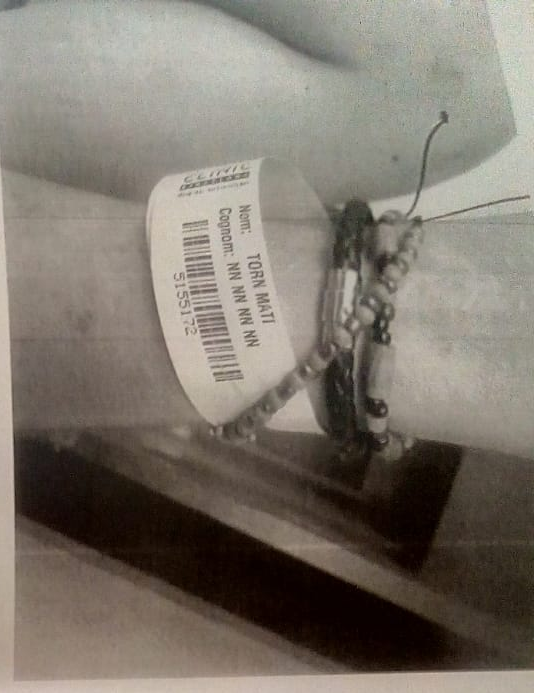
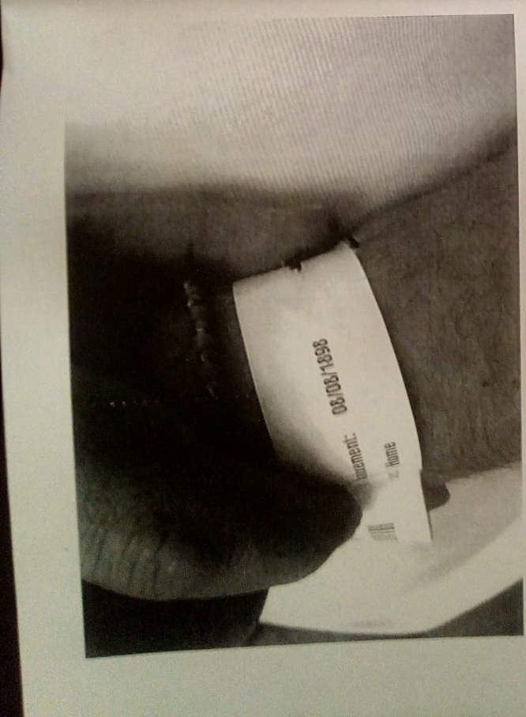

### Denuncia contra Hospital Clinic de Barcelona

En mayo 2018 llame al SEM para ser atendido por una ambulancia, el estado en lo cual me encontraba era un malestar general debida a cansancio y calor. En la ambulancia el trato fue razonable y los dos enfermeros, una  mujer y un hombre, me controlaron unos valores básicos y me llevaron al hospital Clinic .  Sin previo aviso al paciente, yo, el personal del hospital **no me ingreso en urgencias pero me trasladó inmediatamente en la planta dos**.

En dicha planta me redujeron con fuerza unas cinco personas personal del hospital y un miembro de una empresa de seguridad probablemente Prosegur en una camilla donde fui atado con camisa de fuerza. Fui privado de mis bienes. Recuerdo muy distintamente un enfermero muy violento de ojos azules y tatuajes vistosos. 

Para reducirme dichas personas utilizaron violencia ya que me pegaron puñetazos en el estomago, me dislocaron el hombro y me doblaron mi pulso izquierdo donde llevo hierros de una operación que tuve en el año 2015. Además de esto una vez contenido con camisa me inyectaron un potente disociativo  infra muscular. Allí perdí prácticamente conocimiento. Al retomar conciencia después de unas seis horas me encontraba en el mismo estado, atado a la camilla. Llamé al personal chillando porqué no tenía ningún tipo de enfermero a mi lado y estaba en un cuartillo aislado sin otros compañeros. Tenía que poder hacer mis necesidades fisiológicas. En vez de dejarme hacerlas me inyectaron otra vez el mismo compuesto y esta vez  estuve muy cerca de colapsar. Después de otras seis horas una enfermera me trajo un orinal y me libró unicamente un brazo y tuve que mear como podía una cantidad que superó la capacidad del mismo.

 

Lo más increíble de este **grave crimen de mala sanidad** es como he sido ingresado en la infraestructura. Para el hospital yo resulté ser **Torn Mati nacido el ocho de Agosto de 1898**. 

En fe, Riccardo Giuntoli X9770628K

