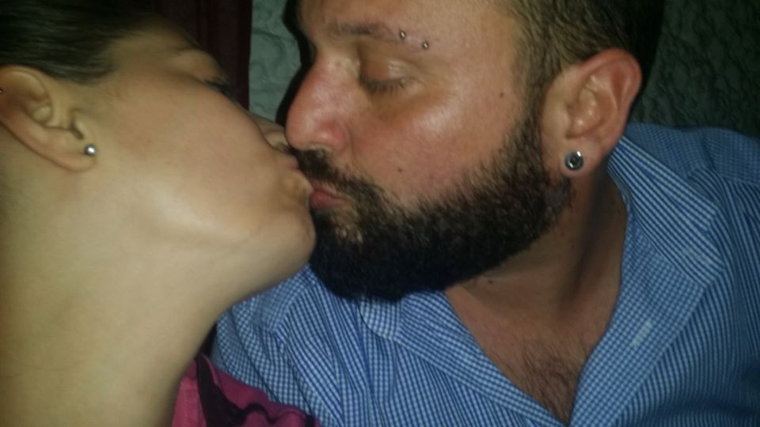

Hola Saray, primero de todo repetirte lo que te he dicho por radio frecuencia. 

Ya se que si quieres yo me voy preso porqué el juego del gangstalking se basa sobre el articulo 172 del código penal donde como acecho se considera el acoso hacía una mujer. Yo no me he suicidado y no me considero un acosador hacía tu persona. Me considero una persona que está muy preocupada por tu vida en la red de control neuronal y creo también en la vida real. He llorado muchísimo porqué al escucharte he pensado inmediatamente en Miriam S.S. de la cual encuentra una fotografía en el documento adjunto.

Lo que yo creo es que esta persona, de la cual conozco las modalidades de actuar, ha moldeado con el tiempo tu carácter a través unas relaciones maquinadas. David, el dolor por no poder criar todos los días a tu hija, yo, la experiencia de hacer daño a un hombre, Javi, que te ha preparado físicamente para ser vendida en servicios especiales físicos (no creo que con conciencia pero no lo conozco). 

El dolor genera odio, sadismo y el sadismo es locura. La locura se cura con los psicofarmacos una de las drogas mas letal para el cerebro y el carácter. La anfetamina y el crack no te hacen dormir y el cerebro humano si no descansa entra en mecanismos, los cuales si son debidamente manipulados pueden ser muy destructivos. Los sedativos y los barbitúricos alimentan la bipolaridad o sea hablando de la red de telepatía intensifica o como lo llama Andreu C. (el cual también tienes en una fotografía en el anexo) el "techno" el hecho no se reconozca que esta red no es nada mas que un sistema de telecomunicaciones y no otro mundo. O sea que las reglas son la de siempre la de la constitución española y no la del medioevo. Hablando de leyes, como yo creo y casi estoy seguro, te acordaras las palabras de Miriam, una manipuladora profesional que ha intentado cambiar mi carácter y los fundamentos de mi vida sin conseguirlo, tienes que tener muy claro que no tienen mas de una interpretación, las leyes son únicamente lo que hay escrito nada mas, no hay otra interpretación. Lo que si existe y en esta red muchísimo es la corrupción policial, de abogacía y judicial. Miriam ha únicamente conseguido eliminar todas mis amistades del plano físico mientras que siempre las tengo en la red de control neuronal, red de control que ha nivel bajo la gente de Andreu, Gerand en primis, ha desarrollado utilizando también la infraestructura que yo había montado en MESWIFI. Pero que a más alto nivel está embebida en algún que otro repetidor LTE, yoigo en primis de lo cual tiene acciones Francesca D., la francesa en radio frecuencia. Aquí dentro juegan también casas reales, Saray te están exprimiendo para que haga toda las porquerías posibles del mundo para después dejarte en un loquero enganchada o muerta. Te suplico de escucharme.

Saray lo que tu haces en las pantallas no es un vídeo juego, lo que tu haces se repercute diariamente en las personas físicas. Estas personas podrían haber cometido suicidio Saray. La vida es una, acuérdate siempre, y es un don de la naturaleza. No se puede sacar provecho del suicidio de la gente. Y no es un provecho tuyo, es en parte de ellos, en parte de nobles españoles y italianos. 

Saray yo estoy dispuesto en ayudarte, cada día. Hasta que no consigas superar este momento. Como amigo Saray, no quiero nada mas que ayudarte. Todos en esta red te hablan mal de mi para ridiculizarme delante de ellos que se hacen llamar hackers pero no son nada mas que violadores orquestados por Miriam y Andreu. Las personas seleccionadas por unas ciertas características, como tu, vienen después moldeados a través de traumas y dolor para ser utilizados como maquinas para matar, para vender, para sexo.

Saray por favor no pasa nada. Se trata únicamente de dormir, llorar, pasear y respirar a llenos pulmones. Ellos a mi lo han intentado, el "insert", el ingreso y yo he tenido que hacer este recurrido de forma solitaria para alejarme de ellos que en realidad, en este red, únicamente son fantasmas. Voces. Nada mas. No tengas miedo por Lucia, ella esta con David y no le pasa nada. La verdad es que, como que la tecnología es muy avanzada, podría ser que ella ni está y que solo se trate de inteligencia artificial. 

Saray tu única culpa es el ser una mujer maravillosa, la mejor mama que he visto en mi vida y la de ser llena de amor.

Saray +34660922890 aprovéchate de mi por favor.