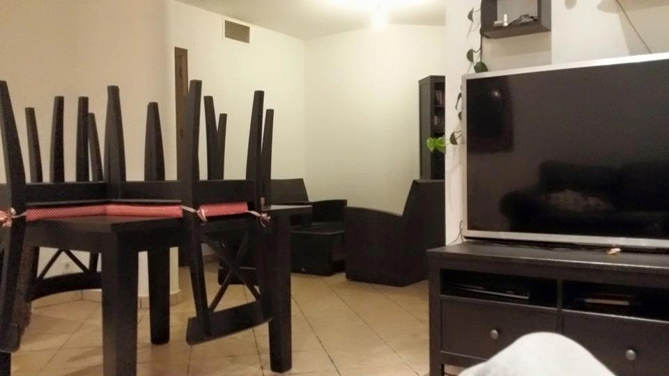

### Denuncia contra Jesus R.A.

Apreciada comisaria de los mossos d'Esquadra quisiera denunciar varios crimenes por parte de mi antiguo casero don Jesus R.A. que fue mi casero por un alquiler criminal en la vivieda unifamiliar de avenida de les Palmeres 12 08811 Canyelles. En la casa estube viviendo con mi dos parejas antes la señorita Thais N.G. y después con Saray L.H.

Aquí estoy en el tejado de la vivienda con mi socio de empresa don Adam M.L..

Primero de todo comentar a los presentes que estube en regime de alquiler con contrato entra privados desde 2008 hasta 2016. Sin ningun tipo de problema de pago el precio estube variando desde 900 hasta 700 euros. Informar a Vuestras signorias que el casero cobraba tanto por transferencia bancaria cuanto por dinero en efectivo. 

La casa fue alquilada totalmente vacia. La casa consta de tres plantas pueden imaginar ustedes la cantidad de muebles, elecotronica y electrodomesticos de la cual había yo amueblado la casa.

Soy empresario de telecomunicaciones y en la casa había material para instalaciones de varios miles de euros y muchos sistemas informaticos.

El casero en 2016 cambío las llaves de la casa y no pude mas entrar en ella, entró rompiendo el cristal de la cocina. Acababa de perder mi empresa, de tener un grave accidente de moto y me encontré reducido a la lemosina en poco tiempo. Mi casero y mi socio habian trabajado juntos en varias ocasiones porqué yo mismo los presenté.

El material substraido consta en:

1. Libreria tipo ikea color blanco
2. Maquina de cocer automatica
3. Ubiquiti Nanostation M3 
4. Ubiquiti Nanostation M9
5. 2x Ubiquiti Unifi cameras
6. Ubiquiti NVR
7. Ubiquiti Nanostation M5
8. Antena satelitar 70cm
9. Nevera 
10. Congelador
11. Lavadora
12. Lavajilla
13. Mesa cadrada color blanco
14. Sillas color argentado
15. Varios productos de limpieza 
16. Ollas platos y cubiertos
17. Cafetera electrica
18. Microondas 
19. 5x estanterias aresanas 
20. Libreria madera oscura
21. 2x sofa
22.  Casetera madera oscura
23. Television LCD 60 pulgadas
24. Sistema de sonido última generación
25. Cuadros antiguos propiedad de mi familia
26. Cajafuerte de pequeña dimensiones con dentro gemelos 1800 de tatarabuelo
27. Jolias en plata
28. Sillas y mesa para exterior
29. 2x cama doble
30. Television plasma 47 pulgadas
31. 2x Tiendas color amarillo
32. Vestidor
33. 3x traques artesanos estilo ingles 
34. 3x zapatos artesanos estilo ingles
35. Moto cross sin matricula Suzuki RM
36. Muebles de arredo de una oficina entera
37. 