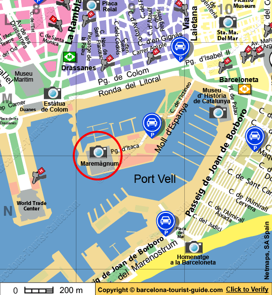
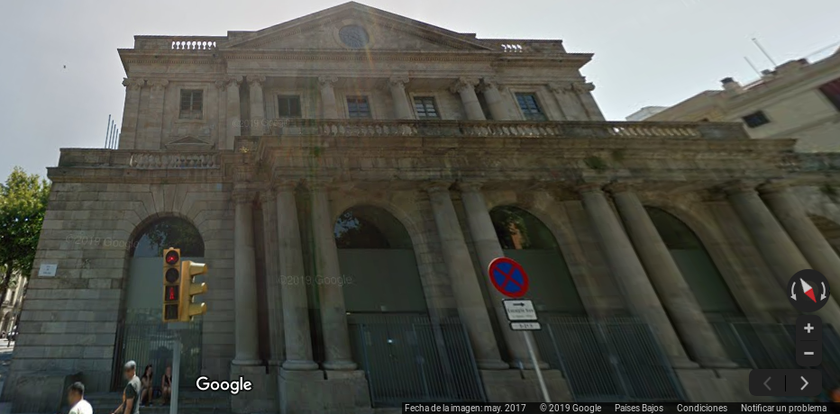
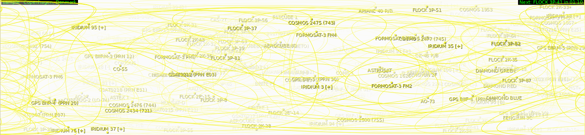
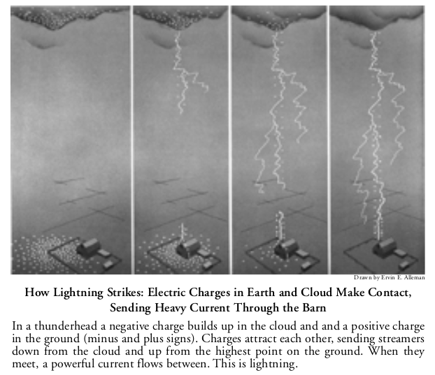
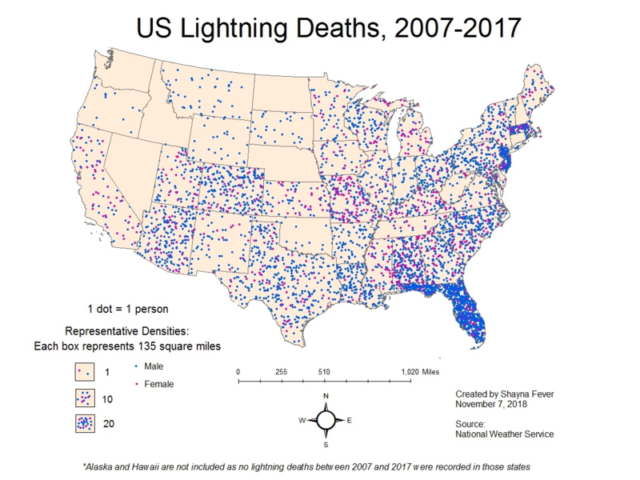
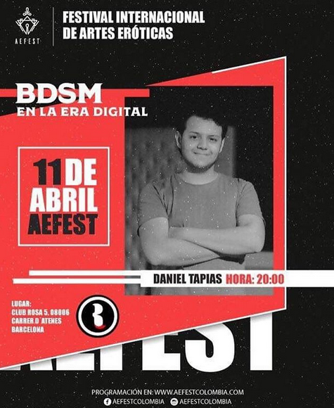
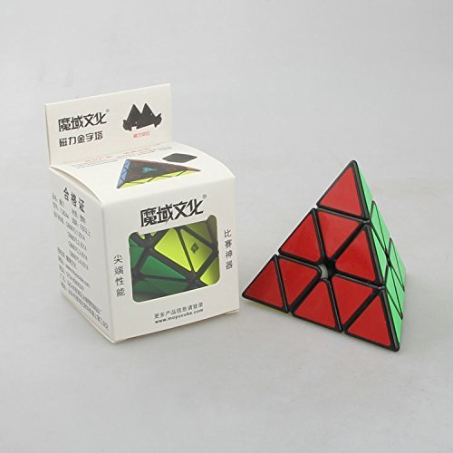
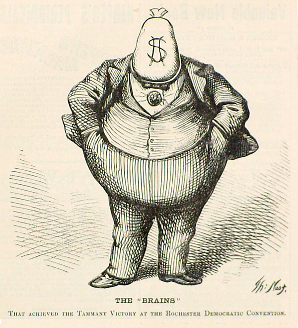
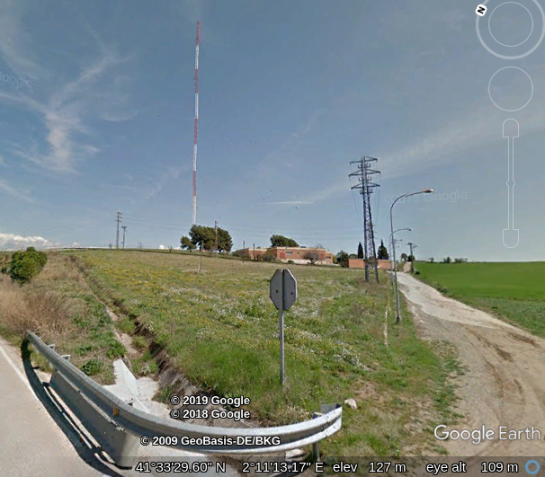

# 	The network illegal services

The first question that we can do when we speak about a service is who is the type of client that search for all the services that are packaged in this network? Remember that all of those utilities are illegals; some of them are possible to be classified as terrorist in my opinion.

- Businessman
- Politicians
- Market analysts
- Criminal organizations
- High-class scammers
- High-class stalkers
- Subversive groups
- Audiovisual industry
- Military warfare industry
- Big tech firm B-Side
- High class society
- High level ecclesiastics

# Gangstalking

## 

> *Clients: Businessman, Politicians, Criminal organizations, Subversive groups, High-class stalkers.*
>
> *Type of service: probably 365 days duration with possibility of renew the contract.*
>
> *Price of service: unknown, but in radio frequency they speak about 3 millions Monero for year of service*.
>
> *Target: one or more human victims.*
>
> *Source of income: contract, sale of victims various type of data, plot for film and/or series productions, video on demand illegal amateur pornography, forced prostitution, human traffic.*

**To stalk**, a verb with root in Protoindo European [[1]](https://en.wikipedia.org/wiki/Indo-European_languages ) languages, ancient Greek [[2]](https://en.wikipedia.org/wiki/Ancient_Greek>) and old Armenian [[3]](https://en.wikipedia.org/wiki/Classical_Armenian). Four  possible meanings of this verb:

1. To approach slowly and quietly in order not to be discovered when getting closer.
2. To (try to) follow or contact someone constantly, often resulting in **harassment** [[4]](https://en.wikipedia.org/wiki/Harassment). 
3. To walk slowly and cautiously; to walk in a stealthy, noiseless manner. 
4. To walk behind something, such as a screen, for the purpose of approaching game; to proceed under cover.

From this verb we can extract the noun **stalking** [[5]](https://en.wikipedia.org/wiki/Stalking), three possibles meanings:

1. Hunting for game by moving silently and stealthily or by waiting in ambush.
2. The crime of following or **harassing** another person, causing him or her to fear death or injury.	
3. The removal of stalks from bunches of grapes prior to wine making.

We can appreciate in bold two times words with root in the verb **to harass**, from old French:

1. To fatigue or to tire with repeated and exhausting efforts. 
2. To annoy endlessly or systematically; to molest. 
3. To put excessive burdens upon; to subject to anxieties. 

We speak about **gangstalking** [[6]](https://www.urbandictionary.com/define.php?term=gang%20stalking) when we refer to the stalking of an individual by a large number of people who coordinate their stalking activities. Normally used by criminals organizations to claim a drogue debt, to induct to suicide an opposer, to annihilate a political figure, to limit a especially creative brain or to generate thousand millions euro. 

Has you can see in the image on top of the paragraph I've used the Spanish name "**Luz de Gas**" [[7]](https://ca.wikipedia.org/wiki/Fer_llum_de_gas) that is the translation of **gaslighting** [[8]](https://en.wikipedia.org/wiki/Gaslighting) that is a form of psychological manipulation in which a person seeks to sow seeds of doubt in a **targeted individual** [[9]](https://www.urbandictionary.com/define.php?term=targeted%20individual) or in members of a targeted group, making them question their own memory, perception, and sanity. Using persistent denial, misdirection, contradiction, and lying, gaslighting involves attempts to destabilize the victim and to invalidate the victim's belief. 

From the name of "Luz de Gas", a practice that without technology was executed also by the Franco's phalanx in the Catalan Republic, we can arrive to the word of a defunct masonry which name was "**illuminati**" [[10]](https://www.nationalgeographic.com/archaeology-and-history/magazine/2016/07-08/profile-adam-weishaupt-illuminati-secret-society/). In Italy and in all over the world nowadays is utilized by a pseudo digital dictatorship that is doing terrorism in Europe. Does illuminati really exist? For sure simply search the hashtag **#illuminati** [[11]](https://www.instagram.com/explore/tags/illuminati/) [[12]](https://twitter.com/search?q=%23illuminati&src=typd) in Twitter or in Instagram, in this one with infographics this masonry have got more than two millions of results.

But what is a pseudo dictatorship? Is a form of a state under the declared state. *A B*-side of the democracy where black markets, stalkings, sexual harassments, illegal control is done. Normally is regulated by a **pyramid structure **[[13]](https://en.wikipedia.org/wiki/Organization#Pyramids_or_hierarchies) with **paramilitary** [[14]](https://en.wikipedia.org/wiki/Paramilitary) or **mercenary** [[15]](https://en.wikipedia.org/wiki/Mercenary) forces controlling the victims that fall in with a gangstalking or the workers, drug sellers or prostitute. 

# The gangstalking "game"

Basically gangstalking and gaslighting are based upon the systematically destruction of your past and present. *Love, friendship, work, home, pets and your possessions are loose* in a short period of time. I've got a personal experience about a pattern used in these tortures. We can speak about "**target individuals**", and i use the plural because there are always two victim, **a men and his love**. It's simple, the man loose all his life like I've said before and the woman like one year after start to think that world have changed and that she'll meet with this man another time after a **sexual game**. *She thinks that this is a game, very similar to what we found in the internationals ready-made television formats*. The two targets are separated and inducted to suicide with a mental destroyer situation, normally a gangstalking for him and a **gang bang** [[16]](https://en.wikipedia.org/wiki/Gang_bang)  for her. The two in different time range, him usually one or half year before, are victims also of what is known as **brainwashing** [[17]](https://en.wikipedia.org/wiki/Brainwashing). The twos in different time laps are victims of stalkers that are normally **mind hackers** [[18]](https://www.gitbook.com/) that try to change the basics of them life. The man usually have no money, no friends and no sex. Go in **major depressive disorder** [[19]](https://en.wikipedia.org/wiki/Major_depressive_disorder) and typically live of what he founds on the street, so the society classify them as indigent and sick with **Diogenes syndrome** [[20]](https://en.wikipedia.org/wiki/Diogenes_syndrome) and **compulsive hoarding** [[21]](https://en.wikipedia.org/wiki/Compulsive_hoarding). The woman is blocked in a vortex of sex and orgies thinking that she is partaking in a game, every game for the women i think that has got one year of time with the goal of four years in total. All of this is brainwashing. First of all when the two separates, that is the start of the loose of all his goods for the man, the woman is betrayed to go away from him with hoax. Next she's got a relation with a personal trainer or a figure like this to have got a perfect body in vision of the games that nothing more are than illegal pornography sold in video on demand bitcoin stores and be a victim of human trade. 

What is the final objective of these machinated steps? It's simple, but when you're experiencing them if your not very clever and intelligent the twos will die committing **suicide**[[22]](https://en.wikipedia.org/wiki/Suicide). The final goal for the woman, if she doesn't kill herself, is to grew up like a sexual slave prostitute build *to satisfy extreme desire for high class society individuals*. 

Normally the man, who has lost everything, commit suicide because  see her in porn movies and images found on the web, deep web, and many others technological platform. The woman when the man loose his life understand that this was not a game and commit suicide also or terminate in heavy drug addiction like **heroine** [[23]](https://en.wikipedia.org/wiki/Heroin) or **crack** [[24]](https://en.wikipedia.org/wiki/Crack_cocaine) working like a low level prostitute. 

This "game" is reality is a recurrent pattern where a love is forcedly broken and two people commit suicide. The pattern is shaped every time upon the victims using a series of variables, like in information technology are the parameters in the invocation of the program. With this crime, gangstalker can gain **billions euro**, alimenting **terrorism** [[25]](https://en.wikipedia.org/wiki/Terrorism) in a silent mode. How is possible to gain such amount of money with this **criminal pattern**? It's simple, they bet on all about the life of the two target individuals, and the woman in engaged in  **sexual harassment** [[26]](https://en.wikipedia.org/wiki/Sexual_harassment) ,**human traffic** [[27] ](https://en.wikipedia.org/wiki/Human_Traffic)and **forced prostitution** [[28]](https://en.wikipedia.org/wiki/Forced_prostitution). They use her to do sexual favors to big drugs clients, rich casino players or so on. She doesn't gain. When she lost her naturally protection about sexual violence they sell her to ultra high class customers that simply enslave her or kill her in a ritual.

*I'll explain step by step how this game with the help of a lot of technology is the real plague of our democracy, and the cause of the right turning in the Europe of the XXI single.*		

# 	Cyberstalking

In the last twenty years, gangstalking has evolved and it has evolved very rapidly using IT technology and telecommunications, touching what is known as **cyberstalking** [[29]](https://en.wikipedia.org/wiki/Cyberstalking) or **cyber gangstalking**. Normally in a gangstalking crew there's a lot of **hackers** [[30]](https://en.wikipedia.org/wiki/Hacker), **crackers** [[31]](http://www.catb.org/jargon/html/C/cracker.html) and **ham radio** [[32]](https://en.wikipedia.org/wiki/Amateur_radio) telecommunications experts, like **satellite** [33](https://en.wikipedia.org/wiki/Satellite), **ELF** [[34]](https://en.wikipedia.org/wiki/Extremely_low_frequency), **ULF** [[35]](https://en.wikipedia.org/wiki/Ultra_low_frequency), **WPT** [36](https://en.wikipedia.org/wiki/Wireless_power_transfer), **HF** [37], **VHF** [[38]](https://en.wikipedia.org/wiki/Very_high_frequency) and **UHF** [[39]](https://en.wikipedia.org/wiki/Ultra_high_frequency). 

**Neuroscience** is another gangstalking IT branch. With the grow up of **BCI** [[40]](https://en.wikipedia.org/wiki/Brain%E2%80%93computer_interface), and the fall down of the price of them with **Arduino** [[41]](https://en.wikipedia.org/wiki/Arduino) and other **open hardware** [[42]](https://en.wikipedia.org/wiki/Open-source_hardware) solutions, **neuroscience** [[43]](https://en.wikipedia.org/wiki/Neuroscience) is now low cost. 

What in the **cold war** [[44]](https://en.wikipedia.org/wiki/Cold_War) was patented by US researcher with various acronym like **V2K** known also as "voice to skull" [[45]](https://sites.google.com/site/targetedindividuals101/home/v2k) or "infrasound" [[46]](https://en.wikipedia.org/wiki/Infrasound), **MKULTRA** [[47]](https://en.wikipedia.org/wiki/Project_MKUltra), known also as CIA mind control program, **TMS** [[48]](https://en.wikipedia.org/wiki/Transcranial_random_noise_stimulation), transcranial magnetic stimulation also in remote, and **NLP** [[49]](https://en.wikipedia.org/wiki/Neuro-linguistic_programming), neuro-linguistic programming (see also methods [[50]](https://en.wikipedia.org/wiki/Methods_of_neuro-linguistic_programming)) synthetic hypnosis , could be found in my personal repository [[51]](https://drive.google.com/drive/folders/1p_ZjYQu33qaeZTE89Ae48biWiBG9EPcK) and it is actively used by gangstalker and hackers. Also in wikileaks we can found some information more about those technologies. 

But is gangstalkers connected to the US secret services and governments? No, probably not. It's very common that they are using the public patents and leaks from **Julian Assange** [[52]](https://en.wikipedia.org/wiki/Julian_Assange) team to improve the synthetic telepathy network, nowadays an information technology evolution of a part of the radio television broadcast system. 

# Telecommunications for inmates

> *Clients: Businessman, Politicians, Criminal organizations, Subversive groups, Extra European spies.*
>
> *Type of service: probably for month service like a normal provider.*
>
> *Price of service: unknown.*
>
> *Target: in reality the same contractor because all the conversations are registered!*
>
> *Source of income: contract, sold of all the conversations to opposites, police and governments.*

Telecommunications for inmates is another service bind by the synthetic  telepathy network. Radio wave at low frequency like is voice to skull  obtained by the applications of the patent US5159703A (462.25 KHz) can  bypass all kind of material utilized in construction. It's an analog but clientless semi secure telecommunication system.

With radio waves as you can see in the image above it's possible to obtain also remote imaging. It's from a **MIT** [[53]](http://www.mit.edu/) research and it's called **RF Pose** [[54]](http://rfpose.csail.mit.edu/). But it's also possible to obtain 3D **skeletons** [[55]](https://en.wikipedia.org/wiki/Skeleton) models always through walls with something called **RF-Pose3D** [[56]](http://rfpose3d.csail.mit.edu/). But it's also possible to remote reading learning **sleep stages** [[57]](https://es.wikipedia.org/wiki/Arquitectura_del_sue%C3%B1o) from radio signals with something called **RF-Sleep** [[58]](http://sleep.csail.mit.edu/) and at least but not last we've got **EQ-Radio** [[59]](http://eqradio.csail.mit.edu/) that is a remote emotion recognition. 

Why i explain this in this section? It's obvious. Who contract this clientless service in reality he's also a victim. Because of all the technologies that i've explained above. With this awesome technology the owners of the network can know passions of the victims and seeing this in a criminal way it is possible to obtain ways to coerce victims. Reflect.

# Semi physic remote desktop environment

> *Clients: Businessman, Politicians, Criminal organizations, Subversive groups, Audiovisual industry, Big tech firm B-Side.*
>
> *Type of service: probably for month service like a normal provider.*
>
> *Price of service: unknown.*
>
> *Target: in reality the same contractor because all the environment is registered!*
>
> *Source of income: contract, sold of all the conversations to opposites, police and governments.*

With the use of brain waves joint together with voice to skull service, clients of this criminal network can work in physic remote site only with their brain. This is a very interesting technology because a person can work physically like a waiter for example and, using what we have refer in another chapter like human multi tasking, do a parallel job. This is a very productive feature but as usual if it's used by bad guys it could determine the grow up of undetectable terrorism. Why i use this important word? It's simple. Think about an hacker crew like the phenomenon that we see in **Al Qaeda** [[60]](https://en.wikipedia.org/wiki/Al-Qaeda) or other mercenary crew working for **Islamic Terrorism** [[61]](https://en.wikipedia.org/wiki/Islamic_terrorism). With this feature they can work using information technology without that any secret service or military police can detect it. 

This is absolutely lawbreaker if sold to the wrong customer. Who is controlling this network? Is police able to stop the grow up of the "Illuminati" pseudo dictatorship? I cannot find information about the synthetic telepathy network and i'm a victim of. *I was electronically tortured for two years* and i decide to write about all what i've understood in those hell years. *Someone have to stop this. Just now.* I think that is responsible of the birth of the new **populist movements** [[62]](https://en.wikipedia.org/wiki/Populism) in Europe, extreme right movements, grow up of **Neo-Nazism** [[63]](https://en.wikipedia.org/wiki/Neo-Nazism) and so on. *This is not a joke.*  

# Sexual holograms  sale

> *Clients: Businessman, Politicians, Criminal organizations, High class society, High class ecclesiastics.*
>
> *Type of service: Different types, for hour like a prostitute or for month like a service.*
>
> *Price of service: unknown.*
>
> *Target: The person that is connected with the machine to the hologram.*
>
> *Source of income: service, contract, and informations about sexual customs of the client.*

This is the cutting edge in prostitution. This is what consume high class society. With this, they can fuck, kill, eat whatever they want. And the shape is the shape of a real person.

**Holography** [[64]](https://en.wikipedia.org/wiki/Holography).  But remember is holography without a projector. Who it is possible? Satellite. The city of Barcelona is totally covered. Genova and Milano without any doubt. In radio frequency the speak about Roma, Copenhague but is very likely that all Europe is under this kind of illegal services. 

But some times it's used also by municipal administration in the A-side. Doing what? Urban projection using what is called **projection mapping** [[65]](https://en.wikipedia.org/wiki/Projection_mapping).

But who is behind all of this goodness? So simple the audio visual industry. But what is the real shit about all of this goodness? **Food for pedophiles**. 

In radio frequency people speak about secret about this awesome technology. But it's not. It's only a patchwork of cutting edge universities discoveries. And someone build upon those works a *digital criminal organization*. Who is? *A/B B/A*. Remember human multitasking? Ok now you've got the reply:

- Big tech companies
- Audiovisual industry
- **Hollywood** [[66]](https://en.wikipedia.org/wiki/Hollywood), **Bollywood** [[67]](https://en.wikipedia.org/wiki/Bollywood) **Cinecittà** [[68]](https://en.wikipedia.org/wiki/Cinecitt%C3%A0) and so on.
- etcetera etcetera

So they sell you a package, an hologram with the shape of a girl. You buy it in a virtual catalog that could be consulted in deep Internet, **Tor** [[69]](https://en.wikipedia.org/wiki/Tor_(anonymity_network)) **i2p** [[70]](https://en.wikipedia.org/wiki/I2P) and so on. Payment is obviously in crypt concurrency, **Litecoin** [[71]](https://en.wikipedia.org/wiki/Litecoin) for example. So the client is secured buy a theoretically untraceable transference. Image that every Sunday there's a **forward auction** [[72]](https://en.wikipedia.org/wiki/Reverse_auction) in a virtual reality ambient like a living room where's people dressed with what so over shape, image something like "the presidents" in the **Point Break** [[73]](https://en.wikipedia.org/wiki/Point_Break) film. Girls are presented like sexual slaves and people offerer a quantity for a type of service. Who pay the more amount of money got a immediate delivery in a geographic exact point in **latitude, longitude and elevation** [[74]](https://en.wikipedia.org/wiki/Geographic_coordinate_system) in a physical site of the city, like in a luxury boat dock in the port or what so ever. The girl, that is treated like a videogame or a object, in reality is at her house but all her nervous system and her brain is totally connected to the hologram by the network. People that buy those services normally do extreme sexual violence, and she pass hell pains and above all in here memory the experience is true. This is **human memory imprinting** [[75]](https://scholar.google.com/scholar?q=human+memory+imprinting&hl=es&as_sdt=0&as_vis=1&oi=scholart).  

Barcelona is famous in this new era market. Barcelona actually is one of the capital of this extreme sex luxury tourist destination. From about five years, it's blowing this hell wind of changes in my favorite city. It's possible to correlate this with the advancement of the **Lion club of Barcelona** [[76]](https://www.e-clubhouse.org/sites/barcelona_gaudi/)? But this is only my little opinion. *A man that has walked 4000 km by foot in the last three years to investigate what is passing here.*  

But is this a secret? No! Here is some international press articles and porn movies:

- https://www.mirror.co.uk/tech/holographic-porn-bring-3d-naked-9525844
- https://www.pornhub.com/view_video.php?viewkey=2114250286
- https://www.pornhub.com/view_video.php?viewkey=ph5ccdfd32e138a
- https://fortune.com/2019/01/11/ces-holograms/

Doing a rapid search on Google i've found a name of a Greek billionaire connected to holograms related business, **Alki David** [[77]](https://en.wikipedia.org/wiki/Alki_David).

# Goods transport route control

> *Clients: Criminal organizations, Subversive groups.*
>
> *Type of service: Price for kilometers.*
>
> *Price of service: Unknown.*
>
> *Target: Some transports are obviously sold to the police or opposite organizations.*
>
> *Source of income: service, contract, and informations about quantities.*

Another fantastic service from this totally criminal network. But don't be shame, it's not with video camera. It's with radio frequency. This is what i call satellite terrorism. All our streets and highways are under control with an array of radio in a satellite network. What network? It's difficult because of open hardware satellite.

This is a screenshot of the open source application **Gpredict** [[78]](http://gpredict.oz9aec.net/). Look at the orbits in the sky of every satellites. Yes they are moving but with the transit of one after other you can track in real time every street of Europe. If a camion with goods is traveling in the **International E-road network** [[79]](https://en.wikipedia.org/wiki/International_E-road_network) is under constant control. But what is the goodness? Simple. If there's some roadblock in his path with this technology and the voice to skull service working on the driver the game is done. A change in his trip and there's no lost of goods. Remember that goods could be also humans.

# Remote controlled lightning strike

> *Clients: Businessman, Politicians, Criminal organizations, Subversive groups.*
>
> *Type of service: Price for strike.*
>
> *Price of service: Unknown.*
>
> *Target: Opposites, politician, criminals, industry.*
>
> *Source of income: service, and the information about who contract it.*

Perhaps this seems to be a craziness. But  no, it isn't. Ok with radio frequency it's possible to **electric charge** [[80]](https://en.wikipedia.org/wiki/Electric_charge) a site, like a mono familiar house a car or a airplane, with **protons** [[81]](https://en.wikipedia.org/wiki/Proton). Because that a thunder born in the **Troposphere** [[82]](https://en.wikipedia.org/wiki/Troposphere) minus charged, **electrons** [[83]](https://en.wikipedia.org/wiki/Electron) are attracted by protons and can be tele guided.  

Let's start with a reflexion about this. What can be done playing with this natural phenomenon?

- Explosions, like in a chemical or war industry.
- Fires, like in a farmland or in a forest.
- Accidents, in transport, civil or military.
- Death by a lightning strike like you can see in the graph below

# Women sexual overexcitation

**This flier is not about an illegal service.**

> *Clients: Businessman, Politicians, Criminal organizations, High-class stalkers, Audiovisual industry, High class society, High level ecclesiastics.*
>
> *Type of service: Price for monthly service for person.*
>
> *Price of service: Unknown.*
>
> *Target: Mainly young womens.*
>
> *Source of income: service, and the information about who contract it.*

*First of all i want to transmit to all my readers that i'm absolutely not in opposite to immigration and human circulation all over the world. I'm not racist because i love freedom and i'm a democratic left side man.  I love cultures from all over the world but i think that we've always to respect local traditions without fomenting political or territorial divisions and we've to search a good balance between all the cultures in a cosmopolitan city, like the city that i'm in love to, Barcelona.*

What is this flier announcing **BDSM** [[84]](https://en.wikipedia.org/wiki/BDSM) from south America using digitals techniques? I will write about what is happening just now under the eyes of all the police forces and government of Barcelona.

Like i've said on chapter two, with the  Machine it's possible to overload the genital system of a women, or a man, with electro magnetism over some part of our brain. And also to get feeling of physical touch in the reproducing apparatus. Now this is all ok if the "target" is consenting. Those feelings that with this technology can be like real (reaD they call in voice to skull chat) it's important to understand that can be activated by two persons with them brains at the same level of importance, in a master / slave configuration like in the real BDSM world, and also with sexual **bot** [[85]](https://en.wikipedia.org/wiki/Internet_bot) or applications. 

 What could be obtained? Extreme sexual appetite, induced prostitution,  brain washing, loose of principles, climb of the threshold of sexual  violence. *Is this a crime*? For sure, it's **sexual violence** [[86]](https://en.wikipedia.org/wiki/Sexual_violence) and **psychological  abuse** [[87]](https://en.wikipedia.org/wiki/Psychological_abuse).

Why the customers who pay for this service is searching for example the climb of the threshold of sexual  violence? As usual is very easy to explain using only some logic, the base of the human thinking. Obviously it's to sold those victims that normally are sexy beautiful womens or athletic mans in sex parties with rich mans that consider them like objects of sexual abuse. Orgies without a decent limit. They are slaved and in this system they obtain a very little financial compensation in crypt concurrency, in totally contrast with the real gain of entrepreneurs that normally round at four digits. It's luxury extreme prostitutions that could be payed like one thousand euro for person and obviously is **exploitation of prostitution** [[88]](http://www.europarl.europa.eu/RegData/etudes/etudes/join/2014/493040/IPOL-FEMM_ET(2014)493040_EN.pdf).  

Now look at sexual ads in Barcelona in a web page called NuevoLoquo, this is an ads for pay not affiliated portal. 

https://www.nuevoloquo.com/anuncios-eroticos/barcelona/putas/catalan/

There is a lot of Catalans young girls. It's so estrange because this territory got a high **PIB** [[89]](https://en.wikipedia.org/wiki/Gross_domestic_product),  33661$ as 2017.  Are those victims of digital **forced prostitution** [[90]](https://en.wikipedia.org/wiki/Forced_prostitution)? Yes, in my opinion. 

Prostitution in the synthetic telepathy network is, like all the structures, a pyramid. 

Barcelona has changed in the last ten years. A lot. Yes the city have been reformed and restored. Its face is clean and beautiful. But is this true? No. Someone, who is washing and cleaning B-side money from this system, yes absolutely, is doing a great job to maintain a good facade. But the old city, the heart of the Catalan capital, was and is totally sold to extra communitarian, but not only, contractors. You can't feel now the real soul and smell of the streets. 

Normally we can underline this chain of sales of small businesses nowadays:

*small Catalan entrepreneur -> sale in cash to Chinese people who deal with the purchase of businesses -> resale to Europeans, mainly Italians.*

This is obviously the new criminal organization, the Illuminati, a fraud.

Look at the numbers of the china community in Catalunya, this study from **UAB** [[91]](https://en.wikipedia.org/wiki/Autonomous_University_of_Barcelona) is impressive:

http://www.fti.uab.es/interasia/documents/Beltran-La%20Inmigraci%F3n%20China%20en%20Catalu%F1a.pdf

# Hacking applied to humans

If a person resist to the fascist crime of gangstalking, namely don't fall in heroin drug abuse, don't fall in psychiatric disorders, don't fall in extreme sex disorders, etcetera etcetera could be next victim of another difficult to detect subliminal crime, but always a very big crime, that could be named as **human hacking** [[92]](https://thecyberwire.com/podcasts/hacking-humans-episode-list.html) and exaggeration of **social engineering** [[93]](https://en.wikipedia.org/wiki/Social_engineering_(security)), a branch of cyber security. 

> *Remember that human hacking is accomplished by very difficult to capture criminals. Serial criminals. Persons who taste sexual pleasure seeing how they can manipulate big masses of humans doing whatever they want. Almost are extremely intelligent individuals, and probably classified by the government as mentally ill. Persons that use others like hacking tools, to hack the victim that they call case of study to expand their recurrent method, used to obtain sexual pleasure.* *This is my two cents, awl (the nickname of one of them)*.

 First of all the synthetic telepathy network is abused by those kind of criminals, remember that i say abuse because though it is an illegal network it is also hacked by these figure. A strange and complex man. Yes because it is only one. But i'll not speak directly about him because he's the most special human that i find in my life. **I'm studying him**. He is using the owner of this facility like a virus, a worm, a girl born in Genova, Italy.

Secondly, and i say this because of the possibility to try to catch this individual, i want to remember to him that human hacking is a crime respect to **human right declaration** [[94]](https://en.wikipedia.org/wiki/Universal_Declaration_of_Human_Rights). A crime against humanity, not a game. 

But what is the final goal of human hacking and in what consist these complex and very long in time attack?

The final goal is obviously the destruction of a singular, a singularity better saying. What is the total destruction? The suicide. But what happen in this wide way? Scorched earth (\#882D17 or **Sienna** [[95]](https://en.wikipedia.org/wiki/Sienna)). When two singularity meet, it's like two stars collide. Results is only death. Death of whatever is in them orbit. All. Next is life. Or one of the most dangerous unknown object will born, a black hole; or if they are like black holes the results in a **binary black hole system** [[96]](https://en.wikipedia.org/wiki/Binary_black_hole). But death is a natural process, the result in falling down a black hole is totally unknown. Some participle are ejected at furious velocities and others go in something that mankind don't know. Some speak about **wormhole** [[97]](https://en.wikipedia.org/wiki/Wormhole). A game of **spacetime** [[98]](https://en.wikipedia.org/wiki/Spacetime) and speed. **Multiverse** [[99]](https://en.wikipedia.org/wiki/Multiverse).  

But remember always, reader, those connections between different science branch  collide into what nations call mental illness. Don't try to fuck your mind alone.

*Are them actors or are them directors of an invented tragedy? I don't know, i've never try it.* 

# Parimutuel crypt betting

​    *"Gambling in which persons participate by the use of remote communication"*

I live in Catalunya from about twelve years. A great country, great traditions and hermetic people live here. People that have fight a lot in the last century with the fascist dictatorship guided by **Francisco Franco** [[100]](https://en.wikipedia.org/wiki/Francisco_Franco). People that have died in the **Spanish civil war** [[101]](https://en.wikipedia.org/wiki/Spanish_Civil_War). **Republicans** [[102]](https://en.wikipedia.org/wiki/Republican_faction_(Spanish_Civil_War)). And after the civil war people that have been persecuted by Franco using what we've called as *gaslighting*. The persecution against one; something that I'm living from about four years. Franco use voice to skull radio technology in MF and mast radiators like we've described in chapter two. Franco use the national provider **RNE** [[103]](https://en.wikipedia.org/wiki/Radio_Nacional_de_Espa%C3%B1a) to mask this criminal emissions. Look at this mast radiator in **Palau-solita i Plegamans** [[104]](https://ca.wikipedia.org/wiki/Palau-solit%C3%A0_i_Plegamans) in Catalunya.

Almost every old person that live in Catalunya can listen to voice to skull emission. They have been tortured by the dictator. The "Illuminati" pseudo dictatorship use the same technology but done with **SDR** [[105]](https://en.wikipedia.org/wiki/Software-defined_radio) radio devices. Open source and open hardware, very dangerous because of low cost. "Illuminati" also have expanded this with what i call remote **BRAINnet** [[106]](https://www.nature.com/articles/s41598-019-41895-7?fbclid=IwAR2dpWDv9RZk41Xt8xcQPLbCXBTfJo_qpaXVAiu--AoIgOyKjhjJqmFCCEI) to create slaves like we've just explained.

But what is the connection between "Illuminati", that are been created ten years ago in **Genoa** [[107]](https://en.wikipedia.org/wiki/Genoa) Italy, and Catalunya fascist voice to skull technology?

This is not so simple to explain but i can argue that five years ago in Catalunya there was a radical change. Now all the B-side of Barcelona is guided by the "Illuminati" **hierarchical** [[108]](https://en.wikipedia.org/wiki/Hierarchy) pyramid tree. Why? In Catalunya there's a silent way to gain millions of Euro, an underground economy to which only wealthy Catalans have access, something handed down according to blood lineage. Something that I'm victim of:

*Bets on everything related to a person's personal life. Suicide bets.*

Something that generate billions, something that is administrated by the Catalan **tax haven** [[109]](https://en.wikipedia.org/wiki/Tax_haven), **Andorra** [[110]](https://en.wikipedia.org/wiki/Andorra). Something that until the advent of the "Illuminati" was managed by hand, but with BRAINnet it is totally automatic. It's an expansion of the tax heaven in the European state, Spain. A fraud. A fiscal fraud. And obviously something that is done also in Genoa using the other fiscal haven, the **Principality of Monaco** [[111]](https://en.wikipedia.org/wiki/Monaco).

Who fall in this bet vortex? Someone, like me, that have something special, a singularity. Someone that pass a complex check list to be classified as a *special case*. Or someone that is a potential political opponent of both the state and the church, also like me. Or someone that was a good entrepreneur, also like me.

**Joseph Oller** [[112]](https://en.wikipedia.org/wiki/Joseph_Oller), a Catalan born in 1839, was the inventor of the **parimutuel betting** [[113]](https://en.wikipedia.org/wiki/Parimutuel_betting) system. And in this network the service of parimutuel betting is done in remote. And *this is the real cause of all the others services*. A billions black market, now bitcoin based, but not only. The worst thing is that if your quota pass a certain gain level in this *game* play noble families and **dynasty** [[114]](https://en.wikipedia.org/wiki/Dynasty). But there's also another big crime, all the people that are forced to join the synthetic telepathy network are subdued to bets. The important thing is not to exceed the quota, which I did however since I did not accept working as a drug dealer for this pyramid of organized digital crime.

Where does people could bet on this human black market? In the normal **sports betting** [[115]](https://en.wikipedia.org/wiki/Sports_betting) there is a double key of lecture. But also there's the crypt betting market:

- https://www.cloudbet.com/en/
- https://1xbit.com/en/
- https://fortunejack.com/
- https://sportsbet.io/
- https://22bet.co.uk/sport

In those circuit and also off line this occult world those type of bets and all the life of the target individuals are *played* in low class games. Like the ones that we find in **app stores** [[116]](https://en.wikipedia.org/wiki/App_store).

So here you are the explanation on why there's this fascist persecution of all the society against a single, betting, money.

Parimutuel betting are a dangerous form of betting when we speak about large amount of money. Because people have to pay before of the deadline, in this case probably in a crypt concurrency bank account. So if you pass the infamous quota dangerous people have already payed and no one can withdraw the bet, it is the cat that bites its tail. If we speak about bet about humans you can understand that this method is the most dangerous one for the life of the victim, like I'm. The bank account it's obvious property of the **bookmaker**  [[117]](https://en.wikipedia.org/wiki/Bookmaker), in this case they are the owners of the network. 

Why i said that all the peoples that enter in the "Illuminati" hierarchy tree are subject to parimutuel betting?  Because every years there is gambling on who do more invoice selling goods, black market, legal market and so on. Like in a **greyhound racing** [[119]](https://en.wikipedia.org/wiki/Greyhound_racing). But here you will die if you arrive further down the place number thirteen. And obviously there is also, probably with another method, a bet in your life using normal concurrency. 

# External links

	

1. https://en.wikipedia.org/wiki/Indo-European_languages 

2. https://en.wikipedia.org/wiki/Ancient_Greek

3. https://en.wikipedia.org/wiki/Classical_Armenian

4. <https://en.wikipedia.org/wiki/Harassment>

5. <https://en.wikipedia.org/wiki/Stalking>

6. https://www.urbandictionary.com/define.php?term=gang%20stalking

7. <https://ca.wikipedia.org/wiki/Fer_llum_de_gas>

8. <https://en.wikipedia.org/wiki/Gaslighting>

9. <https://www.urbandictionary.com/define.php?term=targeted%20individual>

10. <https://www.nationalgeographic.com/archaeology-and-history/magazine/2016/07-08/profile-adam-weishaupt-illuminati-secret-society/>

11. https://www.instagram.com/explore/tags/illuminati/

12. <https://twitter.com/search?q=%23illuminati&src=typd>

13. <https://en.wikipedia.org/wiki/Organization#Pyramids_or_hierarchies>

14. <https://en.wikipedia.org/wiki/Paramilitary>

15. <https://en.wikipedia.org/wiki/Mercenary>

16. <https://en.wikipedia.org/wiki/Gang_bang>

17. https://en.wikipedia.org/wiki/Brainwashing

18. <https://www.mindhacki.ng/content/>

19. <https://en.wikipedia.org/wiki/Major_depressive_disorder>

20. https://en.wikipedia.org/wiki/Diogenes_syndrome

21. https://en.wikipedia.org/wiki/Compulsive_hoarding

22. https://en.wikipedia.org/wiki/Suicide

23. https://en.wikipedia.org/wiki/Heroin

24. https://en.wikipedia.org/wiki/Crack_cocaine

25. https://en.wikipedia.org/wiki/Terrorism

26. <https://en.wikipedia.org/wiki/Sexual_harassment>

27. <https://en.wikipedia.org/wiki/Human_Traffic>

28. https://en.wikipedia.org/wiki/Forced_prostitution

29. https://en.wikipedia.org/wiki/Cyberstalking

30. https://en.wikipedia.org/wiki/Hacker

31. http://www.catb.org/jargon/html/C/cracker.html

32. https://en.wikipedia.org/wiki/Amateur_radio

33. https://en.wikipedia.org/wiki/Satellite

34. https://en.wikipedia.org/wiki/Extremely_low_frequency

35. https://en.wikipedia.org/wiki/Ultra_low_frequency

36. https://en.wikipedia.org/wiki/Wireless_power_transfer

37. https://en.wikipedia.org/wiki/High_frequency

38. https://en.wikipedia.org/wiki/Very_high_frequency

39. https://en.wikipedia.org/wiki/Ultra_high_frequency

40. https://en.wikipedia.org/wiki/Brain%E2%80%93computer_interface

41. https://en.wikipedia.org/wiki/Arduino

42. https://en.wikipedia.org/wiki/Open-source_hardware

43. https://en.wikipedia.org/wiki/Neuroscience

44. https://en.wikipedia.org/wiki/Cold_War

45. https://sites.google.com/site/targetedindividuals101/home/v2k

46. https://en.wikipedia.org/wiki/Infrasound

47. https://en.wikipedia.org/wiki/Project_MKUltra

48. https://en.wikipedia.org/wiki/Transcranial_random_noise_stimulation

49. https://en.wikipedia.org/wiki/Neuro-linguistic_programming

50. https://en.wikipedia.org/wiki/Methods_of_neuro-linguistic_programming

51. https://drive.google.com/drive/folders/1p_ZjYQu33qaeZTE89Ae48biWiBG9EPcK

52. https://en.wikipedia.org/wiki/Julian_Assange

53. http://www.mit.edu/

54. http://rfpose.csail.mit.edu/

55. https://en.wikipedia.org/wiki/Skeleton

56. http://rfpose3d.csail.mit.edu/

57. https://es.wikipedia.org/wiki/Arquitectura_del_sue%C3%B1o

58. http://sleep.csail.mit.edu/

59. http://eqradio.csail.mit.edu/

60. https://en.wikipedia.org/wiki/Al-Qaeda

61. https://en.wikipedia.org/wiki/Islamic_terrorism

62. https://en.wikipedia.org/wiki/Populism

63. https://en.wikipedia.org/wiki/Neo-Nazism

64. https://en.wikipedia.org/wiki/Holography

65. https://en.wikipedia.org/wiki/Projection_mapping

66. https://en.wikipedia.org/wiki/Hollywood

67. https://en.wikipedia.org/wiki/Bollywood

68. https://en.wikipedia.org/wiki/Cinecitt%C3%A0

69. https://en.wikipedia.org/wiki/Tor_(anonymity_network)

70. https://en.wikipedia.org/wiki/I2P

71. https://en.wikipedia.org/wiki/Litecoin

72. https://en.wikipedia.org/wiki/Forward_auction

73. https://en.wikipedia.org/wiki/Point_Break

74. https://en.wikipedia.org/wiki/Geographic_coordinate_system

75. https://scholar.google.com/scholar?q=human+memory+imprinting&hl=es&as_sdt=0&as_vis=1&oi=scholart

76. https://www.e-clubhouse.org/sites/barcelona_gaudi/

77. https://en.wikipedia.org/wiki/Alki_David

78. http://gpredict.oz9aec.net/

79. https://en.wikipedia.org/wiki/International_E-road_network

80. https://en.wikipedia.org/wiki/Electric_charge

81. https://en.wikipedia.org/wiki/Proton

82. https://en.wikipedia.org/wiki/Troposphere

83. https://en.wikipedia.org/wiki/Electron

84. https://en.wikipedia.org/wiki/BDSM

85. https://en.wikipedia.org/wiki/Internet_bot

86. https://en.wikipedia.org/wiki/Sexual_violence

87. https://en.wikipedia.org/wiki/Psychological_abuse

88. http://www.europarl.europa.eu/RegData/etudes/etudes/join/2014/493040/IPOL-FEMM_ET(2014)493040_EN.pdf

89. https://en.wikipedia.org/wiki/Gross_domestic_product

90. https://en.wikipedia.org/wiki/Forced_prostitution

91. https://en.wikipedia.org/wiki/Autonomous_University_of_Barcelona

92. https://thecyberwire.com/podcasts/hacking-humans-episode-list.html

93. https://en.wikipedia.org/wiki/Social_engineering_(security)

94. https://en.wikipedia.org/wiki/Universal_Declaration_of_Human_Rights

95. https://en.wikipedia.org/wiki/Sienna

96. https://en.wikipedia.org/wiki/Binary_black_hole

97. https://en.wikipedia.org/wiki/Wormhole

98. https://en.wikipedia.org/wiki/Spacetime

99. https://en.wikipedia.org/wiki/Multiverse

100. https://en.wikipedia.org/wiki/Francisco_Franco

101. https://en.wikipedia.org/wiki/Spanish_Civil_War

102. https://en.wikipedia.org/wiki/Republican_faction_(Spanish_Civil_War)

103. https://en.wikipedia.org/wiki/Radio_Nacional_de_Espa%C3%B1a

104. https://ca.wikipedia.org/wiki/Palau-solit%C3%A0_i_Plegamans

105. https://en.wikipedia.org/wiki/Software-defined_radio

106. https://www.nature.com/articles/s41598-019-41895-7?fbclid=IwAR2dpWDv9RZk41Xt8xcQPLbCXBTfJo_qpaXVAiu--AoIgOyKjhjJqmFCCEI

107. https://en.wikipedia.org/wiki/Genoa

108. https://en.wikipedia.org/wiki/Hierarchy

109. https://en.wikipedia.org/wiki/Tax_haven

110. https://en.wikipedia.org/wiki/Andorra

111. https://en.wikipedia.org/wiki/Monaco

112. https://en.wikipedia.org/wiki/Joseph_Oller

113. https://en.wikipedia.org/wiki/Parimutuel_betting

114. https://en.wikipedia.org/wiki/Dynasty

115. https://en.wikipedia.org/wiki/Sports_betting

116. https://en.wikipedia.org/wiki/App_store

117. https://en.wikipedia.org/wiki/Bookmaker

118. https://en.wikipedia.org/wiki/Olympic_Games

119. https://en.wikipedia.org/wiki/Greyhound_racing

     

     

     

     

     

     

     

     

