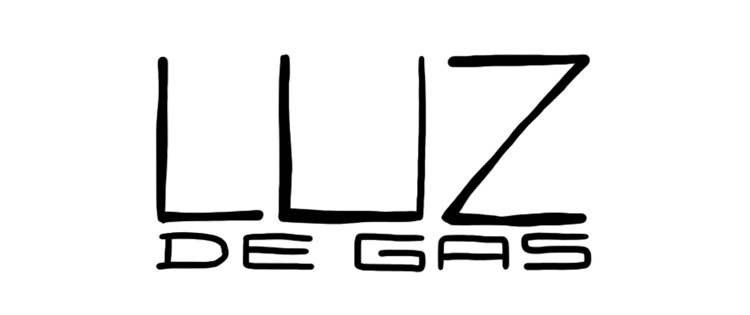
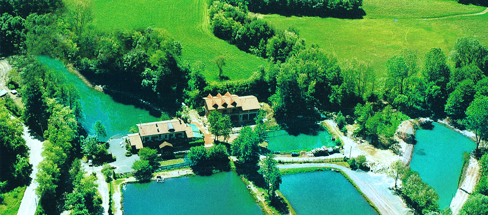
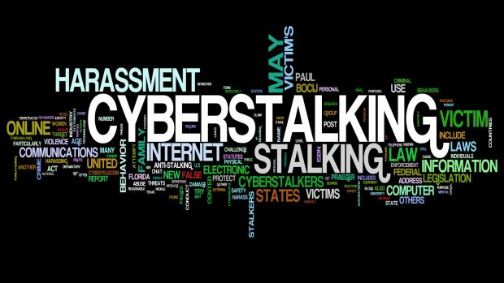
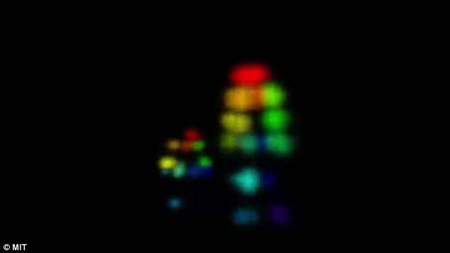
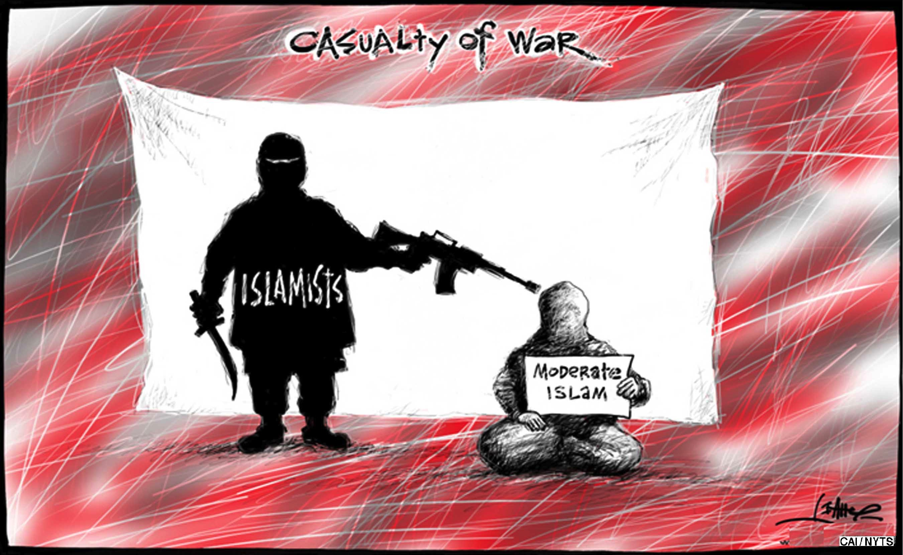
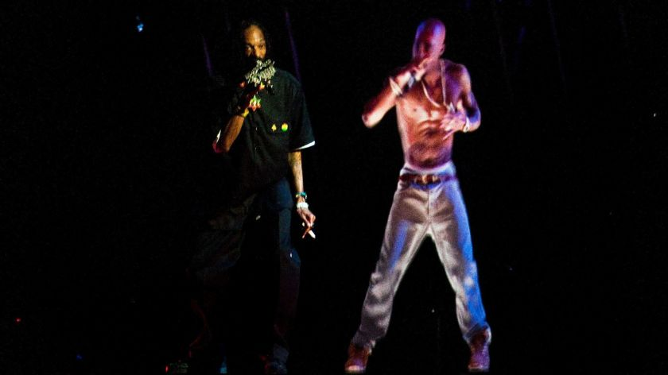
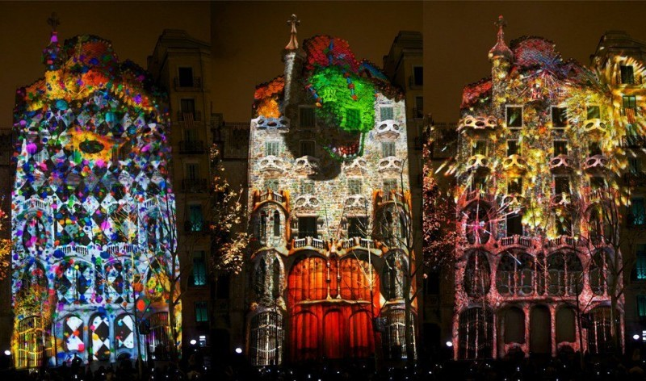

# 	The synthetic telepathy network services

The first question that we can do when we speak about a service is who is the type of client that search for all the services that are packaged in this network? Remember that all of those utilities are illegals; some of them are possible to be classified as terrorist in my opinion.

- Businessman
- Politicians
- Market analysts
- Criminal organizations
- High-class scammers
- High-class stalkers
- Subversive groups
- Extra European spies
- Audiovisual industry
- Military warfare industry
- Big tech firm B-Side
- High class society
- High level ecclesiastics

# Gangstalking

## 

> *Clients: Businessman, Politicians, Criminal organizations, Subversive groups, High-class stalkers.*
>
> *Type of service: probably 365 days duration with possibility of renew the contract.*
>
> *Price of service: unknown, but in radio frequency they speak about 3 millions Monero for year of service*.
>
> *Target: one or more human victims.*
>
> *Source of income: contract, sale of victims various type of data, plot for film and/or series productions, video on demand illegal amateur pornography, forced prostitution, human traffic.*

**To stalk**, a verb with root in Protoindo European [[1]](https://en.wikipedia.org/wiki/Indo-European_languages ) languages, ancient Greek [[2]](https://en.wikipedia.org/wiki/Ancient_Greek>) and old Armenian [[3]](https://en.wikipedia.org/wiki/Classical_Armenian). Four  possible meanings of this verb:

1. To approach slowly and quietly in order not to be discovered when getting closer.
2. To (try to) follow or contact someone constantly, often resulting in **harassment** [[4]](https://en.wikipedia.org/wiki/Harassment). 
3. To walk slowly and cautiously; to walk in a stealthy, noiseless manner. 
4. To walk behind something, such as a screen, for the purpose of approaching game; to proceed under cover.

From this verb we can extract the noun **stalking** [[5]](https://en.wikipedia.org/wiki/Stalking), three possibles meanings:

1. Hunting for game by moving silently and stealthily or by waiting in ambush.
2. The crime of following or **harassing** another person, causing him or her to fear death or injury.	
3. The removal of stalks from bunches of grapes prior to wine making.

We can appreciate in bold two times words with root in the verb **to harass**, from old French:

1. To fatigue or to tire with repeated and exhausting efforts. 
2. To annoy endlessly or systematically; to molest. 
3. To put excessive burdens upon; to subject to anxieties. 

We speak about **gangstalking** [[6]](https://www.urbandictionary.com/define.php?term=gang%20stalking) when we refer to the stalking of an individual by a large number of people who coordinate their stalking activities. Normally used by criminals organizations to claim a drogue debt, to induct to suicide an opposer, to annihilate a political figure, to limit a especially creative brain or to generate thousand millions euro. 

Has you can see in the image on top of the paragraph I've used the Spanish name "**Luz de Gas**" [[7]](https://ca.wikipedia.org/wiki/Fer_llum_de_gas) that is the translation of **gaslighting** [[8]](https://en.wikipedia.org/wiki/Gaslighting) that is a form of psychological manipulation in which a person seeks to sow seeds of doubt in a **targeted individual** [[9]](https://www.urbandictionary.com/define.php?term=targeted%20individual) or in members of a targeted group, making them question their own memory, perception, and sanity. Using persistent denial, misdirection, contradiction, and lying, gaslighting involves attempts to destabilize the victim and to invalidate the victim's belief. 

From the name of "Luz de Gas", a practice that without technology was executed also by the Franco's phalanx in the Catalan Republic, we can arrive to the word of a defunct masonry which name was "**illuminati**" [[10]](https://www.nationalgeographic.com/archaeology-and-history/magazine/2016/07-08/profile-adam-weishaupt-illuminati-secret-society/). In Italy and in all over the world nowadays is utilized by a pseudo digital dictatorship that is doing terrorism in Europe. Does illuminati really exist? For sure simply search the hashtag **#illuminati** [[11]](https://www.instagram.com/explore/tags/illuminati/) [[12]](https://twitter.com/search?q=%23illuminati&src=typd) in Twitter or in Instagram, in this one with infographics this masonry have got more than two millions of results.

But what is a pseudo dictatorship? Is a form of a state under the declared state. *A B*-side of the democracy where black markets, stalkings, sexual harassments, illegal control is done. Normally is regulated by a **pyramid structure **[[13]](https://en.wikipedia.org/wiki/Organization#Pyramids_or_hierarchies) with **paramilitary** [[14]](https://en.wikipedia.org/wiki/Paramilitary) or **mercenary** [[15]](https://en.wikipedia.org/wiki/Mercenary) forces controlling the victims that fall in with a gangstalking or the workers, drug sellers or prostitute. 

### The gangstalking "game"

Basically gangstalking and gaslighting are based upon the systematically destruction of your past and present. *Love, friendship, work, home, pets and your possessions are loose* in a short period of time. I've got a personal experience about a pattern used in these tortures. We can speak about "**target individuals**", and i use the plural because there are always two victim, **a men and his love**. It's simple, the man loose all his life like I've said before and the woman like one year after start to think that world have changed and that she'll meet with this man another time after a **sexual game**. *She thinks that this is a game, very similar to what we found in the internationals ready-made television formats*. The two targets are separated and inducted to suicide with a mental destroyer situation, normally a gangstalking for him and a **gang bang** [[16]](https://en.wikipedia.org/wiki/Gang_bang)  for her. The two in different time range, him usually one or half year before, are victims also of what is known as **brainwashing** [[17]](https://en.wikipedia.org/wiki/Brainwashing). The twos in different time laps are victims of stalkers that are normally **mind hackers** [[18]](https://www.gitbook.com/) that try to change the basics of them life. The man usually have no money, no friends and no sex. Go in **major depressive disorder** [[19]](https://en.wikipedia.org/wiki/Major_depressive_disorder) and typically live of what he founds on the street, so the society classify them as indigent and sick with **Diogenes syndrome** [[20]](https://en.wikipedia.org/wiki/Diogenes_syndrome) and **compulsive hoarding** [[21]](https://en.wikipedia.org/wiki/Compulsive_hoarding). The woman is blocked in a vortex of sex and orgies thinking that she is partaking in a game, every game for the women i think that has got one year of time with the goal of four years in total. All of this is brainwashing. First of all when the two separates, that is the start of the loose of all his goods for the man, the woman is betrayed to go away from him with hoax. Next she's got a relation with a personal trainer or a figure like this to have got a perfect body in vision of the games that nothing more are than illegal pornography sold in video on demand bitcoin stores and be a victim of human trade. 

What is the final objective of these machinated steps? It's simple, but when you're experiencing them if your not very clever and intelligent the twos will die committing **suicide**[[22]](https://en.wikipedia.org/wiki/Suicide). The final goal for the woman, if she doesn't kill herself, is to grew up like a sexual slave prostitute build *to satisfy extreme desire for high class society individuals*. 

Normally the man, who has lost everything, commit suicide because  see her in porn movies and images found on the web, deep web, and many others technological platform. The woman when the man loose his life understand that this was not a game and commit suicide also or terminate in heavy drug addiction like **heroine** [[23]](https://en.wikipedia.org/wiki/Heroin) or **crack** [[24]](https://en.wikipedia.org/wiki/Crack_cocaine) working like a low level prostitute. 

This "game" is reality is a recurrent pattern where a love is forcedly broken and two people commit suicide. The pattern is shaped every time upon the victims using a series of variables, like in information technology are the parameters in the invocation of the program. With this crime, gangstalker can gain **billions euro**, alimenting **terrorism** [[25]](https://en.wikipedia.org/wiki/Terrorism) in a silent mode. How is possible to gain such amount of money with this **criminal pattern**? It's simple, they bet on all about the life of the two target individuals, and the woman in engaged in  **sexual harassment** [[26]](https://en.wikipedia.org/wiki/Sexual_harassment) ,**human traffic** [[27] ](https://en.wikipedia.org/wiki/Human_Traffic)and **forced prostitution** [[28]](https://en.wikipedia.org/wiki/Forced_prostitution). They use her to do sexual favors to big drugs clients, rich casino players or so on. She doesn't gain. When she lost her naturally protection about sexual violence they sell her to ultra high class customers that simply enslave her or kill her in a ritual.

*I'll explain step by step how this game with the help of a lot of technology is the real plague of our democracy, and the cause of the right turning in the Europe of the XXI single.*		

### 	Cyberstalking

In the last twenty years, gangstalking has evolved and it has evolved very rapidly using IT technology and telecommunications, touching what is known as **cyberstalking** [[29]](https://en.wikipedia.org/wiki/Cyberstalking) or **cyber gangstalking**. Normally in a gangstalking crew there's a lot of **hackers** [[30]](https://en.wikipedia.org/wiki/Hacker), **crackers** [[31]](http://www.catb.org/jargon/html/C/cracker.html) and **ham radio** [[32]](https://en.wikipedia.org/wiki/Amateur_radio) telecommunications experts, like **satellite** [33](https://en.wikipedia.org/wiki/Satellite), **ELF** [[34]](https://en.wikipedia.org/wiki/Extremely_low_frequency), **ULF** [[35]](https://en.wikipedia.org/wiki/Ultra_low_frequency), **WPT** [36](https://en.wikipedia.org/wiki/Wireless_power_transfer), **HF** [37], **VHF** [[38]](https://en.wikipedia.org/wiki/Very_high_frequency) and **UHF** [[39]](https://en.wikipedia.org/wiki/Ultra_high_frequency). 

**Neuroscience** is another gangstalking IT branch. With the grow up of **BCI** [[40]](https://en.wikipedia.org/wiki/Brain%E2%80%93computer_interface), and the fall down of the price of them with **Arduino** [[41]](https://en.wikipedia.org/wiki/Arduino) and other **open hardware** [[42]](https://en.wikipedia.org/wiki/Open-source_hardware) solutions, **neuroscience** [[43]](https://en.wikipedia.org/wiki/Neuroscience) is now low cost. 

What in the **cold war** [[44]](https://en.wikipedia.org/wiki/Cold_War) was patented by US researcher with various acronym like **V2K** known also as "voice to skull" [[45]](https://sites.google.com/site/targetedindividuals101/home/v2k) or "infrasound" [[46]](https://en.wikipedia.org/wiki/Infrasound), **MKULTRA** [[47]](https://en.wikipedia.org/wiki/Project_MKUltra), known also as CIA mind control program, **TMS** [[48]](https://en.wikipedia.org/wiki/Transcranial_random_noise_stimulation), transcranial magnetic stimulation also in remote, and **NLP** [[49]](https://en.wikipedia.org/wiki/Neuro-linguistic_programming), neuro-linguistic programming (see also methods [[50]](https://en.wikipedia.org/wiki/Methods_of_neuro-linguistic_programming)) synthetic hypnosis , could be found in my personal repository [[51]](https://drive.google.com/drive/folders/1p_ZjYQu33qaeZTE89Ae48biWiBG9EPcK) and it is actively used by gangstalker and hackers. Also in wikileaks we can found some information more about those technologies. 

But is gangstalkers connected to the US secret services and governments? No, probably not. It's very common that they are using the public patents and leaks from **Julian Assange** [[52]](https://en.wikipedia.org/wiki/Julian_Assange) team to improve the synthetic telepathy network, nowadays an information technology evolution of a part of the radio television broadcast system. 

# Telecommunications for inmates

> *Clients: Businessman, Politicians, Criminal organizations, Subversive groups, Extra European spies.*
>
> *Type of service: probably for month service like a normal provider.*
>
> *Price of service: unknown.*
>
> *Target: in reality the same contractor because all the conversations are registered!*
>
> *Source of income: contract, sold of all the conversations to opposites, police and governments.*

Telecommunications for inmates is another service bind by the synthetic  telepathy network. Radio wave at low frequency like is voice to skull  obtained by the applications of the patent US5159703A (462.25 KHz) can  bypass all kind of material utilized in construction. It's an analog but clientless semi secure telecommunication system.

With radio waves as you can see in the image above it's possible to obtain also remote imaging. It's from a **MIT** [[53]](http://www.mit.edu/) research and it's called **RF Pose** [[54]](http://rfpose.csail.mit.edu/). But it's also possible to obtain 3D **skeletons** [[55]](https://en.wikipedia.org/wiki/Skeleton) models always through walls with something called **RF-Pose3D** [[56]](http://rfpose3d.csail.mit.edu/). But it's also possible to remote reading learning **sleep stages** [[57]](https://es.wikipedia.org/wiki/Arquitectura_del_sue%C3%B1o) from radio signals with something called **RF-Sleep** [[58]](http://sleep.csail.mit.edu/) and at least but not last we've got **EQ-Radio** [[59]](http://eqradio.csail.mit.edu/) that is a remote emotion recognition. 

Why i explain this in this section? It's obvious. Who contract this clientless service in reality he's also a victim. Because of all the technologies that i've explained above. With this awesome technology the owners of the network can know passions of the victims and seeing this in a criminal way it is possible to obtain ways to coerce victims. Reflect.

# Semi physic remote desktop environment

> *Clients: Businessman, Politicians, Criminal organizations, Subversive groups, Audiovisual industry, Big tech firm B-Side.*
>
> *Type of service: probably for month service like a normal provider.*
>
> *Price of service: unknown.*
>
> *Target: in reality the same contractor because all the environment is registered!*
>
> *Source of income: contract, sold of all the conversations to opposites, police and governments.*

With the use of brain waves joint together with voice to skull service, clients of this criminal network can work in physic remote site only with their brain. This is a very interesting technology because a person can work physically like a waiter for example and, using what we have refer in another chapter like human multi tasking, do a parallel job. This is a very productive feature but as usual if it's used by bad guys it could determine the grow up of undetectable terrorism. Why i use this important word? It's simple. Think about an hacker crew like the phenomenon that we see in **Al Qaeda** [[60]](https://en.wikipedia.org/wiki/Al-Qaeda) or other mercenary crew working for **Islamic Terrorism** [[61]](https://en.wikipedia.org/wiki/Islamic_terrorism). With this feature they can work using information technology without that any secret service or military police can detect it. 

This is absolutely lawbreaker if sold to the wrong customer. Who is controlling this network? Is police able to stop the grow up of the "Illuminati" pseudo dictatorship? I cannot find information about the synthetic telepathy network and i'm a victim of. *I was electronically tortured for two years* and i decide to write about all what i've understood in those hell years. *Someone have to stop this. Just now.* I think that is responsible of the birth of the new **populist movements** [[62]](https://en.wikipedia.org/wiki/Populism) in Europe, extreme right movements, grow up of **Neo-Nazism** [[63]](https://en.wikipedia.org/wiki/Neo-Nazism) and so on. *This is not a joke.*  

# Sexual holograms  sale

> *Clients: Businessman, Politicians, Criminal organizations, High class society, High class ecclesiastics.*
>
> *Type of service: Different types, for hour like a prostitute or for month like a service.*
>
> *Price of service: unknown.*
>
> *Target: The person that is connected with the machine to the hologram.*
>
> *Source of income: service, contract, and informations about sexual customs of the client.*

This is the cutting edge in prostitution. This is what consume high class society. With this, they can fuck, kill, eat whatever they want. And the shape is the shape of a real person.

**Holography** [[64]](https://en.wikipedia.org/wiki/Holography).  But remember is holography without a projector. Who it is possible? Satellite. The city of Barcelona is totally covered. Genova and Milano without any doubt. In radio frequency the speak about Roma, Copenhague but is very likely that all Europe is under this kind of illegal services. 

But some times it's used also by municipal administration in the A-side. Doing what? Urban projection using what is called **projection mapping** [[65]](https://en.wikipedia.org/wiki/Projection_mapping).

But who is behind all of this goodness? So simple the audio visual industry. But what is the real shit about all of this goodness? **Food for pedophiles**. 

### External links

1. https://en.wikipedia.org/wiki/Indo-European_languages 

2. https://en.wikipedia.org/wiki/Ancient_Greek

3. https://en.wikipedia.org/wiki/Classical_Armenian

4. <https://en.wikipedia.org/wiki/Harassment>

5. <https://en.wikipedia.org/wiki/Stalking>

6. https://www.urbandictionary.com/define.php?term=gang%20stalking

7. <https://ca.wikipedia.org/wiki/Fer_llum_de_gas>

8. <https://en.wikipedia.org/wiki/Gaslighting>

9. <https://www.urbandictionary.com/define.php?term=targeted%20individual>

10. <https://www.nationalgeographic.com/archaeology-and-history/magazine/2016/07-08/profile-adam-weishaupt-illuminati-secret-society/>

11. https://www.instagram.com/explore/tags/illuminati/

12. <https://twitter.com/search?q=%23illuminati&src=typd>

13. <https://en.wikipedia.org/wiki/Organization#Pyramids_or_hierarchies>

14. <https://en.wikipedia.org/wiki/Paramilitary>

15. <https://en.wikipedia.org/wiki/Mercenary>

16. <https://en.wikipedia.org/wiki/Gang_bang>

17. https://en.wikipedia.org/wiki/Brainwashing

18. <https://www.mindhacki.ng/content/>

19. <https://en.wikipedia.org/wiki/Major_depressive_disorder>

20. https://en.wikipedia.org/wiki/Diogenes_syndrome

21. https://en.wikipedia.org/wiki/Compulsive_hoarding

22. https://en.wikipedia.org/wiki/Suicide

23. https://en.wikipedia.org/wiki/Heroin

24. https://en.wikipedia.org/wiki/Crack_cocaine

25. https://en.wikipedia.org/wiki/Terrorism

26. <https://en.wikipedia.org/wiki/Sexual_harassment>

27. <https://en.wikipedia.org/wiki/Human_Traffic>

28. https://en.wikipedia.org/wiki/Forced_prostitution

29. https://en.wikipedia.org/wiki/Cyberstalking

30. https://en.wikipedia.org/wiki/Hacker

31. http://www.catb.org/jargon/html/C/cracker.html

32. https://en.wikipedia.org/wiki/Amateur_radio

33. https://en.wikipedia.org/wiki/Satellite

34. https://en.wikipedia.org/wiki/Extremely_low_frequency

35. https://en.wikipedia.org/wiki/Ultra_low_frequency

36. https://en.wikipedia.org/wiki/Wireless_power_transfer

37. https://en.wikipedia.org/wiki/High_frequency

38. https://en.wikipedia.org/wiki/Very_high_frequency

39. https://en.wikipedia.org/wiki/Ultra_high_frequency

40. https://en.wikipedia.org/wiki/Brain%E2%80%93computer_interface

41. https://en.wikipedia.org/wiki/Arduino

42. https://en.wikipedia.org/wiki/Open-source_hardware

43. https://en.wikipedia.org/wiki/Neuroscience

44. https://en.wikipedia.org/wiki/Cold_War

45. https://sites.google.com/site/targetedindividuals101/home/v2k

46. https://en.wikipedia.org/wiki/Infrasound

47. https://en.wikipedia.org/wiki/Project_MKUltra

48. https://en.wikipedia.org/wiki/Transcranial_random_noise_stimulation

49. https://en.wikipedia.org/wiki/Neuro-linguistic_programming

50. https://en.wikipedia.org/wiki/Methods_of_neuro-linguistic_programming

51. https://drive.google.com/drive/folders/1p_ZjYQu33qaeZTE89Ae48biWiBG9EPcK

52. https://en.wikipedia.org/wiki/Julian_Assange

53. http://www.mit.edu/

54. http://rfpose.csail.mit.edu/

55. https://en.wikipedia.org/wiki/Skeleton

56. http://rfpose3d.csail.mit.edu/

57. https://es.wikipedia.org/wiki/Arquitectura_del_sue%C3%B1o

58. http://sleep.csail.mit.edu/

59. http://eqradio.csail.mit.edu/

60. https://en.wikipedia.org/wiki/Al-Qaeda

61. https://en.wikipedia.org/wiki/Islamic_terrorism

62. https://en.wikipedia.org/wiki/Populism

63. https://en.wikipedia.org/wiki/Neo-Nazism

64. https://en.wikipedia.org/wiki/Holography

65. https://en.wikipedia.org/wiki/Projection_mapping

    

    

