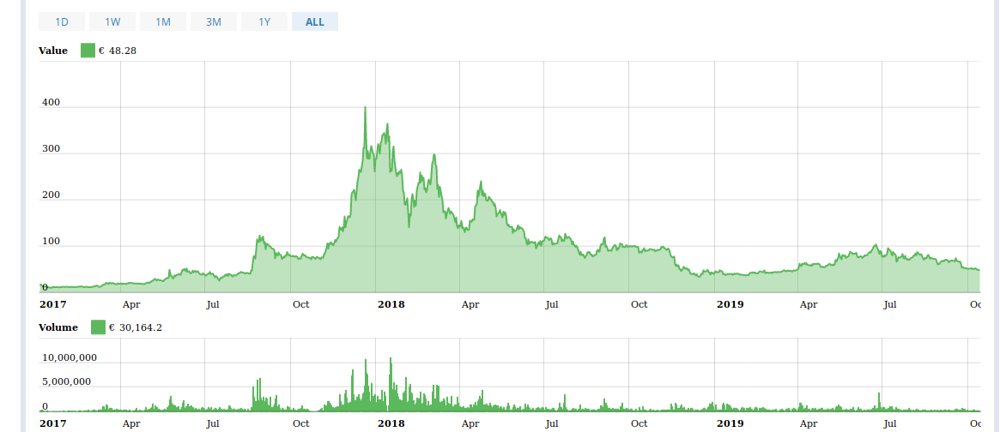
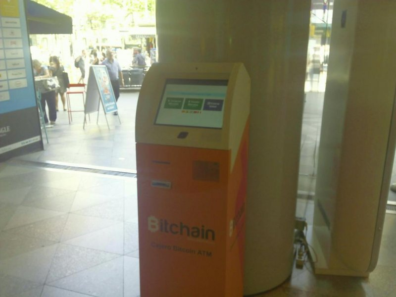
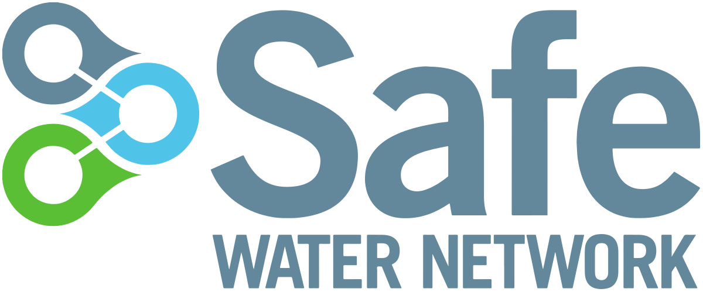

# The Monero crypt concurrency

**Monero** [[1]](https://www.getmonero.org/) is decentralized cryptocurrency, meaning it is secure digital cash  operated by a network of users. Transactions are confirmed by  distributed consensus and then immutably recorded on the **blockchain** [[2]](https://en.wikipedia.org/wiki/Blockchain).  Third-parties do not need to be trusted to keep your **Monero** [[3]](https://en.wikipedia.org/wiki/Monero_(cryptocurrency)) safe. Monero is *totally* untraceable. 

Let's do some considerations before start with a deep dive into this network. First of all **M** is its logotype, simple is the concurrency of the Machine, what we start to explain in the last chapter. But does it can be converted into classical money? Yes for sure here it is the exchange graphic:

​                        

But it's possible to simply go to a cash dispenser and get euro? Yes it is.

## 

Remember that to get cash from this bitcoin **ATM** [[4]](https://en.wikipedia.org/wiki/Automated_teller_machine) normally you have to change **XMR** [[5]](https://www.coinbase.com/price/monero?locale=en) to **LTC** [[6]](https://www.coinbase.com/price/litecoin?locale=en), then go to a local ATM as you can find in **coin ATM radar** [[7]](https://coinatmradar.com/). In Barcelona for example there's the network called **BitBase** [[8]](https://bitbase.es/) where you can sell also directly Monero. 

Another method is to buy a debit bitcoin card that you can recharge on line from your wallet and then simply go to every type of classic currency ATM and got cash. Like **CryptoPay** [[9]](https://cryptopay.me/bitcoin-debit-card/#uk). Criminals use false identities and SIM card without identification to buy online those goods. And this is a fraud. 

Another method to move XMR coins is buy directly in shops that accepts this crypt concurrency. The A-side services or goods that can be payed directly are various some of them are detailed on **cryptwerk** [[10]](https://cryptwerk.com/pay-with/xmr/). What does it mean in reality? That a person that has got a lot of this type of currency could open an A-side physic and Internet shop and sell goods in classical money. Simple but functional. Who's do it in a better way use various company chains to elude fiscal controls and remove the use of XMR from their fiscal invoices. Another time, very simple, it's a game.

What those criminals can do in the same Monero circuit? I don't know but using a little bit of logic and remembering that we're speaking about B-side it's very simple:

- Drug market buy and sell.
- Black market buy and sell.
- Human traffic.
- Forced prostitution.
- All kind of illegal good buy and sell.
- Illegal apartment rent.
- Credit card fraud.
- Cracker services rent.
- Corruption. 

This is only a little window over this terrorist and criminal network. We'll go deeper in the next chapters.

### The SAFE network blockchain 

### External Links

1. https://www.getmonero.org/
2. https://en.wikipedia.org/wiki/Blockchain
3. https://en.wikipedia.org/wiki/Monero_(cryptocurrency)
4. https://en.wikipedia.org/wiki/Automated_teller_machine
5. https://www.coinbase.com/price/monero?locale=en
6. https://www.coinbase.com/price/litecoin?locale=en
7. https://coinatmradar.com/
8. https://bitbase.es/
9. https://cryptopay.me/bitcoin-debit-card/#uk
10. https://cryptwerk.com/pay-with/xmr/

