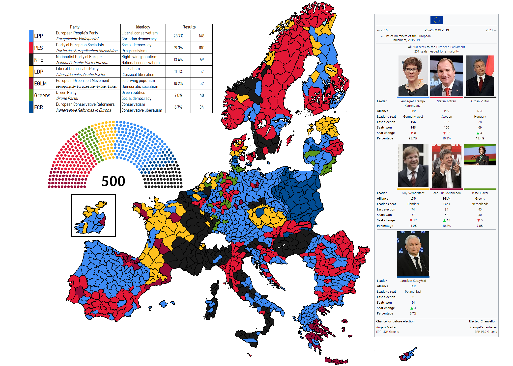
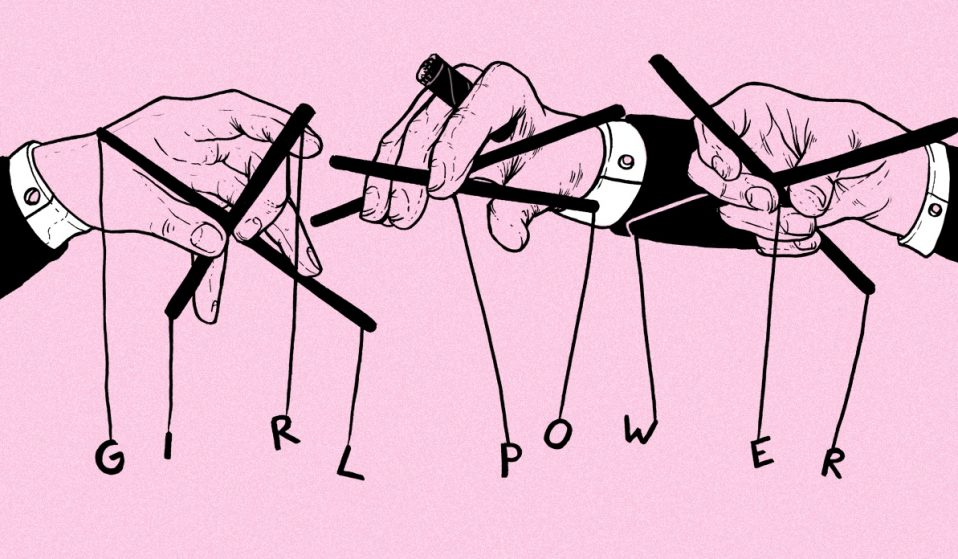

# E-democracy

As you can see there's a pyramid structure in this graphic, so, it's simple, it's a fraud. And electronic democracy *it's not democracy*. I remember my father telling me about his sense of **claustrophobia** [[1]](https://en.wikipedia.org/wiki/Claustrophobia) inside the **Giza pyramid complex** [[2]](https://en.wikipedia.org/wiki/Giza_pyramid_complex), also this illness could be classified as **anxiety disorder** [[3]](https://en.wikipedia.org/wiki/Anxiety_disorder). Look at the second last step before **e-democracy** [[4]](https://en.wikipedia.org/wiki/E-democracy), it's **big data** [[5]](https://en.wikipedia.org/wiki/Big_data) analysis. All of this data in the synthetic telepathy network has grow up a lot. In this criminal network there's absolutely no **privacy** [[6]](https://en.wikipedia.org/wiki/Privacy). And privacy is one of the most important towers of democracy. Where's no privacy there's no democracy.

First of all all people that are connected with the service of remote neural monitoring has got their mind read, auditory cortex and visual cortex first of all. What's happen? People are like remote video cameras! All in their line of sight is uploaded to the computing center, this probably could be in **Switzerland** [[7]](https://en.wikipedia.org/wiki/Switzerland).

What gain do you get in transforming humans into a device? 

Data recollecting about:	

1. Customs and traditions of people.
2. People's sexual clothes.
3. Political inclination.
4. All about them life and about life of his own circle of knowledge.
5. Total control on what so ever is them line of sight, like cars, license plates, people, etcetera etcetera.

But speaking about democracy that is the title of this chapter the worst think is obviously that another tower of our democracies is broken, the **secret ballot** [[8]](https://en.wikipedia.org/wiki/Secret_ballot). 

What is this network? I cannot understand why no one say nothing and my fear for a third world war and the consequent deaths is very high. This is terrorism, and is destroying the **United States of Europe** [[9]](https://en.wikipedia.org/wiki/United_States_of_Europe).

 	

Why our political don't do nothing about? Remember that United Kingdom has vote for ***Brexit***! 

It's very simple and it's astonished how controllers, services and other political group say nothing! The answer is always the same and is the worst cancer of the democracy: **corruption** [[10]](https://en.wikipedia.org/wiki/Corruption). 

How has changed corruption with the "Illuminati" pseudo dictatorship? Simple, with untraceable crypt concurrency like Monero every type of public figure, like politicians or police, can be corrupted with this system. It's very important understand that on line crypt bank like  **Freewallet** [[11]](https://freewallet.org/) are totally anonymous, if used with the **Tor project** [[12]](https://www.torproject.org/) or a free **proxy server** [[13]](https://en.wikipedia.org/wiki/Proxy_server) also source **IP address** [[14]](https://en.wikipedia.org/wiki/IP_address) is rewritten so the service is near absolutely totally secure.

So we can start thinking about what is known as **election day** [[15]](https://en.wikipedia.org/wiki/Election_day) fraud and what is passing just now in our Europe, that is **democratic backsliding** [[16]](https://en.wikipedia.org/wiki/Democratic_backsliding). Since the end of the **cold war** [[17]](https://en.wikipedia.org/wiki/Cold_War) this process in active in the background of our democracies and is something that have been decided by the elite. Like no one have say nothing about the real tool and cause of this right totalitarianism turn, the tool and cause is this network, the synthetic telepathy network and the pseudo dictatorship "Illuminati". I think that at this time, 2019, this process is near to be irreversible like the **climate change** [[18]](https://en.wikipedia.org/wiki/Climate_change), *we've got to do something all together just now*. And in a public way and without using masks. The activists group **Anonymous** [[19]](https://en.wikipedia.org/wiki/Anonymous_(group)) is doing something about, but they've *been classified as terrorist* from ours politicians and also they have not do work in a clear way using simple words without two or more meanings, so a lot of people doesn't understand the real sense. This is a previous accord with the owners of this network where Anonymous got access and do a little bit of opposition, *but it's not sufficient*.

What political currents have born from this backsliding? Remember always, history repeat because humans are always the same. Now with technology, the most important invention in the last century. 

**Populism** [[20]](https://en.wikipedia.org/wiki/Populism). 

And tell me my dear reader, in what these currents flow into? Another time is very simple, but *an icy shiver runs in my spine*:

**Fascism** [[21]](https://en.wikipedia.org/wiki/Fascism) sold as social revolution, sold as **new world order** [[22]](https://en.wikipedia.org/wiki/New_World_Order_(conspiracy_theory)) (a fraud it's always the same elite gaming with people).

Dear fellow reader how many persons die in the last **authoritarianism** [[23]](https://en.wikipedia.org/wiki/Authoritarianism). Only an example **World War 2** [[24]](https://en.wikipedia.org/wiki/World_War_II_casualties) casualties where 55 million. 

Why people don't understand the real danger about "Illuminati"? It's so simple. 

**Ignorance** [[25]](https://en.wikipedia.org/wiki/Ignorance). 

But is ignorance a crime? No it isn't nor it is a bad word to describe the state of a person. It's not an insult. The crime is farm ignorance, with what? *In not so ancient time with supernatural, cult and church. Now with piloted mass media, television and Internet*. 

But if they understand but no one say nothing, what is the cause. Always very simple:

**Money** [[26]](https://en.wikipedia.org/wiki/Money).

I **rotftl** [[27]](https://emojipedia.org/rolling-on-the-floor-laughing/), a nowadays technological acronym, a lot. For money and ignorance our sons and we are about to live another forty years of blackout like the start of the twentieth century more dangerous because of extreme evolution of technology. 

*How are the real persons behind that? Our fathers, because they are old people, they've lived and they only think about personal problems. They don't like humans and unconsciously or not have destroyed the life of their grandchildren.* 

# Piloted feminism

**Feminism** [[28]](https://en.wikipedia.org/wiki/Feminism) is also another paint of this system, they have been very clever and got analyzed the weak points in our society. Attention theoretically feminism is a great movement is for freedom and equality in **human rights** [[29]](https://en.wikipedia.org/wiki/Human_rights) for women, in reply to **machismo** [[30]](https://en.wikipedia.org/wiki/Machismo) and **gender violence** [[31]](https://en.wikipedia.org/wiki/Gender_violence). So it's a democratic movement.     

So who can utilize democratic movements to complain with a turn in totalitarianism in our Europe? Great service entrepreneurs departments by human hackers.

# External links

1. https://en.wikipedia.org/wiki/Claustrophobia
2. https://en.wikipedia.org/wiki/Giza_pyramid_complex
3. https://en.wikipedia.org/wiki/Anxiety_disorder
4. https://en.wikipedia.org/wiki/E-democracy
5. https://en.wikipedia.org/wiki/Big_data
6. https://en.wikipedia.org/wiki/Privacy
7. https://en.wikipedia.org/wiki/Switzerland
8. https://en.wikipedia.org/wiki/Secret_ballot
9. https://en.wikipedia.org/wiki/United_States_of_Europe
10. https://en.wikipedia.org/wiki/Corruption
11. https://freewallet.org/
12. https://www.torproject.org/
13. https://en.wikipedia.org/wiki/Proxy_server
14. https://en.wikipedia.org/wiki/IP_address
15. https://en.wikipedia.org/wiki/Election_day
16. https://en.wikipedia.org/wiki/Democratic_backsliding
17. https://en.wikipedia.org/wiki/Cold_War
18. https://en.wikipedia.org/wiki/Climate_change
19. https://en.wikipedia.org/wiki/Anonymous_(group)
20. https://en.wikipedia.org/wiki/Populism
21. https://en.wikipedia.org/wiki/Fascism
22. https://en.wikipedia.org/wiki/New_World_Order_(conspiracy_theory)
23. https://en.wikipedia.org/wiki/Authoritarianism
24. https://en.wikipedia.org/wiki/World_War_II_casualties
25. https://en.wikipedia.org/wiki/Ignorance
26. https://en.wikipedia.org/wiki/Money
27. https://emojipedia.org/rolling-on-the-floor-laughing/
28. https://en.wikipedia.org/wiki/Feminism
29. https://en.wikipedia.org/wiki/Human_rights
30. https://en.wikipedia.org/wiki/Machismo
31. https://en.wikipedia.org/wiki/Gender_violence

