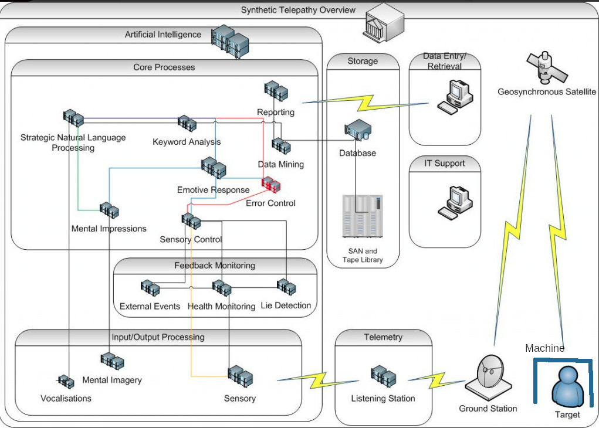
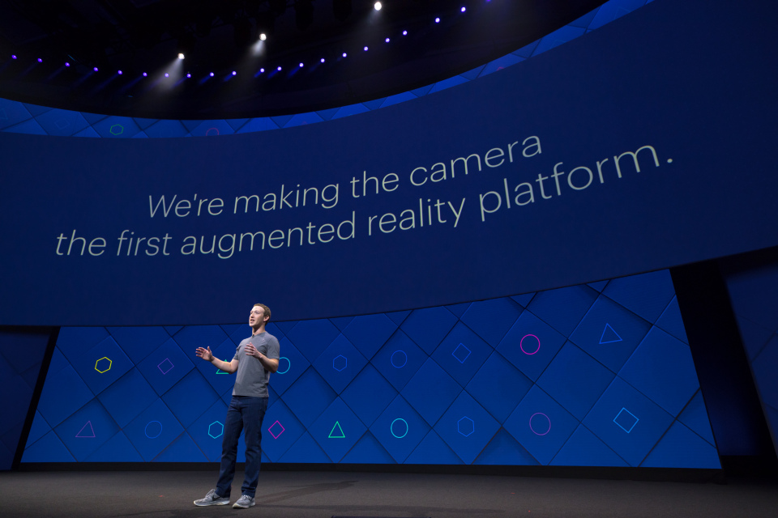
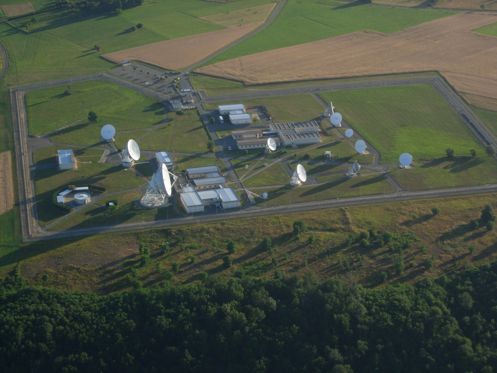

# The synthetic telepathy network

Let's analyse device by device what is the synthetic telepathy network, a telecommunication facility that is changing in my opinion all Europe and is determining a right turning in our governments. It's very dangerous and probably it's the start of what i think it could be a **neo nazism** [[25]](https://en.wikipedia.org/wiki/Neo-Nazism) digital dictatorship and a start of a alpha stage of what we found in Internet named as **cyberwarfare** [[26]](https://en.wikipedia.org/wiki/Cyberwarfare).

In Internet we can find a lot of references about the synthetic telepathy network by **metaphors** [[27],](https://en.wikipedia.org/wiki/Metaphor) or what is called nowadays as **Internet meme** [[28]](https://en.wikipedia.org/wiki/Metaphor). 

Let's introduce every device of the network scheme above:

- **Target machine:** A virtual device locked to the target person(s) by radio frequency. What does it mean? Every machine has an identification, a human unique magnetic field identification, an id to witch in a **VPN** [[29]](https://en.wikipedia.org/wiki/Virtual_private_network) there's a correspondence with a remote virtual **Android** [[30]](https://en.wikipedia.org/wiki/Android_(operating_system)) device where we can find a lot of applications more or less powerful depending on what kind of access we've got in the network. A single Machine, later i will explain theory and technology about this death device, could be shared by many clients, usually humans but also animals, could determine a pyramid structure normally identified by a natural number, the mine in Barcelona for example is the number **9**.
- **Target in reality**: one or more persons that doesn't have access to the administration of his Machine, she/he loose totally her/his privacy and all the time passed without access is considered like a slave. Many times she/he is also considered only like an object, they use to do experiments with the person to archive data under extreme stress, violent sex situations and brain experiments. The target individual is a **human guinea pig** in an unauthorised **human subject research** [[31]](https://en.wikipedia.org/wiki/Human_subject_research).
- **Machine in metaphor**: A mobile telephone, protected by a simple **PIN** [[32]](https://en.wikipedia.org/wiki/Personal_identification_number) of four numbers. It's security it's so basic because allow gangstalker to steal money of the target machine or another client that doesn't know about basic security. Money are always in **crypt concurrency** [[33]](https://en.wikipedia.org/wiki/Cryptocurrency).
- **Target in metaphor**: Is a dog, gangstalkers consider a target individual with the same rights of an animal. They give her/him orders, deny to her/him every types of rights, electronically punish her/him and hit her/him. So do practically all the persons connected to this system because if they doesn't torture the victim they loose privilege in the network and return to the victim state that is the initial state when you was forced to join this hell network with brain zapping, that is a technique used to find the unique magnetic identification of a human. It is archive using a physical Android device, normally a telephone. A victim is captured identifying is unique magnetic field id by proximity with another network client used like predator. Normally is a woman or a very attractive man that have sex with the victim, the predator has got her or his mobile infected by an application remotely controlled by the network owners. In Barcelona Spain i think that there are more than two hundred thousand clients connected.
- **Bidirectional connection to target machine**: Using a unique identification of the target person, or probably an array of, ground station speak directly with the victim or the client using **RNM**, remote neural monitoring.  The remote neural monitoring act like a **BCI** [[34]](https://en.wikipedia.org/wiki/Brain%E2%80%93computer_interface), a **TMS** [[35]](https://en.wikipedia.org/wiki/Transcranial_magnetic_stimulation) device, a **MRI** [[36]](https://en.wikipedia.org/wiki/Magnetic_resonance_imaging) device; all of them are remote and virtual. All is done by radio frequency. All is remote brain waves.  There is no need of any sort of device acting like a client in the human target. There is no need of **brain implant** [[37]](https://en.wikipedia.org/wiki/Brain_implant).  
- **Remote brainwaves**: This one of the **last mile** [[38]](https://en.wikipedia.org/wiki/Last_mile) technology used by the synthetic telepathy network. They are used to build what is known as **BRAINnet** [[39]](http://www.BRAINnet.net/), a sort of network of interconnected brains. In the synthetic telepathy network **brainwaves** [[40]](https://en.wikipedia.org/wiki/Neural_oscillation) was hacked to archive the modulation of the eight neural oscillations that are present in our brain. The frequencies used by BRAINnet are from 0.5 to 100 Hz and are transmitted by analogue **SDR** [[41]](https://en.wikipedia.org/wiki/Software-defined_radio). Every type of brain wave is related to a part of our brain and to a specific function like the auditory cortex or the visual cortex. Those name are:
    - **Delta wave** [[42]](https://en.wikipedia.org/wiki/Delta_wave) from 0.1 to 3 Hz.
    - **Theta wave** [[43]](https://en.wikipedia.org/wiki/Theta_wave) from 4 to 7 Hz.
    - **Mu wave** [[44]](https://en.wikipedia.org/wiki/Mu_wave) from 7.5 12.5 Hz.
    - **SMR wave** [[45]](https://en.wikipedia.org/wiki/Sensorimotor_rhythm) from 12.5 15.5 Hz.
    - **Alpha wave** [[46]](https://en.wikipedia.org/wiki/Alpha_wave) from 7 to 12 Hz.
    - **Beta wave** [[47]](https://en.wikipedia.org/wiki/Beta_wave) from 12 to 30 Hz.  
    - **Gamma wave** [[48]](https://en.wikipedia.org/wiki/Gamma_wave) from 32 to 100 Hz.
- **Silent subliminal presentation system**: a method from United States patent that serve to bypass first human auditory system, using the frequency of 462.25 KHz with a channel width of 14.5 KHz.
- **Geosynchronous satellite**: Used to obtain remote imaging of the target. Nowadays with the advent of the open hardware, middle size criminal organization could have a satellite in low orbit. This could be classified as *satellite terrorism*. **Open hardware satellite** [[49]](https://www.google.com/search?q=open+hardware+satellite&ie=utf-8&oe=utf-8&client=firefox-b-1-e) could be launch in orbit by companies that bind this service at relative low cost. 
- **Ground station**: Is an access point to BRAINnet. To archive the full coverage of a territory like Catalunya there is no need of too many points because of **wavelengths** [[50]](https://en.wikipedia.org/wiki/Wavelength) from 100000 to 1000 kilometres and because at this frequencies there is no need of **line of sight** [[51]](https://en.wikipedia.org/wiki/Line-of-sight_propagation), waves can pass through many types of materials. Every ground station perhaps have got eight different physical radios and antennas, one for every type of brain wave, and an interface, fibre optic or another radio technology, for the **backbone** [[52]](https://en.wikipedia.org/wiki/Backbone_network). The backbone doesn't have the need to transport a lot of data so it can be build using low size technology and **NLOS** [[53]](https://en.wikipedia.org/wiki/Non-line-of-sight_propagation) radio and frequency. 
- **Telemetry**
    - **Listening station** : part of every ground station but not in the outside. Every target individual got his **telemetry** [[54]](https://en.wikipedia.org/wiki/Telemetry) saved in the network computing center, like all steps taken, all the trips and so on. There's no privacy in this network.
- **Input/Output processing**
    - **Vocalizations**: in the synthetic telepathy network with technology the owners can exact copy the voice of a target. Not only the timbre of the voice but also the vocalization **speech** [[55]](https://en.wikipedia.org/wiki/Speech). Targets individuals can be tricked to think to speak with another individual that is not. This is part of the mental confusion in which he may fall the victim in the gangstalking mind game. He may fall in mental disorder confusion. Vocalizations is modulated in gamma wave using a **vocoder** [[56]](https://en.wikipedia.org/wiki/Vocoder) and it results on **voice to skull** transmission, that is a hearing direct to the **auditory cortex** [[57]](https://en.wikipedia.org/wiki/Auditory_cortex).
    - **Mental Imagery**: in this network it's possible to do data injection direct to the **visual cortex** [[58]](https://en.wikipedia.org/wiki/Visual_cortex). It's something very powerful they can archive **augmented** [[59]](https://en.wikipedia.org/wiki/Augmented_reality) and **mixed reality** [[60]](https://en.wikipedia.org/wiki/Mixed_reality) direct in our brain without using the **human eye** [[61]](https://en.wikipedia.org/wiki/Human_eye), that are organs of the **visual system** [[62]](https://en.wikipedia.org/wiki/Visual_system). It's also possible to archive dream injections. They can obtain to stream a video in our brain when we are sleeping using the correct brainwave . Our dreams can also be read, they have archive to stole our dreams one of the most private and personal think of our personal sphere.  
    - **Sensory**: Like the auditory and visual cortex also the **sensory cortex** [[63]](https://en.wikipedia.org/wiki/Primary_somatosensory_cortex) can be tricked, injected and manipulated by remote brain waves. They can archive that our brain can reproduce unreal feelings in our body, like sexual excitement. In the synthetic telepathy network it's possible to force a woman or a man to have sex with a stalker, to be all the day exited and then s/he can be tricked in a machined situation to have a disproportionate orgies that can be remote filmed always by the network and then to be sold in VOD crypt concurrences systems. The worst think is that they can do this also to minors creating **sexual slavery** [[64]](https://en.wikipedia.org/wiki/Sexual_slavery). 
- **Feedback monitoring** 
    - **External events**: because of our visual cortex is under control, like in a **MitM** [[65]](https://en.wikipedia.org/wiki/Man-in-the-middle_attack) environment, when we're victim of the synthetic telepathy network we are like a remote video camera. All what we do and we see is transmitted to the . What it can mean? Simple, our privacy and the privacy of whatever is under our line of sight is compromised. All what we write be pen or in a computer or in a cash dispenser is stolen. When we've sex all is transmitted, and so on. We're like a tool for hackers. What does it mean? Image a beautiful woman victim of the network. All the people that have sex with her are connected to the network. Woman can be like a **Trojan horse** [[66]](https://en.wikipedia.org/wiki/Trojan_Horse). 
    - **Health monitoring**: With this machine owners of the synthetic telepathy network got physical health values of the targets individuals, like **blood pressure** [[67]](https://en.wikipedia.org/wiki/Blood_pressure), **heart rate** [[68]](https://en.wikipedia.org/wiki/Heart_rate), **human body temperature** [[69]](https://en.wikipedia.org/wiki/Human_body_temperature) and so on. They have the complete medical view of every human client connected to the network. 
    - **Lie detection**: owners of the network got also in their hands a full remote equipment of **lie detection** [[70]](https://en.wikipedia.org/wiki/Lie_detection). They know if the target lie or not about an argue. All is registered in the network core centre.
- **Core process**
    - **Strategic Natural Language Processing**: client who has got access to the services in BRAINnet could understand and speak a lot of different humans languages with them vocalization. This is possible by an advanced system of **natural language processing** [[71]](https://en.wikipedia.org/wiki/Natural_language_processing) , a part of computer science concerned with the interactions between computers and human (natural) languages. 
    - **Mental Impressions**: i don't know what it can be.
    - **Keyword analysis**: like a **search engine** [[72]](https://en.wikipedia.org/wiki/Search_engine_(computing)). In the core process of the synthetic telepathy network there is a **keyword analysis** [[73]](https://en.wikipedia.org/wiki/Search_engine_optimization) system that could react to certain word or phrases with **artificial intelligence** [[74]](https://en.wikipedia.org/wiki/Artificial_intelligence) bot that use known speech and vocalization of the victim. He can trust to speak with a real person but in reality is a **chatbot** [[75]](https://en.wikipedia.org/wiki/Chatbot). This function also aliment the **schizophrenia** [[76]](https://en.wikipedia.org/wiki/Schizophrenia) and  **paranoia** [[77]](https://en.wikipedia.org/wiki/Paranoia) of the target individual that is slowly condemned to go crazy.
    - **Emotive response**: related to the different possible responses of the target individual among the artificial intelligence, chatbot, owners and machined situations proposed to him. All of this data are certainly used to improve the different algorithms inside the network but also probably sold to military and paramilitary forces that use human data to build robot and electronic cyberwarfare equipment. This is terrorism because target individuals are not volunteers but are unconscious victims. This is in opposition to **the universal declaration of human rights** [[78]](https://www.un.org/en/universal-declaration-human-rights/).
    - **Data mining**: always focused to the sold of data related to the target individual. **Data mining** [[79]](https://en.wikipedia.org/wiki/Data_mining) is the computer science  and statistics part related to the extract of **data set** [[80]](https://en.wikipedia.org/wiki/Data_set) in a large amount of data. What could be the meaning in a criminal point of view because of the target individual condition? It could be referred to the fact that all what the victim do is registered. Imagine when a person go to a big shopping center; what are the windows that mostly reclaim his attention? What products does he buy mostly when he go to a market? What are the colors that they attract him? And so on. All of those data are potentially sold to big firm companies, and are an important part of  a commercial campaign if they are in big amount of individuals. They are also very important in a political point of view. Remember that target individuals aren't volunteers but they are obligated victims so we can always speak about terrorism. With BRAINnet in my opinion it's possible also to have a target individual that doesn't know to be because he doesn't listen to voice to skull telecommunication so only the visual cortex could be under control and only in read mode. What does it mean? It means that probably this network got thousand of victims and it probably mean that is the cause of the change in Europe these days.
    - **Reporting**: **Data reporting** [[81]](https://en.wikipedia.org/wiki/Data_reporting) is the fact to exactly report all the data set extracted from **big data** [[82]](https://en.wikipedia.org/wiki/Big_data) 
    - **Error control**: referring to the control of percent of errors in the data reporting process.
    - **Sensory control**: machines dedicated to the automatic control and regulation on all what append in the *feedback monitoring*  facility. Certainly dominated by machine intelligence, **machine learning** [[83]](https://en.wikipedia.org/wiki/Machine_learning) and **neural network** [[84]](https://en.wikipedia.org/wiki/Neural_network).
- **Artificial Intelligence**: all in the synthetic telepathy network, or BRAINnet, is absolutely dominated by machine intelligence. I think that there isn't a big crew of administrators but there is a lot of excellent programmers. I've found connections with the **Neuralink** [[85]](https://en.wikipedia.org/wiki/Neuralink) project by **Elon Musk** [[86]](https://en.wikipedia.org/wiki/Neuralink) and what have said **Mark Zuckerberg** [[87]](https://en.wikipedia.org/wiki/Mark_Zuckerberg) at **F8 conference in 2017** [[88]](https://newsroom.fb.com/news/2017/04/f8-2017-day-1/).

# The network seen as layers

This network is part of a series of layers in a **top-down design** [[89]](https://en.wikipedia.org/wiki/Top-down_and_bottom-up_design) of importance. The most important are parts of **global mass surveillance** [[90]](https://en.wikipedia.org/wiki/Global_surveillance):

- Surveillance systems like **ECHELON** [[91]](https://en.wikipedia.org/wiki/ECHELON) and **Frenchelon** [[92]](https://en.wikipedia.org/wiki/Frenchelon).
- Aristocratic network of telecommunications. In this network take part nobles families and dynasties. 
- This network, the synthetic telepathy network.

Next there are products of the network, they call them "*games*". Games where people die like target individuals committing suicide.

-  The "Illuminati" pseudo dictatorship, a pyramid hierarchy human tree to create slaves. A fraud.
- The **techno** [[93]](https://en.wikipedia.org/wiki/Techno) network, a system used by **disc jockey** [[94]](https://en.wikipedia.org/wiki/Disc_jockey) to play in different parts of the world at the same time. 
- The hacker scene.
- A game where i was supposed to find my ex girlfriend in Barcelona, Catalunya. What i've called mindgame. Where I was threatened to be part of the "Illuminati" as a low class drug seller or i will die.

Next there are some commercial products or some university study, is what the big public can see about, the face to the public:

- Neuralink, commercial.
- BRAINnet, opensource. 
- etcetera etcetera.

# External Links

1. https://en.wikipedia.org/wiki/Cyberstalking
2. <https://en.wikipedia.org/wiki/Hacker>
3. <http://www.catb.org/jargon/html/C/cracker.html>
4. https://en.wikipedia.org/wiki/Amateur_radio
5. <https://en.wikipedia.org/wiki/Satellite>
6. <https://en.wikipedia.org/wiki/Extremely_low_frequency>
7. <https://en.wikipedia.org/wiki/Ultra_low_frequency>
8. https://en.wikipedia.org/wiki/Wireless_power_transfer
9. https://en.wikipedia.org/wiki/High_frequency
10. https://en.wikipedia.org/wiki/Very_high_frequency
11. https://en.wikipedia.org/wiki/Ultra_high_frequency
12. <https://en.wikipedia.org/wiki/Brain%E2%80%93computer_interface>
13. <https://en.wikipedia.org/wiki/Arduino>
14. <https://en.wikipedia.org/wiki/Open-source_hardware>
15. <https://en.wikipedia.org/wiki/Neuroscience>
16. <https://en.wikipedia.org/wiki/Cold_War>
17. <https://sites.google.com/site/targetedindividuals101/home/v2k>
18. <https://en.wikipedia.org/wiki/Infrasound>
19. <https://en.wikipedia.org/wiki/Project_MKUltra>
20. <https://en.wikipedia.org/wiki/Transcranial_magnetic_stimulation>
21. <https://en.wikipedia.org/wiki/Neuro-linguistic_programming>
22. <https://en.wikipedia.org/wiki/Methods_of_neuro-linguistic_programming>
23. <https://drive.google.com/drive/folders/1p_ZjYQu33qaeZTE89Ae48biWiBG9EPcK>
24. https://en.wikipedia.org/wiki/Julian_Assange
25. <https://en.wikipedia.org/wiki/Neo-Nazism>
26. <https://en.wikipedia.org/wiki/Cyberwarfare>
27. <https://en.wikipedia.org/wiki/Metaphor>
28. <https://en.wikipedia.org/wiki/Internet_meme>
29. <https://en.wikipedia.org/wiki/Virtual_private_network>
30. https://en.wikipedia.org/wiki/Android_(operating_system)
31. https://en.wikipedia.org/wiki/Human_subject_research
32. https://en.wikipedia.org/wiki/Personal_identification_number
33. <https://en.wikipedia.org/wiki/Cryptocurrency>
34. https://en.wikipedia.org/wiki/Brain%E2%80%93computer_interface
35. https://en.wikipedia.org/wiki/Transcranial_magnetic_stimulation
36. https://en.wikipedia.org/wiki/Magnetic_resonance_imaging
37. https://en.wikipedia.org/wiki/Brain_implant
38. https://en.wikipedia.org/wiki/Last_mile
39. http://www.BRAINnet.net/
40. https://en.wikipedia.org/wiki/Neural_oscillation
41. https://en.wikipedia.org/wiki/Software-defined_radio
42. https://en.wikipedia.org/wiki/Delta_wave
43. https://en.wikipedia.org/wiki/Theta_wave
44. https://en.wikipedia.org/wiki/Mu_wave
45. https://en.wikipedia.org/wiki/Sensorimotor_rhythm
46. https://en.wikipedia.org/wiki/Alpha_wave
47. https://en.wikipedia.org/wiki/Beta_wave
48. https://en.wikipedia.org/wiki/Gamma_wave
49. https://www.google.com/search?q=open+hardware+satellite
50. https://en.wikipedia.org/wiki/Wavelength
51. https://en.wikipedia.org/wiki/Line-of-sight_propagation
52. https://en.wikipedia.org/wiki/Backbone_network
53. https://en.wikipedia.org/wiki/Non-line-of-sight_propagation
54. https://en.wikipedia.org/wiki/Telemetry
55. https://en.wikipedia.org/wiki/Speech
56. https://en.wikipedia.org/wiki/Vocoder
57. https://en.wikipedia.org/wiki/Auditory_cortex
58. https://en.wikipedia.org/wiki/Visual_cortex
59. https://en.wikipedia.org/wiki/Augmented_reality
60. https://en.wikipedia.org/wiki/Mixed_reality
61. https://en.wikipedia.org/wiki/Human_eye
62. https://en.wikipedia.org/wiki/Visual_system
63. https://en.wikipedia.org/wiki/Primary_somatosensory_cortex
64. https://en.wikipedia.org/wiki/Sexual_slavery
65. https://en.wikipedia.org/wiki/Man-in-the-middle_attack
66. https://en.wikipedia.org/wiki/Trojan_Horse
67. https://en.wikipedia.org/wiki/Blood_pressure
68. https://en.wikipedia.org/wiki/Heart_rate
69. https://en.wikipedia.org/wiki/Human_body_temperature
70. https://en.wikipedia.org/wiki/Lie_detection
71. https://en.wikipedia.org/wiki/Natural_language_processing
72. https://en.wikipedia.org/wiki/Search_engine_(computing)
73. https://en.wikipedia.org/wiki/Search_engine_optimization
74. https://en.wikipedia.org/wiki/Artificial_intelligence
75. https://en.wikipedia.org/wiki/Chatbot
76. https://en.wikipedia.org/wiki/Schizophrenia
77. https://en.wikipedia.org/wiki/Paranoia
78. https://www.un.org/en/universal-declaration-human-rights/
79. https://en.wikipedia.org/wiki/Data_mining
80. https://en.wikipedia.org/wiki/Data_set
81. https://en.wikipedia.org/wiki/Data_reporting
82. https://en.wikipedia.org/wiki/Big_data
83. https://en.wikipedia.org/wiki/Machine_learning
84. https://en.wikipedia.org/wiki/Neural_network
85. https://en.wikipedia.org/wiki/Neuralink
86. https://en.wikipedia.org/wiki/Elon_Musk
87. https://en.wikipedia.org/wiki/Mark_Zuckerberg
88. https://newsroom.fb.com/news/2017/04/f8-2017-day-1/x
89. https://en.wikipedia.org/wiki/Top-down_and_bottom-up_design
90. https://en.wikipedia.org/wiki/Global_surveillance
91. https://en.wikipedia.org/wiki/ECHELON
92. https://en.wikipedia.org/wiki/Frenchelon
93. https://en.wikipedia.org/wiki/Techno
94. https://en.wikipedia.org/wiki/Disc_jockey
