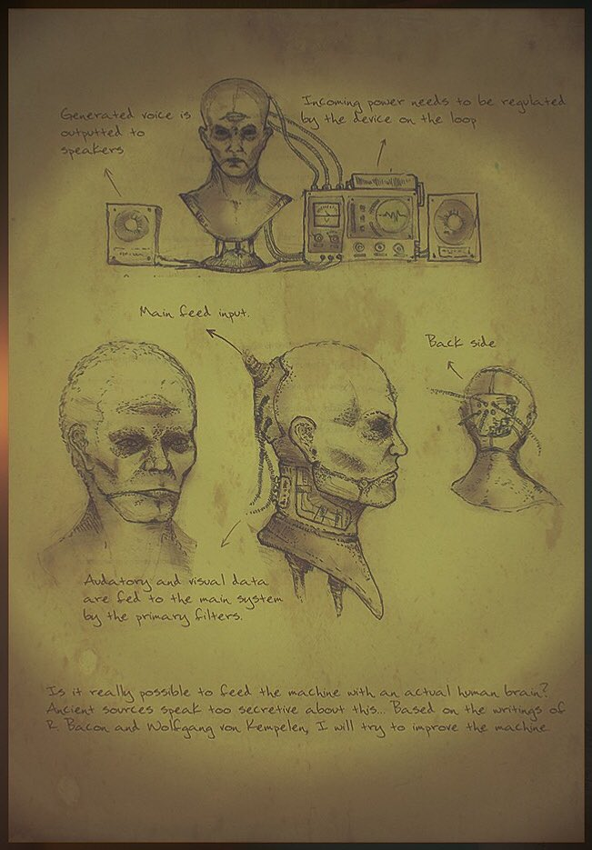

# La zopa de servicios de la red control neuronal

Desde el final de la segunda guerra mundial y principalmente en la guerra fría, se desarrollaron **redes de control neuronal** [1](https://en.wikipedia.org/wiki/Electronic_harassment).

Hoy en día es una red de radiofrecuencia de múltiples capas cuya estructura es similar a la división en niveles de Internet.

Es un sistema de varias tecnologías diferentes, muy complejo de analizar debido a una cortina de humo que cubre este tipo de redes. ¿Por qué? Porque en el pasado fueron utilizadas por los servicios secretos y hoy en día se utilizan en una mafia que piratea cerebros humanos. Manipulan masas. Cambian puntos de vista políticos. Destruyen familias. Apuestan por los suicidios. La nobleza, el Vaticano, los monstruos audiovisuales, las grandes instalaciones tecnológicas y también las empresas espaciales públicas y privadas "juegan" con este sistema.

* Algo que está destruyendo la Unión Europea y la democracia *. * Aquí hay un esquema de un ** target individual** [[2]] (https://www.youtube.com/channel/UC6tQ8RihaSENODcgjLHtrAg). *

¿Quién une esos servicios? Instalaciones que compran servicios de proveedores oficiales que vinculan servicios legales y también obtuvieron este producto * debajo de la mesa * para grandes clientes de telecomunicaciones. Normalmente son empresarios que usan para crear redes del lado B en un estado y limpiarlas en otro con servicios legales. El equipo de hackers medianos crea pequeñas redes como esta; pero también los gobiernos husmean silenciosamente los datos. Es la mafia digital.

La última milla normalmente se absorbe en la infraestructura oficial. No es un secreto, todas las patentes son públicas. Muchos son de la oficina de patentes de los Estados Unidos, pero hay alguien de India, Pakistán, China, Taiwán y Corea. Pero también se puede forjar en radios definidas por software.

¿Quiénes son los individuos objetivo? Por ejemplo, quienes están clasificados como terroristas, como ** ETA ** [[3]] (https://eu.wikipedia.org/wiki/Euskadi_Ta_Askatasuna) en España, por gobiernos estaban controlados por redes neuronales remotas. Pero en los últimos diez años, alguien vino a especular sobre esas redes obligando a los clientes humanos a unirse a este infierno debido a la venta de datos a grandes empresas tecnológicas, instalaciones militares y la industria audiovisual. Debido a la manipulación de grandes masas.

Estoy en control neuronal remoto porque la locura de una madre enferma mental y un padre inepto que no protegió a su hijo de esta destrucción, pero me gusta, me encanta la tecnología, la investigación y la lucha continua. Estoy en control neuronal remoto desde hace unos doce años. Desde que vine a vivir a España. Diez años de servicio pasivo y dos de servicio activo con voz subliminal al cráneo. Perdí todo lo que hice, pero no mi claridad mental.

El servicio, porque sí, es un servicio de un proveedor, de una niña derivada de una familia militar que conozco en Génova, Italia, cuando voy a la escuela primaria. Mis padres lo han permitido asociar el abuso de drogas o alguna estupidez como esta. Esto es solo un crimen horrible y lo han hecho con los datos de mi cerebro y han apostado en mi vida miles de millones de euros.

> * Soy público escribiendo todo esto por ** justicia **. Es difícil de demostrar, pero una persona muy importante en España me está ayudando en esta red. Entonces lo estoy haciendo. Gracias gran hombre y persona. Estoy buscando a la mujer que amo y este libro está dedicado a ella y a su bebé. La obligaron a salir de nuestra casa hace cinco años. *

# External links

1. https://en.wikipedia.org/wiki/Electronic_harassment
2. https://www.youtube.com/channel/UC6tQ8RihaSENODcgjLHtrAg
3. https://eu.wikipedia.org/wiki/Euskadi_Ta_Askatasuna
