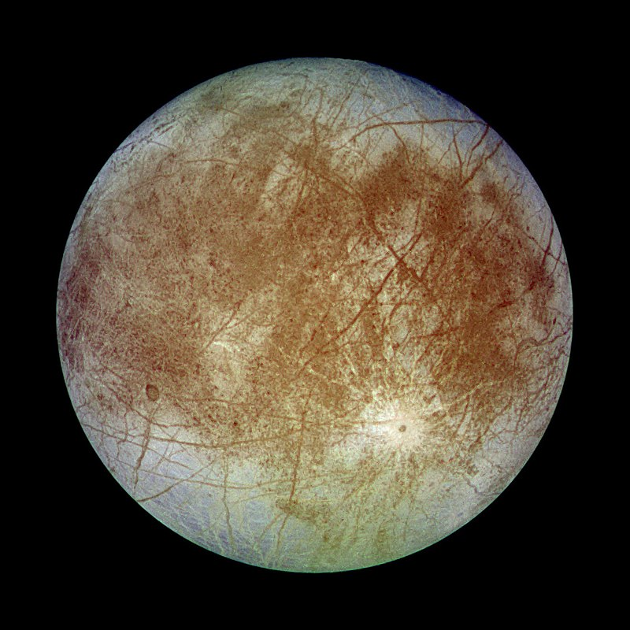
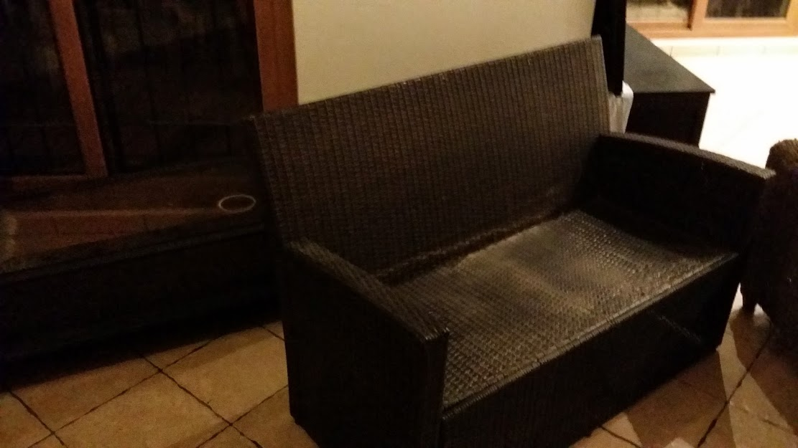

# Canyelles, our lost house

*They have separated us. They have forced our tears. All of this to play with your body, to sell you like in a butcher, to gain to earn slips of paper or magnetic states of a hard disk. To gain with one of the worst think in the world, gambling. ludopathy for mentally ill people.*

*They have separated us. They have forced our tears. All of this to play with my mind, to sell my extreme stress data to military facilities, to gain to earn slips of paper or magnetic states of a hard disk. To gain with one of the worst think in the world, gambling. ludopathy for mentally ill people.*

*Your friend, lover, man and husband if God will help us.*

Here it is our lost house. our love nest. Do you remember sweetie? Our bohemian nights. The fogged glass, the caresses of tenderness.

They have stole our love, but here, in radio frequency, we still in. I will help you to escape to this shit of pseudo dictatorship based on rape of heart's people. Done to create inducted prostitutes and small drug seller or indigents. 

I've seen a photo of you, I've seen three hundred photos of you, I've seen your naked body. They have violated your beauty. The body of a woman is the most important secret that have to be grated only to the man that she loves. No to all those pigs with their penis in their hand. No one can gain nor one Eur over the body of a woman. No one. No one.

### A chronological history of disasters 

*We was happy, but she was nervous. But sometimes she lets her soul see. And she was not what people thought about her. She was, and is, who I love. Full stop. But there's something more, something that overshadow her being a woman, something from which she escaped. Something she needed to scream for help.*

*And now i know what is. This chain of suicides and provoked familiar disasters. The Catalan remote parimutuel  betting system. The remote neural control network. The synthetic telepathy network. The destroy of our democracy. A system where she is a protagonist, where she is a victim. A system where they use her body and violate her soul. But she didn't tell me. She was afraid of. And she escapes.*

*She lets myself see the truth through gestures that are difficult to understand. But my ignorance only made me cry. I was and I'm very ignorant. And she is very complex, articulated and I want to let she stops  living in different abstraction plans possible through the use of this machine. And be a happy woman. I think happiness is simple. I think happiness is walking along the dew of a meadow to the rise of a warm sun.* 

*They build abstraction plan to create human machines. Human machines that are able to induct to suicide another human. Human machines that bet over the life of another.  Why? Image this to a vast scale. If apply to an entire continent, like Europe, could destroy the continent step by step. And this is what is passing to our country. They are fomenting the return of fascism. False promises to help destroyed soul. Millions of deaths for alimenting the war industry.*

*But I'm a **visionary** [[1]](https://en.wikipedia.org/wiki/Visionary). And they are all like zombies.*

#### 27 January of 2015 - fecal water invades the ground floor

In the systematic destruction of my life the number **five** [[2]](https://en.wikipedia.org/wiki/5_(disambiguation)) it's omnipresent. 

It's seems to be **Channel Five** [[3]](https://en.wikipedia.org/wiki/Canale_5) from the telecommunication monster **Mediaset** [[4]](https://en.wikipedia.org/wiki/Mediaset), but it's not possible...it's too big for me. Or not? I'm too lame...yes it's not possible ;) 

She always clean herself and her baby with **wet wipes** [[5]](https://en.wikipedia.org/wiki/Wet_wipe), but those wipes cannot be cannot be pulled into the toilet above all because the house was not connected to **sewerage** [[6]](https://en.wikipedia.org/wiki/Sewerage) network of the town. It was a country house with a **cesspit** [[7]](https://en.wikipedia.org/wiki/Cesspit). My father when he was young fall into one. Probably this is the next one.

This is was the start of the destruction. Something provoked by a lot of people, my family also, and I and my love have been drowned in this sea of technological shit. And also who i was calling brother, but yes he is. But it's obviously something orchestrated by an enemy, she is a girl. And I know her. And, i really don't know, perhaps she likes **caiman** [[8]](https://en.wikipedia.org/wiki/Caiman). Do you know what I mean, **Nanni Moretti** [[9]](https://en.wikipedia.org/wiki/Nanni_Moretti)?

#### 19 March of 2015 - she lefts me

This is our lost terrace. Here we made love. And some one say to me on a social network, a cine face. And now I know why, but it is B-side cine. 

> *Gangstalking*

#### 22 December 2015 - a lighting strike that had to destroy all

Incredible, remember that this chapter it's only about our house. But all in this part it's about destructions. About personal **apocalypse** [[10]](https://en.wikipedia.org/wiki/Apocalyptic_literature). But the real name it's another, I call this *digital mafia*. And yes with this lighting strike exactly over our house, incredible, all the technology was totally destroyed. And i had an accident, she left me, and so on. 

No. This is not causality. This is **attempted murder** [[11]](https://en.wikipedia.org/wiki/Attempted_murder).

But I've got **surge protectors** [[12]](https://en.wikipedia.org/wiki/Surge_protector), I've lost those goods:

- A big flat television.
- Some security cameras.
- A satellite receiver.
- An electric water **pump** [[13]](https://en.wikipedia.org/wiki/Pump).
- A diesel boiler.
- A television signal amplifier and splitter.
- A **hot tub** [[14]](https://en.wikipedia.org/wiki/Hot_tub).

And i was a **surrenderer** [[15]](https://en.wikipedia.org/wiki/Surrender_(law)) with a private contract, and the owner had no **insurance** [[16]](https://en.wikipedia.org/wiki/Insurance). And the house begin to decline.

### External Links

1. https://en.wikipedia.org/wiki/Visionary
2. https://en.wikipedia.org/wiki/5_(disambiguation)
3. https://en.wikipedia.org/wiki/Canale_5
4. https://en.wikipedia.org/wiki/Mediaset
5. https://en.wikipedia.org/wiki/Wet_wipe
6. https://en.wikipedia.org/wiki/Sewerage
7. https://en.wikipedia.org/wiki/Cesspit
8. https://en.wikipedia.org/wiki/Caiman
9. https://en.wikipedia.org/wiki/Nanni_Moretti
10. https://en.wikipedia.org/wiki/Apocalyptic_literature
11. https://en.wikipedia.org/wiki/Attempted_murder
12. https://en.wikipedia.org/wiki/Surge_protector
13. https://en.wikipedia.org/wiki/Pump
14. https://en.wikipedia.org/wiki/Hot_tub
15. https://en.wikipedia.org/wiki/Surrender_(law)
16. https://en.wikipedia.org/wiki/Insurance