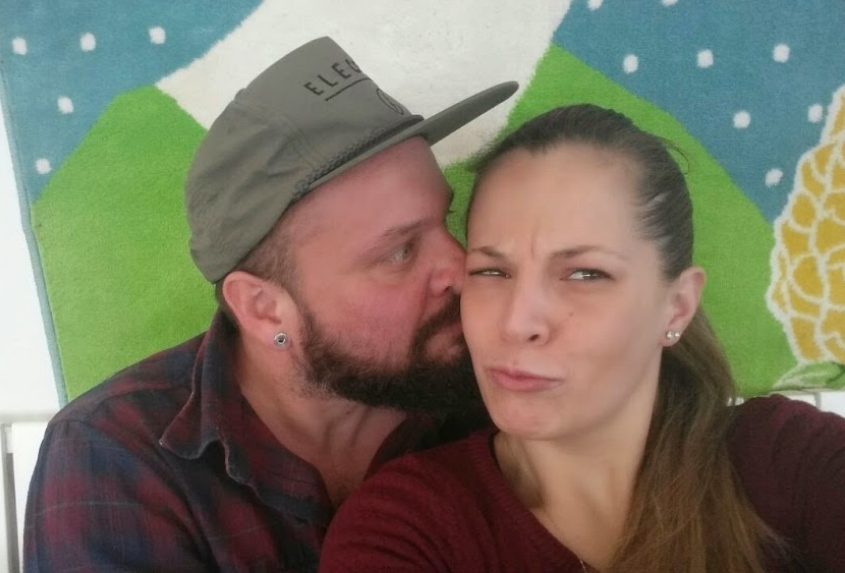

# Killer wireless networks.

In the world there is a series of wireless networks organized in layers in a **top-down design** [[1]](https://en.wikipedia.org/wiki/Top-down_and_bottom-up_design) of importance that have different level of access. The most important are parts of **global mass surveillance** [[2]](https://en.wikipedia.org/wiki/Global_surveillance):

- Surveillance systems like **ECHELON** [[3]](https://en.wikipedia.org/wiki/ECHELON) and **Frenchelon** [[4]](https://en.wikipedia.org/wiki/Frenchelon). Secret services from various nations.
- Military ionosphere satellites network.
- Government  network of telecommunications. In this network take part nobles families and dynasties. It includes Masonic lodges and secret societies. They decide the sort of the world, changing the political climate identically as they've done in the middle age. Nothing has changed it's only digitalized. Commercial private hardware used.
- The synthetic telepathy data center.
- The access network, terrestrial radio wave used, only voice to skull binded. 

What is the principle difference between those networks? Ingredients added to the technology soap. The government one is an embedded hardware in LTE towers from **Huawei** [[5]](https://en.wikipedia.org/wiki/Huawei). There's a little disclosure in Internet about the **concerns over Chinese involvement in 5G wireless networks** [[6]](https://en.wikipedia.org/wiki/Concerns_over_Chinese_involvement_in_5G_wireless_networks).

Next there are products of this network, they call them *games*". Games where people die like target individuals committing suicide. Games where they change the world. Others product can be classified as services.

- The "Illuminati" pseudo dictatorship, a pyramid hierarchy human tree to create slaves. A fraud. The destroy of our privacy, a tower of our democracy. This monster is called as game by the point of view of the aristocratic cast.

- The **techno** [[7]](https://en.wikipedia.org/wiki/Techno) network, a system used by **disc jockey** [[8]](https://en.wikipedia.org/wiki/Disc_jockey) to play in different parts of the world at the same time this could be classified as service but not only. It serve new victims to the Illuminati.

- The human hacker scene. Where only the best hackers in the world work obtaining money from the aristocratic cast. They work making incredible crap to the population by creating human guinea pigs.  Those hackers are also victims of the aristocratic cast and more often they are treated as scapegoats to hide the true instigators of these horrible crimes they call games.

- A remote parimutuel betting system. Was born in Catalunya a decade ago created by a very big felonious who is Catalan also. The Catalan "game" is based onto Andorran bank account. Every victim got is document copied and some kind of corrupted administration redo them to open physical bank account into tax heavens. There is also others version of this game, one Argentinian or Venezuelan.  Notice that i call it game but it's sexual violence for the womans and induct to suicide for mans. Nothing more than a terrible crime.

Next there are some commercial products or some university study, is what the big public can see about, the face to the public:

- **Neuralink** [[9]](https://en.wikipedia.org/wiki/Neuralink), commercial.
- **BRAINnet** [[10]](https://en.wikipedia.org/wiki/Neuralink), opensource. 
- etcetera etcetera.

### Who can i know about that?

I was connected to the Catalan voice to skull service in November 2017 after a year of gas lighting. My ex girlfriend was connected also to the Catalan network in 2009, and is also victim.

I am victim of one game that have changed the city of Barcelona in the last five years:

A game where i was supposed to find my ex girlfriend in Barcelona, Catalunya. What I've called mindgame. Where I was threatened to be part of the "Illuminati" as a low class drug seller or i will die. In reality my game is an hacker attack to the city of Barcelona and Genova, attack that have connected thousand of people to the synthetic telepathy network resulting in hundreds of death by suicide. Those people all are forced to sell drug or to be a prostitute if they don't commit suicide. Also them life is object of bets. And i'm also victim of the Catalan remote parimutuel betting system.

My ex girlfriend was also victim with her husband of the Catalan game but physically, now the game it's digitalized. The twos were victims of the remote parimutuel betting system. 

But my ex girlfriend is also victim of another crime. Her shape, her body and her voice was copied by the owners of the "Illuminati" synthetic telepathy network and they use her to induct to suicide with gang stalking all of them victims. Was copied by a **3D scanner** [[11]](https://en.wikipedia.org/wiki/3D_scanning).

### Who are we?

I'm a telecommunications entrepreneur. I'm a professional Unix lover, nothing more, nothing less. She is my love, her name is Saray.

When i was young i start to play with Internet at sixteen, and use to join an **IRC** [[14]](https://en.wikipedia.org/wiki/Internet_Relay_Chat) channel served by the network **IRCNet** [[15]](https://en.wikipedia.org/wiki/IRCnet).  We was a group, or better saying a crew, of young hackers that enjoy computer science and **IRC takeover** [[16]](https://en.wikipedia.org/wiki/IRC_takeover). 

So yes i enjoy the hacker scene for three years then i start to study seriously to be a **system administrator** [[17]](https://en.wikipedia.org/wiki/System_administrator), **Unix** [[18]](https://en.wikipedia.org/wiki/Unix) and **networking** [[19]](https://en.wikipedia.org/wiki/Computer_network). 

I start like a **wannabe** [[20]](https://www.vice.com/en_us/article/gv5kdw/wannabe-hackers-are-adding-terrible-and-stupid-features-to-mirai) enjoying **psyBNC** [[21]](https://web.archive.org/web/20060808043607/http://psybnc.at/), **eggdrop** [[22]](https://www.eggheads.org/), **IRCD daemon** [[23]](http://www.nic.funet.fi/~irc/server/), **team TESO** [[24]](https://en.wikipedia.org/wiki/TESO_(Austrian_hacker_group)), **SunOS** [[25]](https://en.wikipedia.org/wiki/SunOS), **madrake Linux** [[26]](https://en.wikipedia.org/wiki/Mandriva_Linux), **debian Linux** [[27]](https://en.wikipedia.org/wiki/Debian), **NetBSD** [[28]](https://en.wikipedia.org/wiki/NetBSD), and so on. Have you understand? 

For takeover we use to pass night by night gaming with **Stacheldraht** [[29]](https://en.wikipedia.org/wiki/Stacheldraht), **Trinoo** [[30]](https://en.wikipedia.org/wiki/Trinoo), **Smurf attack** [[31]](https://en.wikipedia.org/wiki/Smurf_attack).

To understand packet security and innovation i use to bind to my virtual friends point to multipoint **IPsec** [[32]](https://en.wikipedia.org/wiki/IPsec) networks and **6BONE** [[33]](https://en.wikipedia.org/wiki/6bone) stuff. 

Next i build with others two a **shell provider** [[34]](https://web.archive.org/web/20050409113133/http://www.6shells.net/) for IRC bouncer and eggdrop hosting, and i start to understand packet flow management and Unix security. Like you can see in this mail to the **FreeBSD** [[35]](https://www.freebsd.org/) **mailing list** [[36]](https://en.wikipedia.org/wiki/Mailing_list):

https://lists.freebsd.org/pipermail/freebsd-pf/2005-June/001105.html

Also i was a radio amateur from when i was twelve. Enjoy **SSB band** [[37]](https://en.wikipedia.org/wiki/Single-sideband_modulation), **ZG radio equipment** [[38]](http://www.zgitaly.it/inglese/), and **President radio** [[39]](https://president-electronics.com/) **CB** [[40]](https://en.wikipedia.org/wiki/Citizens_band_radio).

So yes I'm an hacker and i want to demonstrate how various crew has bet over my life and destroy Barcelona. All of them depend by the conduction of a girl, she is coming to my primary school in Genoa. 

Francesca is a terrorist of extreme right. And i'm a democratic Europeanist.

> *Francesca is destroying Europe, and she has destroyed my life and the life of my ex girlfriend. Saray. My sun flower.*

### External Links

1. https://en.wikipedia.org/wiki/Top-down_and_bottom-up_design
2. https://en.wikipedia.org/wiki/Global_surveillance
3. https://en.wikipedia.org/wiki/ECHELON
4. https://en.wikipedia.org/wiki/Frenchelon
5. https://en.wikipedia.org/wiki/Huawei
6. https://en.wikipedia.org/wiki/Concerns_over_Chinese_involvement_in_5G_wireless_networks
7. https://en.wikipedia.org/wiki/Techno
8. https://en.wikipedia.org/wiki/Disc_jockey
9. https://en.wikipedia.org/wiki/Neuralink
10. https://www.nature.com/articles/s41598-019-41895-7?fbclid=IwAR2dpWDv9RZk41Xt8xcQPLbCXBTfJo_qpaXVAiu--AoIgOyKjhjJqmFCCEI
11. https://en.wikipedia.org/wiki/3D_scanning
12. https://en.wikipedia.org/wiki/Internet_Relay_Chat
13. https://en.wikipedia.org/wiki/IRCnet
14. https://en.wikipedia.org/wiki/IRC_takeover
15. https://en.wikipedia.org/wiki/System_administrator
16. https://en.wikipedia.org/wiki/Unix
17. https://en.wikipedia.org/wiki/Computer_network
18. https://www.vice.com/en_us/article/gv5kdw/wannabe-hackers-are-adding-terrible-and-stupid-features-to-mirai
19. https://web.archive.org/web/20060808043607/http://psybnc.at/
20. https://www.eggheads.org/
21. http://www.nic.funet.fi/~irc/server/
22. https://en.wikipedia.org/wiki/TESO_(Austrian_hacker_group)
23. https://en.wikipedia.org/wiki/SunOS
24. https://en.wikipedia.org/wiki/Mandriva_Linux
25. https://en.wikipedia.org/wiki/Debian
26. https://en.wikipedia.org/wiki/NetBSD
27. https://en.wikipedia.org/wiki/Stacheldraht
28. https://en.wikipedia.org/wiki/Trinoo
29. https://en.wikipedia.org/wiki/Smurf_attack
30. https://en.wikipedia.org/wiki/IPsec
31. https://en.wikipedia.org/wiki/6bone
32. https://web.archive.org/web/20050409113133/http://www.6shells.net/
33. https://www.freebsd.org/
34. https://en.wikipedia.org/wiki/Mailing_list
35. https://en.wikipedia.org/wiki/Single-sideband_modulation
36. http://www.zgitaly.it/inglese/
37. https://president-electronics.com/
38. https://en.wikipedia.org/wiki/Citizens_band_radio