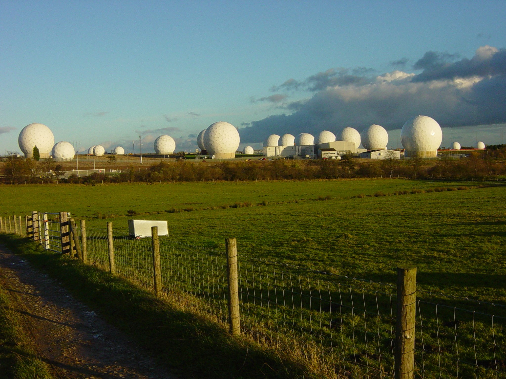
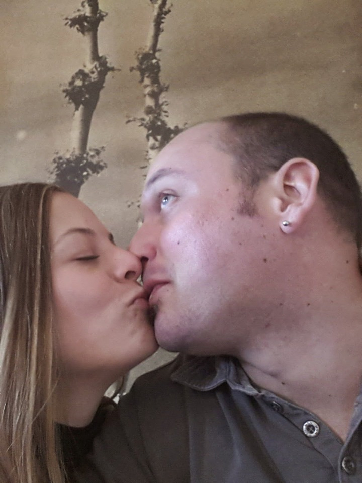

# Killer wireless networks.

In the world there is a series of networks organized in layers in a **top-down design** [[1]](https://en.wikipedia.org/wiki/Top-down_and_bottom-up_design) of importance that have different level of access. The most important are parts of **global mass surveillance** [[2]](https://en.wikipedia.org/wiki/Global_surveillance):

- Surveillance systems like **ECHELON** [[3]](https://en.wikipedia.org/wiki/ECHELON) and **Frenchelon** [[4]](https://en.wikipedia.org/wiki/Frenchelon). Secret services from various nations.
- Military ionosphere satellites network.
- Aristocratic network of telecommunications. In this network take part nobles families and dynasties. It includes Masonic lodges and secret societies. They decide the sort of the world, changing the political climate identically as they've done in the middle age. Nothing has changed it's only digitalized. Commercial private hardware used.
- The synthetic telepathy network almost open source and open hardware based.
- A small Catalan network, terrestrial radio wave used, only voice to skull binded. Five years ago was absorbed by the synthetic telepathy network that use v2k terrestrial in Catalunya. Excellent latency in voice service.

What is the principle difference between those networks? The last mile technology. In the synthetic telepathy network is mixed between satellite and ground stations. In the Catalan network is terrestrial radio wave. The Aristocratic one i think but it's only a supposition that is an embedded hardware in LTE towers from the **Huawei** [[5]](https://en.wikipedia.org/wiki/Huawei). There's a little disclosure in Internet about the **concerns over Chinese involvement in 5G wireless networks** [[6]](https://en.wikipedia.org/wiki/Concerns_over_Chinese_involvement_in_5G_wireless_networks).

Next there are products of this network, the aristocratic call them "*games*". Games where people die like target individuals committing suicide. Games where they change the world. Others product can be classified as services.

- The "Illuminati" pseudo dictatorship, a pyramid hierarchy human tree to create slaves. A fraud. The destroy of our privacy, a tower of our democracy. This monster is called as game by the point of view of the aristocratic cast.

- The **techno** [[7]](https://en.wikipedia.org/wiki/Techno) network, a system used by **disc jockey** [[8]](https://en.wikipedia.org/wiki/Disc_jockey) to play in different parts of the world at the same time this could be classified as service but not only. It serve new victims to the Illuminati.

- The human hacker scene. Where only the best hackers in the world work obtaining money from the aristocratic cast. It's an unauthorized access to the synthetic telepathy network, hacker crew that can obtain it are rewarded and the aristocratic cast permit a limited use to them. But they have to work for them making incredible crap to the population by creating human guinea pigs.  Those hackers are also victims of the aristocratic cast and more often they are treated as scapegoats to hide the true instigators of these horrible crimes they call games.

- A remote parimutuel betting system. Was born in Catalunya a decade ago created by a very big felonious who is Catalan also. Now the "game" is available in the synthetic telepathy network, that have changed normal money betting with crypt concurrency betting. The Catalan "game" is based onto Andorran bank account. Every victim got is document copied and some kind of corrupted administration redo them to open physical bank account into tax heavens. There is also others version of this game, one Argentinian or Venezuelan.  Notice that i call it game but it's sexual violence for the womans and induct to suicide for mans. Nothing more than a terrible crime.

Next there are some commercial products or some university study, is what the big public can see about, the face to the public:

- **Neuralink** [[9]](https://en.wikipedia.org/wiki/Neuralink), commercial.
- **BRAINnet** [[10]](https://en.wikipedia.org/wiki/Neuralink), opensource. 
- etcetera etcetera.

### Who can i know about that?

I was connected to the Catalan voice to skull service in November 2017 after a year of gangstalking. My ex girlfriend was connected also to the Catalan network in 2009, and was also victim.

I am victim of one game that have changed the city of Barcelona in the last five years:

A game where i was supposed to find my ex girlfriend in Barcelona, Catalunya. What I've called mindgame. Where I was threatened to be part of the "Illuminati" as a low class drug seller or i will die. In reality my game is an hacker attack to the city of Barcelona and Genova, attack that have connected thousand of people to the synthetic telepathy network resulting in hundreds of death by suicide. Those people all are forced to sell drug or to be a prostitute if they don't commit suicide. Also them life is object of bets. And i'm also victim of the Catalan remote parimutuel betting system.

My ex girlfriend was also victim with her husband of the Catalan game but physically, now the game it's digitalized. The twos were victims of the remote parimutuel betting system.

# External Links

1. https://en.wikipedia.org/wiki/Top-down_and_bottom-up_design
2. https://en.wikipedia.org/wiki/Global_surveillance
3. https://en.wikipedia.org/wiki/ECHELON
4. https://en.wikipedia.org/wiki/Frenchelon
5. https://en.wikipedia.org/wiki/Huawei
6. https://en.wikipedia.org/wiki/Concerns_over_Chinese_involvement_in_5G_wireless_networks
7. https://en.wikipedia.org/wiki/Techno
8. https://en.wikipedia.org/wiki/Disc_jockey
9. https://en.wikipedia.org/wiki/Neuralink
10. https://www.nature.com/articles/s41598-019-41895-7?fbclid=IwAR2dpWDv9RZk41Xt8xcQPLbCXBTfJo_qpaXVAiu--AoIgOyKjhjJqmFCCEI
