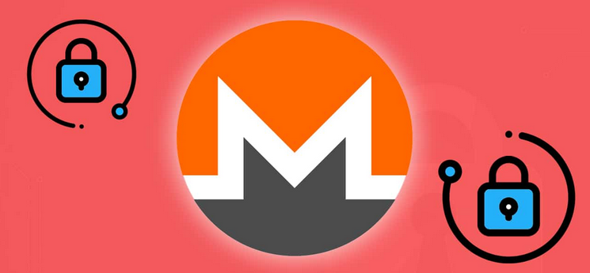
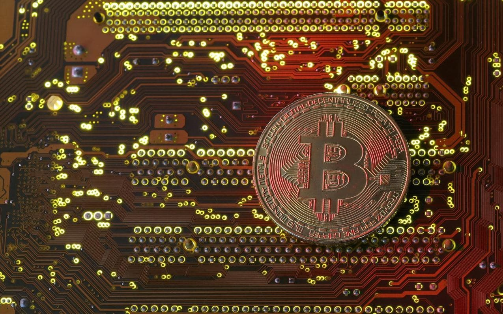

# Blockchain technology

First of all i wanna do with you, reader, a consideration. We've got analyzed the synthetic telepathy network and the radio waves Machine. Those two IT systems are to control, break our privacy laws, abuse persons, destroy souls, change our life. 

Now i want to introduce to you technologies that are exactly on the opposite site. Those technologies are actively developed to do the exact in front work. Those peer to peer derived protocols are born to guarantee privacy and security to the end users. 

But they are used by the synthetic telepathy network owners to do crimes. Horrible crimes like foment pedophilia or illegal pornography. But those are not the real crimes, though they are the most horrible of mankind. The ultimate end is despise the work of those programmers that work for freedom. *Freedom is the most important background of our democracy*.

Who are the new dictators, who is building this pseudo dictatorship, who is destroying our dreams of the late sixties? Always the same persons. The elite. Now the elite have semi owned the Internet, the most important invention in the last century and with the tech giants they are building the eye that all see. Something similar to the Egyptian gods, mysticism upon ignorance; in Internet and radio frequency but now also in the *decimal society* they call "Illuminati", an Internet **fraud**. The new mafia is the **digital mafia** and is international. 

But why they are doing crimes like those? It's simple. To get profound and go ahead with technology. All of this is for always the same think. Like in the cold war. Is for the arms race. The nowadays cold war have a name but no one speak about, **cyber warfare**. 

*Those are my two cents.*   

### The Monero crypt concurrency

**Monero** [[1]](https://www.getmonero.org/) is decentralized crypt currency, meaning it is secure digital cash  operated by a network of users. Transactions are confirmed by  distributed consensus and then immutably recorded on the **blockchain** [[2]](https://en.wikipedia.org/wiki/Blockchain).  Third-parties do not need to be trusted to keep your **Monero** [[3]](https://en.wikipedia.org/wiki/Monero_(cryptocurrency)) safe. Monero is *totally* untraceable. 

Let's do some considerations before start with a deep dive into this network. First of all **M** is its logotype, simple is the concurrency of the Machine, what we start to explain in the last chapter. But does it can be converted into classical money? Yes for sure here it is the exchange graphic:

​                        

But it's possible to simply go to a cash dispenser and get euro? Yes it is.

Remember that to get cash from this bitcoin **ATM** [[4]](https://en.wikipedia.org/wiki/Automated_teller_machine) normally you have to change **XMR** [[5]](https://www.coinbase.com/price/monero?locale=en) to **LTC** [[6]](https://www.coinbase.com/price/litecoin?locale=en), then go to a local ATM as you can find in **coin ATM radar** [[7]](https://coinatmradar.com/). In Barcelona for example there's the network called **BitBase** [[8]](https://bitbase.es/) where you can sell also directly Monero. 

Another method is to buy a debit bitcoin card that you can recharge on line from your wallet and then simply go to every type of classic currency ATM and got cash. Like **CryptoPay** [[9]](https://cryptopay.me/bitcoin-debit-card/#uk). Criminals use false identities and SIM card without identification to buy online those goods. And this is a fraud. 

Another method to move XMR coins is buy directly in shops that accepts this crypt concurrency. The A-side services or goods that can be payed directly are various some of them are detailed on **cryptwerk** [[10]](https://cryptwerk.com/pay-with/xmr/). What does it mean in reality? That a person that has got a lot of this type of currency could open an A-side physic and Internet shop and sell goods in classical money. Simple but functional. Who's do it in a better way use various company chains to elude fiscal controls and remove the use of XMR from their fiscal invoices. Another time, very simple, it's a game.

What those criminals can do in the same Monero circuit? I don't know but using a little bit of logic and remembering that we're speaking about B-side it's very simple:

- Drug market buy and sell.
- Black market buy and sell.
- Human traffic.
- Forced prostitution.
- All kind of illegal good buy and sell.
- Illegal apartment rent.
- Credit card fraud.
- Cracker services rent.
- Corruption. 

This is only a little window over this terrorist and criminal network. We'll go deeper in the next chapters.

### The crypt concurrency market  

The Bitcoin market it's similar to the normal concurrency market, with a quotation changing it's value every day depending on different factors. There's more solid concurrency that don't fluctuate too much but others, new or opened ad hoc for an operation, change them value constantly. People that work with this kind of values know it and play a lot with newbies or ignorance paying in a type and dais after this type loose likely more than 10% of value.  

A good player got always in mind this factor and use good web pages to keep the global market under control. 

https://coinmarketcap.com/

This is a very good portal to know about it. *But why I speak about this feature*?  

Many Bitcoin or **Ethereum** [[11]](https://en.wikipedia.org/wiki/Ethereum) based crypt concurrency are connected to the "Illuminati" pseudo dictatorship. Many of them are connected to the black, drug and prostitution market. Many also with corruption. I've done a public web page where you can consult about those coin that I've learned in radio frequency (voice to skull) about.

There are safe crypt currency bank and others that respect totally the privacy of the owners. Some want that you send your passport and a photography of you keeping it opened in front of a webcam, nothing very secure, and others are totally anonymous:

- https://www.coinbase.com/ is the one more secure.

- https://freewallet.org/ the other more privacy related.

  But there is also games bitcoin based that are based onto Caribbean tax heavens like **Curaçao** [[12]](https://en.wikipedia.org/wiki/Cura%C3%A7ao). Here you can open free and totally anonymous crypt concurrency directions where to clean money in a series of washing machines. To obtain totally anonymity in a bitcoin transaction. One of those games is:

  https://duckdice.io/?modal=greeting

  That is probably related to the privacy based search engine **Duck, duck, goose** [[13]](https://en.wikipedia.org/wiki/DuckDuckGo).

### The SAFE network blockchain 

A blockchain model applied to networking **ISO/OSI** [[14]](https://en.wikipedia.org/wiki/OSI_model) stack. It replace the last fourth pile of the Internet model. Packets are replaced with data chunks mixed in various different locations without a fixed one, a central server. It's like the old style **p2p** [[15]](https://en.wikipedia.org/wiki/Peer-to-peer) but with new encryptions models that guarantee **privacy** [[16]](https://en.wikipedia.org/wiki/Privacy), **cryptography** [[17]](https://en.wikipedia.org/wiki/Cryptography), confidentiality, integrity, and availability.

# External Links	

1. https://www.getmonero.org/
2. https://en.wikipedia.org/wiki/Blockchain
3. https://en.wikipedia.org/wiki/Monero_(cryptocurrency)
4. https://en.wikipedia.org/wiki/Automated_teller_machine
5. https://www.coinbase.com/price/monero?locale=en
6. https://www.coinbase.com/price/litecoin?locale=en
7. https://coinatmradar.com/
8. https://bitbase.es/
9. https://cryptopay.me/bitcoin-debit-card/#uk
10. https://cryptwerk.com/pay-with/xmr/
11. https://en.wikipedia.org/wiki/Ethereum
12. https://en.wikipedia.org/wiki/Cura%C3%A7ao
13. https://en.wikipedia.org/wiki/DuckDuckGo
14. https://en.wikipedia.org/wiki/OSI_model
15. https://en.wikipedia.org/wiki/Peer-to-peer
16. https://en.wikipedia.org/wiki/Privacy
17. https://en.wikipedia.org/wiki/Cryptography

