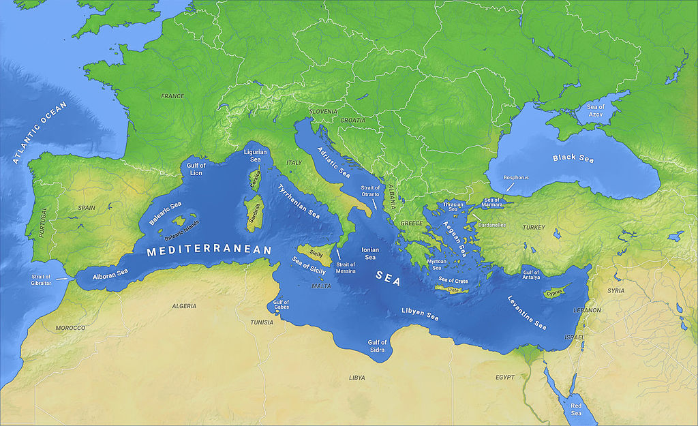

# Products from the assembly line 

The synthetic telepathy network is like an industry of human brains.  It models masses of brains according to predetermined patrons to create figures of work and exploitation in order to foster the greatest gain due to imposed digital slavery. 

Those slaves first of all enter for a couple of years in the lowest part of this structured multi layer pyramid, a big fraud of frauds. Those are the works after a period of time, after gangstalking, that are offered for the new citizens of this state under the state:

- Low class drug sellers
- Induced prostitutes

People that normally doesn't accept this condition ends suicides or heroin addicted or in jail, this last phase underline the big corruption present in our society, and no one say nothing but it is under the eyes of everyone first of all the workers of hospitals, psychiatric structures, courts and jails.

Remember also a thing, if a person accept under torture, yes because who enter in this system is tortured to obtain **genuflection** [[1]](https://en.wikipedia.org/wiki/Genuflection), it's seems to be like a religion, selling drugs or obtain return from prostitution he's doing a crime so the owners of the network could press him to do whatever they want, like torture others friends that end in this vortex. 

They do this also with the ghost of **pederasty** [[2]](https://en.wikipedia.org/wiki/Pederasty) against children of the victims, but remember those people are only ghost. You all, victims, have to just start to explain your personal experience and all together we can start a legal **complaint** [[3]](https://en.wikipedia.org/wiki/Complaint) because **the law is the same for everyone** [[4]](https://en.wikipedia.org/wiki/Equality_before_the_law) in a democracy and yet we are in a democracy even if totally corrupt. Just bring enough proof.

> *There is another my two cents, i'm totally crazy or this digital and radio world perhaps in guided by some sect, or what so ever?* 
>
> *Something like this? **Communion and Liberation** [[5]](https://en.wikipedia.org/wiki/Communion_and_Liberation).*

So in fact this pseudo dictatorship is founded in drug sell and prostitution. But where does it reverses its revenues? Basically in technology to fortify the digital explosion ship of people. Who're behind this monster? Aristocrats, Vatican, great entrepreneurs and so on. The **elite** [[6]](https://en.wikipedia.org/wiki/Elite). And now the so-called elitist have decided to destroy our democracy probably to reinvigorate the arms market, especially the electronic weapons market in view of a new cyber cold war that currently has already targeted our United Europe to favor the two great giants, the United States and Russia. **Mediterranean Sea** [[7]](https://en.wikipedia.org/wiki/Mediterranean_Sea) always was board of silent cold wars for is geographical center position between the two empires.

### Theft of ideas and unfair competition

Remember that all people in this network, victims or not, are under remote neural monitoring. Them minds are read. In a vast amount of people there's always some singularity, some especial person, some inventor. This system have got a branch of rapid idea development. The problem is that who has got the idea don't know this feature and his idea is theft and rapidly pass in production. Those people has got all the tools and stuff, not only digital, to produce whatever good, also physic. They produce millions of euro stealing good ideas.  Why they do more moneys than a single? Simply, in this network there's a lot of great entrepreneurs all of them participate with non-legal **shares** [[8]](https://en.wikipedia.org/wiki/Share_(finance)) of the company, that make a percentage completely out of the market so that they attract a lot of **shareholders** [[9]](https://en.wikipedia.org/wiki/Shareholder). So all participate in the purchase and marketisation of the product. Very simple, dude.

**Idea theft** [[10]](https://lawtl.com/idea-theft) is a crime! *And i'm victim of*.

With remote neural monitoring what happen to business mans: 

- **Unfair competition** [[11]](https://en.wikipedia.org/wiki/Unfair_competition)
- **Misappropriation** [[12]](https://en.wikipedia.org/wiki/Misappropriation)
- Break of **competition law** [[13]](https://en.wikipedia.org/wiki/Competition_law)

So another kind of victim of the network are young inexpert businessman, like i was, that are inserted violently in this system. They theft all his possession and fall in the gang stalking game, normally for a couple of years or more depending on his capacities.

### People with similar physiognomy

**Physiognomy** [[14]](https://en.wikipedia.org/wiki/Physiognomy). **Clone** [[15]](https://en.wikipedia.org/wiki/Clone_(computing)) in computing. What does those words got in common? 

In the "Illuminati" pseudo dictatorship all about technology it is applied to human being and society. So we speak about human hacking and not simply hacking. It's fascinating but somewhat disturbing the bizarre but effective result of the creators of this network.

Think about pyramid structures with a summit and next top-down levels from minus to more members. One of the feature of this system is to find with the network or in Internet in social web sites persons with similar physiognomy of the summit of the pyramid? Why? To protect to real identity of the head of. Or other applications.

Who can they do it?

It's so basic today with open source technology you can do it at your home. With **OpenCV** [[16]](https://en.wikipedia.org/wiki/OpenCV) some **face detection** [[17]](https://en.wikipedia.org/wiki/Face_detection) **algorithm** [[18]](https://en.wikipedia.org/wiki/Algorithm) and a good programmers department the game is done. Nothing of the other world. 

Remember also that visual cortex of all the human clients of the network is read. What does it mean? That in the core of the network image from thousands or millions of human video camera walking in the street is automatic elaborated to find clones for example. Probably they are sold to pyramids summit to comply with crimes. 

### Hunters of new victims

To hunt, to pursue, to chase, to *stalk*. Or in computer science, a **trojan horse** [[19]](https://en.wikipedia.org/wiki/Trojan_horse_(computing)); something in a good shape that hide something terrible and dangerous. *Prostitutes*? Something more complex, they aren't directly sold in web pages. They go out in the **Saturday Night Fever** [[20]](https://en.wikipedia.org/wiki/Saturday_Night_Fever) trying to catch, and yes all the days they go out they catch, the correct prey. Someone that isn't connected to the network, someone that has got a good bank account, or someone that is a possible competitor for others clients of the network. In this way  my ex-girlfriend ended up being a slave to the neural control network for a year and raped several times before becoming a millionaire huntress berthed in the tourist port of Barcelona. Under threat of losing the chance to see his daughter.

 *She is too, like me, a victim. But a different type of*.

What is the forced process to become a slayer? What steps must a huntress follow to avoid being tortured daily by the owners of this criminal network? How many victims hunt my ex girlfriend and twenty other four girls in Barcelona? What kind of drugs are they administered to make them lose the limit of violence? How many men and women forced to be slaves of this hell in their turn? How much money did you generate for the owners? How is it possible that the police do not stop this continuous crime? How many orgies did you have to deal with international dealers and characters of dubious origin? How many times has your life been endangered?

*I love you sweetie, where are you?*

This is a two years process, started with brainwash and ended with continuous praise and helpful additives to boost self esteem. Provoked situations orchestrated by a strong mind, like a master. Something similar but not equal to a sept. The adepts are beautiful women with a great desire to overcome and to be noticed in a complicated world. With a great desire to reach economic goals glimpsed in the upper floors of the direction of this deadly weapon, the network of synthetic telepathy. Situations in which these beautiful girls after being treated as slaves for mid-level stalkers are lured with false promises and made safe by theoretically random facts. For example, being invited to high-class parties, such as parties in football players' private villas and being able to have sex, even multiple ones, with so-called famous people. Other tools of the owners of the network.

So that their self-esteem rises exponentially in a short period of time. Since you don't even have money to eat quickly you are invited to luxurious parties. Then a work is proposed to her, based on the seduction ballet. On the hunt, on sex on the capacity for conviction.

*Why do they make money?*

Easy, actually people who have nights of madness with these beautiful women, including my ex-girlfriend, are victims of a subtle crime of invasion of privacy. Girls are human cameras. The owners of the network observe the sexual clothes of the victims in case they are high-level people, obviously they are not included in the invasive form, but only in a hidden way.

*Let us remember that the naked man is a more vulnerable man.*

# External links

1. https://en.wikipedia.org/wiki/Genuflection

2. https://en.wikipedia.org/wiki/Pederasty

3. https://en.wikipedia.org/wiki/Complaint

4. https://en.wikipedia.org/wiki/Equality_before_the_law

5. https://en.wikipedia.org/wiki/Communion_and_Liberation

6. https://en.wikipedia.org/wiki/Elite

7. https://en.wikipedia.org/wiki/Mediterranean_Sea

8. https://en.wikipedia.org/wiki/Share_(finance)

9. https://en.wikipedia.org/wiki/Shareholder

10. https://lawtl.com/idea-theft

11. https://en.wikipedia.org/wiki/Unfair_competition

12. https://en.wikipedia.org/wiki/Misappropriation

13. https://en.wikipedia.org/wiki/Competition_law

14. https://en.wikipedia.org/wiki/Physiognomy

15. https://en.wikipedia.org/wiki/Clone_(computing)

16. https://en.wikipedia.org/wiki/OpenCV

17. https://en.wikipedia.org/wiki/Face_detection

18. https://en.wikipedia.org/wiki/Algorithm

19. https://en.wikipedia.org/wiki/Trojan_horse_(computing)

20. https://en.wikipedia.org/wiki/Saturday_Night_Fever

    