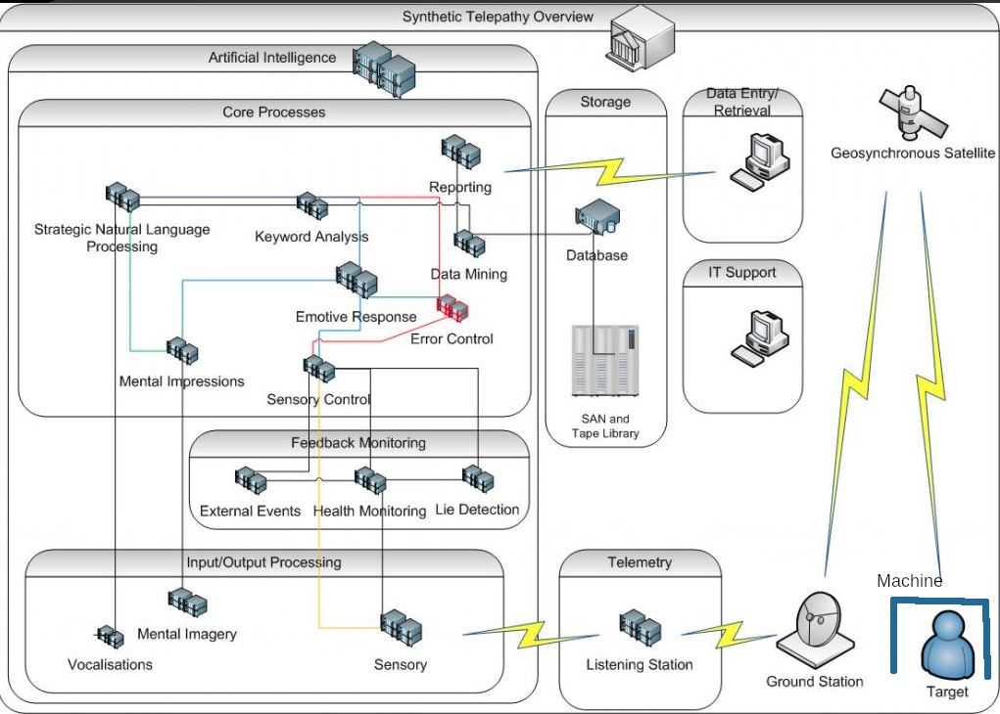
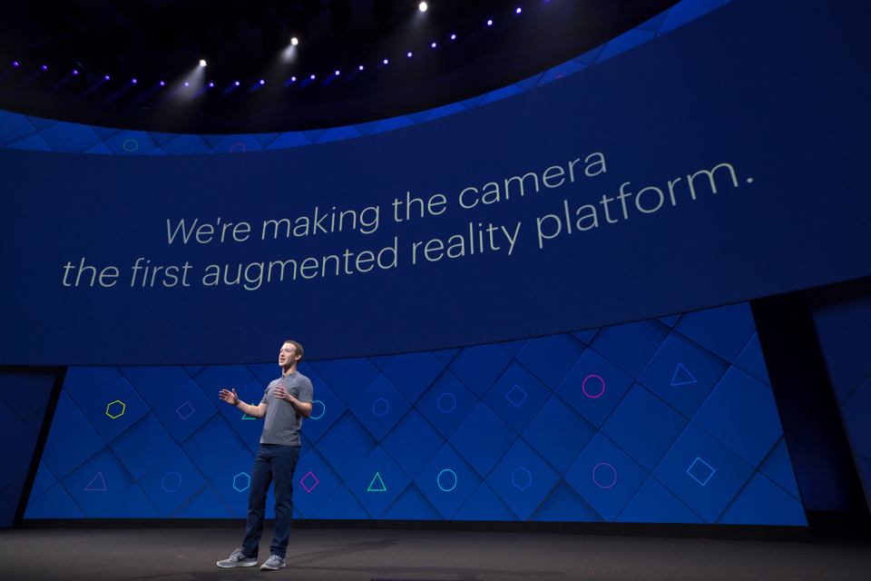

# The worldwide neural control network

From the end of the second world war and mostly in the cold war remote **neural control networks** [[1]](https://en.wikipedia.org/wiki/Electronic_harassment) was developed. 

Nowadays it is a multi layer radio frequency networks which structure is similar to Internet tier division. Last mile is mixed between magnetic field network to position and lock to the human, terrestrial waves towers and satellite. 

It's a soap of different radio service, very complex to analyze because of a smoke curtain covering this type of networks. Why? Because in the past they was utilized by secret services and nowadays are utilized my a digital mafia that hack human brains. Manipulate masses. Change political views. Destroy families. Bet on suicides. 

*Something that is destroying the Europe Union and democracy*.

Who bind those services? Facilities that buy services from official providers that bind legal services and got also this product *under the table* for big telecommunications clients. Normally are businessman that use to create B-side networks in a state and clean them in another with legal services. It's the digital mafia. 

Last mile normally is soak into official infrastructure. It's not a secret all the patents are public. A lot of are from the US patents office but there is someone from India, Pakistan, China, Taiwan and Korea.  

Who are target individuals? For example who are classified as terrorist, like **ETA** [[2]](https://eu.wikipedia.org/wiki/Euskadi_Ta_Askatasuna) in Spain was controlled by remote neural networks. But in the last ten years someone come to speculate over those networks forcing human clients to join this hell because of data selling to big tech companies, military facilities and audiovisual industry. Because of big masses manipulation. 

I'm in remote neural control because the madness of a mental sick mother and an inept father that didn't protect his son from this destruction, but I like it i love technology, research and continuous struggle. I'm in remote neural control from about twelve years. From when i came to live in Spain. Ten years of passive and two of active with subliminal voice to skull service. I've lost all what I've done, but not my mental clearness. 

The service, because yes it is a service from a provider, was contracted in Spain by a military family derived girl that i know in Genoa, Italy, when i go in primary school. My parents have permitted it attaching drug abuse or some stupidity like this. This is only an horrible crime and they have done with my brain data and bet in my life thousand of millions of Eur.

>  *I'm public writing all of this because of **justice**. It's difficult to demonstrate but a very important person in Spain is helping me in this network. So I'm doing it. Thank you great man and person. I've lost the woman that I'm love to and this book is dedicated to her and her baby. They forced her to go out from our house five years ago.*

### Magnetic field area network, the radio steam machine

The magnetic field area network or **MFAN** [[3]](https://ieeexplore.ieee.org/document/5405677) is a terrestrial magnetic radio where they can identify exactly the position of the victim. More than this it's possible to practically torture physically the client or do sexual violence to him. 

> *They call this steam machine.* 

With this virtual device the environment near the victim is like a remote **CT scan** [[4]](https://en.wikipedia.org/wiki/CT_scan) machine. And it is continuously, the real mean is that we are under excess doses and risk **radiation burn** [[5]](https://en.wikipedia.org/wiki/Radiation_burn). 

We're locked to those networks by satellite and by the steam machine between an unique human magnetic field value transmitted naturally if radio wave stimulated. **Magnetoelectric** [[6]](https://www.nature.com/articles/s41598-017-01647-x) **nanoparticles** [[7]](https://en.wikipedia.org/wiki/Nanoparticle) MEN are responsible of this emission. 

Until ten years ago those networks exist but the services use in hide mode, there was no interaction with the client, the victim. Then someone have created a tool that scan for this magnetic field unique id and a lot of people become target individuals. Human guinea pig. Subjects that are under a continuous bet vortex in crypt concurrency. People that normally commit suicide. Go in mental disorder vortex by a corrupted health care system. Something that is  destroying our society. Welcome to the false electronic democracy. Welcome to the probably third world war. 

### The synthetic telepathy network computing center 

This is the network scheme of the "Illuminati" criminal network **data center** [[8]](https://en.wikipedia.org/wiki/Data_center). Let's analyses device by device what is the synthetic telepathy network, a telecommunication facility that is changing in my opinion all Europe and is determining a right turning in our governments. It's very dangerous and probably it's the start of what i think it could be a **neo nazism** [[9]](https://en.wikipedia.org/wiki/Neo-Nazism) digital dictatorship and a start of a alpha stage of what we found in Internet named as **cyberwarfare** [[10]](https://en.wikipedia.org/wiki/Cyberwarfare).

In Internet we can find a lot of references about the synthetic telepathy network by **metaphors** [[11],](https://en.wikipedia.org/wiki/Metaphor) or what is called nowadays as **Internet meme** [[12]](https://en.wikipedia.org/wiki/Metaphor). 

Let's introduce every device of the network scheme above:

- **Target machine:** A virtual device locked to the target persons by the unique magnetic field. What does it mean? Every machine has an id to witch in a **VPN** [[13]](https://en.wikipedia.org/wiki/Virtual_private_network) there's a correspondence with a remote virtual **Android** [[14]](https://en.wikipedia.org/wiki/Android_(operating_system)) device where we can find a lot of applications more or less powerful depending on what kind of access we've got in the network. A single Machine could be shared by many clients, usually humans but also animals, could determine a pyramid structure normally identified by a natural number, the mine in Barcelona for example will be the number **9** if I accept to work in this shit, but technology awesome, network. 

- **Target in reality**: one or more persons that doesn't have access to the administration of his Machine, loose totally his privacy and all the time passed without access is considered like a slave. Many times is also considered only like an object, they use to do experiments with the person to archive data under extreme stress, violent sex situations and brain experiments. The target individual is a **human guinea pig** in an unauthorized **human subject research** [[15]](https://en.wikipedia.org/wiki/Human_subject_research).

- **Machine in metaphor**: A mobile telephone, protected by a simple **PIN** [[16]](https://en.wikipedia.org/wiki/Personal_identification_number) of four numbers. It's security it's so basic because allow gangstalker to get control of the target machine or another client that doesn't know about basic security. Every machine got various crypt bank account but also **offshore bank** [[17]](https://en.wikipedia.org/wiki/Offshore_bank) accounts. 

- **Target in metaphor**: Is a dog, gangstalkers consider a target individual with the same rights of an animal. They give him orders, deny every types of rights, electronically punish him. So do practically all the persons connected to this system because if they doesn't torture the victim they loose privilege in the network and return to the victim state that is the initial state when you were forced to join this hell network with brain zapping, that is a technique used to find the unique magnetic identification of a human. It is archive using a physical Android device, normally a telephone. A victim is captured identifying is unique magnetic field id by proximity with another network client used like a predator. Normally is a woman or a very attractive man that have sex with the victim, the predator has got her or his mobile infected by an application remotely controlled by the network owners.

- **Bidirectional connection to target machine**: Using the unique identification of the target person, or probably an array of, ground station speak directly with the victim or the client using **RNM**, remote neural monitoring.  The remote neural monitoring act like a **BCI** [[18]](https://en.wikipedia.org/wiki/Brain%E2%80%93computer_interface), a **TMS** [[19]](https://en.wikipedia.org/wiki/Transcranial_magnetic_stimulation) device, a **MRI** [[20]](https://en.wikipedia.org/wiki/Magnetic_resonance_imaging) device; all of them are remote and virtual. All is done by radio frequency. All is remote brain waves.  There is no need of any sort of device acting like a client in the human target. There is no need of **brain implant** [[21]](https://en.wikipedia.org/wiki/Brain_implant).  

- **Remote brainwaves**: This one of the **last mile** [[22]](https://en.wikipedia.org/wiki/Last_mile) technology used by the synthetic telepathy network. They are used to build what is known as **BRAINnet** [[23]](http://www.BRAINnet.net/), a sort of network of interconnected brains. In the synthetic telepathy network **brainwaves** [[24]](https://en.wikipedia.org/wiki/Neural_oscillation) was hacked to archive the modulation of the eight neural oscillations that are present in our brain. The frequencies used by BRAINnet are from 0.5 to 100 Hz and are received by various analogue **SDR** [[25]](https://en.wikipedia.org/wiki/Software-defined_radio) or commercial private add ons to mobile towers. Every type of brain wave is related to a part of our brain and to a specific function like the auditory cortex or the visual cortex. Those name are:
  
  - **Delta wave** [[26]](https://en.wikipedia.org/wiki/Delta_wave) from 0.1 to 3 Hz.
  - **Theta wave** [[27]](https://en.wikipedia.org/wiki/Theta_wave) from 4 to 7 Hz.
  - **Mu wave** [[28]](https://en.wikipedia.org/wiki/Mu_wave) from 7.5 12.5 Hz.
  - **SMR wave** [[29]](https://en.wikipedia.org/wiki/Sensorimotor_rhythm) from 12.5 15.5 Hz.
  - **Alpha wave** [[30]](https://en.wikipedia.org/wiki/Alpha_wave) from 7 to 12 Hz.
  - **Beta wave** [[31]](https://en.wikipedia.org/wiki/Beta_wave) from 12 to 30 Hz.  
  - **Gamma wave** [[32]](https://en.wikipedia.org/wiki/Gamma_wave) from 32 to 100 Hz.
  
  Our brain is stimulated by scalar microwaves beam from satellite or by the steam machine. With this stimulation, to make you an idea it is similar to the cooking we get in a microwave oven, our brainwaves  are amplified and received by an array of radios in terrestrial towers, like the emission it's not very powerful it is necessary that all the territory is totally covered by passive scanner almost impossible to detect with another scanner. This are without any doubt the LTE towers. It's an hide service of the owners of the mobile infrastructure of the state. 
  
  *So our body is the transmitter.*
  
- **Silent subliminal presentation system**: a method from United States patent that serve to bypass first human auditory system, using the frequency of 462.25 KHz with a channel width of 14.5 KHz. This is an active transmission radio. It's possible to detect with a scanner. The reception is with the passive brainwave radios.

- **Geosynchronous satellite**: Used to obtain remote imaging of the target. Nowadays with the advent of the open hardware, middle size criminal organization could have a satellite in low orbit. This could be classified as *satellite terrorism*. **Open hardware satellite** [[33]](https://www.google.com/search?q=open+hardware+satellite&ie=utf-8&oe=utf-8&client=firefox-b-1-e) could be launch in orbit by companies that bind this service at relative low cost. It's used also with a radio that transmit to stimulate our brain like i've already explain.

- **Ground station**: Is an access point to BRAINnet and the others technologies. To archive the full coverage of a territory like Catalunya there is no need of too many points because of **wavelengths** [[34]](https://en.wikipedia.org/wiki/Wavelength) from 100000 to 1000 kilometers and because at this frequencies there is no need of **line of sight** [[35]](https://en.wikipedia.org/wiki/Line-of-sight_propagation), waves can pass through many types of materials. Every ground station perhaps have got eight different physical radios and antennas, one for every type of brain wave, and an interface, fiber optic or another radio technology, for the **backbone** [[36]](https://en.wikipedia.org/wiki/Backbone_network). 

- **Telemetry**
  
  - **Listening station** : part of every ground station but not in the outside. Every target individual got his **telemetry** [[37]](https://en.wikipedia.org/wiki/Telemetry) saved in the network computing center, like all steps taken, all the trips and so on. There's no privacy in this network.
  
- **Input/Output processing**
  - **Vocalizations**: in the synthetic telepathy network with technology the owners can do an exact copy of the target's voice. Not only the timbre of the voice but also the vocalization **speech** [[38]](https://en.wikipedia.org/wiki/Speech). Targets individuals can be tricked to think to speak with another individual that is not. This is part of the mental confusion in which they may fall in the gangstalking mind game. He may enter in mental disorder confusion. Vocalizations is modulated in gamma wave using a **vocoder** [[39]](https://en.wikipedia.org/wiki/Vocoder) and it results on **voice to skull** transmission, that is a hearing direct to the **auditory cortex** [[40]](https://en.wikipedia.org/wiki/Auditory_cortex). Many others technologies can create silent subliminal messages.
  - **Mental Imagery**: in this network it's possible to do data injection direct to the **visual cortex** [[41]](https://en.wikipedia.org/wiki/Visual_cortex). It's something very powerful they can archive **augmented** [[42]](https://en.wikipedia.org/wiki/Augmented_reality) and **mixed reality** [[43]](https://en.wikipedia.org/wiki/Mixed_reality) direct in our brain without using the **human eye** [[44]](https://en.wikipedia.org/wiki/Human_eye), a part of the **visual system** [[45]](https://en.wikipedia.org/wiki/Visual_system). It's also possible to archive dream injections. They can obtain to stream a video in our brain when we are sleeping using the correct brainwave . Our dreams can also be read, they have archive to stole our dreams one of the most private and personal think of our personal sphere.  
  - **Sensory**: Like the auditory and visual cortex also the **sensory cortex** [[46]](https://en.wikipedia.org/wiki/Primary_somatosensory_cortex) can be tricked, injected and manipulated by remote brain waves. They can archive that our brain can reproduce unreal feelings in our body, like sexual excitement. In the synthetic telepathy network it's possible to force a woman or a man to have sex with a stalker, to be all the day exited and then s/he can be tricked in a machined situation to have a disproportionate orgies that can be remote filmed always by the network and then to be sold in VOD crypt concurrences systems. The worst think is that they can do this also to minors creating **sexual slavery** [[47]](https://en.wikipedia.org/wiki/Sexual_slavery). 
  
- **Feedback monitoring** 
  - **External events**: because of our visual cortex is under control, like in a **MitM** [[48]](https://en.wikipedia.org/wiki/Man-in-the-middle_attack) environment, when we're victim of the synthetic telepathy network we are like a remote video camera. All what we do and we see is transmitted to the data center. What it can means? Simple, our privacy and the privacy of whatever is under our line of sight is compromised. All what we write using a pen or in a computer or in a cash dispenser is stolen. When we've sex all is transmitted, and so on. We're like a tool for hackers. What does it mean? Image a beautiful woman victim of the network. All the people that have sex with her can be connected to the network. Woman can be like a **Trojan horse** [[49]](https://en.wikipedia.org/wiki/Trojan_Horse). 
  - **Health monitoring**: With this machine owners of the synthetic telepathy network got physical health values of the targets individuals, like **blood pressure** [[50]](https://en.wikipedia.org/wiki/Blood_pressure), **heart rate** [[51]](https://en.wikipedia.org/wiki/Heart_rate), **human body temperature** [[52]](https://en.wikipedia.org/wiki/Human_body_temperature) and so on. They have the complete medical view of every human client connected to the network. 
  - **Lie detection**: owners of the network got also in their hands a full remote equipment of **lie detection** [[53]](https://en.wikipedia.org/wiki/Lie_detection). They know if the target lie or not about an argue. All is registered in the network core center.
  
- **Core process**
  - **Strategic Natural Language Processing**: client who has got access to the services in BRAINnet could understand and speak a lot of different humans languages with them vocalization. This is possible by an advanced system of **natural language processing** [[54]](https://en.wikipedia.org/wiki/Natural_language_processing) , a part of computer science concerned with the interactions between computers and human (natural) languages. 
  - **Mental Impressions**: owners got a medical global view of our mental health.
  - **Keyword analysis**: like a **search engine** [[55]](https://en.wikipedia.org/wiki/Search_engine_(computing)). In the core process of the synthetic telepathy network there is a **keyword analysis** [[56]](https://en.wikipedia.org/wiki/Search_engine_optimization) system that could react to certain word or phrases with **artificial intelligence** [[57]](https://en.wikipedia.org/wiki/Artificial_intelligence) bot that use known speech and vocalization of the victim. He can trust to speak with a real person but in reality is a **chatbot** [[58]](https://en.wikipedia.org/wiki/Chatbot). This function also aliment the **schizophrenia** [[59]](https://en.wikipedia.org/wiki/Schizophrenia) and  **paranoia** [[60]](https://en.wikipedia.org/wiki/Paranoia) of the target individual that is slowly condemned to go crazy.
  - **Emotive response**: related to the different possible responses of the target individual among the artificial intelligence, chatbot, owners and machined situations proposed to him. All of this data are certainly used to improve the different algorithms inside the network but also probably sold to military and paramilitary forces that use human data to build robot and electronic cyberwarfare equipment. This is terrorism because target individuals are not volunteers but are unconscious victims. This is in opposition to **the universal declaration of human rights** [[61]](https://www.un.org/en/universal-declaration-human-rights/).
  - **Data mining**: always focused to the sold of data related to the target individual. **Data mining** [[62]](https://en.wikipedia.org/wiki/Data_mining) is the computer science  and statistics part related to the extract of **data set** [[63]](https://en.wikipedia.org/wiki/Data_set) in a large amount of data. What could be the meaning in a criminal point of view because of the target individual condition? It could be referred to the fact that all what the victim do is registered. Imagine when a person go to a big shopping center; what are the windows that mostly reclaim his attention? What products does he buy mostly when he go es to a market? What are the colors that attract him? And so on. All of those data are potentially sold to big firm companies, and are an important part of  a commercial campaign. They are also very important in a political point of view. Remember that target individuals aren't volunteers but are obligated so we can always speak about crimes. With BRAINnet in my opinion it's possible also to have a target individual that doesn't know to be because he doesn't listen to voice to skull telecommunication so only the visual cortex could be under control and only in read mode. What does it mean? It means that probably this network got thousand of victims and it probably mean that is the cause of the change in Europe these days.
  - **Reporting**: **Data reporting** [[64]](https://en.wikipedia.org/wiki/Data_reporting) is the fact to exactly report all the data set extracted from **big data** [[65]](https://en.wikipedia.org/wiki/Big_data).
  - **Error control**: referring to the control of percent of errors in the data reporting process.
  - **Sensory control**: machines dedicated to the automatic control and regulation on all what append in the *feedback monitoring*  facility. Certainly dominated by machine intelligence, **machine learning** [[66]](https://en.wikipedia.org/wiki/Machine_learning) and **neural network** [[67]](https://en.wikipedia.org/wiki/Neural_network).
  
- **Artificial Intelligence**: all in the synthetic telepathy network, or BRAINnet, is absolutely dominated by machine intelligence. I think that there isn't a big crew of administrators but there is a lot of excellent programmers. I've found connections with the **Neuralink** [[68]](https://en.wikipedia.org/wiki/Neuralink) project by **Elon Musk** [[69]](https://en.wikipedia.org/wiki/Neuralink) and what have said **Mark Zuckerberg** [[70]](https://en.wikipedia.org/wiki/Mark_Zuckerberg) at **F8 conference in 2017** [[71]](https://newsroom.fb.com/news/2017/04/f8-2017-day-1/).

# External links

1. https://en.wikipedia.org/wiki/Electronic_harassment
2. https://eu.wikipedia.org/wiki/Euskadi_Ta_Askatasuna
3. https://ieeexplore.ieee.org/document/5405677
4. https://en.wikipedia.org/wiki/CT_scan
5. https://en.wikipedia.org/wiki/Radiation_burn
6. https://www.nature.com/articles/s41598-017-01647-x
7. https://en.wikipedia.org/wiki/Nanoparticle
8. https://en.wikipedia.org/wiki/Data_center
9. <https://en.wikipedia.org/wiki/Neo-Nazism>
10. <https://en.wikipedia.org/wiki/Cyberwarfare>
11. <https://en.wikipedia.org/wiki/Metaphor>
12. <https://en.wikipedia.org/wiki/Internet_meme>
13. <https://en.wikipedia.org/wiki/Virtual_private_network>
14. https://en.wikipedia.org/wiki/Android_(operating_system)
15. https://en.wikipedia.org/wiki/Human_subject_research
16. https://en.wikipedia.org/wiki/Personal_identification_number
17. https://en.wikipedia.org/wiki/Offshore_bank
18. <https://en.wikipedia.org/wiki/Cryptocurrency>
19. https://en.wikipedia.org/wiki/Brain%E2%80%93computer_interface
20. https://en.wikipedia.org/wiki/Transcranial_magnetic_stimulation
21. https://en.wikipedia.org/wiki/Magnetic_resonance_imaging
22. https://en.wikipedia.org/wiki/Brain_implant
23. https://en.wikipedia.org/wiki/Last_mile
24. http://www.BRAINnet.net/
25. https://en.wikipedia.org/wiki/Neural_oscillation
26. https://en.wikipedia.org/wiki/Software-defined_radio
27. https://en.wikipedia.org/wiki/Delta_wave
28. https://en.wikipedia.org/wiki/Theta_wave
29. https://en.wikipedia.org/wiki/Mu_wave
30. https://en.wikipedia.org/wiki/Alpha_wave
31. https://en.wikipedia.org/wiki/Beta_wave
32. https://en.wikipedia.org/wiki/Gamma_wave
33. https://www.google.com/search?q=open+hardware+satellite
34. https://en.wikipedia.org/wiki/Wavelength
35. https://en.wikipedia.org/wiki/Line-of-sight_propagation
36. https://en.wikipedia.org/wiki/Non-line-of-sight_propagation
37. https://en.wikipedia.org/wiki/Telemetry
38. https://en.wikipedia.org/wiki/Speech
39. https://en.wikipedia.org/wiki/Vocoder
40. https://en.wikipedia.org/wiki/Auditory_cortex
41. https://en.wikipedia.org/wiki/Visual_cortex
42. https://en.wikipedia.org/wiki/Augmented_reality
43. https://en.wikipedia.org/wiki/Mixed_reality
44. https://en.wikipedia.org/wiki/Human_eye
45. https://en.wikipedia.org/wiki/Visual_system
46. https://en.wikipedia.org/wiki/Primary_somatosensory_cortex
47. https://en.wikipedia.org/wiki/Sexual_slavery
48. https://en.wikipedia.org/wiki/Man-in-the-middle_attack
49. https://en.wikipedia.org/wiki/Trojan_Horse
50. https://en.wikipedia.org/wiki/Blood_pressure
51. https://en.wikipedia.org/wiki/Heart_rate
52. https://en.wikipedia.org/wiki/Human_body_temperature
53. https://en.wikipedia.org/wiki/Lie_detection
54. https://en.wikipedia.org/wiki/Natural_language_processing
55. https://en.wikipedia.org/wiki/Search_engine_(computing)
56. https://en.wikipedia.org/wiki/Search_engine_optimization
57. https://en.wikipedia.org/wiki/Artificial_intelligence
58. https://en.wikipedia.org/wiki/Chatbot
59. https://en.wikipedia.org/wiki/Schizophrenia
60. https://en.wikipedia.org/wiki/Paranoia
61. https://www.un.org/en/universal-declaration-human-rights/
62. https://en.wikipedia.org/wiki/Data_mining
63. https://en.wikipedia.org/wiki/Data_set
64. https://en.wikipedia.org/wiki/Data_reporting
65. https://en.wikipedia.org/wiki/Big_data
66. https://en.wikipedia.org/wiki/Machine_learning
67. https://en.wikipedia.org/wiki/Neural_network
68. https://en.wikipedia.org/wiki/Neuralink
69. https://en.wikipedia.org/wiki/Elon_Musk
70. https://en.wikipedia.org/wiki/Mark_Zuckerberg
71. https://newsroom.fb.com/news/2017/04/f8-2017-day-1/x