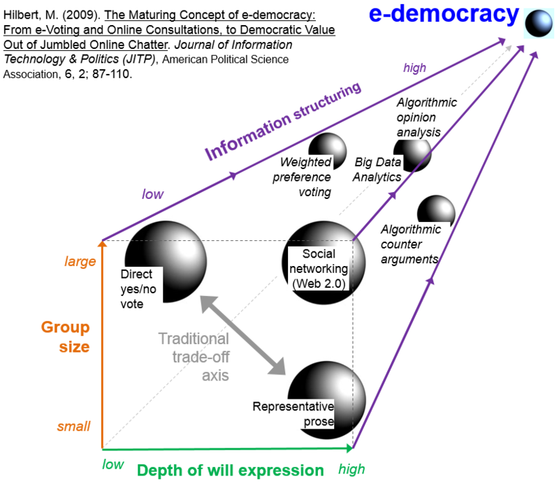
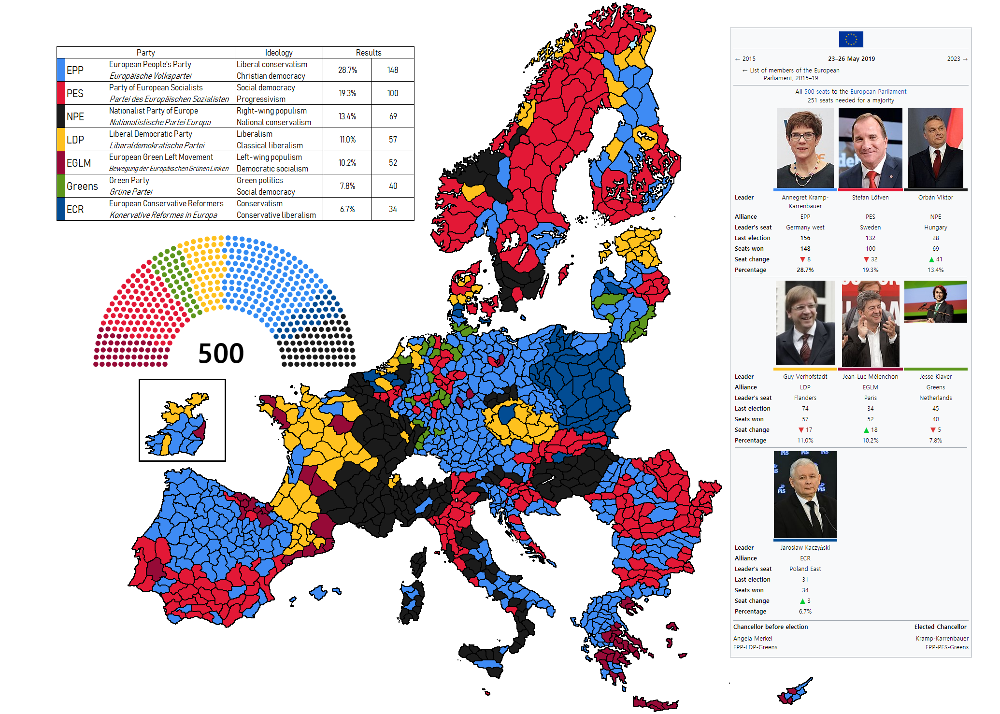
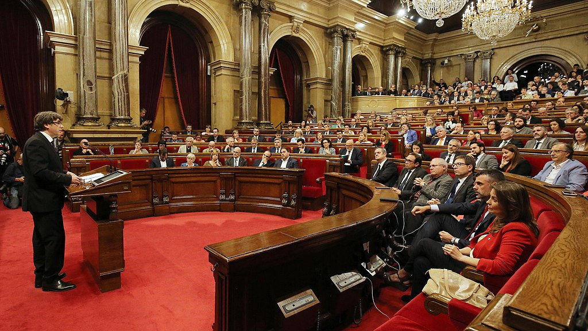
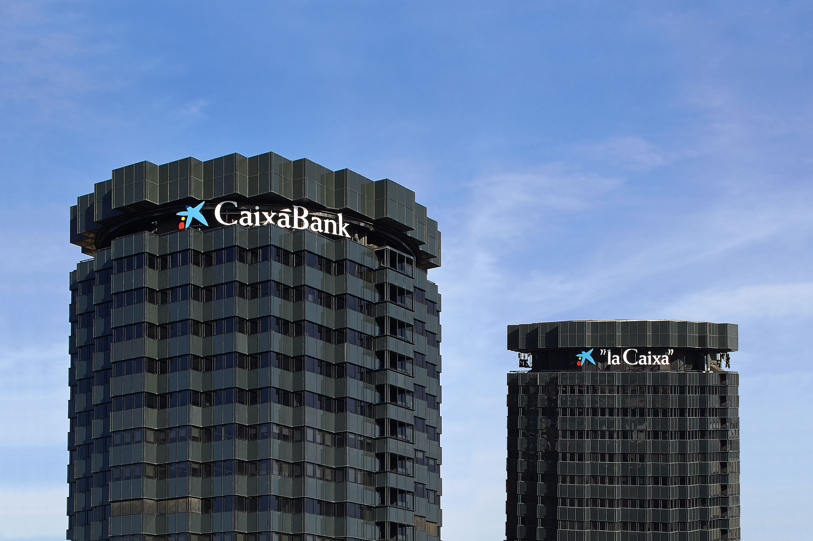
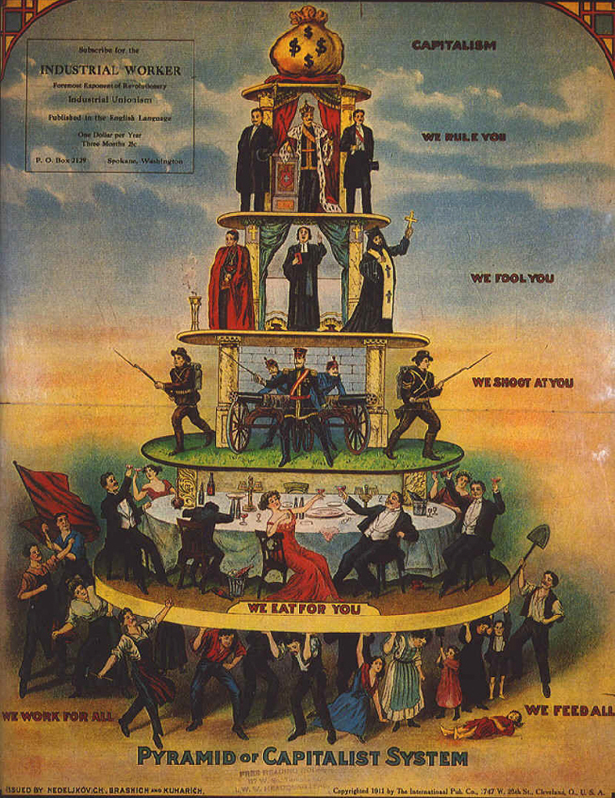
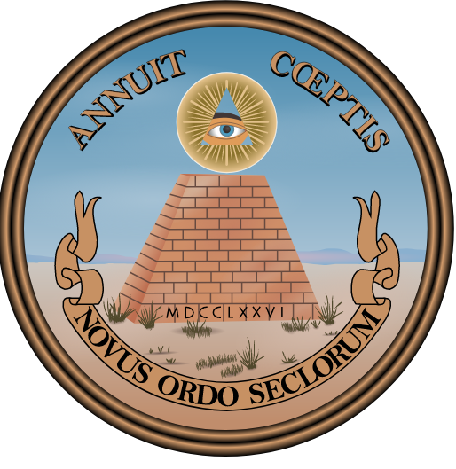
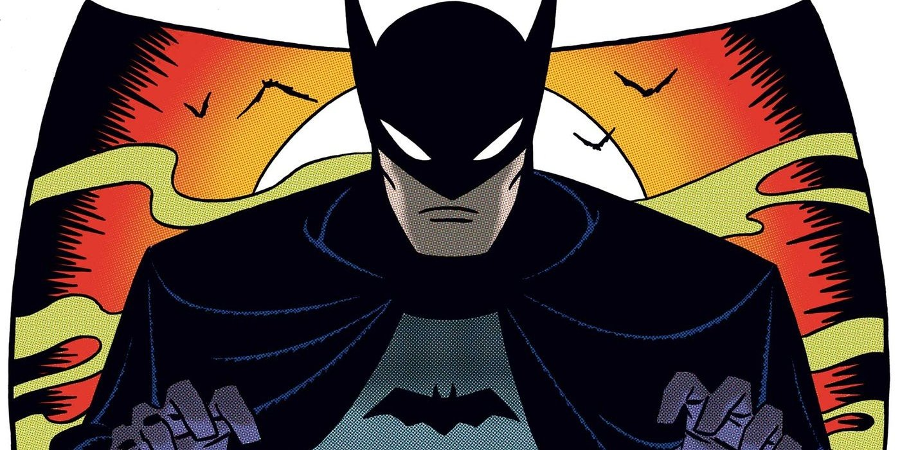
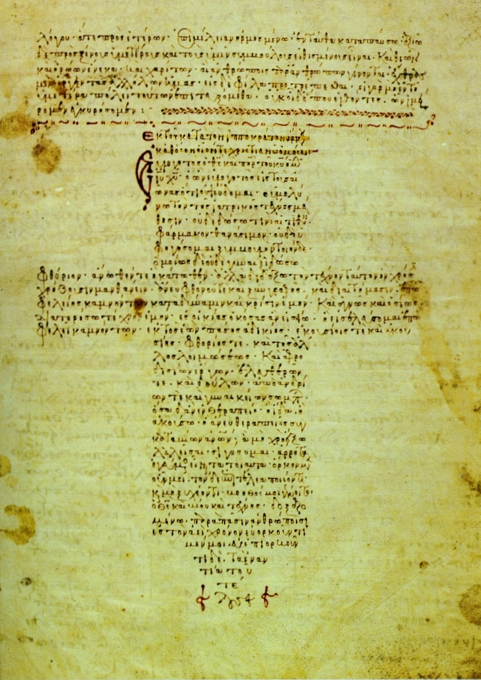

# E-democracy

As you can see there's a pyramid structure in this graphic, so, it's simple, it's a fraud. And electronic democracy *it's not democracy*. I remember my father telling me about his sense of **claustrophobia** [[1]](https://en.wikipedia.org/wiki/Claustrophobia) inside the **Giza pyramid complex** [[2]](https://en.wikipedia.org/wiki/Giza_pyramid_complex), also this illness could be classified as **anxiety disorder** [[3]](https://en.wikipedia.org/wiki/Anxiety_disorder). Look at the second last step before **e-democracy** [[4]](https://en.wikipedia.org/wiki/E-democracy), it's **big data** [[5]](https://en.wikipedia.org/wiki/Big_data) analysis. All of this data in the synthetic telepathy network has grow up a lot. In this criminal network there's absolutely no **privacy** [[6]](https://en.wikipedia.org/wiki/Privacy). And privacy is one of the most important towers of democracy. Where's no privacy there's no democracy.

First of all all people that are connected with the service of remote neural monitoring has got their mind read, auditory cortex and visual cortex first of all. What's happen? People are like remote video cameras! All in their line of sight is uploaded to the computing center, this probably could be in **Switzerland** [[7]](https://en.wikipedia.org/wiki/Switzerland).

What gain do you get in transforming humans into a device? 

Data recollecting about:	

1. Customs and traditions of people.
2. People's sexual clothes.
3. Political inclination.
4. All about them life and about life of his own circle of knowledge.
5. Total control on what so ever is them line of sight, like cars, license plates, people, etcetera etcetera.

But speaking about democracy that is the title of this chapter the worst think is obviously that another tower of our democracies is broken, the **secret ballot** [[8]](https://en.wikipedia.org/wiki/Secret_ballot). 

What is this network? I cannot understand why no one say nothing and my fear for a third world war and the consequent deaths is very high. This is terrorism, and is destroying the **United States of Europe** [[9]](https://en.wikipedia.org/wiki/United_States_of_Europe).

 	

Why our political don't do nothing about? Remember that United Kingdom has vote for ***Brexit***! 

It's very simple and it's astonished how controllers, services and other political group say nothing! The answer is always the same and is the worst cancer of the democracy: **corruption** [[10]](https://en.wikipedia.org/wiki/Corruption). 

How has changed corruption with the "Illuminati" pseudo dictatorship? Simple, with untraceable crypt concurrency like Monero every type of public figure, like politicians or police, can be corrupted with this system. It's very important understand that on line crypt bank like  **Freewallet** [[11]](https://freewallet.org/) are totally anonymous, if used with the **Tor project** [[12]](https://www.torproject.org/) or a free **proxy server** [[13]](https://en.wikipedia.org/wiki/Proxy_server) also source **IP address** [[14]](https://en.wikipedia.org/wiki/IP_address) is rewritten so the service is near absolutely totally secure.

So we can start thinking about what is known as **election day** [[15]](https://en.wikipedia.org/wiki/Election_day) fraud and what is passing just now in our Europe, that is **democratic backsliding** [[16]](https://en.wikipedia.org/wiki/Democratic_backsliding). Since the end of the **cold war** [[17]](https://en.wikipedia.org/wiki/Cold_War) this process in active in the background of our democracies and is something that have been decided by the elite. Like no one have say nothing about the real tool and cause of this right totalitarianism turn, the tool and cause is this network, the synthetic telepathy network and the pseudo dictatorship "Illuminati". I think that at this time, 2019, this process is near to be irreversible like the **climate change** [[18]](https://en.wikipedia.org/wiki/Climate_change), *we've got to do something all together just now*. And in a public way and without using masks. The activists group **Anonymous** [[19]](https://en.wikipedia.org/wiki/Anonymous_(group)) is doing something about, but they've *been classified as terrorist* from ours politicians and also they have not do work in a clear way using simple words without two or more meanings, so a lot of people doesn't understand the real sense. This is a previous accord with the owners of this network where Anonymous got access and do a little bit of opposition, *but it's not sufficient*.

What political currents have born from this backsliding? Remember always, history repeat because humans are always the same. Now with technology, the most important invention in the last century. 

**Populism** [[20]](https://en.wikipedia.org/wiki/Populism). 

And tell me my dear reader, in what these currents flow into? Another time is very simple, but *an icy shiver runs in my spine*:

**Fascism** [[21]](https://en.wikipedia.org/wiki/Fascism) sold as social revolution, sold as **new world order** [[22]](https://en.wikipedia.org/wiki/New_World_Order_(conspiracy_theory)) (a fraud it's always the same elite gaming with people).

Dear fellow reader how many persons die in the last **authoritarianism** [[23]](https://en.wikipedia.org/wiki/Authoritarianism). Only an example **World War 2** [[24]](https://en.wikipedia.org/wiki/World_War_II_casualties) casualties where 55 million. 

Why people don't understand the real danger about "Illuminati"? It's so simple. 

**Ignorance** [[25]](https://en.wikipedia.org/wiki/Ignorance). 

But is ignorance a crime? No it isn't nor it is a bad word to describe the state of a person. It's not an insult. The crime is farm ignorance, with what? *In not so ancient time with supernatural, cult and church. Now with piloted mass media, television and Internet*. 

But if they understand but no one say nothing, what is the cause. Always very simple:

**Money** [[26]](https://en.wikipedia.org/wiki/Money).

I **rotftl** [[27]](https://emojipedia.org/rolling-on-the-floor-laughing/), a nowadays technological acronym, a lot. For money and ignorance our sons and we are about to live another forty years of blackout like the start of the twentieth century more dangerous because of extreme evolution of technology. 

*How are the real persons behind that? Our fathers, because they are old people, they've lived and they only think about personal problems. They don't like humans and unconsciously or not have destroyed the life of their grandchildren.* 

### Piloted feminism and others mass feelings

*-- vai avanti tu che a me vien da ridere --*

**Feminism** [[28]](https://en.wikipedia.org/wiki/Feminism) is also another paint of this system, they have been very clever and got analyzed the weak points in our society. Attention theoretically feminism is a great movement is for freedom and equality in **human rights** [[29]](https://en.wikipedia.org/wiki/Human_rights) for women, in reply to **machismo** [[30]](https://en.wikipedia.org/wiki/Machismo) and **gender violence** [[31]](https://en.wikipedia.org/wiki/Gender_violence). So it's a democratic movement.     

So who can utilize democratic movements to complain with a turn in totalitarianism in our Europe? Great service entrepreneurs departments followed by human hackers.

Why i speak about paint when i speak about feminist? It's not to illegitimate a true sentiment but it's to do a reflexion and i want that you, girls, do the same with my phrases that are not a manipulation but an object thinking. When we speak about sentiment that move a lot of persons, we can speak about masses. Masses are an incredible power tool for politicians and big entrepreneurs. Masses guided using a real sentiment with another final goal are very dangerous for democracy, masses vote almost the same when there's an **election** [[32]](https://en.wikipedia.org/wiki/Election) in the current **legislature** [[33]](https://en.wikipedia.org/wiki/Legislature).   

Very unfortunately always when we speak about masses common feeling if they are not managed by great minds alien to foreign influences and primarily not corrupted by money, like it happen with the advance of the "Illuminati" pseudo dictatorship, they can be addressed where the corrupter want. 

*The common address nowadays is the devious, for now, totalitarian regime.*

Here it is others masses common feelings that is manipulated with this hell technology in my opinion:

- The Catalan Republican feeling.
- Associations against homophobia.
- Football club supports.
- Disgruntled citizens from the current political scene.
- Religious believers.

### Documentation and bank identity thief

There is others towers of our democracy government like the importance of keeping your identification and banking documents private. With this technology all of yours documents are read by the visual cortex remote reading by the neural control.

Also, and yes it's true, with radio frequency it's possible to simulate a **magnetic stripe reader** [[34]](https://en.wikipedia.org/wiki/Card_reader) device and chip reader. It's true and it's under our eyes every days. Do you know **contactless payment** [[35]](https://en.wikipedia.org/wiki/Contactless_payment)? Do you know **radio frequency identification** [[36]](https://en.wikipedia.org/wiki/Radio-frequency_identification)? Could you image that the same system is done from a satellite network? You probably don't understand that we've totally loose our democracy. E-democracy is totally hacked by satterrorism. And it's now, and no one speak about? Does mass media say nothing? No. Why? Because of democratic backsliding that have fallen into populism political real movement and that obviously will fall into fascism and millions of death. The history always is repeating because of human kind, we're always the same animal and with technology we're too dangerous. For our planet and for our fellow men. *What is happening in reality*?

 

Look another pyramid, another fraud, this have more than two thousand years. A strong one. Ok but now there's one layer upper that is **outer space** [[37]](https://en.wikipedia.org/wiki/Outer_space) and **cyberspace** [[38]](https://en.wikipedia.org/wiki/Cyberspace).

Old summit of the capitalist pyramid, that have been always the same aristocratic cast, have lost them supremacy. This is called **new world order** [[39]](https://en.wikipedia.org/wiki/New_World_Order_(conspiracy_theory)), but is a conspiracy theory (in wikipedia, a web portal...).

Look at this false **esoterism** [[40]](https://en.wikipedia.org/wiki/Western_esotericism) **masonic** [[41]](https://en.wikipedia.org/wiki/Freemasonry) symbol, you can find it on the **dollar** [[42]](https://en.wikipedia.org/wiki/Dollar) . Remember *paper money is a fraud also*.  A pyramid, a fraud, broken in his summit by an eye in space. *Satellite nothing else*.

But who are who have broken the capitalist summit? Big technological firm.

They call them the **unicorn club** [[43]](https://en.wikipedia.org/wiki/Unicorn_(finance)), another symbol. And the biggest are the **GAFAM** [[44]](https://en.wikipedia.org/wiki/Big_Four_tech_companies), next "**the big nine G-MAFIA BAT**" [[45]](https://www.wired.com/beyond-the-beyond/2019/03/big-nine-g-mafia-bat/). Those are the companies:

1. Google
2. Amazon
3. IBM
4. Facebook
5. Apple
6. Microsoft
7. **Baidu** [[46]](https://en.wikipedia.org/wiki/Alibaba_Group)
8. **Alibaba** [[47]](https://en.wikipedia.org/wiki/Alibaba_Group)
9. **Tencent** [[46]](https://en.wikipedia.org/wiki/Tencent)

Look at those last three tech giant, are Chinese. 

The reality is one. **Barcelona was owned by BAT tech giants.** And also the B-side is under those group. Because big tech nowadays control also black markets. Yes, it's true and yes the new mafia. The digital one.

### Oaths break

There's various professional figures in a democratic state that have to oath in front of the state about the professional secret of customers personal data and cases. 

 Those professionals are important to maintains people sovereign state:

- Doctors and odontologist, **Hippocratic Oath** [[47]](https://en.wikipedia.org/wiki/Hippocratic_Oath).
- Military and also military police like **Carabinieri** [[48]](https://en.wikipedia.org/wiki/Carabinieri) or **Guardia Civil** [[49]](https://en.wikipedia.org/wiki/Civil_Guard_(Spain)),  **Oath of allegiance** [[50]](https://en.wikipedia.org/wiki/Oath_of_allegiance).
- **Oath of politicians office** [[51]](https://en.wikipedia.org/wiki/Oath_of_office).
- Oath of **lawyers** [[52]](https://en.wikipedia.org/wiki/Lawyer).

With this criminal networks it's impossible to maintain professional secrecy! All what we're saying to a lawyer or a police officers or our medicals records are registered and stolen. They have the knowledge of all about us. 

I call it a pseudo dictatorship because it is a state under the state like it is the old Mafia. But it's important to understand that this kind of digital Mafia with this extreme invasive technology got all about every citizen  and professional. It's absolutely the end of democracy, no privacy, without rights, every victim or target individual is totally naked in front of the perpetuators of this horrible criminal state. Something that start in Internet like a fraud, the *"Illuminati" now are a very dangerous Mafia which is taking ground in the civil status but also in the ancient mafias*.

### Political mass view manipulation

This is my father profile image in the social network **Whatsup** [[53]](https://www.whatsapp.com/). As you can see there is a road in a desert, the **loneliness** [[54]](https://en.wikipedia.org/wiki/Loneliness), straight forward. 

Next there is a right turn. Let's focus in the current European political situation.

 

# External links

1. https://en.wikipedia.org/wiki/Claustrophobia

2. https://en.wikipedia.org/wiki/Giza_pyramid_complex

3. https://en.wikipedia.org/wiki/Anxiety_disorder

4. https://en.wikipedia.org/wiki/E-democracy

5. https://en.wikipedia.org/wiki/Big_data

6. https://en.wikipedia.org/wiki/Privacy

7. https://en.wikipedia.org/wiki/Switzerland

8. https://en.wikipedia.org/wiki/Secret_ballot

9. https://en.wikipedia.org/wiki/United_States_of_Europe

10. https://en.wikipedia.org/wiki/Corruption

11. https://freewallet.org/

12. https://www.torproject.org/

13. https://en.wikipedia.org/wiki/Proxy_server

14. https://en.wikipedia.org/wiki/IP_address

15. https://en.wikipedia.org/wiki/Election_day

16. https://en.wikipedia.org/wiki/Democratic_backsliding

17. https://en.wikipedia.org/wiki/Cold_War

18. https://en.wikipedia.org/wiki/Climate_change

19. https://en.wikipedia.org/wiki/Anonymous_(group)

20. https://en.wikipedia.org/wiki/Populism

21. https://en.wikipedia.org/wiki/Fascism

22. https://en.wikipedia.org/wiki/New_World_Order_(conspiracy_theory)

23. https://en.wikipedia.org/wiki/Authoritarianism

24. https://en.wikipedia.org/wiki/World_War_II_casualties

25. https://en.wikipedia.org/wiki/Ignorance

26. https://en.wikipedia.org/wiki/Money

27. https://emojipedia.org/rolling-on-the-floor-laughing/

28. https://en.wikipedia.org/wiki/Feminism

29. https://en.wikipedia.org/wiki/Human_rights

30. https://en.wikipedia.org/wiki/Machismo

31. https://en.wikipedia.org/wiki/Gender_violence

32. https://en.wikipedia.org/wiki/Election

33. https://en.wikipedia.org/wiki/Legislature

34. https://en.wikipedia.org/wiki/Card_reader

35. https://en.wikipedia.org/wiki/Contactless_payment

36. https://en.wikipedia.org/wiki/Radio-frequency_identification

37. https://en.wikipedia.org/wiki/Outer_space

38. https://en.wikipedia.org/wiki/Cyberspace

39. https://en.wikipedia.org/wiki/New_World_Order_(conspiracy_theory)

40. https://en.wikipedia.org/wiki/Western_esotericism

41. https://en.wikipedia.org/wiki/Freemasonry

42. https://en.wikipedia.org/wiki/Dollar

43. https://en.wikipedia.org/wiki/Unicorn_(finance)

44. https://en.wikipedia.org/wiki/Big_Four_tech_companies

45. https://www.wired.com/beyond-the-beyond/2019/03/big-nine-g-mafia-bat/

46. https://en.wikipedia.org/wiki/Baidu

47. https://en.wikipedia.org/wiki/Hippocratic_Oath

48. https://en.wikipedia.org/wiki/Carabinieri

49. https://en.wikipedia.org/wiki/Civil_Guard_(Spain)

50. https://en.wikipedia.org/wiki/Oath_of_allegiance

51. https://en.wikipedia.org/wiki/Oath_of_office

52. https://en.wikipedia.org/wiki/Lawyer

53. https://www.whatsapp.com/

54. https://en.wikipedia.org/wiki/Loneliness

    

    

    

