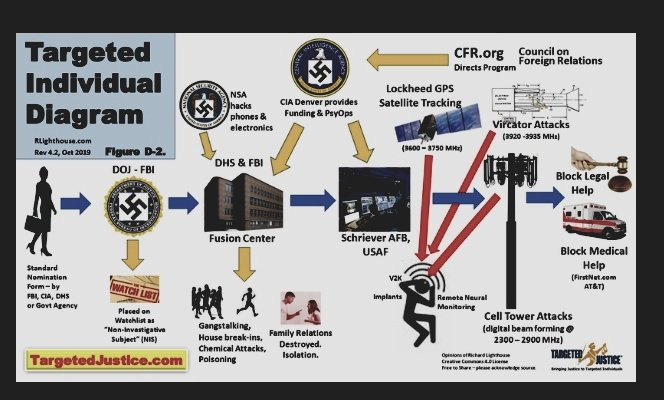

# Targeted individuals

Who are target individuals? Person that for whatever reason are exposed to be a victim of a large group of persons, criminals organizations normally. Target individuals like I've said before are business man that have lost them companies in a strange way eaten by opposites sharks, political opponents to the current government or B-side organization,  victims of corrupt love plots among wealthy people. 

*I'm a victim of all those three cases. All.* 

Target individuals are persons those life are destroyed by electromagnetic torture. Continuously. Isolated by a corrupted administration and society obtained by the use of the synthetic telepathy network. Corruption like an **octopus** [[1]](https://en.wikipedia.org/wiki/Octopus).  Corruption that touch all levels of the administration, the **municipality** [[2]](https://en.wikipedia.org/wiki/Municipality), the various police department and the **health care** [[3]](https://en.wikipedia.org/wiki/Health_care). Target individuals are tortured every day and them physical health condition is day by day degraded by the radio emission utilized to provoke inflammations in internal organs and can also fall into a **brain tumor** [[4]](https://en.wikipedia.org/wiki/Brain_tumor).

Society classify them as schizophrenic, usually became indigents reduced to extreme **poverty** [[5]](https://en.wikipedia.org/wiki/Poverty) in our European capitals. Alcohol, heavy drugs addicted. Searching for a couple of coins to eat something, dieing in the cold winter seeing others citizens walking in front of them eyes as if they didn't exist. I've seen many collapsed with them syringes still planted in their drooping arms at the mouth in the central streets of a noisy Barcelona of an infamous tourism incapable of helping these poor people destroyed by this *unknown but not hidden system*.

But this is not the worst think. In this network another shit happen to those poor people. 

Those people are heavy tortured almost every day and every night to obtain value to sell to military facilities. Tortured by sadist. Bent by the excruciating pain of electronic weapons that are a reality silenced by corruption as subtle but as thick as a fog bank that is destroying our Europe in front of our white cocaine noses.

Some of them, who got a family that can maintain them like me, try to resist to this monster, this network. And some, always like me, are IT technologist. Someone don't loose his mind after the complicate brain washing phases and the gangstalking one. Like me. Look in twitter the hashtag **#targetindividuals** [[6]](https://twitter.com/hashtag/targetindividuals). This is the legal and silenced by corruption human right abuse in our false electronic democracy. This is the end of ours states. No one speak about and this have to finish right now.

Why there's so much human guinea pigs in our streets and no one reflect on the real reason?

It's simple. And this is not apocalyptic. Have you seen the Terminator saga? Do you understand the **Terminator character concept** [[7]](https://en.wikipedia.org/wiki/Terminator_(character_concept))? Have you think about that the first film left on cinema on 1984? 

**George Orwell** [[8]](https://en.wikipedia.org/wiki/George_Orwell) has written a novel in 1947 after the second world war called **Nineteen Eighty-Four** [[9]](https://en.wikipedia.org/wiki/Nineteen_Eighty-Four). He wrote about a big brother society based on global mass surveillance. He had a lot of fantasy? I don't think so. He was a visionary? I don't think so. But those are just my two cents as usual.

So why i speak about a film saga and a novel? Because this network use indigent to obtain human data under extreme stress situations and very low physical health to go ahead with extreme speed in artificial intelligence, neural network, and electronic weapon development. In a few decades the real scenario will be exactly the one proposed by **James Cameron** [[10]](https://en.wikipedia.org/wiki/James_Cameron)? Another visionary? I don't think so, just the elite that with great film productions advance to the big public what will be one of probable feature. But no one say nothing. And let the tortures goes on. Fuck.

Do you want to know the reality? *I'm a target individuals by a military family from when i was born*. But this i will explain in another section, my personal experience.

Many times people don't understand why they are target individuals? They do money betting on life of persons, only destroying a family unit they could obtain thousands of euro. And no one understand it. 

Look at the image above. It say "contract stalking". What does it mean? It means that someone, probably persons that you know very well like "friends" of yours, have contracted this service in the synthetic telepathy network to oblige you to commit suicide. Who they are? It's very simple revise with clear mind the years before that this provoked situations has affected your life. Try to draw a graph as a function of time and nefarious events. You will find that those friends could be also your family. Someone that you've call brother. Like me. But why all of this shit could happen to a normal guy? The reply it's only one, envies one of the **seven deadly sins** [[11]](https://en.wikipedia.org/wiki/Seven_deadly_sins). Or something that you haven't under your control, an inheritance. Or simply your business, that provoke interest in some medium size shark. As usual I'm victim of the three cases.

### External links

1. https://en.wikipedia.org/wiki/Octopus
2. https://en.wikipedia.org/wiki/Municipality
3. https://en.wikipedia.org/wiki/Health_care
4. https://en.wikipedia.org/wiki/Brain_tumor
5. https://en.wikipedia.org/wiki/Poverty
6. https://twitter.com/hashtag/targetindividuals
7. https://en.wikipedia.org/wiki/Terminator_(character_concept)
8. https://en.wikipedia.org/wiki/George_Orwell
9. https://en.wikipedia.org/wiki/Nineteen_Eighty-Four
10. https://en.wikipedia.org/wiki/James_Cameron
11. https://en.wikipedia.org/wiki/Seven_deadly_sins