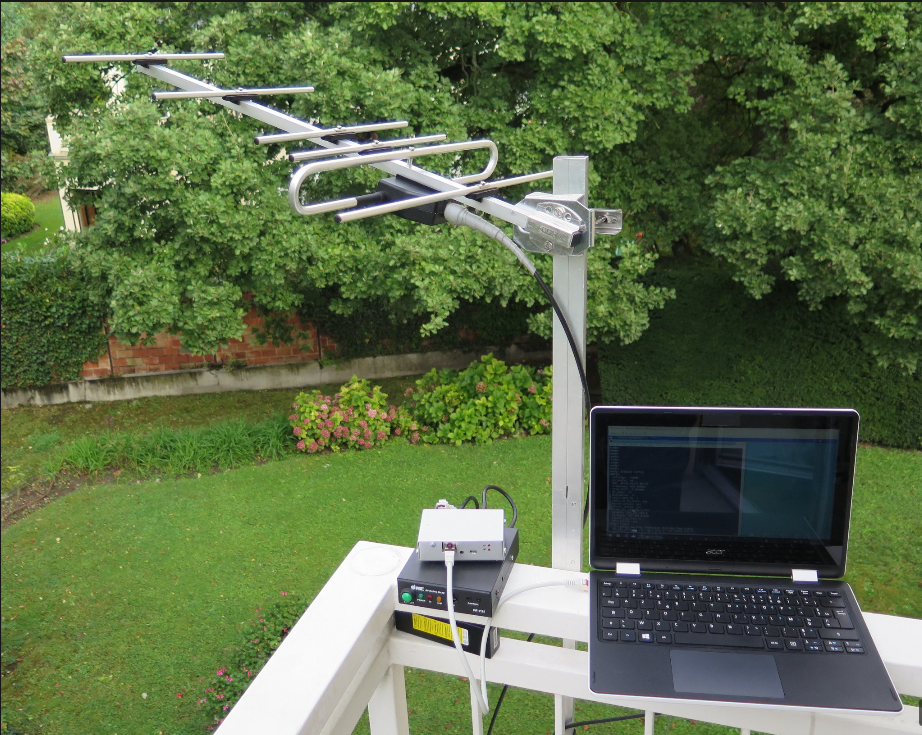
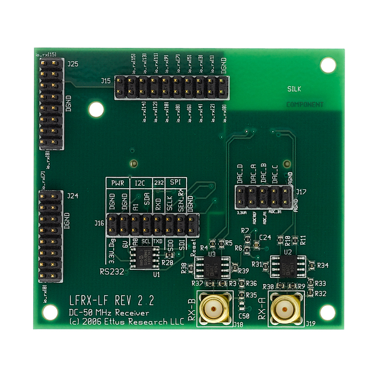
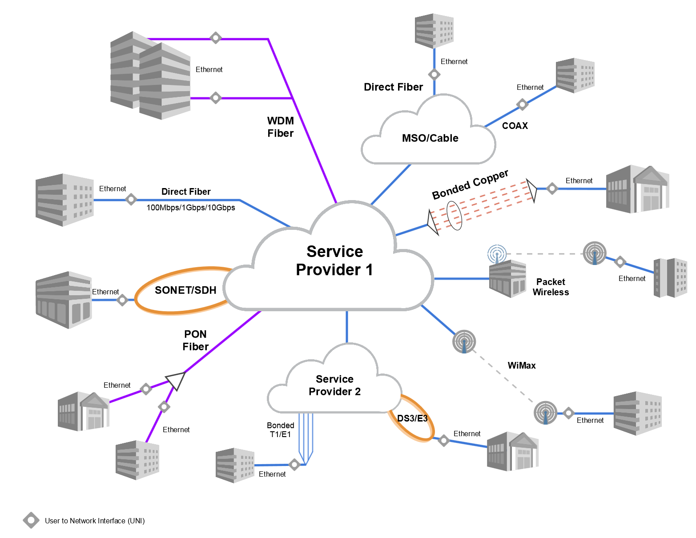
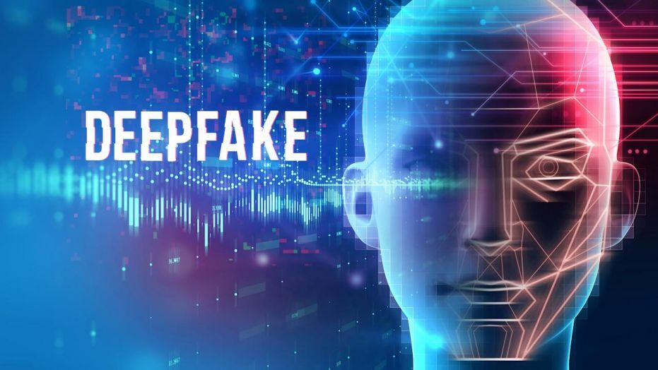

# The audiovisual industry

So we've got analyzed the radio part of the synthetic telepathy network, what people call "Illuminati". A pseudo dictatorship that has got is principal goal to create technological startup in the IT an audiovisual sector. To develop using humans as guinea pigs.

But we don't speak about one of the most important leaf, audiovisual. 

Let's speak about the infrastructure that is behind this monster.

Normally they use to connect the illegal radio network with a wireless Internet service provider next  using a fiber transport provider next a local exchange data center to connect to a audiovisual facility. Doing this is difficult to trace the exact origin of this traffic because the nature of the **WISP** [[1]](https://en.wikipedia.org/wiki/Wireless_Internet_service_provider) it doesn't have an **AS number** [[2]](https://en.wikipedia.org/wiki/Autonomous_system_(Internet)) so at international level it's like impossible to trace.

This is what they've done in Catalunya and it is a patron to search in all Europe and probably all the world. But in the next part I will explain exactly how they've done it. Here I will speak about protocols, hardware and great productions facilities of **Hollywood** [[3]](https://en.wikipedia.org/wiki/Hollywood), **Bollywood** [[4]](https://en.wikipedia.org/wiki/Bollywood) and others.

### Telecommunication infrastructure 

Ok, so the first step it's to translate analogue different meters longitude waves into [IP](https://en.wikipedia.org/wiki/IP_address). This is almost done with software defined radio, but in the past and probably nowadays something is however up and running there was radio ham bridges. 

**Packet radio** [[6]](https://en.wikipedia.org/wiki/Packet_radio) was and is a classical solution present in the **Linux kernel** [[7]](https://en.wikipedia.org/wiki/Linux_kernel).

Here is some good links:

- **Amateur X.25** [[8]](https://en.wikipedia.org/wiki/AX.25)
- **GNURadio** [[9]](https://en.wikipedia.org/wiki/GNU_Radio)
- **Software-defined radio** [[10]](https://en.wikipedia.org/wiki/Software-defined_radio)
- **Universal Software Radio Periphereal** [[11]](https://en.wikipedia.org/wiki/Universal_Software_Radio_Peripheral)

USRP are a point of interest to develop BRAINnet utilized to silently sniff EEG from victims and inject data into brains.

Some of them implement **direct current** [[12]](https://en.wikipedia.org/wiki/Direct_current) of wireless and those are our favorite products to analyze this hell network from the telecommunications lobby known as **wireless power transfer** [[13]](https://en.wikipedia.org/wiki/Wireless_power_transfer). Look at this radios:

- **LFRX DC - 30 MHz Rx** [[14]](https://www.ettus.com/all-products/lfrx/)
- **LFRX DC - 30 MHz Tx** [[15]](https://www.ettus.com/all-products/lftx/)

Next the bridge from ham radio to IP it's important to join a **metropolitan area network** [[16]](https://en.wikipedia.org/wiki/Metropolitan_area_network) with fiber or license radio bridges to a data center. Here with an **exterior gateway protocol** [[17]](https://en.wikipedia.org/wiki/Exterior_gateway_protocol) IP layer three packet are routed to an audiovisual networking and production facility.

Here protocols are various the but the goal is to retransmit data over IP using **IPTV** [[18]](https://en.wikipedia.org/wiki/Internet_Protocol_television) over Internet, over **deep web** [[19]](https://en.wikipedia.org/wiki/Deep_web), over satellite using **videocipher** [[20]](https://en.wikipedia.org/wiki/Videocipher) customer enterprise equipment. What is transmitted as result of the "Illuminati"  facility is only illegal porn content, also **pedophilia** [[21]](https://en.wikipedia.org/wiki/Pedophilia). Remember that victims are unconscious human video camera.  

Speaking about protocols it's important to learn **Internet Group Management Protocol** [[22]](https://en.wikipedia.org/wiki/Internet_Group_Management_Protocol) perhaps who is **shareholder** [[23]](https://en.wikipedia.org/wiki/Shareholder) of the most important telecommunications and technological societies it's subscribed to a **multicast** [[24]](https://en.wikipedia.org/wiki/Multicast) address where all this shit is transmitted. 

*Bet over humans like they are animals is how they pass their afternoon.* 

### Digital video processing 

Resolution of video obtained by the "Illuminati" technology are of **nHD** [[25]](https://en.wikipedia.org/wiki/Graphics_display_resolution#nHD) display resolution, a ninth part of **Full HD** [[26]](https://en.wikipedia.org/wiki/1080p). To be transmitted over the channels above a **video processing** [[27]](https://en.wikipedia.org/wiki/Video_processing) facility is necessary. 

I'm not a audiovisual expert but i can say that technology of video composite and **deepfake** [[28]](https://en.wikipedia.org/wiki/Deepfake) are used.

Deepfake is used to mask victims. Porn web portals are full of amateur not acknowledge videos masked by the use of advanced version of this technology. All is open source and only a team of good programmer could done a perfect job. It's important to find RAW images  to condemn criminals.

### External Links

1. https://en.wikipedia.org/wiki/Wireless_Internet_service_provider
2. https://en.wikipedia.org/wiki/Autonomous_system_(Internet)
3. https://en.wikipedia.org/wiki/Hollywood
4. https://en.wikipedia.org/wiki/Bollywood
5. https://en.wikipedia.org/wiki/IP_address
6. https://en.wikipedia.org/wiki/Packet_radio
7. https://en.wikipedia.org/wiki/Linux_kernel
8. https://en.wikipedia.org/wiki/AX.25
9. https://en.wikipedia.org/wiki/GNU_Radio
10. https://en.wikipedia.org/wiki/Software-defined_radio
11. https://en.wikipedia.org/wiki/Universal_Software_Radio_Peripheral
12. https://en.wikipedia.org/wiki/Direct_current
13. https://en.wikipedia.org/wiki/Wireless_power_transfer
14. https://www.ettus.com/all-products/lfrx/
15. https://www.ettus.com/all-products/lfrx/
16. https://en.wikipedia.org/wiki/Metropolitan_area_network
17. https://en.wikipedia.org/wiki/Exterior_gateway_protocol
18. https://en.wikipedia.org/wiki/Internet_Protocol_television
19. https://en.wikipedia.org/wiki/Deep_web
20. https://en.wikipedia.org/wiki/Videocipher
21. https://en.wikipedia.org/wiki/Pedophilia
22. https://en.wikipedia.org/wiki/Internet_Group_Management_Protocol
23. https://en.wikipedia.org/wiki/Shareholder
24. https://en.wikipedia.org/wiki/Multicast
25. https://en.wikipedia.org/wiki/Graphics_display_resolution#nHD
26. https://en.wikipedia.org/wiki/1080p
27. https://en.wikipedia.org/wiki/Video_processing
28. https://en.wikipedia.org/wiki/Deepfake