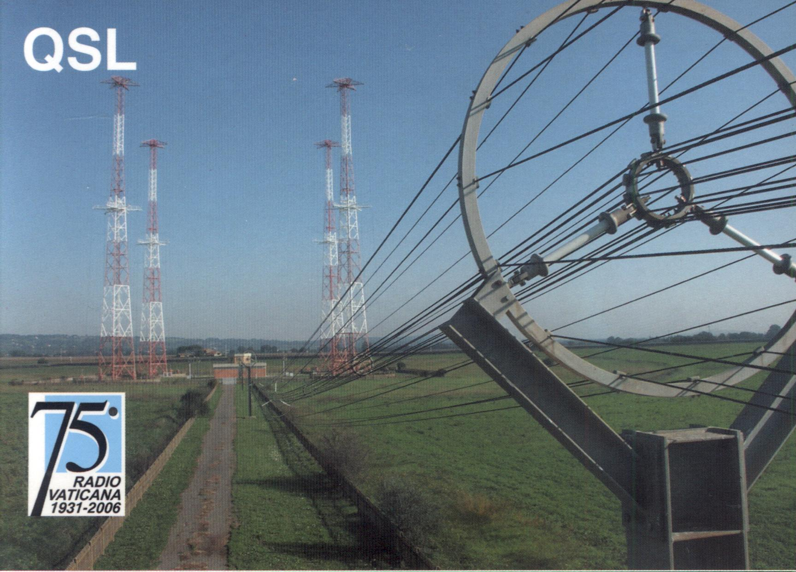
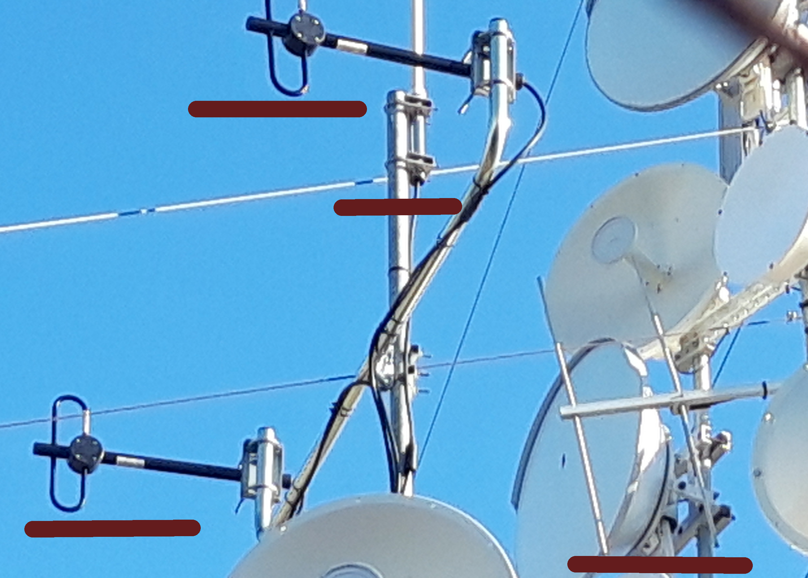

# Hardware layers

### Magnetic field

**Vatican Radio** [[1]](https://en.wikipedia.org/wiki/Vatican_Radio) is active from 1930s. It had got a lot of complaints for be cancerous with them emission. Got an extremely power transmitter that cover all over the world because of a law of 1936 where the **International Telecommunication Union** [[2]](https://en.wikipedia.org/wiki/International_Telecommunication_Union) had permitted broadcasting in all over the world considering them emissions like a special case. The **principle transmitter** [[3]](https://www.catholicsun.org/vatican-radio-transmission-site-at-santa-maria-di-galeria-outside-rome/) in the Vatican situated in **Santa Maria di Galeria** [[4]](https://it.wikipedia.org/wiki/Santa_Maria_di_Galeria).

The Vatican extreme power AM transmitter, but also all kind of other radio waves transmitter, interacting with **overhead power lines** [[5]](https://en.wikipedia.org/wiki/Overhead_power_line) create what is called electrosmog. 

This  an enormous magnetic field under the **Troposhere** [[6]](https://en.wikipedia.org/wiki/Troposphere). The hackers of the worldwide neural control network had build all below this layer one that was not created exactly for this purposes. But was also utilized in the second world war. 

> *They call this steam machine.* 

The steam machine works similar to the red upon a bumper cars installation but wireless. It's the cause of all the violence in this hell network and it permit human semi physical transposition. I use the substantive Vatican because in subliminal voice to skull there's a lot of person from the ancient state of Vatican. 

With the magnetic field upon our head they virtually connect cables to our body channeling different technologies and frequencies inside of them. This is why it's almost impossible register this electromagnetic transmission. The only method possible is using an **electroencephalogram** [[7]](https://en.wikipedia.org/wiki/Electroencephalography) **cap** [[8]](https://www.brainlatam.com/products/eeg-electrode-caps) but we will see more in deep in the technical analysis. 

The magnetic field area network or **MFAN** [[9]](https://ieeexplore.ieee.org/document/5405677) is the method to encapsulate IP data over a magnetic field. 

With this virtual device the environment near the victim is like a remote **CT scan** [[10]](https://en.wikipedia.org/wiki/CT_scan) machine, like under an electromagnetic isolation bell. And it is continuously, the real mean is that we are under excess doses and risk **radiation burn** [[11]](https://en.wikipedia.org/wiki/Radiation_burn) and risk of cancer.

### The government LTE embedded hardware

Governments has got subliminal voice services and silent brain waves sniff embedded in national operators LTE towers. Satellite constellation network also is used to stimulate MEN cells remotely with a 3GHz radio beam antenna. But also they implement in a **cubesat** [[14]](https://en.wikipedia.org/wiki/CubeSat) environment subliminal voice service like I've proved in an airplane trip and remote imaging of targets individuals.

### The access network

The antennas and ground stations that permit the connection to the human targets are very simple. In this photo taken in Catalunya in a tower from a wireless Internet service provider that bind those illegal services  there are two black ferrite magnetic loop antennas that create with two software defined radios a network below 150Hz. They implement **US patent 6011991** [[15]](https://github.com/noplacenoaddress/RNMnetwork/blob/master/Appendix%201%20-%20Patents/US6011991.pdf) , **4834701** [[16]](https://github.com/noplacenoaddress/RNMnetwork/blob/master/Appendix%201%20-%20Patents/US4834701.pdf) but not only.

The white omnidireccional antenna is operating in MF and it used for subliminal voice services. It implement **US patent  5159703** [[17]](https://github.com/noplacenoaddress/RNMnetwork/blob/master/Appendix%201%20-%20Patents/US5159703.pdf).

The last one it's probably related to an open hardware radar system.

This infrastructure, very simple in design, is implemented by Francesca, nephew of an Italian second world war hero, in Catalunya and all over the world. This infrastructure was mounted where i build my wireless Internet service provider. This is why i fall like a victim in the worldwide neural control network. With this infrastructure Francesca is the owner of the gangstalking service in all over the world. Her nickname in the silent subliminal message chat is "Francese". I personally know her and she is one of the head of the digital mafia lobby.

### The terrestrial positioning system

**3D radar** [[18]](https://en.wikipedia.org/wiki/3D_radar). It's a positioning system that is implemented in the neural control network. There are two layers of positioning, the official one from military forces and the open hardware one that use SDR hardware that it's called **software defined embedded radar** [[19]](http://ancortek.com/).

### 

# External links

1. https://en.wikipedia.org/wiki/Vatican_Radio
2. https://en.wikipedia.org/wiki/International_Telecommunication_Union
3. https://www.catholicsun.org/vatican-radio-transmission-site-at-santa-maria-di-galeria-outside-rome/
4. https://en.wikipedia.org/wiki/Vatican_Radio
5. https://en.wikipedia.org/wiki/International_Telecommunication_Union
6. https://en.wikipedia.org/wiki/Troposphere
7. https://it.wikipedia.org/wiki/Santa_Maria_di_Galeria
8. https://ieeexplore.ieee.org/document/5405677
9. https://www.catholicsun.org/vatican-radio-transmission-site-at-santa-maria-di-galeria-outside-rome/
10. https://en.wikipedia.org/wiki/CT_scan
11. https://en.wikipedia.org/wiki/Radiation_burn
12. https://www.nature.com/articles/s41598-017-01647-x
13. https://en.wikipedia.org/wiki/Nanoparticle
14. https://en.wikipedia.org/wiki/CubeSat
15. https://github.com/noplacenoaddress/RNMnetwork/blob/master/Appendix%201%20-%20Patents/US6011991.pdf
16. https://github.com/noplacenoaddress/RNMnetwork/blob/master/Appendix%201%20-%20Patents/US4834701.pdf
17. https://github.com/noplacenoaddress/RNMnetwork/blob/master/Appendix%201%20-%20Patents/US5159703.pdf
18. https://en.wikipedia.org/wiki/3D_radar
19. http://ancortek.com/