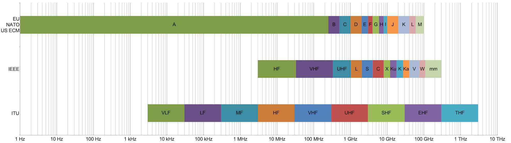
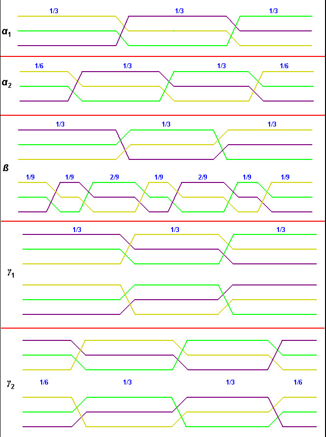
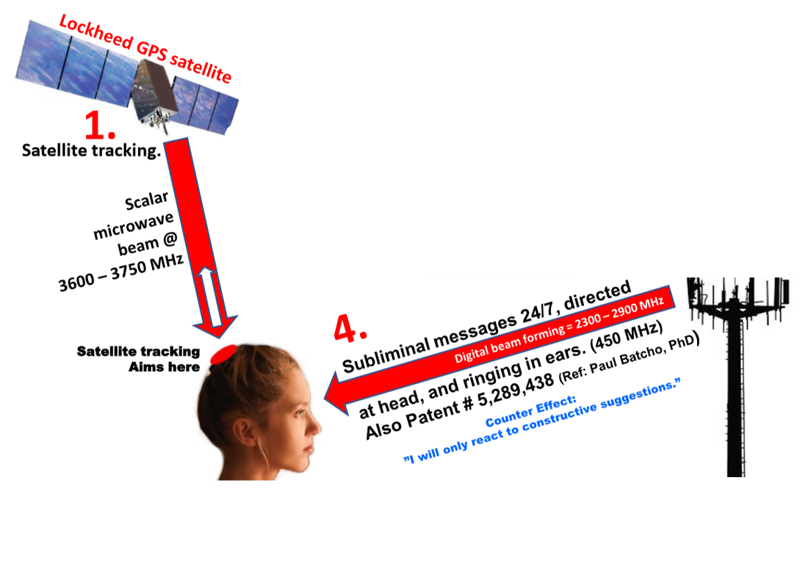
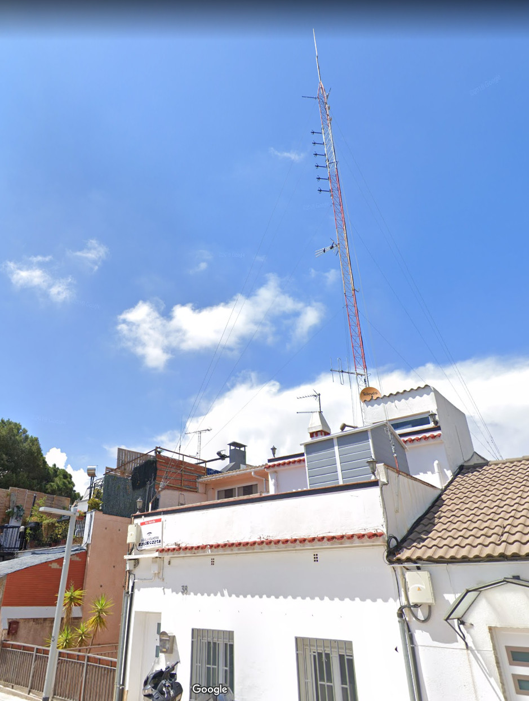
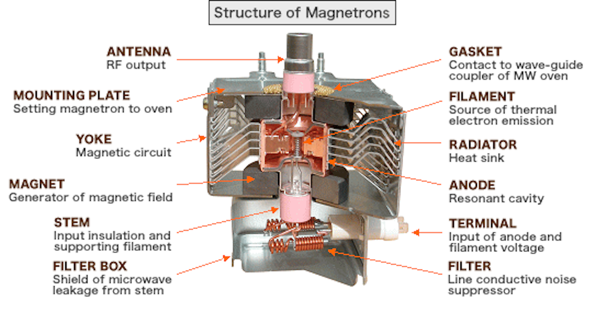
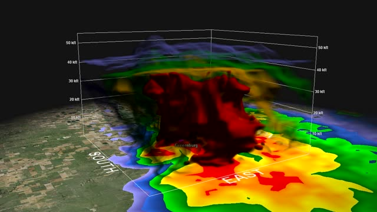

# Radio infrastructure

There is a lot of different services join together to create the remote neural monitoring facility. Depending on the layer and  who is the real owner it include hidden services from governments, church, nobles and big facilities. At the lower level, used normally to manage black market, prostitution and betting it is create by the use of open hardware devices and open source programs. 

The **radio bands** [[1]](https://en.wikipedia.org/wiki/Radio_spectrum) utilized are:

- Extreme low frequency **ELF** [[2]](https://en.wikipedia.org/wiki/Extremely_low_frequency)
- Super low frequency **SLF** [[3]](https://en.wikipedia.org/wiki/Super_low_frequency)
- Ultra low frequency **ULF** [[4]](https://en.wikipedia.org/wiki/Ultra_low_frequency)
- Very low frequency **VLF** [[5]](https://en.wikipedia.org/wiki/Very_low_frequency)
- Low frequency **LF** [[6]](https://en.wikipedia.org/wiki/Low_frequency)
- Medium Frequency **MF** [[7]](https://en.wikipedia.org/wiki/Medium_frequency)
- High Frequency **HF** [[8]](https://en.wikipedia.org/wiki/High_frequency)
- Very high frequency **VHF** [[9]](https://en.wikipedia.org/wiki/Very_high_frequency)
- Ultra high frequency **UHF** [[10]](https://en.wikipedia.org/wiki/Ultra_high_frequency)
- Super high frequency **SHF** [[11]](https://en.wikipedia.org/wiki/Super_high_frequency)

The technologies are a mixture between analog and IP. All is public but no one has recollected all the informations in the same document. The telecommunication lobby manage those services using different layers of anonymity and creating a very deep smokescreen using deception, confusion, false institutions and many people to hide that in reality this whole system derives however from the first fifty years of the twentieth century. And it recreates the Middle Ages in today's democracies. 

### Church services for the cast

Medium frequencies are the band utilized by ancient fascism and church to create subliminal message systems that produce sound directly into our head. This is not exactly brain wave but it utilize technology to bypass the auditory system in the humans and also in some animals.

In Spain still exist the infrastructure that use Franco at the time of fascism which ended much later in this state than in the rest of Europe. It fell naturally, practically without violence, in the mid-seventies. All this is synonymous that the ruling class, the political class and a good part of the noble families of this country still have a vivid memory of absolutism, very much alive.

In the Vatican state in 1931 the **homonymous radio** [[12]](https://en.wikipedia.org/wiki/Vatican_Radio) was started which from the first moment had as its objective to bring the word of Christ, that is, of the church of man, all over the world. Attention to these last words, from a technical point of view I want to underline how only from an emitting center, actually one inside the walls of the same micro state and from a nearby appendix, the coverage of the whole globe has been guaranteed for practically a century thanks to a special law approved by the **International Telecommunication Union** [[13]](https://en.wikipedia.org/wiki/International_Telecommunication_Union) that allows the use of an emission power completely outside the world regulations. In Italy there have been various cases, practically all silenced by the immense power of the Church, of groups of people affected by various types of cancer certainly derived from the powers of their radios.

The enormous emission power of the Vatican center, over 150 Kw, interacts worldwide with **overhead power lines** [[14]](https://en.wikipedia.org/wiki/Overhead_power_line), forming what is defined today as **electromagnetic smog** [[15]](https://www.theguardian.com/technology/2007/jan/18/guardianweeklytechnologysection4). In reality, this magnetic field as large as our planet is used methodically for the great radio experts in the Vatican, who, given their immense culture, are certainly among the best in the world, to position human beings and other objects within the same field, a kind of ancient global position system and never made public. A scandal.

Using this magnetic field, electricity and others radio features it's possible from to obtain what is called **transposition** [[16]](https://en.wikipedia.org/wiki/Transposition_(telecommunications)), **remote viewing** [[17]](https://en.wikipedia.org/wiki/Remote_viewing) and **out-of-body experience** [[18]](https://en.wikipedia.org/wiki/Out-of-body_experience). This is not pseudoscience this is true and the elite has concealed it from citizens for a hundred years.

### Governments remote neural control

Governments has got subliminal voice services and silent brain waves sniff embedded in national operators LTE towers. Satellite constellation network also is used to stimulate MEN cells remotely with a 3GHz radio beam antenna. 

Neural control means that our **electroencephalography** [[19]](https://en.wikipedia.org/wiki/Electroencephalography) it's continuously read without our agree, we've no privacy at all. From the interpretation of the brain waves it's possible to obtain what we see, what we feel, what we smell, our tough. But this is not the worst think, the bad ass feature is that they can write in our brain with remote emissions. They consider mankind like a machine and in this book we try to understand how technology work and what kind of abuses are done in the target individuals collective.

Target individuals are active victim of this facility, victims normally by all of those institutions. The church first of all.

What are goals of governments using this technology:

- Security obtained by the way with an illegal technology.
- Control of conflicting territories, like Catalunya.
- Social mass influencing to change political wind of a period, now we're deep in populism.

### "Games" radio and magnetic network

What are games?

Games are frauds used to mask the real goal of being a target individual. Frauds used to mask who are behind this abuse but also frauds that generate millions of Eur. Frauds that recollect money from:

- Black market management.
- Prostitution market management.
- Sexual harassment obtained by manipulation of subjects that have fall inside this system.
- Porn industry food.
- Brain and biological data sold to high tech big firm and military facilities.

Who are behind games? 

Games are assigned and completely masked behind nobles family, hacking and others stories. When I speak about assign I mean that a territory, like Catalunya, is assigned for a period of time to a group or a crew that create the game. Below every game there is a figure that interconnect different layers, casts, or call them how do you want that could be defined as the figure of observer. Who observe warrant that almost all the participants in the game have the opportunity to operate in the territory with a high degree of freedom, that is, it deals with drawing other figures with an important role of interconnection with high functions of the state, such as police, justice and public health. Practically it is those who deal with corruption.

Games are like " **the Canterbury tales**" [[20]](https://en.wikipedia.org/wiki/The_Canterbury_Tales), stories created on a center of attention that normally elude citizens and police forces not corrupted by the true meaning that nothing else is, as always, unbridled gain through a series of horrible crimes such as the creation of human guinea pigs for the purpose of developing unauthorized technologies. I am a victim of this system.

The antennas and ground stations that permit the connection to the human targets are very simple. In this photo taken in Catalunya in a tower from a wireless Internet service provider that bind those illegal services  there are six black ferrite magnetic loop antennas that create with six software defined radios a network below 150Hz. 

The white omni directional antenna is operating in VHF and it used for **AX.25** [[21]](https://en.wikipedia.org/wiki/AX.25) service. 

Next there is two **WiMAX** [[22]](https://en.wikipedia.org/wiki/WiMAX) three gigahertz antennas used to create terrestrial beam to excite brain neurons and permit remote EEG reading. 

The last one it's probably related to an open hardware radar system. Next there is two horizontally mounted antenna on the top of the tower that i don't know the exact purposes. 

This infrastructure, very simple in design, is implemented by Francesca, nephew of an Italian second world war hero, in Catalunya and in Italy. This infrastructure was mounted where i build my wireless Internet service provider. This is why i fall like a victim in the worldwide neural control network. With this infrastructure Francesca is the owner of the gang stalking service in a vast territory. Her nickname in the silent subliminal message chat is "Francese". I personally know her and she is one an important figure of the telecommunication lobby and his who invented the "Illuminati" game that is responsible of a dramatic increase of suicide death in Europe.

Who gain money with those masked "games"? Always the sames, the cast. Who loose them rights? Normally people who do not have the intellectual capacity to understand exactly the very complex general framework of this system of human exploitation. Many end up as drug dealers or whores. Many other suicides. Very few make room for shoulders in the midst of this bedlam of extreme wealth, corruption and silent crimes for an increasingly weak democracy, this time very rusty even from what is my passion, telecommunications.

### The terrestrial positioning system

**3D radar** [[23]](https://en.wikipedia.org/wiki/3D_radar). It's a positioning system that is implemented in the neural control network at the level of "game" if done with open hardware that use a special type of software defined radio that is called **software defined embedded radar** [[24]](http://ancortek.com/).

Another method to calculate the position of an object or a person with radio wave technology are **ultrasound** [[25]](https://en.wikipedia.org/wiki/Ultrasound). **Bat** [[26]](https://en.wikipedia.org/wiki/Bat) use the same method to fly in the night, it's what is called **sonar** [[27]](https://en.wikipedia.org/wiki/Sonar).

### External links

1. https://en.wikipedia.org/wiki/Radio_spectrum
2. https://en.wikipedia.org/wiki/Extremely_low_frequency
3. https://en.wikipedia.org/wiki/Super_low_frequency
4. https://en.wikipedia.org/wiki/Ultra_low_frequency
5. https://en.wikipedia.org/wiki/Very_low_frequency
6. https://en.wikipedia.org/wiki/Low_frequency
7. https://en.wikipedia.org/wiki/Medium_frequency
8. https://en.wikipedia.org/wiki/High_frequency
9. https://en.wikipedia.org/wiki/Very_high_frequency
10. https://en.wikipedia.org/wiki/Ultra_high_frequency
11. https://en.wikipedia.org/wiki/Super_high_frequency
12. https://en.wikipedia.org/wiki/Vatican_Radio
13. https://en.wikipedia.org/wiki/International_Telecommunication_Union
14. https://en.wikipedia.org/wiki/Overhead_power_line
15. https://www.theguardian.com/technology/2007/jan/18/guardianweeklytechnologysection4)
16. https://en.wikipedia.org/wiki/Transposition_(telecommunications)
17. https://en.wikipedia.org/wiki/Remote_viewing
18. https://en.wikipedia.org/wiki/Out-of-body_experience
19. https://en.wikipedia.org/wiki/Electroencephalography
20. https://en.wikipedia.org/wiki/The_Canterbury_Tales
21. https://en.wikipedia.org/wiki/AX.25
22. https://en.wikipedia.org/wiki/WiMAX
23. https://en.wikipedia.org/wiki/3D_radar
24. http://ancortek.com/
25. https://en.wikipedia.org/wiki/Ultrasound
26. https://en.wikipedia.org/wiki/Bat
27. https://en.wikipedia.org/wiki/Sonar