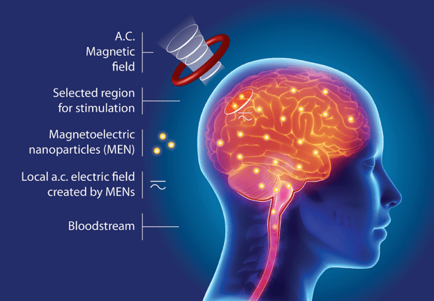

# Human networking stack

Like in the OSI model in the remote neural monitoring network there's a pile of different protocols that which deals with human address that are constantly tracked in the network and are considered like machines in a IP network.

### Physical layer

**Human body** [[1](https://en.wikipedia.org/wiki/Human_body)] is the physical layer of connectivity of this network. This is an awesome technology but used to destroy, command and conquer. 

### Data Link Layer

We're locked to those networks by satellite and by the steam machine between an unique human magnetic field value transmitted naturally if radio wave stimulated. The frequency that is used to stimulate these field is 3Ghz it can be transmitted by satellite or by **WiMax** [[2](https://en.wikipedia.org/wiki/WiMAX)] radio technology. **Magnetoelectric** [[3]](https://www.nature.com/articles/s41598-017-01647-x) **nanoparticles** [[4]](https://en.wikipedia.org/wiki/Nanoparticle) MEN are responsible of this emission. 

Until ten years ago those networks exist but the services use in hide mode, there was no interaction with the client, the victim. Then someone have created a tool that scan for this magnetic field unique id and a lot of people become target individuals. Human guinea pig. Subjects that are under a continuous bet vortex in crypt concurrency. People that normally commit suicide. Go in mental disorder vortex by a corrupted health care system. Something that is  destroying our society. Welcome to the false electronic democracy. Welcome to the probably third world war. 

### Network Layer

Another method to give an address in this radio network to clients, humans but not only also animal and machines, is the magnetic field produced by **heart** [[5]](https://en.wikipedia.org/wiki/Heart). 

### Transport Layer

The transport layer to address the different organs of the client services, in this case are our organs, are the resonance frequencies of every part of our body. The worst part is that every human has got a particular range of resonance of internal organs. So every target individual has to be scanned like in a **nmap** [[6]](https://en.wikipedia.org/wiki/Nmap) session.

How they can do it?

Using others victims and their particular smart phones infected by hackers working with these facility. 

A smart phone nowadays has got a lot of hardware that can be used to do this body scanner:

- **MEMS magnetic field sensor** [[7]](https://en.wikipedia.org/wiki/MEMS_magnetic_field_sensor)
- **Accelerometer** [[8]](https://en.wikipedia.org/wiki/Accelerometer)
- **LTE quad band modem** [[9]](https://www.sierrawireless.com/products-and-solutions/embedded-solutions/iot-modules/)
- **Wi-Fi and Bluetooth modules** [[10]](https://www.sierrawireless.com/products-and-solutions/embedded-solutions/wifi-bluetooth-modules/)
- **GNSS modules** [[11]](https://www.sierrawireless.com/products-and-solutions/embedded-solutions/gnss-positioning-modules/)

# External links

1. https://en.wikipedia.org/wiki/Human_body
2. https://en.wikipedia.org/wiki/WiMAX
3. https://www.nature.com/articles/s41598-017-01647-x
4. https://en.wikipedia.org/wiki/Nanoparticle
5. https://en.wikipedia.org/wiki/Heart
6. https://en.wikipedia.org/wiki/Nmap
7. https://en.wikipedia.org/wiki/MEMS_magnetic_field_sensor
8. https://en.wikipedia.org/wiki/Accelerometer
9. https://www.sierrawireless.com/products-and-solutions/embedded-solutions/iot-modules/
10. https://www.sierrawireless.com/products-and-solutions/embedded-solutions/wifi-bluetooth-modules/
11. https://www.sierrawireless.com/products-and-solutions/embedded-solutions/gnss-positioning-modules/