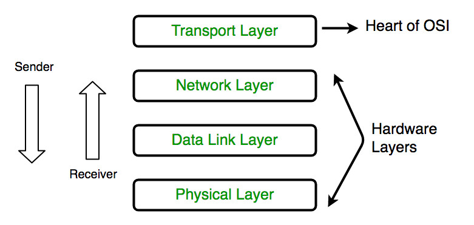

# Human networking stack

Like in the OSI model in the remote neural monitoring network there's a pile of different protocols that which deals with human address that are constantly tracked in the network and are considered like machines in a IP network.

### Physical layer

### Data Link Layer

### Network Layer

### Transport Layer

# External links