# The remote neural monitor wave Machine

In the last chapter we speak about the target machine, a virtual system under which many clients, conscious or not, are organized in a pyramid structure. But what is exactly the machine, or **M** [[1]](https://en.wikipedia.org/wiki/M_(James_Bond))? First of all there is practically no public document speaking about, so it's like a secret or something similar, many people know about it, someone can technically explain it, but no one write about. Why? I really don't know the real reason and i strongly believe in the **open source model** [[2]](https://en.wikipedia.org/wiki/Open-source_model) and i will try here to explain what I've understand about with some background knowledge about computer science, telecommunication, neuroscience and ham radio. 

In 1988 the Iceland artist **Björk Guðmundsdóttir** [[3]](https://en.wikipedia.org/wiki/Bj%C3%B6rk) speak about the **analog television** [[4]](https://en.wikipedia.org/wiki/Analog_television) with a fascinated voice  Here is part of her logic-defying monologue:

*This beautiful television has put me, like I said before, in all sorts of situations.*

*I remember being very scared because an Icelandic poet told me that not like in cinemas, where the thing that throws the picture from it just sends light on the screen, but this is different. This is millions and millions of little screens that send light, some sort of electric light, I'm not really sure.*

*But because there are so many of them, and in fact you are watching very many things when you are watching TV. Your head is very busy all the time to calculate and put it all together into one picture.*

*And then because you're so busy doing that, you don't watch very carefully what the program you are watching is really about. So you become hypnotized. So all that's on TV, it just goes directly into your brain and you stop judging it's right or not.*

*You just swallow and swallow. This is what an Icelandic poet told me.*

*And I became so scared to television that I always got headaches when I watched it. Then, later on, when I got my Danish book on television, I stopped being afraid because I read the truth, the scientifical truth and it was much better.*

*You shouldn't let poets lie to you.*

Image to have en front of yours eye a **cathode ray tube** [[5]](https://en.wikipedia.org/wiki/Cathode-ray_tube) that projects all the reality in our line of sight more some object like in an augmented reality system or completely rewrite all the world before us with a totally computer graphic ambient, something like interactive architectural visualization made by **unreal engine** [[6]](https://en.wikipedia.org/wiki/Unreal_Engine) **four** [[7]](https://www.unrealengine.com/en-US/); this is what they call as **immersion in virtual reality** [[8]](https://en.wikipedia.org/wiki/Immersion_(virtual_reality)) but without any hardware device. 

Image to have surrounding your ears a special headphone that reproduce all the audio around you but add a voice chat, could duplicate on the fly the exact voice of a human or any type of sound or audio, could rewrite on the fly the voice of a person speaking with you and so on. Something that could emulate what is nowadays call **3D audio effect** [[9]](https://en.wikipedia.org/wiki/3D_audio_effect).

Image also but not only to have all your **nervous system** [[10]](https://en.wikipedia.org/wiki/Nervous_system) and **muscles** [[11]](https://en.wikipedia.org/wiki/Muscle) connected by **acupuncture** [[12]](https://en.wikipedia.org/wiki/Acupuncture) and **electrodes** [[13]](https://en.wikipedia.org/wiki/Electrode) to a perfect human body reproduction external and internal. They can torture you without touching you but only reproducing the **pain** [[14]](https://en.wikipedia.org/wiki/Pain) remotely stimulating your **nerves** [[15]](https://en.wikipedia.org/wiki/Nerve) and your **brain** [[16]](https://en.wikipedia.org/wiki/Brain).

Our brain is also able to execute two complete tasks, yes two life, at the same moment dividing the twos in the left and right side of the brain. This is called **human multitasking** [[19]](https://en.wikipedia.org/wiki/Human_multitasking). With the Machine connected clients, and not victims, thanks to the radio technology can work in parallel in two thinks. Normally physically in the A-side, legal work, and with the brain in an augmented reality like environment in the B-side, black market. What is the real result? Because of the people connected on this system are divided in classes like **Indian castes**, low cast persons are like slaves, work double time without great compensation normally in the A-side in restorations of what ever and in the B-side in illegal IT, or doing black market and payed in very variables value crypt concurrencies. Normally nor they don't understand the bitcoin market and loose a lot of money. This is like slavery and the soul death of a lot of people. A lot of friends of mine have changed totally in the last ten years.

This seems to be a science fiction film but it's true and it's up and running. It's what i can describe as the more powerful tool product by computer science applied to human being but if used with the only goal the archive more money than possible it's the nightmare of the democracy in our old but great **European Union** [[20]](https://en.wikipedia.org/wiki/European_Union); *world have to know*. 

### The visual system MitM remote device

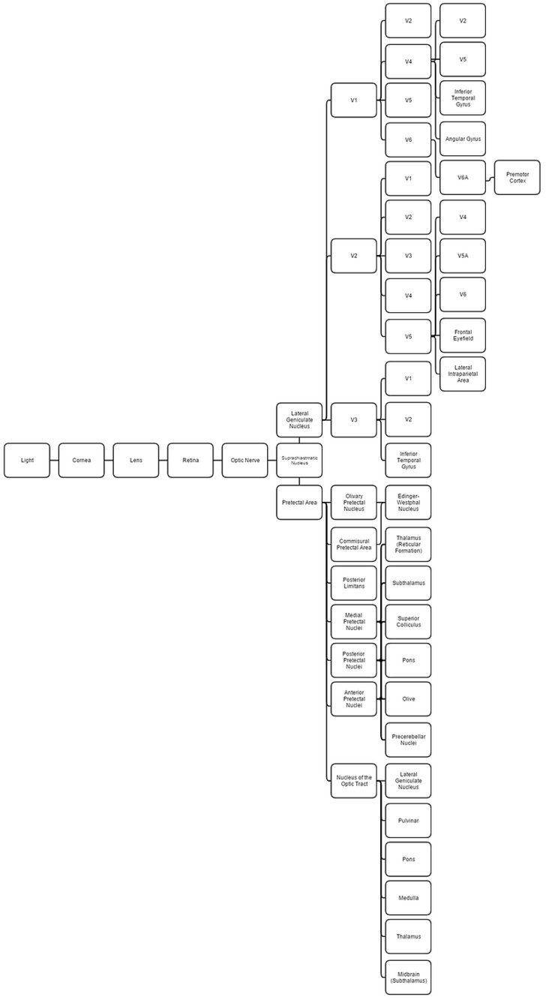

The first part of the human visual system is composed by:

- **Cornea** [[21]](https://en.wikipedia.org/wiki/Cornea) and **Lens** [[22]](https://en.wikipedia.org/wiki/Lens_(anatomy)): reflect light into a small image and shine it on the **retina** [[23]](https://en.wikipedia.org/wiki/Retina).
- **Retina**: translate the image received by cornea and lens into electrical neural impulse to the brain to create **visual perception** [[24]](https://en.wikipedia.org/wiki/Visual_perception).
- **Optic nerve** [[25]](https://en.wikipedia.org/wiki/Optic_nerve): a paired **cranial nerve** [[26]](https://en.wikipedia.org/wiki/Cranial_nerves) that transmit visual information from the retina to the brain.

How is possible to do a MitM on the human visual system? I think that the developers have done a big work because the complexity of this system but i can complain that they've done this two principle jobs:

1. Reading in the optic nerve with radio waves obtaining something similar to the **fiber tapping** [[27]](https://en.wikipedia.org/wiki/Fiber_tapping) passive attack. *A very hard work*, it does mean that they have great developers working for this criminal project.
2. **Reading mind** [[28]](https://www.nationalgeographic.com/science/phenomena/2011/10/13/reading-minds-with-fmri/) by remote **fMRI** [[29]](https://www.nationalgeographic.com/science/phenomena/2011/10/13/reading-minds-with-fmri/) or others **neuroimaging** [[30]](https://en.wikipedia.org/wiki/Neuroimaging) sciences. The use of radio waves distinguish real programming state of art of the heads of this project. Probably one of the best programmers is payed by this terrorist system.  Military related?
3. Writing using **dream** [[31]](https://en.wikipedia.org/wiki/Dream) injections. Image to dream but when you are awake. How it possible? Using **theta waves**, but not only, generated by software defined radio and the correct modulation. Another time a great work but not so difficult to complain. 

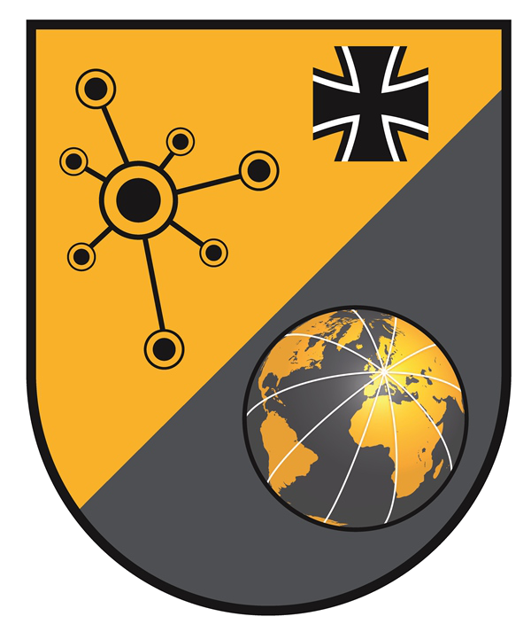

This kind of ultra hard work it' seems to be obviously related to military forces research department. I live in  Europe so the team is Europe related. I was studying computer science at the university of Genoa, Italy. Here I've known the only genius that I've known in my life, i will not write is name here because of possible complaints. What i know that he's working hard on this criminal network and he's working for German military forces (the **Bundeswehr** [[32]](https://en.wikipedia.org/wiki/Bundeswehr)). The Deutschland military cyber forces is named **Cyber and Information Domain Service** [[33]](https://en.wikipedia.org/wiki/Cyber_and_Information_Domain_Service_(Germany)).

Another obvious connection, because of one of the most important speaker in the voice to skull chat that i know from my primary school always in Genoa, is the **Italian Navy** [[34]](https://en.wikipedia.org/wiki/Italian_Navy), i think that speaking about the **CEMM** [[35]](https://it.wikipedia.org/wiki/Corpo_degli_equipaggi_militari_marittimi) the section is obviously the **SSC/TLC/GE** [[36]](http://www.marina.difesa.it/il-tuo-futuro-e-il-mare/carriere/per-grado/sottufficiali/Documents/categ_sottufficiali.pdf). 

### The auditory system  MitM remote device

The human auditory system is composed by the **auditory system** [[38]](https://en.wikipedia.org/wiki/Auditory_system) and the **primary auditory cortex** [[39]](https://en.wikipedia.org/wiki/Auditory_cortex).

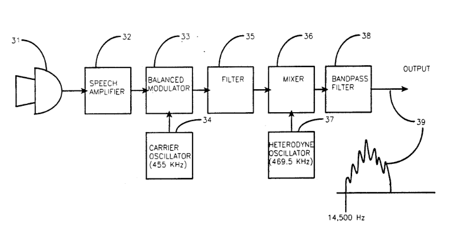

The auditory system is totally bypassed by the voice to skull technology. Voice to skull from the early seventy until now was classified as mental sickness. Voice to skull technology was patented on 27 October 1992 by United States Patent under the official name of **silent subliminal presentation system** [[40]](https://patents.google.com/patent/US5159703A/en). The system generate a single **sideband** [[41]](https://en.wikipedia.org/wiki/Sideband), **suppressed carrier** [[42]](https://en.wikipedia.org/wiki/Double-sideband_suppressed-carrier_transmission), **amplitude modulated (AM)** [[43]](https://en.wikipedia.org/wiki/Amplitude_modulation) signal with a channel width of 14.5 KHz, the frequency is 462.25 KHz. 

In Catalunya, Spain, people that have worked in this patent have shifted the center frequency and found another that work exactly like these. 431.87

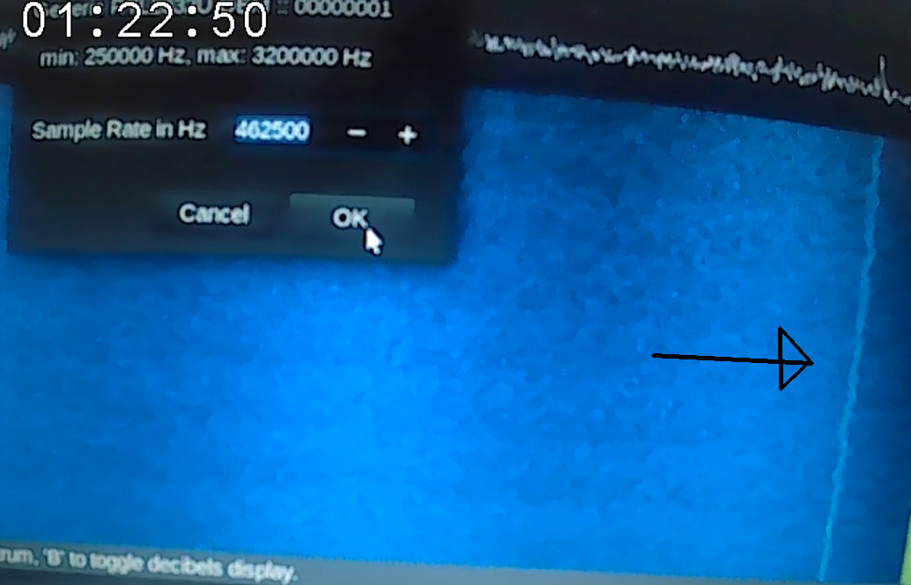

This is the *voice to skull service active in Catalunya*, Spain. As you can see the center frequency move in function of time. Nowadays it's certainly coded with a script in a SDR environment, but it's a technology from like thirty years ago. It is emitted from terrestrial radio equipment. This frequency is classified by **ITU** as **medium frequency** and normally use a **mast radiator** like antenna, with a single radio it can cover hundred of kilometers using **ground waves** and **ionosphere** reflection. 

With this frequency all the B-side, probably all over the world, is administrated. What is the **B-side** [[44]](https://en.wikipedia.org/wiki/B-Sides)? **The dark side of the moon** [[45]](https://en.wikipedia.org/wiki/The_Dark_Side_of_the_Moon)? The two faces of the same medal? It's simple, it is all what is concerned to what ever is connected to the underground world, black market, illegal pornography, deep internet, crypt concurrency, unknown location club, human test, electronic weapons development, society illegal control, audiovisual and so on. All the people working on the shadow economy infrastructures and markets know it but no one speak about in a public network like Internet. 

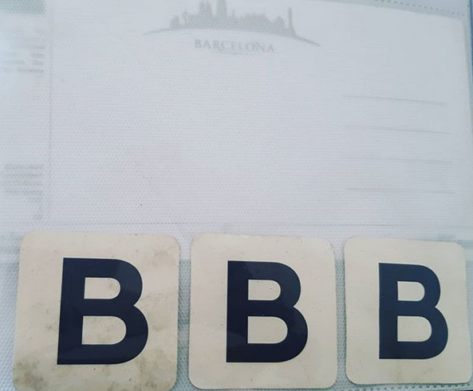

So this network is known by also the governments but *since i was tortured* by probably electronic weapons development and since i'm under continuous control  by third parts i decide to speak about it, doing it in an open source way. 

But what is the MitM remote equipment that could rewrite on fly audio from every sources on our **auditory field** [[46]](http://www.cochlea.org/en/hear/human-auditory-range) ? This is very complex. And is for sure done with a receiver in the same frequency of the **frequency range of human hearing** [[47]](https://hypertextbook.com/facts/2003/ChrisDAmbrose.shtml) and a transmitter that use the same patent, the **US5159703A**.

This supposed system could have this abstracted scheme:

**Receiver** [20Hz to 20Khz] [[48]](https://en.wikipedia.org/wiki/Radio_receiver) --> **Vocoder** [[49]](https://en.wikipedia.org/wiki/Vocoder) (**speech** [[50]](https://en.wikipedia.org/wiki/Speech) to bit) --> **Operating system** [[51]](https://en.wikipedia.org/wiki/Operating_system) --> Vocoder (bit to speech) --> **Transmitter** [462.25 KHz] [[52]](https://en.wikipedia.org/wiki/Transmitter)

What can be archived with this system?

1. Automatic voice recognition.
2. Automatic translation in what ever language; input and output.
3. On the fly voice or sound rewrite.
4. Sound effects and like augmented reality system.

### The nervous system and muscle control

Do you know the project **OpenBCI** [[53]](https://en.wikipedia.org/wiki/OpenBCI)? An **open hardware** [[54]](https://en.wikipedia.org/wiki/Open-source_hardware) project to amplify, read and processing **EEG** [[55]](https://en.wikipedia.org/wiki/Electroencephalography), **EMG** [[56]](https://en.wikipedia.org/wiki/Electromyography) and **EKG** [[57]](https://en.wikipedia.org/wiki/Electrocardiography). 

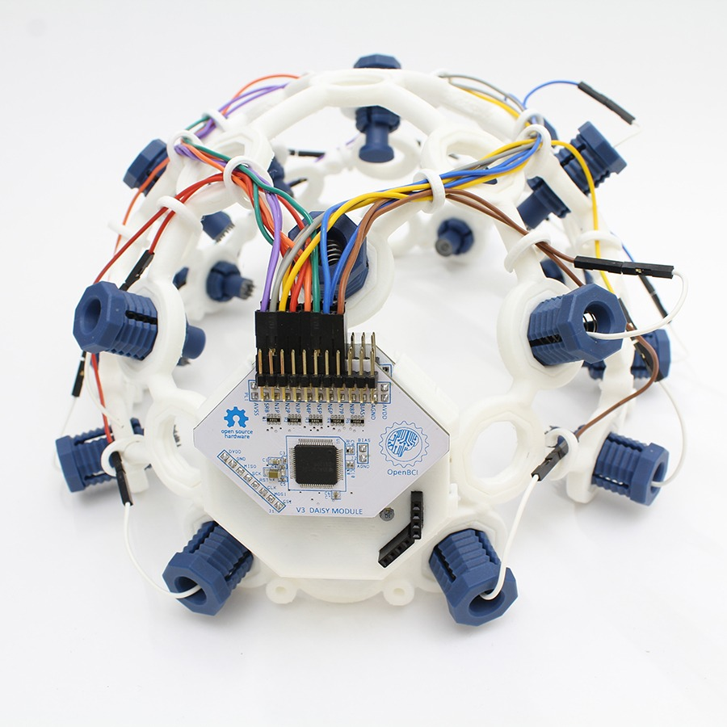

Do you know that Facebook **has adquired** [[58]](https://www.theverge.com/2019/9/23/20881032/facebook-ctrl-labs-acquisition-neural-interface-armband-ar-vr-deal) **CTRL-Labs** [[59]](https://www.ctrl-labs.com/) that produce an **neural control interface NCI** [[60]](https://en.wikipedia.org/wiki/Brain%E2%80%93computer_interface), a wristband to control machine with muscles on a arm?

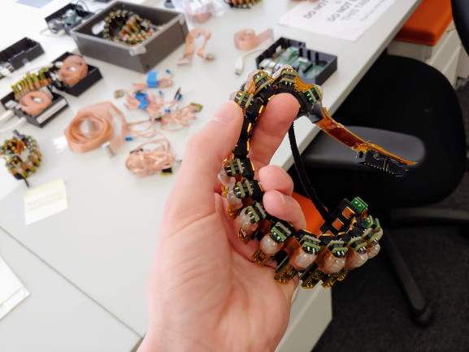

Imagine those devices acting in remote without any physical brain implant or device on the victim or the client of the synthetic telepathy network, this is exactly what is the "Machine". This is an extremely powerful device that used in a bad way could start what it can me named as a pseudo dictatorship. A digital mafia. Owning rapidly black market and clear economy and politics. This is what it is passing just now, nowadays, at this moment in our country, Europe. This is not a joke. This is what we're leaving now and no one speak about it. **Brexit** [[61]](https://en.wikipedia.org/wiki/Brexit)? This is probably what it start it. It's possible that is acronym of "*brain exit*"?

it the person **on this article** [[62]](https://www.guineapigzero.com/i-was-a-brain-slave.html) a schizophrenic? Absolutely not, but he doesn't know why he is a slave. Why does he speaks about UFO and stupidity like this? Because when human kind cannot explain a phenomenon use divinity, like our ancestor do with polytheism and monotheism. The real problem is that our politics, administrations and police doesn't know exactly what it is passing or they are totally corrupted by the Machine. How it is possible? We will see in the next chapter.

### The visible light radio wave monitor television

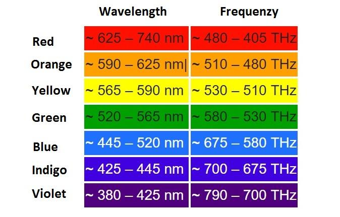

This is the best feature of this network. People that have payed to enter or girls that have passed two years of slavery are in. When you're in you visualize, and only you, a virtual monitor above your head. Something similar to the effect of the physic **Google glass** [[63]](https://en.wikipedia.org/wiki/Google_Glass). Augmented reality without a device, it's real and it's now. It's changing our democracy. Just now, under our eyes.

What you visualize is a big tablet Android equipped above your head. And also a augmented reality vision. How do you control it? With two virtual arms that you control with your brain. All of this it's visible only by the end user, others users in the network could not visualize it. 

### The reproductive system over excitement and control

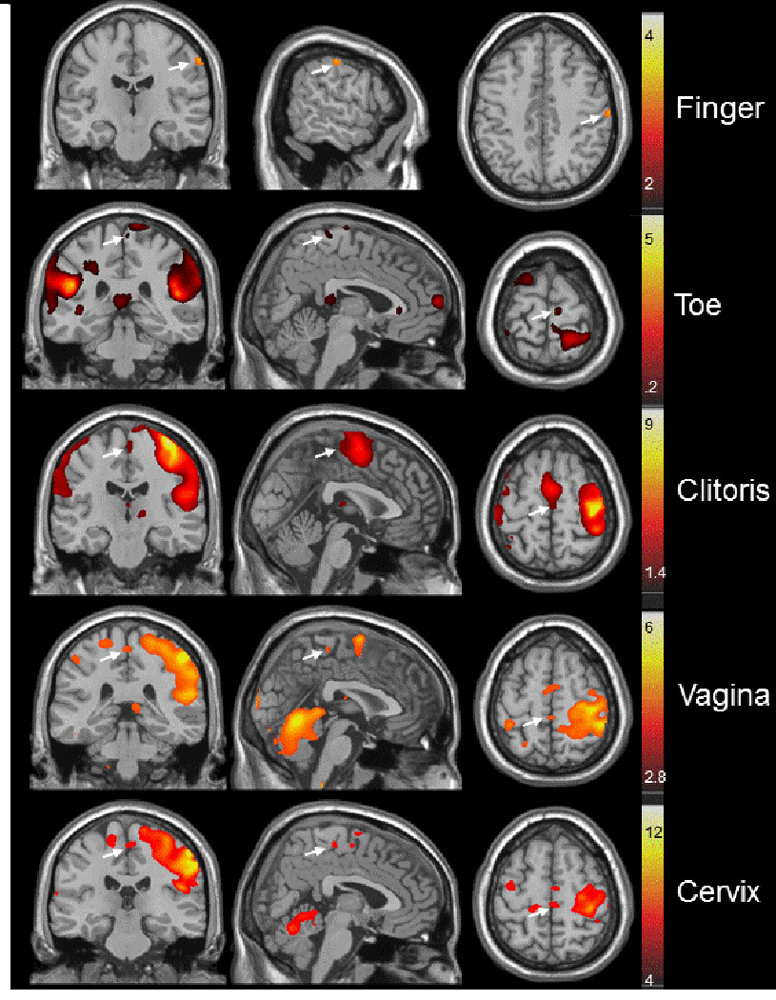

**Human sexual activity** [[63]](https://en.wikipedia.org/wiki/Human_sexual_activity) can be overloaded by the use of the radio and digital Machine from the synthetic telepathy network. This can create induced sex slaves, prostitutes and child violations. How it is possible? 

In the **study before** [[64]](https://www.ncbi.nlm.nih.gov/pmc/articles/PMC3186818/) we can appreciate in the fMRI images in composite the brain zone neuron activated by different parts self masturbation in a woman. 

So like we've seen before with this technology and **electromagnetic waves** [[65]](https://en.wikipedia.org/wiki/Electromagnetic_radiation) it's possible to remotely stimulate neurons like it's done in a physic MRI machine. 

Doing a rapid technical analysis we can consider that radios are working in a magnetic resonance environment use **shortwave** [[66]](https://en.wikipedia.org/wiki/Shortwave_radio) frequencies. Transmitters and receivers are called **radio frequency coils** [[67]](https://en.wikipedia.org/wiki/Radiofrequency_coil) and use **loop antennas** [[68]](https://en.wikipedia.org/wiki/Loop_antenna) or **ferrite loop antennas** [[69]](https://en.wikipedia.org/wiki/Comoros).

### Remote EEG plotting 

Whit this technology it's possible to obtain remote plotting of brain waves to obtain a complete clinical picture of the victim; but not only using this informations is possible to keep under control various state of mind induced by external agents, like provoked situations, or to study effect of drug abuse in a victim. Results can be different between targets. 

Stalkers and human hackers with a large career, criminals, can use those remote informations to trace a possible degrade in the life of the victim using **psychological traumas** [[70]](https://en.wikipedia.org/wiki/Psychological_trauma) and inducted drug abuse to obtain the suicide of the target. Those criminals always play pushing the psychological limit  using provoked anxiety stress and schizophrenias on the victims to obtain extreme data to sell for example to military facilities or to obtain the suicide gaining money using a system of bets that i'll explain later.

Those criminals are the most dangerous ones in the earth. Using this network they can apply this method to a large part of the population changing life of entire families, groups and so on. Can obtain change in political elections. *This is terrorism*.

Another thing about remote EEG it's not only the possibility to read. But this i really don't know. 

I think that is possible using this technology to induce to a victim an attack of **epilepsy** [[71]](https://en.wikipedia.org/wiki/Epilepsy). 

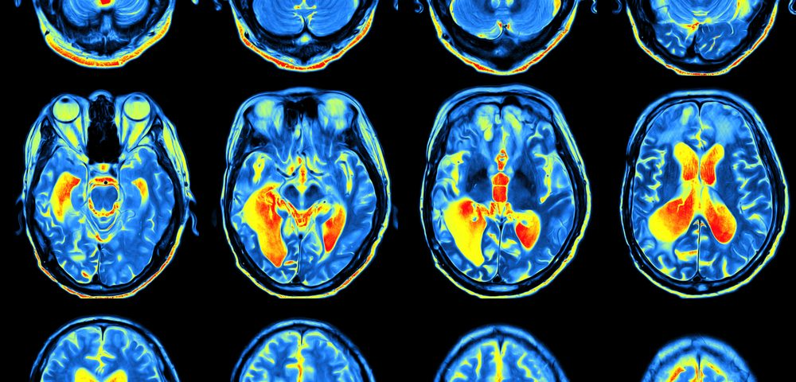

**Epileptic seizures** [[72]](https://en.wikipedia.org/wiki/Epileptic_seizure) are the result of excessive and abnormal neuronal activity in the cortex of the brain. This abnormal neuronal activity can be induced at 3Hz at **extremely low frequency** [[73]](https://en.wikipedia.org/wiki/Extremely_low_frequency).

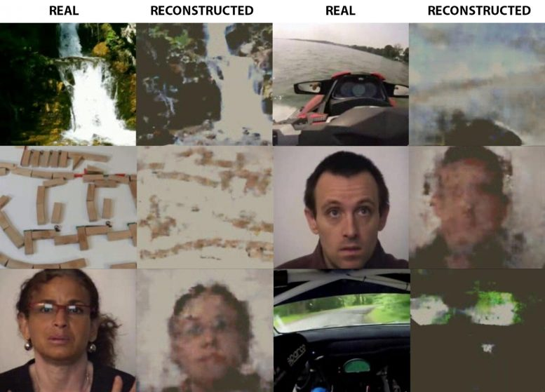

### Death method

Yes, in this network it's possible to induce to death rapidly and slowly to a victim. Rapidly i can describe those methods:

- Prolonged attack of epilepsy.
- **Intracranial aneurysm** [[74]](https://en.wikipedia.org/wiki/Intracranial_aneurysm) inducted by amphetamine or cocaine more pressure in cranial **blood vessels** [[75]](https://en.wikipedia.org/wiki/Blood_vessel), a **vasospasm** [[76]](https://en.wikipedia.org/wiki/Vasospasm).
- **Myocardial infarction** [[77]](https://en.wikipedia.org/wiki/Myocardial_infarction).

But there is also worst method to kill persons using this network. One is very slowly but so effective. Using radio waves pointed exactly always in the same interior organ, like a **lung** [[78]](https://en.wikipedia.org/wiki/Lung), you can create a **pleurisy** [[79]](https://en.wikipedia.org/wiki/Pleurisy). Because pleuritis is an **inflammation** [[80]](https://en.wikipedia.org/wiki/Inflammation) if it is prolonged for years it can degenerate in a **lung cancer** [[81]](https://en.wikipedia.org/wiki/Lung_cancer).  If the victim is a smoker it can be used like an effective manner to kill.

### Electronic harassment

**Electromagnetic torture** [[82]](https://en.wikipedia.org/wiki/Electronic_harassment) are normally classified for the governments as **hallucinations** [[83]](https://en.wikipedia.org/wiki/Hallucination) thats because people cannot explain scientifically the real cause of the voice to skull and other sensations feelings that provoke them. 

This book want to be exactly the necessary proof, the **evidences** [[84]](https://en.wikipedia.org/wiki/Evidence_(law)),  to denounce these criminals who are ruining the lives of millions of people. 

**Electromagnetic pollution** [[85]](https://en.wikipedia.org/wiki/Electromagnetic_radiation_and_health) exist. And mistakenly these issues are classified as such. Electro smog is also dangerous for our health. 

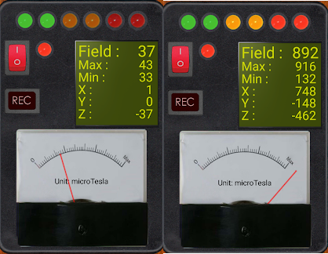

This detections was done in my house on march 2019. Like you can appreciate the normal values  are shown on the left , this is the correct on people that are not target individuals. The right side is a person, like me, subjected to electromagnetic assault. Those are called **EMF measurement** [[86]](https://en.wikipedia.org/wiki/EMF_measurement) can be obtained with physical meters or with applications in mobile that've got a **MEMS magnetic field sensor** [[87]](https://en.wikipedia.org/wiki/MEMS_magnetic_field_sensor). Almost all medium size smart mobile got one nowadays. Here you are some application to size it:

- https://play.google.com/store/apps/details?id=smf.detector
- https://play.google.com/store/apps/details?id=com.mreprogramming.ultimateemfdetector

Those hardware size EMF using the **Tesla unit** [[88]](https://en.wikipedia.org/wiki/Tesla_(unit)). 

### Unreal engine full immersion. 

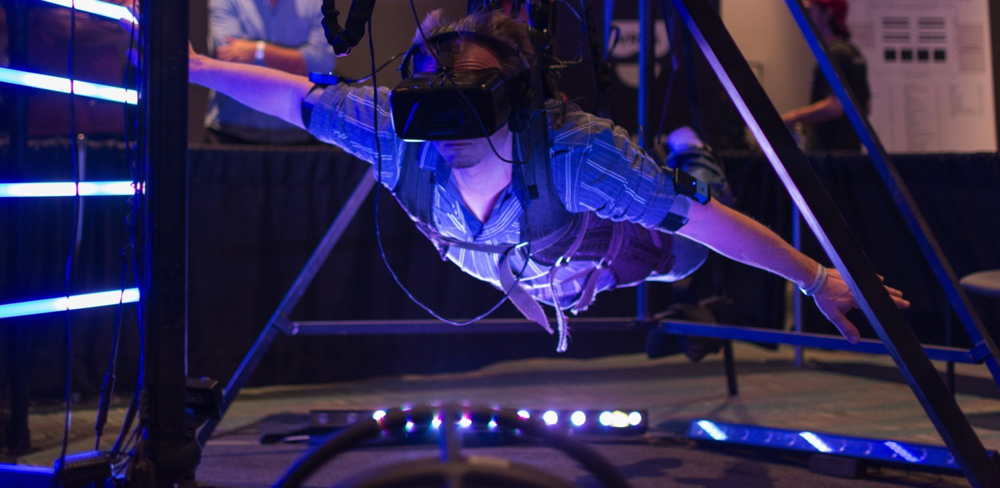

Look above. This man is experiencing what we can define as virtual and augmented reality full immersion. Ok, but this mas has go to this site and want to test it. Correct. Imagine if someone put you in this world without authorization and whenever he wants. You could die if your driving for example. This feature is the most terrible one of this network. Thousand of woman are suffering violence with this terrible system. But also minors. In this network there is a lot of pederast that buy services from the owners.

**Unreal Engine 4** [[90]](https://en.wikipedia.org/wiki/Unreal_Engine) permit the construction of virtual world that absolutely seems to be real like you can see in the image above. It runs without any problems in a **Playstation 4** [[91]](https://en.wikipedia.org/wiki/PlayStation_4) hardware, something that cost for below of 300 **Dollar** [[92]](https://en.wikipedia.org/wiki/Dollar). 

Imagine this graphic engine streamed on your visual cortex and your nervous system binded to the virtual world. Imagine to be chained to a chair and a lot of people, humans or not, is doing sexual violence to you. Imagine that they kill you and the sensations, the pain, is the almost the same. Image it, but it's true and it's now and it's changing the life of many womans and mans in Europe. 

Imagine a person that couldn't explain this using science. Do you remember what happen when humankind cannot explain processes with science? *It's the start of a new sept or religion*. Do you try to image a person that want to denounce it and try to explain to police that she seen her in a BDSM torture chamber every night? What happened to the girl? The police send her immediately to the **mental asylum** [[93]](https://en.wikipedia.org/wiki/Psychiatric_hospital). 

Can you image that your child start "dreaming" and in reality a porn is streamed in their visual cortex a pedophile start abuse them? This is what is pass in this hell network.

Girls start to think about **UFO** [[94]](https://en.wikipedia.org/wiki/Unidentified_flying_object). Could you image if this continuous sexual violence that don't keep signs of violence in the body of the woman is accompanied by stalker brain washing job and the use of psychotic drug like amphetamine? 

What does it pass to the woman? Nothing good. 

I want to share in public this document because Europe has changed. This is real. And my ex girlfriend is a victim. Please help, *spread the world*! 

But what is the real purposes of stream violence sex ambients in the visual cortex of a victim? Always the same. Change her life. She cannot work because if she is serving in a restaurant for example, and they start to do data injection with something similar and she doesn't visualize the real world, because they can do a complete rewrite, she will fall to the ground. And if they masturbate her with the reproductive system over excitement and control she will got an orgasm while she is working. She will lost the job and probably she will be raped also by her employer or by some client. And if those stalkers that has got access to the network will send at her workplace some payed actor, she will be raped yes or yes. This is what is passing. When she lost the job she will search for another, if she cannot explain with science what is passing to her she will lost the other. And so? She will fall in prostitution. This is what they've done to my ex girlfriend.

What can pass also to a woman if they put her brain into full immersion? 

If she is with those stalkers, that are also **rapist** [[95]](https://en.wikipedia.org/wiki/Rape), they can tie her. And then they can violate her. As many as they want. This is why i'm searching to explain to the outside world what is this network. 

### Body full copy and body instances 

With **3D scanning** [[96]](https://en.wikipedia.org/wiki/3D_scanning) methods it's possible to achieve the full body scan of a human in ten minutes. The data obtained by the scan are usable in augmented reality worlds. 

With the radio waves Machine is possible to use those bodies connected to a real human with system nervous interaction. With this I can say that body of a victim could be utilized by another person. Also a body of a child. To aliment pederast. And this is what is passing with the administration of the "Francese".

The body of my ex girlfriend was scanned and used in all the network of remote neural monitoring. 

Bodies are like **instances** [[97]](https://en.wikipedia.org/wiki/Instance_(computer_science)) of a class of an **object oriented programming** [[98]](https://en.wikipedia.org/wiki/Object-oriented_programming) language. By the way the shape, the figure, is the same of the victim. What does it mean? That is sex violence. 

In the data center of the synthetic telepathy network many times the body isn't government by the interaction with a real human. Many times, in routine movements like suck a dick for example, the body is moved by a program. And in many conversation in the subliminal message system the body is connected to a chat bot governed by artificial intelligence. 

Those chat bot has got also the same voice and speech of the person that is cloned. Using this method targets individuals think to have sex with her lost woman, normally also victim of sexual harassment, or to speak with friends of them. Usually doing menaces. But they are not. Those are chat bot with advanced artificial intelligence. And why physically also those person don't contact with target individuals? Because of corruption, that is not because civilian that receive payments in crypt currencies are doing a crime. But the real crime is *participation in the contest of murdered*. Those chat bot can also mix different tone of people obtain a specie of matryosha. This is another hoax of the "Illuminati" pseudo dictatorship. In the Machine clients that are able to operate got an analog filter like the ones that use techno music producers to obtain effects and sound shifting in amplitude and modulation. Another behavior of those bots is that they wake up with special words that you say, automatically and in round robin rotation choosing different speech vocoders.

> *By the way, her body is raped millions of times. By the way the body is the most important secret of  a woman. And the woman that I love has lost her body in this hell. And we need justice.*

# External links

1. https://en.wikipedia.org/wiki/M_(James_Bond)
2. https://en.wikipedia.org/wiki/Open-source_model
3. [https://en.wikipedia.org/wiki/Bj%C3%B6rk](https://en.wikipedia.org/wiki/Björk)
4. https://en.wikipedia.org/wiki/Analog_television
5. https://en.wikipedia.org/wiki/Cathode-ray_tube
6. https://en.wikipedia.org/wiki/Unreal_Engine
7. https://www.unrealengine.com/en-US/
8. https://en.wikipedia.org/wiki/Immersion_(virtual_reality)
9. https://en.wikipedia.org/wiki/3D_audio_effect
10. https://en.wikipedia.org/wiki/Nervous_system
11. https://en.wikipedia.org/wiki/Muscle
12. https://en.wikipedia.org/wiki/Acupuncture
13. https://en.wikipedia.org/wiki/Electrode
14. https://en.wikipedia.org/wiki/Pain
15. https://en.wikipedia.org/wiki/Nerve
16. https://en.wikipedia.org/wiki/Brain
17. https://en.wikipedia.org/wiki/Dyson_sphere
18. https://en.wikipedia.org/wiki/Tty_(unix)
19. https://en.wikipedia.org/wiki/Human_multitasking
20. https://en.wikipedia.org/wiki/European_Union
21. https://en.wikipedia.org/wiki/Cornea
22. https://en.wikipedia.org/wiki/Lens_(anatomy)
23. https://en.wikipedia.org/wiki/Retina
24. https://en.wikipedia.org/wiki/Visual_perception
25. https://en.wikipedia.org/wiki/Optic_nerve
26. https://en.wikipedia.org/wiki/Cranial_nerves
27. https://en.wikipedia.org/wiki/Fiber_tapping
28. https://www.nationalgeographic.com/science/phenomena/2011/10/13/reading-minds-with-fmri/
29. https://en.wikipedia.org/wiki/Functional_magnetic_resonance_imaging
30. https://en.wikipedia.org/wiki/Neuroimaging
31. https://en.wikipedia.org/wiki/Dream
32. https://en.wikipedia.org/wiki/Bundeswehr
33. https://en.wikipedia.org/wiki/Cyber_and_Information_Domain_Service_(Germany)
34. https://en.wikipedia.org/wiki/Italian_Navy
35. https://it.wikipedia.org/wiki/Corpo_degli_equipaggi_militari_marittimi
36. http://www.marina.difesa.it/il-tuo-futuro-e-il-mare/carriere/per-grado/sottufficiali/Documents/categ_sottufficiali.pdf
37. https://en.wikipedia.org/wiki/Luigi_Durand_de_la_Penne
38. https://en.wikipedia.org/wiki/Auditory_system
39. https://en.wikipedia.org/wiki/Auditory_cortex
40. https://patents.google.com/patent/US5159703A/en
41. https://en.wikipedia.org/wiki/Sideband
42. https://en.wikipedia.org/wiki/Double-sideband_suppressed-carrier_transmission
43. https://en.wikipedia.org/wiki/Amplitude_modulation
44. https://en.wikipedia.org/wiki/B-Side
45. https://en.wikipedia.org/wiki/The_Dark_Side_of_the_Moon
46. http://www.cochlea.org/en/hear/human-auditory-range
47. https://hypertextbook.com/facts/2003/ChrisDAmbrose.shtml
48. https://en.wikipedia.org/wiki/Radio_receiver
49. https://en.wikipedia.org/wiki/Vocoder
50. https://en.wikipedia.org/wiki/Speech
51. https://en.wikipedia.org/wiki/Operating_system
52. https://en.wikipedia.org/wiki/Transmitter
53. https://en.wikipedia.org/wiki/OpenBCI
54. https://en.wikipedia.org/wiki/Open-source_hardware
55. https://en.wikipedia.org/wiki/Electroencephalography
56. https://en.wikipedia.org/wiki/Electromyography
57. https://en.wikipedia.org/wiki/Electrocardiography
58. https://www.theverge.com/2019/9/23/20881032/facebook-ctrl-labs-acquisition-neural-interface-armband-ar-vr-deal
59. https://www.ctrl-labs.com/
60. https://en.wikipedia.org/wiki/Brain%E2%80%93computer_interface
61. https://en.wikipedia.org/wiki/Brexit
62. https://www.guineapigzero.com/i-was-a-brain-slave.html
63. https://en.wikipedia.org/wiki/Google_Glass
64. https://en.wikipedia.org/wiki/Human_sexual_activity
65. https://www.ncbi.nlm.nih.gov/pmc/articles/PMC3186818/
66. https://en.wikipedia.org/wiki/Electromagnetic_radiation
67. https://en.wikipedia.org/wiki/Shortwave_radio
68. https://en.wikipedia.org/wiki/Radiofrequency_coil
69. https://en.wikipedia.org/wiki/Loop_antenna
70. https://en.wikipedia.org/wiki/Ferrite_core#Ferrite_rod_aerial
71. https://en.wikipedia.org/wiki/Psychological_trauma
72. https://en.wikipedia.org/wiki/Epilepsy
73. https://en.wikipedia.org/wiki/Epileptic_seizure
74. https://en.wikipedia.org/wiki/Extremely_low_frequency
75. https://en.wikipedia.org/wiki/Intracranial_aneurysm
76. https://en.wikipedia.org/wiki/Blood_vessel
77. https://en.wikipedia.org/wiki/Vasospasm
78. https://en.wikipedia.org/wiki/Myocardial_infarction
79. https://en.wikipedia.org/wiki/Lung
80. https://en.wikipedia.org/wiki/Pleurisy
81. https://en.wikipedia.org/wiki/Inflammation
82. https://en.wikipedia.org/wiki/Lung_cancer
83. https://en.wikipedia.org/wiki/Electronic_harassment
84. https://en.wikipedia.org/wiki/Hallucination
85. https://en.wikipedia.org/wiki/Evidence_(law)
86. https://en.wikipedia.org/wiki/Electromagnetic_radiation_and_health
87. https://en.wikipedia.org/wiki/EMF_measurement
88. https://en.wikipedia.org/wiki/MEMS_magnetic_field_sensor
89. https://en.wikipedia.org/wiki/Tesla_(unit)
90. https://en.wikipedia.org/wiki/Unreal_Engine
91. https://en.wikipedia.org/wiki/PlayStation_4
92. https://en.wikipedia.org/wiki/Dollar
93. https://en.wikipedia.org/wiki/Psychiatric_hospital
94. https://en.wikipedia.org/wiki/Unidentified_flying_object
95. https://en.wikipedia.org/wiki/Rape
96. https://en.wikipedia.org/wiki/3D_scanning
97. https://en.wikipedia.org/wiki/Instance_(computer_science)
98. https://en.wikipedia.org/wiki/Object-oriented_programming

