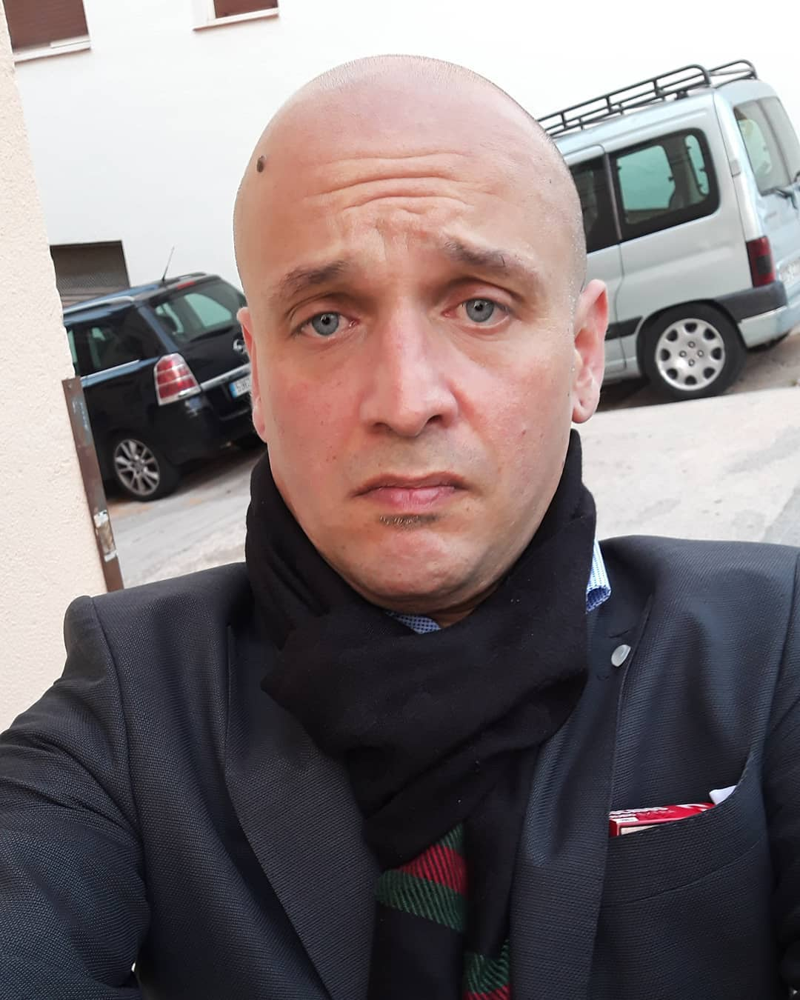

# DNA

In the last fifteen years in Internet there is a few web applications that are used worldwide to do research about **DNA** [[1]](https://en.wikipedia.org/wiki/DNA). This acid molecule carry **genetic** [[2]](https://en.wikipedia.org/wiki/Genetics) instructions that could be used by humankind to study **heredity** [[3]](https://en.wikipedia.org/wiki/Heredity), that in humans is passed generation between generation with **sexual reproduction** [[4]](https://en.wikipedia.org/wiki/Sexual_reproduction). 

The study of heredity or bloodline could help a citizen, like me, to understand if he pertains to a noble family o to various. That is the reason why I start studying it. To understand who I am and why in the remote neural control facility I've been persecuted from November 2017 and a lot of semi fatal randomness more that I've lived in my incredible life. I start to studying it also to help the woman that I'm love to, Saray. Another victim of this facility, this time probably for her surnames. In my case the **surnames** [[5]](https://en.wikipedia.org/wiki/Surname) doesn't help but I've learned with my bloodline and some somatic characteristic that for sure I pertain to a very important noble **lineage** [[6]](https://en.wikipedia.org/wiki/Lineage_(genetic)). And this why they have electronic torture me.

Now that I'm fighting for my rights in the neural network I've learned a think, a think that I've got to share with you, my readers, to understand how to choose the right way in a common situation. Never fall in the stalking washing machine:

*never pass to be an abused to be an abuser*. 

This is so important and remember that nobles use the art of deception something that derived from the Catholic allegoric figure of the **forbidden fruit** [[7]](https://en.wikipedia.org/wiki/Forbidden_fruit). Church is totally implied in the gang stalking business. The technological B-side. The digital mafia. Almost all is connected with bloodlines. 

 

# External links

1. https://en.wikipedia.org/wiki/DNA
2. https://en.wikipedia.org/wiki/Genetics
3. https://en.wikipedia.org/wiki/Heredity
4. https://en.wikipedia.org/wiki/Sexual_reproduction
5. https://en.wikipedia.org/wiki/Surname
6. https://en.wikipedia.org/wiki/Lineage_(genetic)
7. https://en.wikipedia.org/wiki/Forbidden_fruit