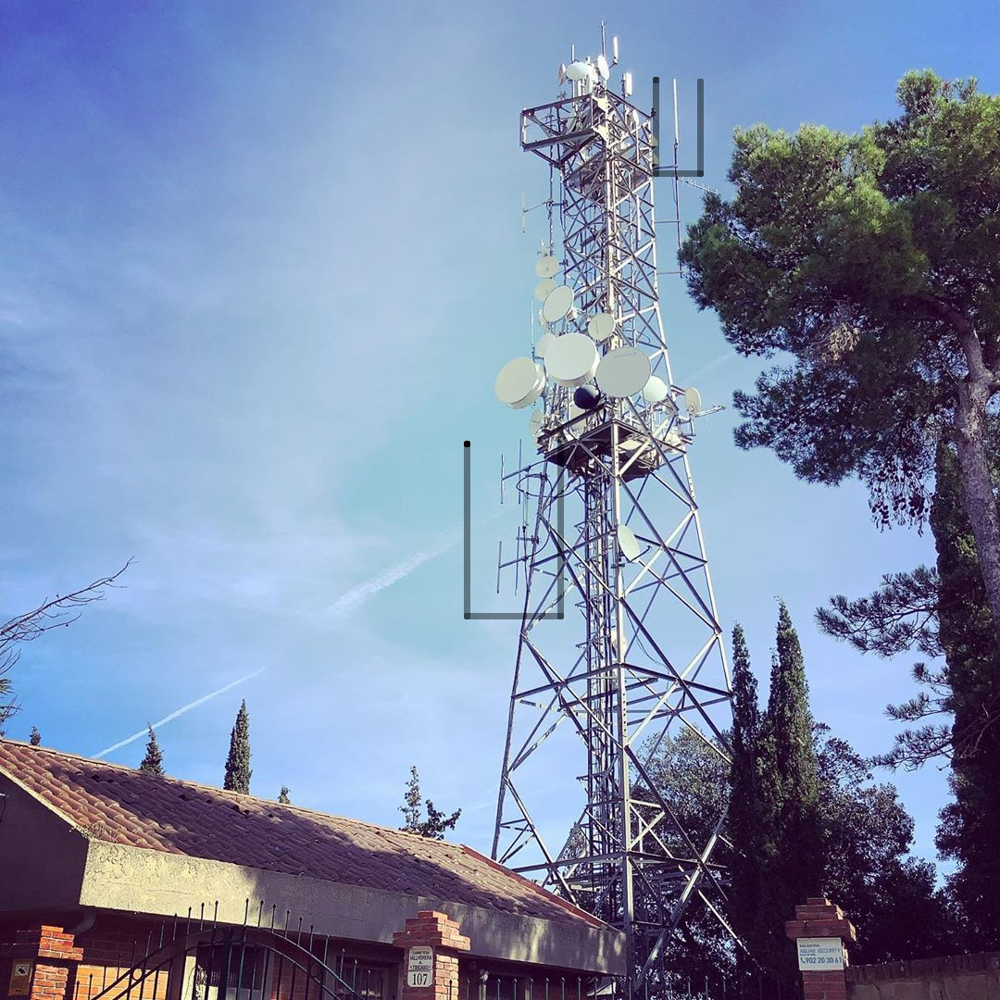
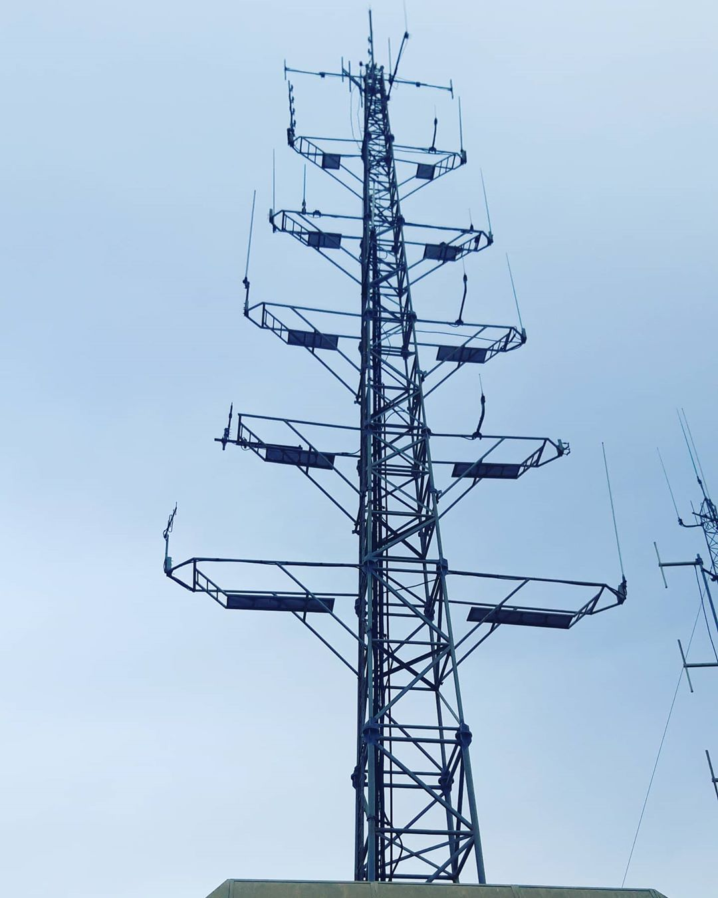

# Carcelona

Time has passed from when the first **monopoly** [[1]](https://en.wikipedia.org/wiki/Monopoly_(game)) **board game** [[2]](https://en.wikipedia.org/wiki/Board_game) was published. The principle difference between **Carcelona** [[3]](https://www.youtube.com/watch?v=Cqfx5GPecAE), the augmented reality environment directly injected to our visual and auditive cortex in Barcelona, and these game is that here there are not any manual and targets individuals reduced to small narcos or prostitutes forged by the remote neural monitoring network have not buy or better saying contracted any service. We're forced to join in. We're forced to be a bitch or a narcos by slavery. Electronic harassment slavery.  

*And institution know it, because in these hell there is a principle think: corruption.*

What is Carcelona?

It's a mixed reality environment where people that pay for this service play as in the board game. Where who doesn't pay is a target individual slaved in a parimutuel betting system and inducted to suicide, like me. 

Who are target individuals in Carcelona?

I can speak about four categories:

- Beggars: submitted to electronic harassment tortures because of development of technology commissioned by military facilities, great tech giants and the same remote neural monitoring facility.
- Entrepreneurs: submitted to electronic harassment tortures because of fraud where they loose their facility. *Like me*. Inducted to suicide to cover up the crime.
- Hackers: slaved by the Carcelona master, the butcher, starved to to get a job for free practically in Carcelona itself. Work that includes going from tortured to torturer.
- Low class Catalans: forced to make a double life they normally work in the small restaurant business, in reality in the virtual environment they are forced to sell drugs or prostitute themselves in transposition. *Like my ex girlfriend*. In this situation over the years the master takes care of teaching them the basics of human hacking to ruin people and move forward with the betting chains. One of the main sources of income of Carcelona and a series of shareholders of the Catalan bourgeoisie or nobles.

Who play in Carcelona?

In Carcelona play high class Catalans, Chinese, Russian, Pakistan and Italians. 

What is the game?

Like in the board game there is houses. 

What kind of houses?

Whores, drug sell house, B&B rent, restaurants, discotheques, sex shops, fast food, sales squares, private club, etcetera etcetera.

The most incredible think is that in this remote game play people that are not criminals because is like a video game a sort of **Grand Theft Auto** [[4]](https://en.wikipedia.org/wiki/Grand_Theft_Auto). People play to be a criminal, but yes they are and they must be tried in a court for drug sales and exploitation of prostitution as a minimum.

Barcelona is dead, it is like a circus, it has been sold in board game these two figures, the butcher and the purple little bitch. They are destroying Europe.

How they gain money?

Those drug and prostitution facilities are divided in actions like an anonymous society. They gain a percent in crypt concurrency in the monthly revenue.

Why I speak about this?

Because they have systematically destroy my life, they stole my job and used my infrastructure to open this service in Barcelona. They made the woman I love prostitute and destroyed the city. Everyone must be sent to life imprisonment.

### The technological infrastructure

This is a WISP node that fusion the remote neural monitoring access radios, on the left, and the **Ubiquiti** [[5]](https://en.wikipedia.org/wiki/Ubiquiti_Networks) network IP infrastructure. 

Image was taken at 41º 29’ 29.7” N, 2º 15’ 9.1” E **geographical coordinates** [[6]](https://en.wikipedia.org/wiki/Geographic_coordinate_system) on 9 of December of 2019 at 2:55 PM.

The WISP was of my property until 2016, then with a fraud I loose it and they start to induct to suicide me. The name is MESWIFI and now has got an AS number that is **AS205645** [[7]](https://bgp.he.net/AS205645).

The top antenna is a point to point radio wave in proprietary protocol, called AirFiber. **Gigabit wireless** [[8]](https://en.wikipedia.org/wiki/Gigabit_Wireless). This antenna focus to a tower in **Tibidabo** [[9]](https://en.wikipedia.org/wiki/Tibidabo) over Barcelona. Next another access point to the "Illuminati" facility focused over the Catalan capital reducing to slavery a lot of citizens. 

This image is taken at 41º 25’ 10.57” N, 2º 09’ 48.39” E geographical coordinates that can be retrieve on **Google Street View** [[10]](https://en.wikipedia.org/wiki/Google_Street_View) aged at the time of writing. As you can appreciate the technology is the same and, yes, is the infrastructure of the "game" "Illuminati" that in reality it's a fraud but it is changing our Europe being a pseudo digital dictatorship.

This image is taken at 41º 25’ 23.42” N, 2º 07’ 9.42” E geographical coordinates that can be retrieve on **Instagram** [[11]](https://en.wikipedia.org/wiki/Instagram) on the social network profile of my old wireless Internet service provider dated on 27 of November 2019 stand out in gray you can appreciate part of the same installation. But there is no magnetic loop antenna. So, no extreme low frequencies, no brain network.

This image is taken at 41º 25’ 9.56” N, 2º 09’ 41.88” geographical coordinates. Is the tower and is dominating the city of Barcelona. The place is an hill in the middle of the city that is full of ELF and SLF transmitters. The name is **Turó de la Rovira** [[12]](https://en.wikipedia.org/wiki/Tur%C3%B3_de_la_Rovira) and is the principle tower of emission.  The "Illuminati" game is served by the black antenna, in this photo is at the second floor on the left. Other equal antennas are underlined. 

This site has got a lot of others tower and all are operating in the lowest part of the radio spectrum. We will speak more about this site in the fourth chapter. 

###  External links

1. https://en.wikipedia.org/wiki/Monopoly_(game)
2. https://en.wikipedia.org/wiki/Board_game
3. https://www.youtube.com/watch?v=Cqfx5GPecAE
4. https://en.wikipedia.org/wiki/Grand_Theft_Auto
5. https://en.wikipedia.org/wiki/Ubiquiti_Networks
6. https://en.wikipedia.org/wiki/Geographic_coordinate_system
7. https://bgp.he.net/AS205645
8. https://en.wikipedia.org/wiki/Gigabit_Wireless
9. https://en.wikipedia.org/wiki/Tibidabo
10. https://en.wikipedia.org/wiki/Google_Street_View
11. https://en.wikipedia.org/wiki/Instagram
12. [https://en.wikipedia.org/wiki/Tur%C3%B3_de_la_Rovira](https://en.wikipedia.org/wiki/Turó_de_la_Rovira)

