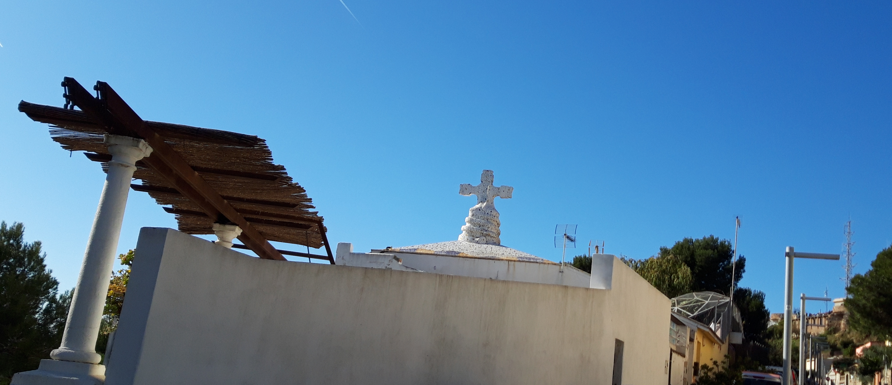
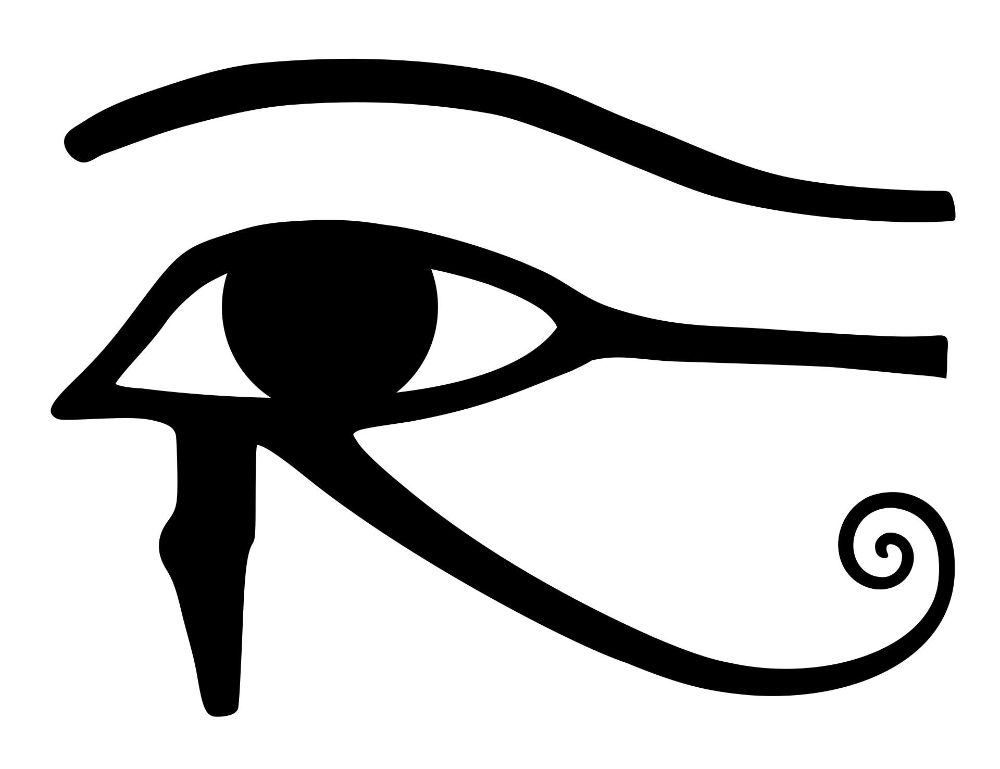

# The radio waves ship

In Barcelona on the summit of a hill that dominates all the Catalan capital there is what in the underground city's **slang** [[1]](https://en.wikipedia.org/wiki/Slang) is known as "la nau", "la nave", "the ship".  A white small house similar to the colors that we found in **Athens** [[2]](https://en.wikipedia.org/wiki/Athens) on whose roof it dominates a **Coptic cross** [[3]](https://en.wikipedia.org/wiki/Coptic_cross).  On the right side you can appreciate the main mast of the allegorical ship, a telecommunication tower which exactly resembles the mast of a **cruise ship** [[4]](https://en.wikipedia.org/wiki/Cruise_ship) that in fact *is* a telecommunication tower.

A Coptic cross is associated with Coptic Christians or better **Copts** [[5]](https://en.wikipedia.org/wiki/Copts). This **ethnoreligious group** [[6]](https://en.wikipedia.org/wiki/Ethnoreligious_group) that speak historically the **Coptic language** [[7]](https://en.wikipedia.org/wiki/Coptic_language) the latest stage of the **Egyptian language** [[8]](https://en.wikipedia.org/wiki/Egyptian_language).

In the wikipedia article about the Coptic language on the right you can appreciate this symbol, that in the ancient Egypt was interpreted as the **eye of Horus** [[9]](https://en.wikipedia.org/wiki/Eye_of_Horus). In the "Illuminati" fraud, that in reality is a digital pseudo dictatorship that is destroying our democracy, this symbol is often use as what is called the **third eye** [[10]](https://en.wikipedia.org/wiki/Third_eye), that has got mystical and esoteric concept to deflect the attention of an investigator and to subdue weak minds in order to make them become slaves as sexual as being **drug dealer** [[11]](https://en.wikipedia.org/wiki/Drug_Dealer).  This is fraud take it root on Internet from the late eighties and has Genoese families as theorists. This fraud is a paramilitary group that has got hackers as soldiers, but not only.  Remember that **Illuminati** [[12]](https://en.wikipedia.org/wiki/Illuminati) was a **secret society** [[13]](https://en.wikipedia.org/wiki/Secret_society), and those are the "**new world order**" [[14]](https://en.wikipedia.org/wiki/New_World_Order_(conspiracy_theory)), that is only an enormous fraud that have killed indirectly with accidents and suicides a lot of people.

This phantom third eye is nothing more than technology. Is the remote neural monitoring network. And the hill in the middle of Barcelona is the telecommunication center of this facility but here people doesn't work physically all is done in remote with IoT devices acting as bridges. This telecommunication center, "the ship", is known also as the "*cathedral of techno*", but not the music, the technological department of those criminals. 

However techno music is very present, the first "Illuminati" games based on the fracture of a stable couple and always based upon remote parimutuel betting system and using radio waves as technology they can be located in the underground rooms of Italian progressive techno. Why is very present? It's simple in discotheques there is a lot of young people dancing and they can be considered places where special people are lured, usually girls, using drugs and this technology they can be slaved and evolved in sexual harassment.  

###  External links

1. https://en.wikipedia.org/wiki/Slang
2. https://en.wikipedia.org/wiki/Athens
3. https://en.wikipedia.org/wiki/Coptic_cross
4. https://en.wikipedia.org/wiki/Cruise_ship
5. https://en.wikipedia.org/wiki/Copts
6. https://en.wikipedia.org/wiki/Ethnoreligious_group
7. https://en.wikipedia.org/wiki/Coptic_language
8. https://en.wikipedia.org/wiki/Egyptian_language
9. https://en.wikipedia.org/wiki/Eye_of_Horus
10. https://en.wikipedia.org/wiki/Third_eye
11. https://en.wikipedia.org/wiki/Drug_Dealer
12. https://en.wikipedia.org/wiki/Illuminati
13. https://en.wikipedia.org/wiki/Secret_society
14. https://en.wikipedia.org/wiki/New_World_Order_(conspiracy_theory)