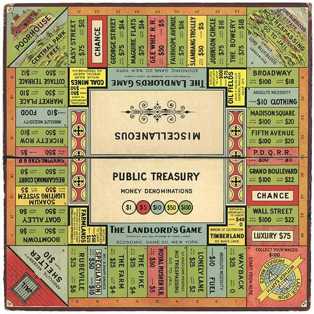

# Carcelona

Time has passed from when the first **monopoly** [[1]](https://en.wikipedia.org/wiki/Monopoly_(game)) **board game** [[2]](https://en.wikipedia.org/wiki/Board_game) was published. The principle difference between **Carcelona** [[3]](https://www.youtube.com/watch?v=Cqfx5GPecAE), the augmented reality environment directly injected to our visual and auditive cortex in Barcelona, and these game is that here there are not any manual and targets individuals reduced to small narcos or prostitutes forged by the remote neural monitoring network have not buy or better saying contracted any service. We're forced to join in. We're forced to be a bitch or a narcos by slavery. Electronic harassment slavery.  

*And institution know it, because in these hell there is a principle think: corruption.*

What is Carcelona?

It's a mixed reality environment where people that pay for this service play as in the board game. Where who doesn't pay is a target individual slaved in a parimutuel betting system and inducted to suicide, like me. 

Who are target individuals in Carcelona?

I can speak about four categories:

- Beggars: submitted to electronic harassment tortures because of development of technology commissioned by military facilities, great tech giants and the same remote neural monitoring facility.
- Entrepreneurs: submitted to electronic harassment tortures because of fraud where they loose their facility. *Like me*. Inducted to suicide to cover up the crime.
- Hackers: slaved by the Carcelona master, the butcher, starved to to get a job for free practically in Carcelona itself. Work that includes going from tortured to torturer.
- Low class Catalans: forced to make a double life they normally work in the small restaurant business, in reality in the virtual environment they are forced to sell drugs or prostitute themselves in transposition. *Like my ex girlfriend*. In this situation over the years the master takes care of teaching them the basics of human hacking to ruin people and move forward with the betting chains. One of the main sources of income of Carcelona and a series of shareholders of the Catalan bourgeoisie or nobles.

# External links

1. https://en.wikipedia.org/wiki/Monopoly_(game)
2. https://en.wikipedia.org/wiki/Board_game
3. https://www.youtube.com/watch?v=Cqfx5GPecAE