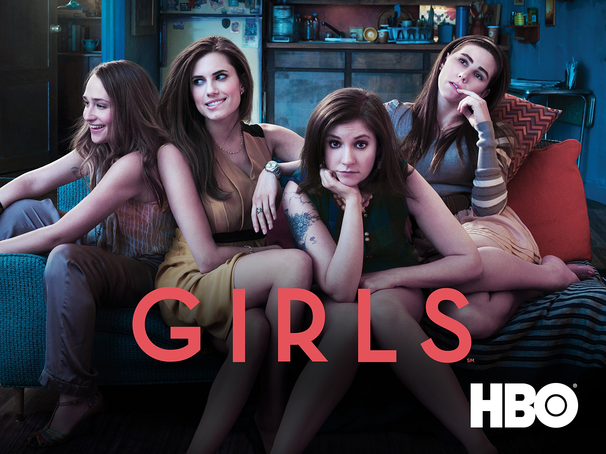
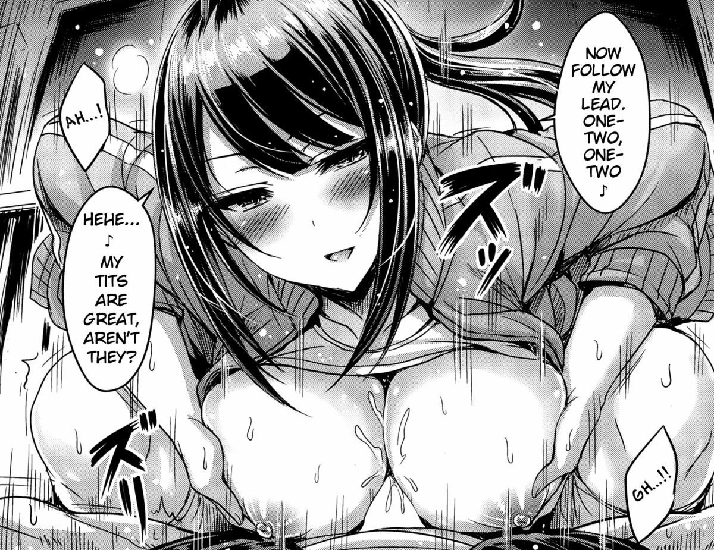

# The Catalan head, the butcher

In the Catalan Guifi network there is a **obfs4 bridge** [[11]](https://2019.www.torproject.org/docs/bridges.html.en) that permit access to the B-side network, subliminal voice and visual cortex injection like the synthetic telepathy network more a very special magnetic device who inventor call "steam engine". Ops perhaps we speak about the **Steam community** [[12]](https://store.steampowered.com/) in nowadays slang. It's something special very difficult to understand how it works. This person, that is also a very special man very clever and interesting, is also a big network hacker, like me, Unix lover, like me, but also a very dangerous stalker. But he normally keeps care that victims doesn't commit suicide. Why? He's so clever and keep in equilibrium the limit between a crime for at least twenty years in prison and the Stockholm syndrome. He has got in his hand the mind of various precious womans, obtained with the techniques that i've explained before, that pays in crypt concurrency and in betting system. They study new victims. Like me. I'm victim of this big stalker, but i can consider that I'm also perhaps in part passing the Stockholm syndrome because I don't denunciate him and I'm preferring the public way to help those girls, who I know personally more than five and I've got two large relations. He is extremely clever and with him I'm supposing to do a chess play. He has a criminal background. He has analyzed a lot of brains. He has a very deep understanding in human comportments under extreme stress. I'm totally sure that he has an enormous handmade diagram in parentheses, where he decides with almost weekly anticipation where to leave the victim with his steam engine false theater. All is false. All. One of the worst sentiment that grow up in your mind is impotence. In my case was the impotence the keep in safe the life of a woman. This is my week point in his manner to see life. He plays with brains. People that protect him do thousand millions euro in bet system. I don't think that he loves to obtain great amount of money. He loves to understand humans, because he thinks to be superior. And yes he is, but not of alls. He is an **anarchic** [[13]](https://en.wikipedia.org/wiki/Anarchy), a **punk** [[14]](https://en.wikipedia.org/wiki/Punk_subculture) and an **heavy metal** [[15]](https://en.wikipedia.org/wiki/Heavy_metal_music) follower. But i know him in a techno music little reserved club. But in reality he is so complex that i think that he can dress whatever gown.

**She calls him daddy, but her dad has died.** And i love her. It seems to me a sexual rape scene, but i really don't know. She doesn't reply to me. When he has known me, always he uses extreme sexual insinuations, and one time with a woman start to play a BDSM master/slave game. But he doesn't violate me because i realize it. He uses fear and sexual subjugation and who i love calls him daddy. And in radio frequency there like two thousand persons that i know personally and nobody help me because of money. But the real think is that because of him. He manipulates masses of people all together. His power is astonished because many of them i know from more than twenty years. It's impossible understand how he can do it. But he does.

But there is another break point. When i came to Catalunya i fall in love with one girl, **but also her dad has died**. The two mans where heavy drug addicted, one more than the other. The **eighty** in Spain was so heavy.  Heavy metal. **Cine quinqui** [[16]](https://es.wikipedia.org/wiki/Cine_quinqui), a film genre that describe exactly what i wanna explain to you, dear fellow.

> *Ambiguous equivocal devious backhanded doubtful ambidexter*

I don't wanna describe more in deep, my dear, just best regards and keep up the good work. I'll do the same. Cheers.

### Twenty four girls

*Twenty four beauties*. Twenty four victims of the head. All with familiar problems. The figure of the dad is key. I personally know nine or probably more, and I've got two large sentimental relations with two of them. Why i personally know many? Because the head in his network has always control me. I came to Catalunya in 2009, i think that in 2010 he was controlling me. But not only me. Why he controls me? Because I'm a network engineer and i work in wireless telecommunications  but in the A side. He is like me but more bigger and work in the B side. He is older than me he has got much more experience. So I respect him but I have to act legally against him even if I don't like the idea. 

*Someone has sold me to him. Someone that i know very well, but this i will explain in part four.*

He calls them hackers. But no, they aren't. He uses the term hacker to describe girls that are human cameras that he uses to analyses the victims. Victims of what? Systematic destroy of them life, like me, and consequent bet tunnel. Like I've already explain and i will do better in the next chapter. They follow his scripts and act like a B side actresses. 

He gains money with kilometers done searching for one of those twenty four girls believing that they are in danger, with amateur sex sold, with body data under stress sold to military and hi tech facilities, with scripts to audiovisual industry, and so on. The girls for him are hi tech prostitutes in reality. Nothing more. He plays with the victims in the manner that they think that the girls are the real guilty of this horrible crime, but no they aren't. 

The girls are victim from a lot of time. Victim of brain washing at high level. Brain washing that change for ever them life. They couldn't live in a normal family, they are alone against this monster of the mind. But no they aren't. I want to give freedom to you, Saray and Thais, and to you all. Also the baby of Saray, Lucia, is inside this hell. I want that you, and all of you that are victim of the Catalan magnetic network, will be free forever. It's dangerous and difficult. 

*This magnetic network its the state of the art. He is a genius.* 

*But he is the most dangerous person that I've known in my life.*

### One of his wife. A malware.

Her name is very similar to the most dangerous **botnet** [[17]](https://en.wikipedia.org/wiki/Botnet) in the world: **Mirai** [[18]](https://en.wikipedia.org/wiki/Mirai_(malware)). He calls her wife, but no she isn't. She is another old victim of this monster. Nothing more. She says she is an hacker. I don't know, i think that yes she is. But nothing so special, more human and brain hacker.

She uses to forge girls to be huntress of new victims, like she has done with my ex girlfriend. She is a stalker, a person that with fear and violent sex change life of beautiful woman that simply enjoy sexuality. She try to do brain wash to me but i didn't fall. Her method is for ignorant people. But at bottom she is a good person. He touches her very deeply. What i don't like about her is the fact that in some kind of manner she is fascist, but i really don't think that she is the most probably thing is that her family is and she is also a victim of this kind of culture that is nowadays active in some old families in Spain. Remember that Franco has died only forty years ago. And fascism is living in Spain.

I don't think that he or she is the creator of this **malware** [[19]](https://en.wikipedia.org/wiki/Malware). Like you know, my reader, Mirai is opensource. And its hosted on github.

https://github.com/jgamblin/Mirai-Source-Code

So who is he? Someone that copy the source code from github or another repository, public or private, and develop a private version to build a **DDoS** [[20]](https://en.wikipedia.org/wiki/Denial-of-service_attack#Distributed_attack) net. What kind of hosts could he has infected with this malware? One idea to follow his footprints, because he is Catalan, is that he probably has compromised routers of **Movistar** [[21]](https://en.wikipedia.org/wiki/Movistar), the Spanish first ISP. Remember that now with **FTTH** [[22]](https://en.wikipedia.org/wiki/Fiber_to_the_x) house connection has got like 1gbps symmetric bandwidth. And **CPE** [[23]](https://en.wikipedia.org/wiki/Customer-premises_equipment) are the most easy to break system for a **cracker** [[24]](http://www.catb.org/jargon/html/C/cracker.html). Here is some vulnerability that this crew and his head could have used to break Spanish fibers and a possible line of investigation:

- https://www.exploit-db.com/exploits/43061
- https://cve.mitre.org/cgi-bin/cvename.cgi?name=CVE-2018-10561
- https://cve.mitre.org/cgi-bin/cvename.cgi?name=CVE-2018-10562

With those three exploit he could have build an enormous Mirai fork botnet. 

But owning home routers it's only to build a ddosnet? No. Absolutely not. It's to deeply know all about the family that live in the house. **MitM attacks over HTTPS** [[25]](http://www.cs.ru.nl/E.Poll/sws2/2015/slides/sws2_7_mitm.pdf) session it's a reality from 2009. And those people are creating a pseudo dictatorship with this. First of all a digital one, but this phase is almost done, and next a real one. Populism and piloted demonstration are changing our Europe that is passing a very difficult phase. 

*Please help*

### An esoteric hacker.

An **esoteric** [[26]](https://en.wikipedia.org/wiki/Western_esotericism), **black magic** [[27]](https://en.wikipedia.org/wiki/Black_magic) hacker. I will not say his name, because yes, he is. He is an hacker. He likes to program and to write **Hentai** [[28]](https://en.wikipedia.org/wiki/Hentai) sex stories. But the hentai stories has got a secret. That is not so secret, are write upon real rape scene. Rape scene obtained with brain wash techniques or not i really don't know.

In the art of brain wash, this time with my mind he was the most efficient one and he didn't do nothing bad at all. So, yes *he is the best one*. With the network he finds one girl that has the same name and very similar physiognomy to one of the two girls that i've said before. She is practically identical to my ex when i start to go out with her. And he has build a sexual violence scene without doing it. And yes, i cry a lot. I remember she. And why i say that he is the best one. Because i'm victim of this network and victim of this crew of human hackers that probably do suicide betting over people and he is the only one that doesn't permit that i know him. So i cannot describe a lot of him nor i want.

He came from the **THC German crew** [[29]](https://web.archive.org/web/20131231060750/https://www.thc.org/) here is them public repository, old stuff:

https://github.com/vanhauser-thc/THC-Archive

They are the creators of the significant **brute force** [[30]](https://en.wikipedia.org/wiki/Brute-force_attack) tool **Hydra** [[31]](https://tools.kali.org/password-attacks/hydra). 

He has got a lot of cam4 public profiles where he speaks with people from the swinger world and hes has lived in German and Italy in the past where he probably met another girl from this crew, a woman from **Ladinia** [[32]](https://en.wikipedia.org/wiki/Ladinia) an extreme north country in Italy.

I like him because i've read some publication and i've seen how he love to use opensource methods to explain to the outside world his work. Like i've done in the past. He is an expert of windows **shellcode** [[33]](https://en.wikipedia.org/wiki/Shellcode).

He is important in Barcelona in the **graffiti** [[34]](https://en.wikipedia.org/wiki/Graffiti) underground culture.

He has got contacts with a north Italy crew from **Bergamo** [[35]](https://en.wikipedia.org/wiki/Bergamo), so yes he is one of the most important in the Catalan crew but he has got importance also in the north Italian one, the "Illuminati".

*I've seen a photo of him kissing mi ex girlfriend.*

### A fake Nazi, the girl that meet him

Yes, she seems to be a theorist of digital **neo-nazism** [[36]](https://en.wikipedia.org/wiki/Neo-Nazism). 

*But is she really a Nazi? No. But the argument is very difficult to understand. All of theme are ambiguous.*

She is the most difficult one to analyze. She is beautiful, she has an accent very difficult to understand. It's a mixture between north Italian and German. She is from **Brunico**[[37]](https://en.wikipedia.org/wiki/Bruneck). **South Tyrol** [[38]](https://en.wikipedia.org/wiki/South_Tyrol). 

But what does the head of the Italian crew who name is "Francese" with a fake digital Nazi theorist? 

*Very difficult to explain but so dangerous to let them operate in Europe.*

Why i speak about Nazism? Because of **Esoteric Nazism** [[39]](https://en.wikipedia.org/wiki/Esoteric_Nazism). Because of the man that i've write above. In a presentations that he has done for THC crew you can see that he doesn't like esoteric. He was a good man. Someone has change him. And yes, i think that she was like she has done with another friend of mine that is in love with her. 

She is an expert brain hacker. Nothing more.

*She is dangerous but not so much.*

 

### External links

1. https://en.wikipedia.org/wiki/Guifi.net

2. https://en.wikipedia.org/wiki/MikroTik

3. https://en.wikipedia.org/wiki/Ubiquiti_Networks

4. https://en.wikipedia.org/wiki/Network_layer

5. https://en.wikipedia.org/wiki/Open_Shortest_Path_First

6. https://en.wikipedia.org/wiki/Multiprotocol_Label_Switching

7. https://en.wikipedia.org/wiki/Virtual_Private_LAN_Service

8. https://en.wikipedia.org/wiki/Metropolitan_area_network

9. https://mikrotik.com/software

10. https://en.wikipedia.org/wiki/Border_Gateway_Protocol

11. https://2019.www.torproject.org/docs/bridges.html.en

12. https://store.steampowered.com/

13. https://en.wikipedia.org/wiki/Anarchy

14. https://en.wikipedia.org/wiki/Punk_subculture

15. https://en.wikipedia.org/wiki/Heavy_metal_music

16. https://es.wikipedia.org/wiki/Cine_quinqui

17. https://en.wikipedia.org/wiki/Botnet

18. https://en.wikipedia.org/wiki/Mirai_(malware)

19. https://en.wikipedia.org/wiki/Malware

20. https://en.wikipedia.org/wiki/Denial-of-service_attack#Distributed_attack

21. https://en.wikipedia.org/wiki/Movistar

22. https://en.wikipedia.org/wiki/Fiber_to_the_x

23. https://en.wikipedia.org/wiki/Customer-premises_equipment

24. http://www.catb.org/jargon/html/C/cracker.html

25. http://www.cs.ru.nl/E.Poll/sws2/2015/slides/sws2_7_mitm.pdf

26. https://en.wikipedia.org/wiki/Western_esotericism

27. https://en.wikipedia.org/wiki/Black_magic

28. https://en.wikipedia.org/wiki/Hentai

29. https://web.archive.org/web/20131231060750/https://www.thc.org/

30. https://en.wikipedia.org/wiki/Brute-force_attack

31. https://tools.kali.org/password-attacks/hydra

32. https://en.wikipedia.org/wiki/Ladinia

33. https://en.wikipedia.org/wiki/Shellcode

34. https://en.wikipedia.org/wiki/Graffiti

35. https://en.wikipedia.org/wiki/Bergamo

36. https://en.wikipedia.org/wiki/Neo-Nazism

37. https://en.wikipedia.org/wiki/Bruneck

38. https://en.wikipedia.org/wiki/South_Tyrol

39. https://en.wikipedia.org/wiki/Esoteric_Nazism

    

    