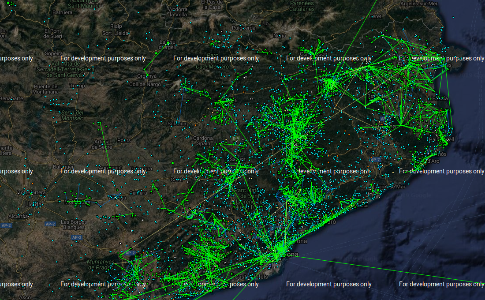

# The meeting in Arago, Barcelona

This is the network graph of guifi.net. A wireless routed layer three network. **B.A.T.M.A.N.** [[1]](https://en.wikipedia.org/wiki/B.A.T.M.A.N.) routing protocol is active, but also **OSPF** [[2]](https://en.wikipedia.org/wiki/Open_Shortest_Path_First) and **BGP** [[3]](https://en.wikipedia.org/wiki/Border_Gateway_Protocol). 

Like I've already said guifi is based upon Mikrotik. The stupid little purple bitch, a telecommunications entrepreneur in France, a daughter of military family in Italy, an hacker of systems and people in Spain and a terrorist in the world have used a public exploit to gain access in this free  network. The problem is that this free network has got a **BGP autonomous system number** [[4]](https://www.inetdaemon.com/tutorials/internet/ip/routing/bgp/autonomous_system_number.shtml). The primary exchange ASN is **49835** [[5]](https://www.peeringdb.com/asn/49835), the data center is the **Catalunya neutral Internet exchange** [[6]](https://www.catnix.net/). In the same **IXP** [[7]](https://en.wikipedia.org/wiki/Internet_exchange_point) there is others very important connections:

- **Adamo** [[8]](http://www.adamo.es) **35699** [[9]](https://www.peeringdb.com/net/1989)
  - **ESPANIX** [[10]](http://www.espanix.net) 
- **Andorra Telecom** [[11]](
  https://www.andorratelecom.ad) **6752** [[12]](https://www.peeringdb.com/net/14854)
- **Claranet** [[13]](http://www.clara.net) **8426** [[14]](https://www.peeringdb.com/net/116)
- **Cloudfare** [[15]](https://www.cloudflare.com) **13335**  [[16]](https://www.peeringdb.com/net/4224)
- **Google LLC** [[17]](https://about.google/intl/en/) **15169** [[18]](https://www.peeringdb.com/net/433)
- **Microsoft** [[19]](https://www.microsoft.com/nl-nl/)  **8075** [[20]](https://www.peeringdb.com/net/694)
- **Orange Spain** [[21]](https://www.peeringdb.com/net/11902) **11902** [[22]](https://www.peeringdb.com/net/11902)
- **RedIRIS** [[23]](https://www.peeringdb.com/net/2813) **766** [[24]](https://www.peeringdb.com/net/2813)
- **RIPE NCC** [[25]](https://stat.ripe.net/widget/looking-glass) **12654** [[26]](https://www.peeringdb.com/net/621)
- **Hurricane Electric** [[27]](http://lg.he.net) **6939** [[28]](https://www.peeringdb.com/net/291)
- **ISC** [[29]](https://www.isc.org) **1280** [[30]](https://www.peeringdb.com/net/1111)
- **T-Systems** [[31]](https://www.t-systems.es) **30892** [[32]](https://www.peeringdb.com/net/10653)
- **Telefonica de España** [[33]](http://www.telefonica.es/) **3352** [[34]](https://www.peeringdb.com/net/12709)
- **VeriSign** [[35]](http://www.verisign.com/rirs) **26415** [[36]](https://www.peeringdb.com/net/9897)

In the Orange network but also probably in the Telefonica one hackers gain access to the LTE towers and the passive scanning system for brain waves. The ones that are stimulated by the satellite in 3GHz. Like we've seen. 

All the customers premise equipments of Telefonica in FTTH mount the CPE Wan Management Protocol **TR-069** [[37]](https://en.wikipedia.org/wiki/TR-069) **soap** [[38]](https://en.wikipedia.org/wiki/SOAP) based message system with the data center to them. And there is a **public vulnerability** [[39]](https://www.defcon.org/images/defcon-22/dc-22-presentations/Tal/DEFCON-22-Shahar-TaI-I-hunt-TR-069-admins-UPDATED.pdf), simple to use to exploit the client hardware. Movistar equipment got three **virtual lan** [[40]](https://en.wikipedia.org/wiki/Virtual_LAN), 2 voice 3 iptv and 6 data. This is the configuration of a router with an ONT:

https://github.com/noplacenoaddress/RouterOS/blob/master/movistar.rsc

PPPoE daemon in the FTTH movistar network serve dynamic public. CWMP daemon it's opened by default over virtual lan 2 and got an **access control list** [[41]](https://en.wikipedia.org/wiki/Access-control_list) with default permissions on deny and accept only a range of public ip from the same provider. Those people with **BGP Hijacking** [[42]](https://en.wikipedia.org/wiki/BGP_hijacking) have hoped from AS 49835 to various more. 1280 could significance a very dangerous **dns cache poisoning** [[43]](https://en.wikipedia.org/wiki/DNS_spoofing), 6752 the thief of bank accounts of big facilities, 3352  and 11902 construction of an enormous ddosnet and thief of social network profiles but also access to the passive scanning embedded on the mobile towers. With 6939 they could have build a ddos net using **IPv6** [[44]](https://en.wikipedia.org/wiki/IPv6), a tool that could have been used, a tool that have created a person that I know from IRCNnet in the 1990s, is **ipv6fuck** [[45]](https://github.com/noplacenoaddress/Hacking/blob/master/ipv6fuck.c). 

### External links

1. https://en.wikipedia.org/wiki/B.A.T.M.A.N.
2. https://en.wikipedia.org/wiki/Open_Shortest_Path_First
3. https://en.wikipedia.org/wiki/Border_Gateway_Protocol
4. https://www.inetdaemon.com/tutorials/internet/ip/routing/bgp/autonomous_system_number.shtml
5. https://www.peeringdb.com/asn/49835
6. https://www.catnix.net/
7. https://en.wikipedia.org/wiki/Internet_exchange_point
8. http://www.adamo.es
9. https://www.peeringdb.com/net/1989
10. http://www.espanix.net
11. https://www.andorratelecom.ad
12. https://www.peeringdb.com/net/14854
13. http://www.clara.net
14. https://www.peeringdb.com/net/116
15. https://www.cloudflare.com
16. https://www.peeringdb.com/net/4224
17. https://about.google/intl/en/
18. https://www.peeringdb.com/net/433
19. https://www.microsoft.com/nl-nl/
20. https://www.peeringdb.com/net/694
21. https://www.orange.es/
22. https://www.peeringdb.com/net/11902
23. http://www.rediris.es
24. https://www.peeringdb.com/net/2813
25. https://stat.ripe.net/widget/looking-glass
26. https://www.peeringdb.com/net/621
27. http://lg.he.net
28. https://www.peeringdb.com/net/291
29. https://www.isc.org
30. https://www.peeringdb.com/net/1111
31. https://www.t-systems.es
32. https://www.peeringdb.com/net/10653
33. www.telefonica.es
34. https://www.peeringdb.com/net/12709
35. http://www.verisign.com/rirs
36. https://www.peeringdb.com/net/9897
37. https://en.wikipedia.org/wiki/TR-069
38. https://en.wikipedia.org/wiki/SOAP
39. https://www.defcon.org/images/defcon-22/dc-22-presentations/Tal/DEFCON-22-Shahar-TaI-I-hunt-TR-069-admins-UPDATED.pdf
40. https://en.wikipedia.org/wiki/Virtual_LAN
41. https://en.wikipedia.org/wiki/Access-control_list
42. https://en.wikipedia.org/wiki/BGP_hijacking
43. https://en.wikipedia.org/wiki/DNS_spoofing
44. https://en.wikipedia.org/wiki/IPv6
45. https://github.com/noplacenoaddress/Hacking/blob/master/ipv6fuck.c