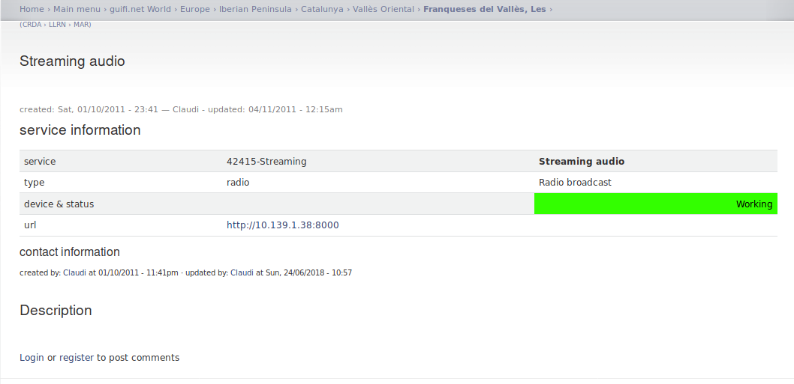

# The Catalan wireless free network

This Catalan network is radio wave terrestrial based. Low latency and good performances. All open source based and open hardware. A great job but full of crimes. And some services can be utilized by rapists. It's embedded in the **guifi.net** [[1]](https://en.wikipedia.org/wiki/Guifi.net) network, a great project. Full of great people that interconnect via wi-fi, **Mikrotik** [[2]](https://en.wikipedia.org/wiki/MikroTik) and **Ubiquiti** [[3]](https://en.wikipedia.org/wiki/Ubiquiti_Networks) based, various nodes. It's a **layer 3** [[4]](https://en.wikipedia.org/wiki/Network_layer) **ospf** [[5]](https://en.wikipedia.org/wiki/Open_Shortest_Path_First), **mpls** [[6]](https://en.wikipedia.org/wiki/Multiprotocol_Label_Switching), **vpls** [[7]](https://en.wikipedia.org/wiki/Virtual_Private_LAN_Service) switched **MAN network** [[8]](https://en.wikipedia.org/wiki/Metropolitan_area_network). A free network, something incredible and very good administrated. A nice work. I was the owner of something similar but commercial. A wireless Internet service provider. 

Why i defined it full of crimes? Because the low security level that bind the **RouterOS** [[9]](https://mikrotik.com/software) system operative. Look at those remote exploit:

1. https://www.exploit-db.com/exploits/45578
2. https://www.exploit-db.com/exploits/46444
3. https://www.exploit-db.com/exploits/44290
4. https://www.exploit-db.com/exploits/44284

Because of the nature of this router system operative, you can find it also in **BGP** [[10]](https://en.wikipedia.org/wiki/Border_Gateway_Protocol) gateways, it's totally insane put it on those machines so important. Five years ago in Catalunya there was an hacker attack that have changed all. It seems to be impossible, but yes it is. 

"Illuminati" synthetic telepathy network hackers has illegally owned the guifi.net subliminal voice services and others services utilized by not so many Catalans hackers. With those access they have digitally violated a lot of Catalans womans. They have copy the technology of the Catalans, subliminal voice and visual cortex injection, and put them onto satellite creating a monster that is changing that will do it more and more Europe. A global mass surveillance system and a global brain washing system. Active upon our heads and the heads of our babies.

### The head of

In the Catalan Guifi network there is a **obfs4 bridge** [[11]](https://2019.www.torproject.org/docs/bridges.html.en) that permit access to the B-side network, subliminal voice and visual cortex injection like the synthetic telepathy network more a very special magnetic device who inventor call "steam engine". Ops perhaps we speak about the **Steam community** [[12]](https://store.steampowered.com/) in nowadays slang. It's something special very difficult to understand how it works. This person, that is also a very special man very clever and interesting, is also a big network hacker, like me, Unix lover, like me, but also a very dangerous stalker. But he normally keeps care that victims doesn't commit suicide. Why? He's so clever and keep in equilibrium the limit between a crime for at least twenty years in prison and the Stockholm syndrome. He has got in his hand the mind of various precious womans, obtained with the techniques that i've explained before, that pays in crypt concurrency and in betting system. They study new victims. Like me. I'm victim of this big stalker, but i can consider that I'm also perhaps in part passing the Stockholm syndrome because I don't denunciate him and I'm preferring the public way to help those girls, who I know personally more than five and I've got two large relations. He is extremely clever and with him I'm supposing to do a chess play. He has a criminal background. He has analyzed a lot of brains. He has a very deep understanding in human comportments under extreme stress. I'm totally sure that he has an enormous handmade diagram in parentheses, where he decides with almost weekly anticipation where to leave the victim with his steam engine false theater. All is false. All. One of the worst sentiment that grow up in your mind is impotence. In my case was the impotence the keep in safe the life of a woman. This is my week point in his manner to see life. He plays with brains. People that protect him do thousand millions euro in bet system. I don't think that he loves to obtain great amount of money. He loves to understand humans, because he thinks to be superior. And yes he is, but not of alls. He is an **anarchic** [[13]](https://en.wikipedia.org/wiki/Anarchy), a **punk** [[14]](https://en.wikipedia.org/wiki/Punk_subculture) and an **heavy metal** [[15]](https://en.wikipedia.org/wiki/Heavy_metal_music) follower. But i know him in a techno music little reserved club. But in reality he is so complex that i think that he can dress whatever gown.

**She calls him daddy, but her dad has died.** And i love her. It seems to me a sexual rape scene, but i really don't know. She doesn't reply to me. When he has known me, always he uses extreme sexual insinuations, and one time with a woman start to play a BDSM master/slave game. But he doesn't violate me because i realize it. He uses fear and sexual subjugation and who i love calls him daddy. And in radio frequency there like two thousand persons that i know personally and nobody help me because of money. But the real think is that because of him. He manipulates masses of people all together. His power is astonished because many of them i know from more than twenty years. It's impossible understand how he can do it. But he does.

But there is another break point. When i came to Catalunya i fall in love with one girl, **but also her dad has died**. The two mans where heavy drug addicted, one more than the other. The **eighty** in Spain was so heavy.  Heavy metal. **Cine quinqui** [[16]](https://es.wikipedia.org/wiki/Cine_quinqui), a film genre that describe exactly what i wanna explain to you, dear fellow.

> *Ambiguous equivocal devious backhanded doubtful ambidexter*

I don't wanna describe more in deep, my dear, just best regards and keep up the good work. I'll do the same. Cheers.

### External links

1. https://en.wikipedia.org/wiki/Guifi.net

2. https://en.wikipedia.org/wiki/MikroTik

3. https://en.wikipedia.org/wiki/Ubiquiti_Networks

4. https://en.wikipedia.org/wiki/Network_layer

5. https://en.wikipedia.org/wiki/Open_Shortest_Path_First

6. https://en.wikipedia.org/wiki/Multiprotocol_Label_Switching

7. https://en.wikipedia.org/wiki/Virtual_Private_LAN_Service

8. https://en.wikipedia.org/wiki/Metropolitan_area_network

9. https://mikrotik.com/software

10. https://en.wikipedia.org/wiki/Border_Gateway_Protocol

11. https://2019.www.torproject.org/docs/bridges.html.en

12. https://store.steampowered.com/

13. https://en.wikipedia.org/wiki/Anarchy

14. https://en.wikipedia.org/wiki/Punk_subculture

15. https://en.wikipedia.org/wiki/Heavy_metal_music

16. https://es.wikipedia.org/wiki/Cine_quinqui

    