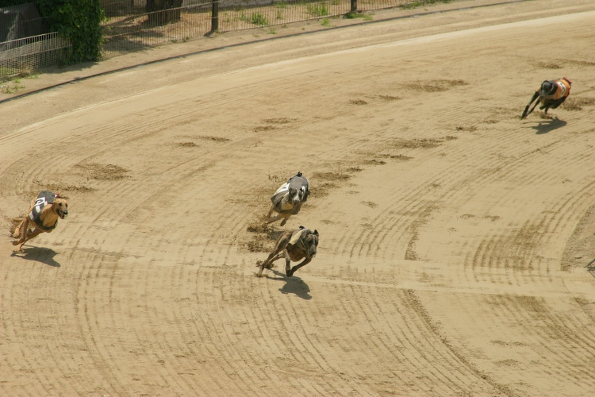
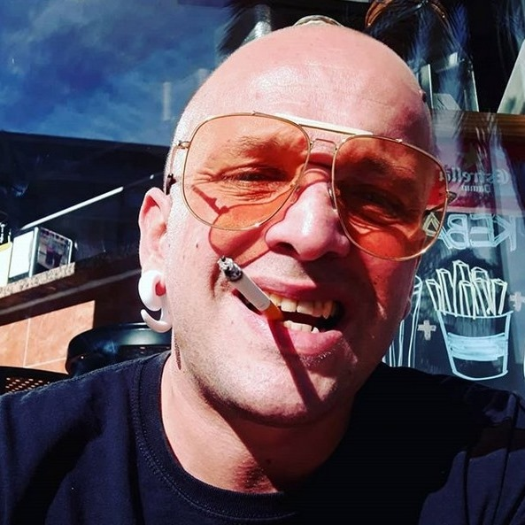

# The Catalan's goods	

This is a recent shoot of the **bingo** [[1]](https://en.wikipedia.org/wiki/Bingo_(card_game)) **Augusta** [[2]](http://www.rodriguezvillar.com/bingo-augusta/) in **Badalona** [[3]](https://en.wikipedia.org/wiki/Badalona). You can play the bingo game or do sports betting. But we've said before that people bet over network's victim. And yes, i think that many bets are mask beside other legals bets. Like the ones we find here, in the bingo club.

Why I speak about Badalona, because i know him there and i love this city, little tourism and the wind smell like **Andalucia** [[4]](https://en.wikipedia.org/wiki/Andalusia). 

### The Catalan metaphor about greyhound racing

In Catalunya the medium high class society play the game of remote parimutuel betting that i've described in the part one. 

But they don't bet about dogs, or what so ever animal. They bet on humans. And i'm a victim of. It's a tunnel without end where you don't have any relation, you loose all your friends, also your family play and, in my case, a girl that i'm was in love to act like she need help.

And i've done four thousand kilometers by foot in the city of Barcelona.

I've resisted to all kind of brain washing system, gang stalking, threat and rape. Guns on my face. Motorbike accident. And so on and i will explain better all of those fantastic events in the part number four. 

And i received every day any type of threat in radio frequency.

They say that they sell her like a prostitute. But she doesn't call me. 

And time is past. And i cannot wait more. Two years has past. Five years that i don't see her. But because seven years ago i've said "i love you" for me is sufficient to have done all of this.

**But it's only about bet because she has to act because she has a baby and yes i still love you**.

What i want to explain here, dear reader, is how Catalans bet in this shit. They compare dog breeds to humans. *Could you tell me if am I a dog sons of bitches?*

The reply is one: no.

But it's yes for some high class revenue profile, fascist derived. Womans. A lot of. This is how you can be classified but also is how they gain money in them Andorran bank accounts. It's only about sex, kilometers, masturbation, orgies, drug abuse, and stupidities like those. There's three class of dogs, who is the legal owner of the dog in this B-side abuse network gain money and think to be your owner like if you are the dog. 

Incredible, but yes it is.

1. **Catch dogs** [[5]](https://en.wikipedia.org/wiki/Catch_dog), and why i've got blue eyes in a particular way the blue color **Staffordshire Bull Terrier** [[6]](https://en.wikipedia.org/wiki/Staffordshire_Bull_Terrier). The legal owners gain a perceptual if the victim sell drugs. If you don't sell after two years that they *opened you the brain*, this is how they say when they simply activate to subliminal voice service and the visual cortex read, they will kill you like a combat dog that loose. But with who i'm in competition? Could he possible be who i was calling brother? And the most important think I don't sell drugs.
2. 

### External links

1. https://en.wikipedia.org/wiki/Bingo_(card_game)
2. http://www.rodriguezvillar.com/bingo-augusta/
3. https://en.wikipedia.org/wiki/Badalona
4. https://en.wikipedia.org/wiki/Andalusia
5. https://en.wikipedia.org/wiki/Catch_dog
6. https://en.wikipedia.org/wiki/Staffordshire_Bull_Terrier