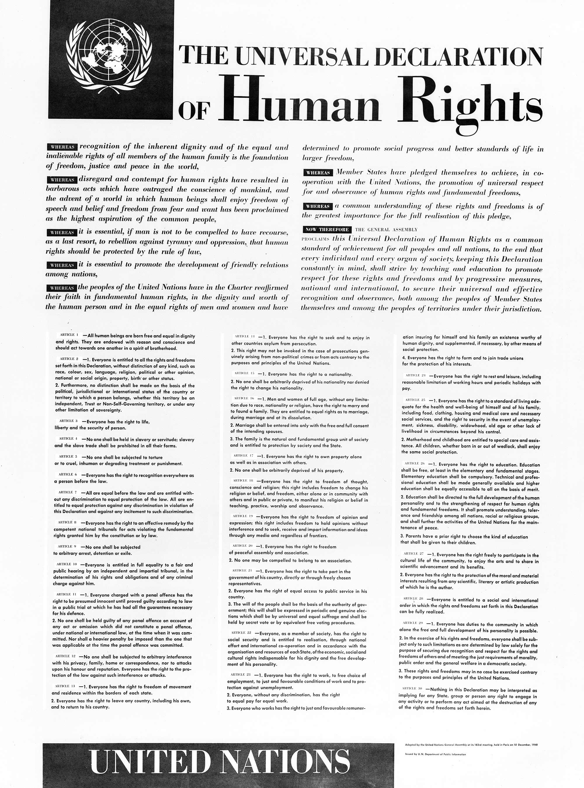

# Laws violated by this system

### How to hit hard the pyramid of "Illuminati"

All the girls start the "rise" of this fraud being a sexual slave. What does it mean? That they have to prostitute all the days, they don't gain money, and all the money is divided depending on the position in the pyramid of the different criminals. 

*Mi ex girlfriend was a slave. I love you sweetie.*

This is like **people trafficking** [[1]](https://en.wikipedia.org/wiki/Human_trafficking). But this is also **procuring** [[2]](https://en.wikipedia.org/wiki/Procuring_(prostitution)). All the criminals that are up then the first level of the sexual pyramid, the number four in Barcelona, have to respond before the law. 

But remember, those people that have started being a slave in the first step of the pyramid and suffer brain washing or others techniques and simply believe that "Illuminati" are the new order in a democratic state like Spain have, in my point of view, must be compensated from the state. They are doing a crime but many are coerced by radio frequency threats about their family. Women are threatened with their children. 

The theme is very complex and we've to build an association of cold cuts. To protect who have to be protect in front of the law. An association with good lawyers prepared in this special and vast theme. The fight against a new type of pseudo dictatorship.

In Spain **codigo penal** [[3]](https://es.wikipedia.org/wiki/C%C3%B3digo_penal) is the **criminal code** [[4]](https://en.wikipedia.org/wiki/Criminal_code) operative in the State. Those are the crimes:

- **Trata de personas** [[5]](https://es.wikipedia.org/wiki/Trata_de_personas)
- **Esclavitud** [[6]](https://es.wikipedia.org/wiki/Esclavitud)
- **Proxenitismo** [[7]](https://es.wikipedia.org/wiki/Proxenetismo)

All of them are horribles crimes that destroy **human rights** [[8]](https://en.wikipedia.org/wiki/Human_rights). Especially of women and child. And my ex girlfriend is a victim of.

*I love you.*

### How to hit every network of neural control

Like we've already said one of the tower of democracy is without any doubt privacy. In Spain, the country where i live there's a lot of laws protecting this fundamental right of the citizen. Spain is **Europe Union** [[9]](https://en.wikipedia.org/wiki/European_Union). 

- In the **Universal Declaration of Human Rights** [[10]](https://en.wikipedia.org/wiki/Universal_Declaration_of_Human_Rights) of 1948 privacy was defended and guaranteed. It says that everyone got the right to protect his **intimacy** [[11]](https://en.wikipedia.org/wiki/Intimate_relationship), family, home, **reputation** [[12]](https://en.wikipedia.org/wiki/Reputation).
- In the article 18 of the **Spanish Constitution** [[13]](https://en.wikipedia.org/wiki/Constitution_of_Spain) the right of **honor** [[14]](https://en.wikipedia.org/wiki/Honour), intimacy and personal image.
- **Organic law** [[15]](https://en.wikipedia.org/wiki/Organic_law) **11982** [[16]](https://elderecho.com/ley-organica-11982-5-mayo-proteccion-civil-del-derecho-al-honor-la-intimidad-personal-familiar-la-imagen) 
- **General Data Protection Regulation** [[17]](https://en.wikipedia.org/wiki/General_Data_Protection_Regulation) from 25 of May 2018
- Organic law **15/1999** [[18]](https://en.wikipedia.org/wiki/Ley_Org%C3%A1nica_de_Protecci%C3%B3n_de_Datos_de_Car%C3%A1cter_Personal) of December 13 of protection of **personal data** [[19]](https://en.wikipedia.org/wiki/Personal_data)
- Law **9/2014** [[20]](https://transparencia.gob.es/servicios-buscador/contenido/ley.htm?id=NORMAT_E049216014627&fcAct=2017-10-06T08:44:37.843Z&lang=es) of telecommunications that dictate the facilities of the sector. It give to them public service character and it give them the fundamental background about client's rights. 

This laws if violated could represent fines and penalties and also jail defined by the **article 197** [[21]](http://noticias.juridicas.com/base_datos/Penal/lo10-1995.l2t10.html) of the **penal code** [[22]](https://es.wikipedia.org/wiki/C%C3%B3digo_Penal_(Espa%C3%B1a)).

So like our visual cortex and auditory cortex and much more brain parts are totally under control in a remote neural control network this laws, those above are the Spanish ones, have to be held en front of a penal **judgment** [[23]](https://en.wikipedia.org/wiki/Judgement).

Those are the pains:

- prison from one to three years for disseminate facts about a person without their consent, even if they have not participated in obtaining such information.
- prison from one to four years:
  -  Seize documents or personal effects of a person without their consent.
  - Use recording, transmission or broadcasting devices without the individual's permission.
  - Treatment of a person's information without their consent in computer files or telematic records.
- prison from three to five years:
  - It is imposed when the crimes of intrusion and disclosure of information have been committed by those responsible or responsible for the processing of the files, or by their representatives.
  - Disseminate data that reveals the person's race, ideology, religion or sexual condition.
  - Disclose data relating to minors or disabled persons.
- prison from four to seven years committing the above crimes for profit.

The last point is what is break under remote neural control networks. And obviously the pain will be the maximum because for example in my case its two years that I'm below this crime in active, with subliminal voice service activated, and many years more in silent mode, or in **hide** [[24]](https://www.thesaurus.com/browse/hide) like i call it.

### How to hit the layer one magnetic field

Steam machine create a magnetic field with two analogs very powerful radio and ferrite or magnetic loop antennas. Like we've already seen. In the European Union laws electromagnetic field are regulated not speaking about outside environment but speaking about **occupational hazards** [[25]](https://en.wikipedia.org/wiki/Occupational_hazard). The same normative I think that can be applied without any problems because of the extent field provoke health diseases to all the Catalans, not only to who are connected to the remote neural monitoring network. People with for example some mechanical bypass, people that have suffered a **bypass surgery** [[26]](https://en.wikipedia.org/wiki/Bypass_surgery) could be killed in remote with this technology.

1. **Directive 2013/35/EU** [[27]](https://drive.google.com/drive/folders/1RS0fwU8V0e3iu2SyuLtiXFiiR8bJ7_In)
2. **The Control of Electromagnetic Fields at Work Regulations 2016** [[28]](https://drive.google.com/drive/folders/1RS0fwU8V0e3iu2SyuLtiXFiiR8bJ7_In)

Another consideration that it can be applied about those magnetic field is that are military technology. Those fields are created in battle sites. But Catalunya isn't in a war environment. I really don't know if there is some law that protect civilians by the use of this telecommunications extreme invasive technology.

Speaking about the Vatican Radio there is various cases of cancer denunciated by civilians over the installations near Rome.

- https://roma.repubblica.it/cronaca/2010/07/13/news/onde_elettromagnetiche-5565454/
- https://magdahavas.com/study-finds-vatican-radio-causes-cancer/

### Human rights violated

The synthetic telepathy network violate almost eleven rights declared in the **universal declaration** [[29]](https://en.wikipedia.org/wiki/Universal_Declaration_of_Human_Rights) created in 1948 by the **United Nations** [[30]](https://en.wikipedia.org/wiki/United_Nations):

1. *We are all born free and equal*. Broken because when you are a target individual is humiliated continuously by who got access in the network. 
2. *Don't discriminate*. Discrimination is done every moment in this network to induct to suicide.
3. *The right to life*. Also broken. When stalkers play with your emotions and tough your life is ridiculed en front of a lot of people seeing the virtual monitor device of the network above them head. The transmission is a mandatory.
4. *No slavery*. Slavery is the entrance for everyone in this hell, next if a person, like me, decide to fight for his rights psychological slavery in on the agenda.
5.  *No torture*.  Electronic harassments and subliminal messages are without any doubt a torture. And we're living in the twenty one century. This is not middle age.
6. *You have the same rights no matter where you go*.  Here you don't have any right.
7. *We're all equal before the law*. Also false, people that are working here have access to a system that permit rapid corruption in crypt concurrency and there are many policemen, lawyers and judges that accept this kind of corruption that is almost undetectable.
8. *Your human rights are protected by the law*. This is true but this crime is very difficult to prove so our rights aren't protected by the current law because no one explain in public how to register or to connect with a device to this network.
9. *No unfair detainment*. Stalkers of Barcelona got me arrested without any sense. Also because of corruption.
10. *The right to privacy*. Totally broken. All what we see and what we think is transmitted over the remote neural monitoring network. Image to go for cash in a dispenser, all our pin codes are intercepted. Yes because in this network they are not hackers, almost all are thieves. And I hate to steal.
11. *The right to seek a safe place to live*. If you are a target individual your private house it's not a safe place to live because of electronic harassment. 

So it's important to understand that owners of this network have to be put in jail also because they commit **crimes against humanity** [[31]](https://en.wikipedia.org/wiki/Crimes_against_humanity). 

### Nuremberger code

1. The voluntary consent of the human subject is absolutely essential.

2. The experiment should be such as to yield fruitful results for the good of society, unprocurable by other methods or means of study, and not random and unnecessary in nature.
3. The experiment should be so designed and based on the results of animal experimentation and a knowledge of the natural history of the disease or other problem under study that the anticipated results will justify the performance of the experiment.
4. The experiment should be so conducted as to avoid all unnecessary physical and mental suffering and injury.
5. No experiment should be conducted where there is an *a priori* reason to believe that death or disabling injury will occur; except, perhaps, in those experiments where the experimental physicians also serve as subjects.
6. The degree of risk to be taken should never exceed that determined by the humanitarian importance of the problem to be solved by the experiment.
7. Proper preparations should be made and adequate facilities provided to protect the experimental subject against even remote possibilities of injury, disability, or death.
8. The experiment should be conducted only by scientifically qualified persons. The highest degree of skill and care should be required through all stages of the experiment of those who conduct or engage in the experiment.
9. During the course of the experiment the human subject should be at liberty to bring the experiment to an end if he has reached the physical or mental state where continuation of the experiment seems to him to be impossible.
10. During the course of the experiment the scientist in charge must be prepared to terminate the experiment at any stage, if he has probable cause to believe, in the exercise of the good faith, superior skill and careful judgment required of him that a continuation of the experiment is likely to result in injury, disability, or death to the experimental subject.

Those are the ten points of the Nuremberger code speak about ethics in human experiments. That is exactly what the telecoms lobby do with our brains and bodies in the remote neural monitoring network. This is a worldwide problem. 

### Sexual harassment and pedophilia

### External links

1. https://en.wikipedia.org/wiki/Human_trafficking

2. https://en.wikipedia.org/wiki/Procuring_(prostitution)

3. https://es.wikipedia.org/wiki/C%C3%B3digo_penal

4. https://en.wikipedia.org/wiki/Criminal_code

5. https://es.wikipedia.org/wiki/Trata_de_personas

6. https://es.wikipedia.org/wiki/Esclavitud

7. https://es.wikipedia.org/wiki/Proxenetismo

8. https://en.wikipedia.org/wiki/Human_rights

9. https://en.wikipedia.org/wiki/European_Union

10. https://en.wikipedia.org/wiki/Universal_Declaration_of_Human_Rights

11. https://en.wikipedia.org/wiki/Intimate_relationship

12. https://en.wikipedia.org/wiki/Reputation

13. https://en.wikipedia.org/wiki/Constitution_of_Spain

14. https://en.wikipedia.org/wiki/Honour

15. https://en.wikipedia.org/wiki/Organic_law

16. https://elderecho.com/ley-organica-11982-5-mayo-proteccion-civil-del-derecho-al-honor-la-intimidad-personal-familiar-la-imagen

17. https://en.wikipedia.org/wiki/General_Data_Protection_Regulation

18. https://en.wikipedia.org/wiki/Ley_Org%C3%A1nica_de_Protecci%C3%B3n_de_Datos_de_Car%C3%A1cter_Personal

19. https://en.wikipedia.org/wiki/Personal_data

20. https://transparencia.gob.es/servicios-buscador/contenido/ley.htm?id=NORMAT_E049216014627&fcAct=2017-10-06T08:44:37.843Z&lang=es

21. http://noticias.juridicas.com/base_datos/Penal/lo10-1995.l2t10.html

22. https://es.wikipedia.org/wiki/C%C3%B3digo_Penal_(Espa%C3%B1a)

23. https://en.wikipedia.org/wiki/Judgement

24. https://www.thesaurus.com/browse/hide

25. https://en.wikipedia.org/wiki/Occupational_hazard

26. https://en.wikipedia.org/wiki/Bypass_surgery

27. https://drive.google.com/drive/folders/1RS0fwU8V0e3iu2SyuLtiXFiiR8bJ7_In

28. https://drive.google.com/drive/folders/1RS0fwU8V0e3iu2SyuLtiXFiiR8bJ7_In

29. https://en.wikipedia.org/wiki/Universal_Declaration_of_Human_Rights

30. https://en.wikipedia.org/wiki/United_Nations

31. https://en.wikipedia.org/wiki/Crimes_against_humanity

    