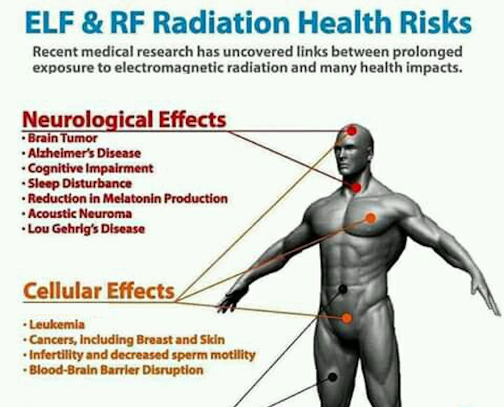

# Health diseases 

The remote neural monitoring network got a lot of health diseases that could ruin target individual's life that could be presented to a penal court:

- **Brain tumor** [[1]](https://en.wikipedia.org/wiki/Brain_tumor)
- **Alzheimer's disease** [[2]](https://en.wikipedia.org/wiki/Alzheimer%27s_disease)
- **Cognitive deficit** [[3]](https://en.wikipedia.org/wiki/Cognitive_deficit)
- **Hypopigmentation** [[4]](https://en.wikipedia.org/wiki/Hypopigmentation)
- **Vestibular schwannoma** [[5]](https://en.wikipedia.org/wiki/Vestibular_schwannoma)
- **Breast cancer** [[6]](https://en.wikipedia.org/wiki/Breast_cancer)
- **Skin cancer** [[7]](https://en.wikipedia.org/wiki/Skin_cancer)
- **Infertility** [[8]](https://en.wikipedia.org/wiki/Infertility)
- **Blood brain barrier** [[9]](https://en.wikipedia.org/wiki/Blood%E2%80%93brain_barrier) disruption

Another type of disease that can be taken in front of a court is the **Attention deficit hyperactivity disorder** [[10]](https://en.wikipedia.org/wiki/Attention_deficit_hyperactivity_disorder) caused by radio waves exposure. The worst point is that this deficit is classified by governments as **mental disorder** [[11]](https://en.wikipedia.org/wiki/Mental_disorder) of the **neurodevelopmental** [[12]](https://en.wikipedia.org/wiki/Neurodevelopmental_disorder) type. Those types of disorders affect the development of the nervous system affecting **emotion** [[13]](https://en.wikipedia.org/wiki/Emotion), **learning ability** [[14]](https://en.wikipedia.org/wiki/Standardized_test), **self-control** [[15]](https://en.wikipedia.org/wiki/Self-control) and **memory** [[16]](https://en.wikipedia.org/wiki/Memory). 

> *In my personal experience as target individual I notice that I'm loosing a lot of learning ability, remember to protect always your brain and body with the correct goods to deny the remote neural monitoring radio waves acting over you and recuperate those humans abilities. It's important to underline that corrupted medics could add to your medical record use of drug or psychiatric medication in front of analyze in a correct way our around electric radio.* 

### Sleep deprivation

**Sleep deprivation** [[17]](https://en.wikipedia.org/wiki/Sleep_deprivation) in the neural control network it's obtained by electronic torture. With dream injection it's also possible to completely write in our brain dreams that are prepared like a movie and streamed directly to our mind. 

Forced sleep deprivation it's considered a torture and if prolonged it can cause various compartmental distortion in the victim and can fall into **narcolepsy** [[18]](https://en.wikipedia.org/wiki/Narcolepsy) that is a **long-term neurological disorder** [[19]](https://en.wikipedia.org/wiki/Neurological_disorder).  This kind of disorders could fall into death.

Those are the illness provoked by this torture:

- **Irritability** [[20]](https://en.wikipedia.org/wiki/Irritability)
- **Amnesia** [[21]](https://en.wikipedia.org/wiki/Amnesia)

### External links

1. https://en.wikipedia.org/wiki/Brain_tumor

2. [https://en.wikipedia.org/wiki/Alzheimer%27s_disease](https://en.wikipedia.org/wiki/Alzheimer's_disease)

3. https://en.wikipedia.org/wiki/Cognitive_deficit

4. https://en.wikipedia.org/wiki/Hypopigmentation

5. https://en.wikipedia.org/wiki/Vestibular_schwannoma

6. https://en.wikipedia.org/wiki/Breast_cancer

7. https://en.wikipedia.org/wiki/Skin_cancer

8. https://en.wikipedia.org/wiki/Infertility

9. [https://en.wikipedia.org/wiki/Blood%E2%80%93brain_barrier](https://en.wikipedia.org/wiki/Blood–brain_barrier)

10. https://en.wikipedia.org/wiki/Attention_deficit_hyperactivity_disorder

11. https://en.wikipedia.org/wiki/Mental_disorder

12. https://en.wikipedia.org/wiki/Neurodevelopmental_disorder

13. https://en.wikipedia.org/wiki/Emotion

14. https://en.wikipedia.org/wiki/Standardized_test

15. https://en.wikipedia.org/wiki/Self-control

16. https://en.wikipedia.org/wiki/Memory

17. https://en.wikipedia.org/wiki/Sleep_deprivation

18. https://en.wikipedia.org/wiki/Narcolepsy

19. https://en.wikipedia.org/wiki/Neurological_disorder

20. https://en.wikipedia.org/wiki/Irritability

21. https://en.wikipedia.org/wiki/Amnesia

    

