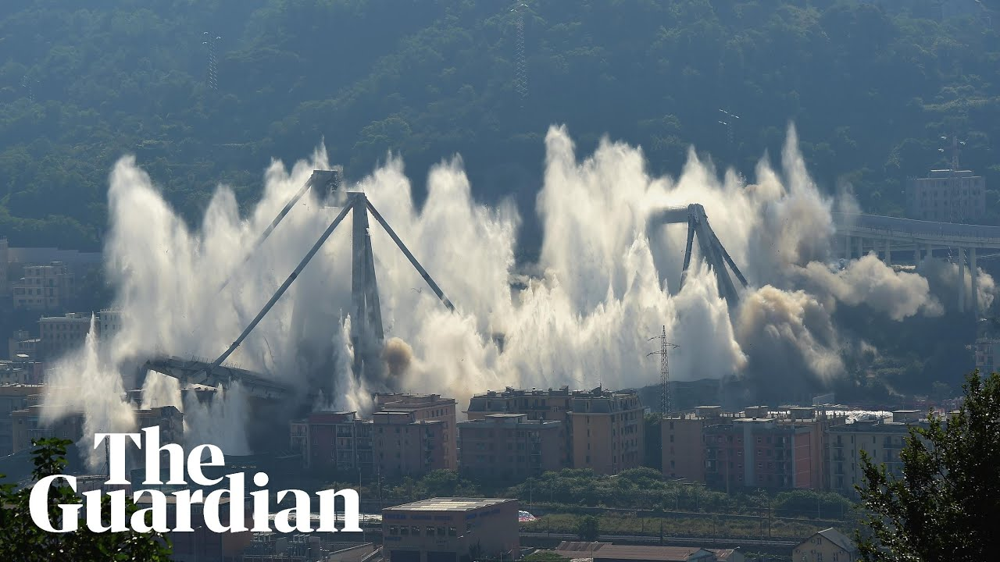
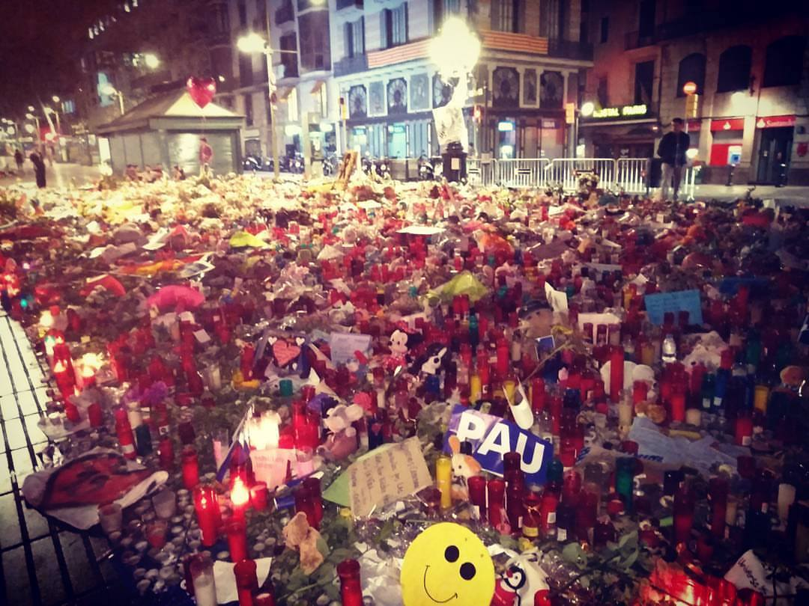
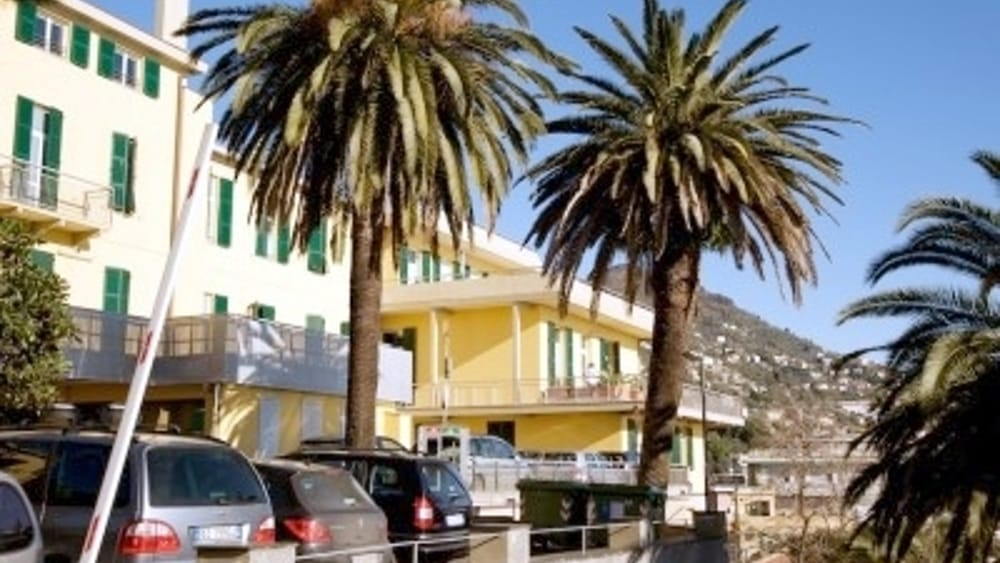
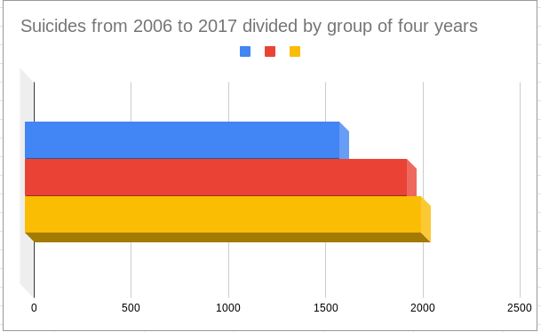
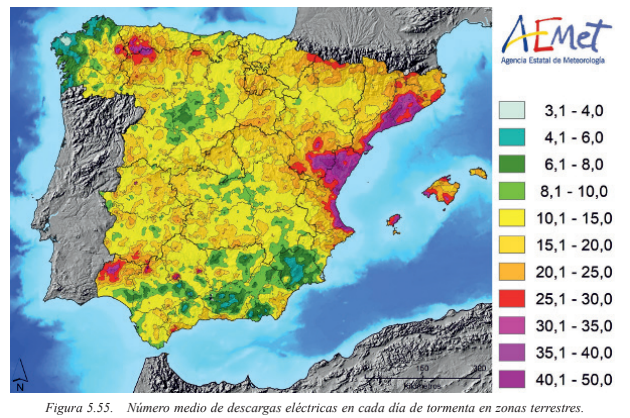
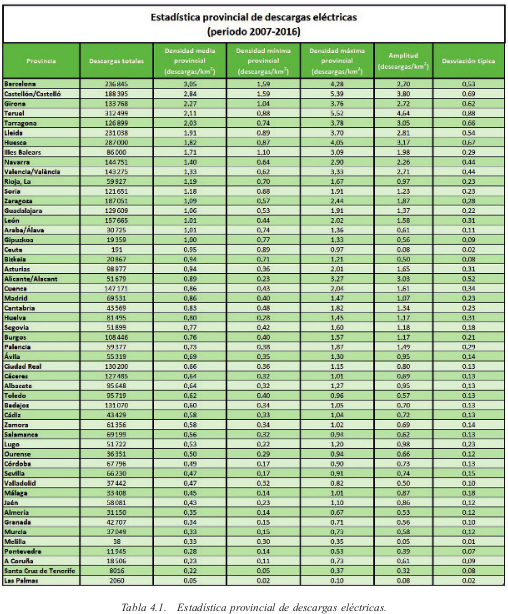
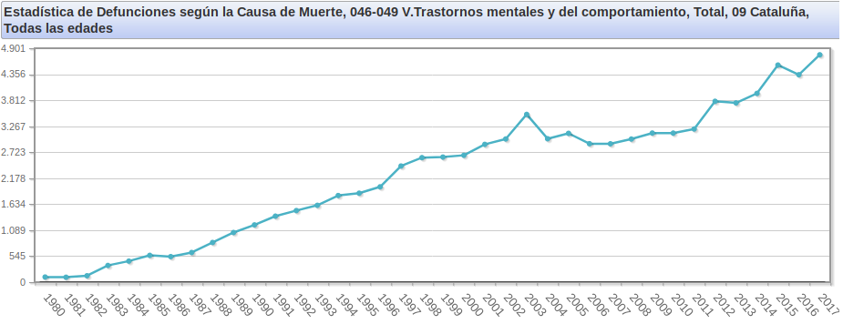

# Rest in peace innocent deaths

**Ponte Morandi** [[1]](https://en.wikipedia.org/wiki/Ponte_Morandi), Genoa, August 2018 the bridge collapse and 43 persons died. But this is the controlled demolition of June 2019, one year after.

Barcelona, August 2017. Ramblas. One of the so called **2017 Barcelona attacks** [[2]](https://en.wikipedia.org/wiki/2017_Barcelona_attacks). Another tragedy. 13 people die.

My two cities; the two seriously affected by two tragedies. Rest in peace. God bless you.

 12 May 2016. A friend of mine, Cristian, commit suicide in a psychiatric hospital. **Clinica Maugeri** [[3]](https://www.icsmaugeri.it/dove-siamo/ics-genova-nervi). An **article** [[4]](http://www.genovatoday.it/cronaca/nervi-suicidio-ospedale.html) in a local newspaper say that he was mental sick. But no he wasn't. He was a great man. One victim of this criminal system. Another victim of this stupid little bitch. This is the true.

24 May of 2019. A professor of mine, doctor **Giuseppe Ciaccio** [[5]](https://person.dibris.unige.it/ciaccio-giuseppe/), **lost his life** [[6]](https://www.ilsecoloxix.it/genova/2019/05/24/news/trovato-morto-escursionista-disperso-a-punta-martin-1.32924897) in an excursion. Apparently. He wants edge **punta Martin** [[7]](https://it.wikipedia.org/wiki/Punta_Martin), in Liguria, Genoa. In radio frequency she says that she knows about this death. Rest in peace Giuseppe. He was also a radio operator, **IZ1QZE** [[8]](https://www.qsl.net/iz1qze/).

### Abnormal soaring deaths from suicide in Catalunya 

In this graph, obtained reading the **official data** [[9]](https://www.idescat.cat/pub/?id=aec&n=616&lang=es) by **statistical institute of Catalonia** [[10]](https://ca.wikipedia.org/wiki/Institut_d%27Estad%C3%ADstica_de_Catalunya), you can see how suicide tax has grown like 25%. Another case? *I don't think so*. This increase it's probably related to the "Illuminati" pseudo dictatorship. 

### Abnormal electrical storms in Catalunya

As you can see in the image above, in Catalunya respect others district of Spain there is an abnormal density of **electrical storms** [[11]](https://en.wikipedia.org/wiki/Thunderstorm). The map is from **AEMET** [[12]](https://es.wikipedia.org/wiki/Agencia_Estatal_de_Meteorolog%C3%ADa) an official organization of the central state.

Barcelona, Girona, Tarragona and Lleida are in position first, third, fourth and fifth in the national ranking. This is not normal, don't you think so? *I don't*. But why it's important? First of all there's a number of death related to **lighting strikes** [[13]](https://en.wikipedia.org/wiki/Lightning_strike). Those can be real time monitored in the Internet with web applications like:

- https://www.lightningmaps.org/
- http://en.blitzortung.org

Here you can appreciate also a database containing statistics and graphs. Stations are equipped with **lighting detection** [[14]](https://en.wikipedia.org/wiki/Lightning_detection) systems.

### Abnormal rise in death from mental disorders in Catalunya

This is another official statistics this time from Spanish  **National Statistics Institute** [[15]](https://en.wikipedia.org/wiki/Instituto_Nacional_de_Estad%C3%ADstica_(Spain)). This time numbers are horribles. And speak about deaths, as usual. And no, numbers don't lie. *So do i*. 

You can appreciate what happened from 2010 to 2017. The climb in number is incredible. This couldn't be a case, for me it's related with the "Illuminati" pseudo dictatorship and those killer networks that we've analyzed. People start to listen to subliminal messages direct to them brains and think to be mad. Go to the hospital and got directly hospitalized in psychiatric center where they start to assume **barbiturates** [[16]](https://en.wikipedia.org/wiki/Barbiturate). These legal drug used to calm anxiety for example is addictive. Can provoke **overdose** [[17]](https://en.wikipedia.org/wiki/Barbiturate_overdose). Nowadays many young and not so young persons consume cocaine and alcohol. Those two drugs mixed are dangerous and produce agitation, **tachycardia** [[18]](https://en.wikipedia.org/wiki/Tachycardia). People that have got barbiturates dependency use to take them to relax themselves. But together with cocaine and alcohol are mortal. Don't do it. 

*Don't do it sweetie, i love you.*

### External links

1. https://en.wikipedia.org/wiki/Ponte_Morandi

2. https://en.wikipedia.org/wiki/2017_Barcelona_attacks

3. https://www.icsmaugeri.it/dove-siamo/ics-genova-nervi

4. http://www.genovatoday.it/cronaca/nervi-suicidio-ospedale.html

5. https://person.dibris.unige.it/ciaccio-giuseppe/

6. https://www.ilsecoloxix.it/genova/2019/05/24/news/trovato-morto-escursionista-disperso-a-punta-martin-1.32924897

7. https://it.wikipedia.org/wiki/Punta_Martin

8. https://www.qsl.net/iz1qze/

9. https://www.idescat.cat/pub/?id=aec&n=616&lang=es

10. https://ca.wikipedia.org/wiki/Institut_d%27Estad%C3%ADstica_de_Catalunya

11. https://en.wikipedia.org/wiki/Thunderstorm

12. https://es.wikipedia.org/wiki/Agencia_Estatal_de_Meteorolog%C3%ADa

13. https://en.wikipedia.org/wiki/Lightning_strike

14. https://en.wikipedia.org/wiki/Lightning_detection

15. https://en.wikipedia.org/wiki/Instituto_Nacional_de_Estad%C3%ADstica_(Spain)

16. https://en.wikipedia.org/wiki/Barbiturate

17. https://en.wikipedia.org/wiki/Barbiturate_overdose

18. https://en.wikipedia.org/wiki/Tachycardia

    