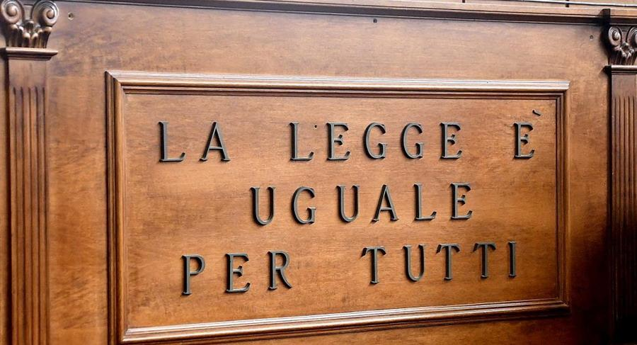
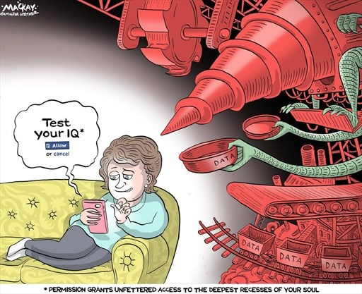
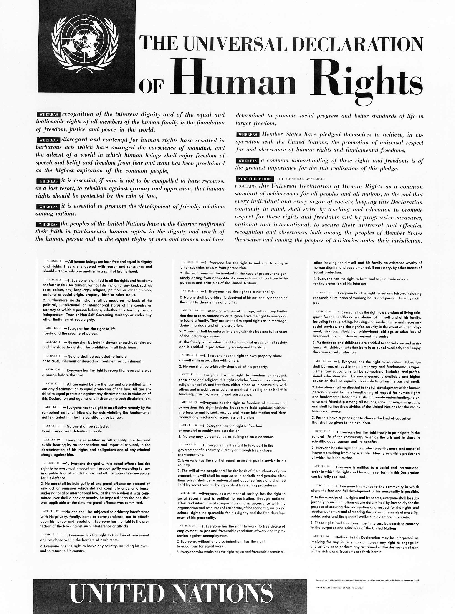
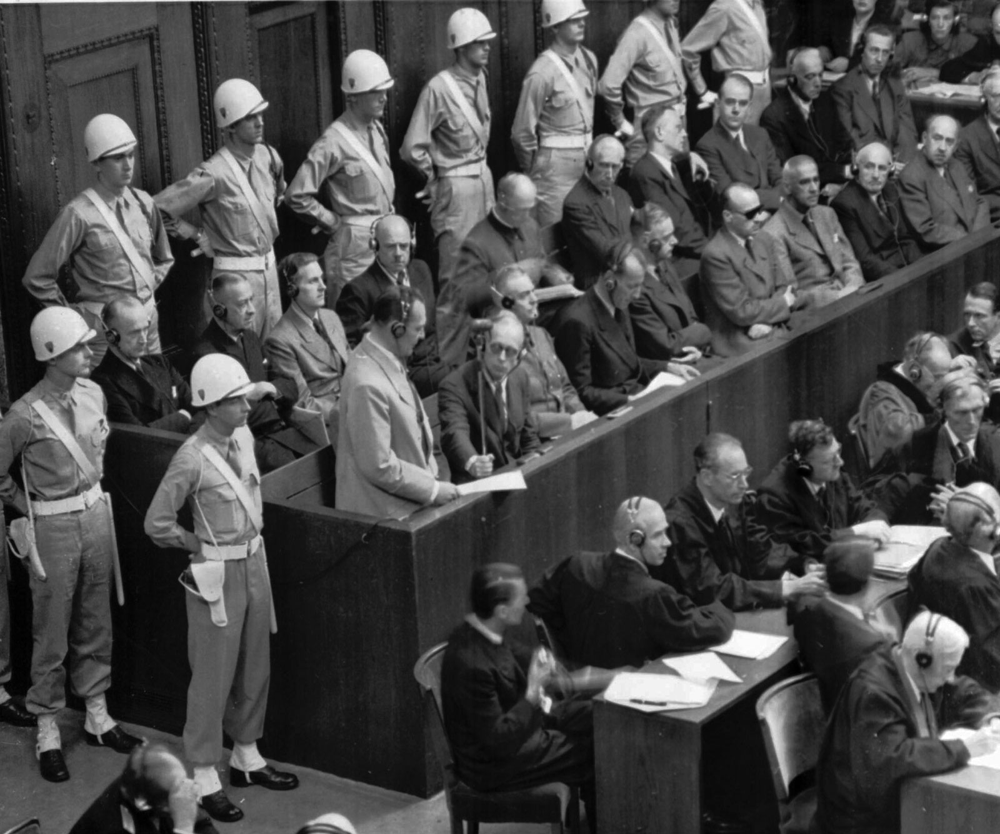
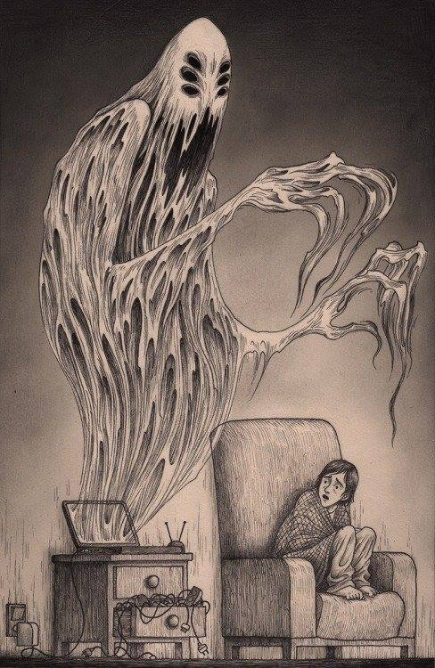
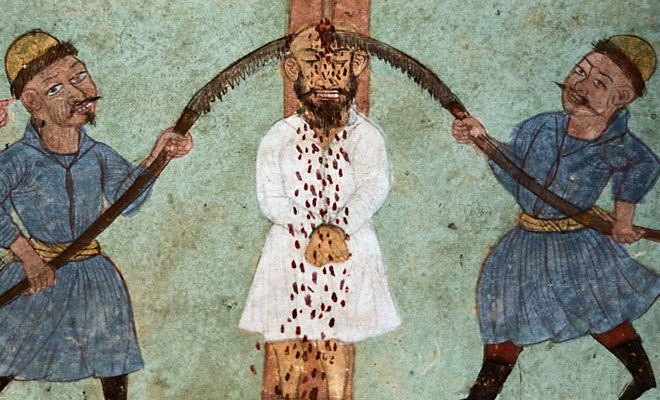

# Laws violated by this system

### How to hit hard the pyramid of "Illuminati"

All the girls start the "rise" of this fraud being a sexual slave. What does it mean? That they have to prostitute all the days, they don't gain money, and all the money is divided depending on the position in the pyramid of the different criminals. 

*Mi ex girlfriend was a slave. I love you sweetie.*

This is like **people trafficking** [[1]](https://en.wikipedia.org/wiki/Human_trafficking). But this is also **procuring** [[2]](https://en.wikipedia.org/wiki/Procuring_(prostitution)). All the criminals that are up then the first level of the sexual pyramid, the number four in Barcelona, have to respond before the law. 

But remember, those people that have started being a slave in the first step of the pyramid and suffer brain washing or others techniques and simply believe that "Illuminati" are the new order in a democratic state like Spain have, in my point of view, must be compensated from the state. They are doing a crime but many are coerced by radio frequency threats about their family. Women are threatened with their children. 

The theme is very complex and we've to build an association of cold cuts. To protect who have to be protect in front of the law. An association with good lawyers prepared in this special and vast theme. The fight against a new type of pseudo dictatorship.

In Spain **codigo penal** [[3]](https://es.wikipedia.org/wiki/C%C3%B3digo_penal) is the **criminal code** [[4]](https://en.wikipedia.org/wiki/Criminal_code) operative in the State. Those are the crimes:

- **Trata de personas** [[5]](https://es.wikipedia.org/wiki/Trata_de_personas)
- **Esclavitud** [[6]](https://es.wikipedia.org/wiki/Esclavitud)
- **Proxenitismo** [[7]](https://es.wikipedia.org/wiki/Proxenetismo)

All of them are horribles crimes that destroy **human rights** [[8]](https://en.wikipedia.org/wiki/Human_rights). Especially of women and child. And my ex girlfriend is a victim of.

*I love you.*

### How to hit every network of neural control

Like we've already said one of the tower of democracy is without any doubt privacy. In Spain, the country where i live there's a lot of laws protecting this fundamental right of the citizen. Spain is **Europe Union** [[9]](https://en.wikipedia.org/wiki/European_Union). 

- In the **Universal Declaration of Human Rights** [[10]](https://en.wikipedia.org/wiki/Universal_Declaration_of_Human_Rights) of 1948 privacy was defended and guaranteed. It says that everyone got the right to protect his **intimacy** [[11]](https://en.wikipedia.org/wiki/Intimate_relationship), family, home, **reputation** [[12]](https://en.wikipedia.org/wiki/Reputation).
- In the article 18 of the **Spanish Constitution** [[13]](https://en.wikipedia.org/wiki/Constitution_of_Spain) the right of **honor** [[14]](https://en.wikipedia.org/wiki/Honour), intimacy and personal image.
- **Organic law** [[15]](https://en.wikipedia.org/wiki/Organic_law) **11982** [[16]](https://elderecho.com/ley-organica-11982-5-mayo-proteccion-civil-del-derecho-al-honor-la-intimidad-personal-familiar-la-imagen) 
- **General Data Protection Regulation** [[17]](https://en.wikipedia.org/wiki/General_Data_Protection_Regulation) from 25 of May 2018
- Organic law **15/1999** [[18]](https://en.wikipedia.org/wiki/Ley_Org%C3%A1nica_de_Protecci%C3%B3n_de_Datos_de_Car%C3%A1cter_Personal) of December 13 of protection of **personal data** [[19]](https://en.wikipedia.org/wiki/Personal_data)
- Law **9/2014** [[20]](https://transparencia.gob.es/servicios-buscador/contenido/ley.htm?id=NORMAT_E049216014627&fcAct=2017-10-06T08:44:37.843Z&lang=es) of telecommunications that dictate the facilities of the sector. It give to them public service character and it give them the fundamental background about client's rights. 

This laws if violated could represent fines and penalties and also jail defined by the **article 197** [[21]](http://noticias.juridicas.com/base_datos/Penal/lo10-1995.l2t10.html) of the **penal code** [[22]](https://es.wikipedia.org/wiki/C%C3%B3digo_Penal_(Espa%C3%B1a)).

So like our visual cortex and auditory cortex and much more brain parts are totally under control in a remote neural control network this laws, those above are the Spanish ones, have to be held en front of a penal **judgment** [[23]](https://en.wikipedia.org/wiki/Judgement).

Those are the pains:

- prison from one to three years for disseminate facts about a person without their consent, even if they have not participated in obtaining such information.
- prison from one to four years:
  -  Seize documents or personal effects of a person without their consent.
  - Use recording, transmission or broadcasting devices without the individual's permission.
  - Treatment of a person's information without their consent in computer files or telematic records.
- prison from three to five years:
  - It is imposed when the crimes of intrusion and disclosure of information have been committed by those responsible or responsible for the processing of the files, or by their representatives.
  - Disseminate data that reveals the person's race, ideology, religion or sexual condition.
  - Disclose data relating to minors or disabled persons.
- prison from four to seven years committing the above crimes for profit.

The last point is what is break under remote neural control networks. And obviously the pain will be the maximum because for example in my case its two years that I'm below this crime in active, with subliminal voice service activated, and many years more in silent mode, or in **hide** [[24]](https://www.thesaurus.com/browse/hide) like i call it.

### How to hit the layer one magnetic field

Steam machine create a magnetic field with two analogs very powerful radio and ferrite or magnetic loop antennas. Like we've already seen. In the European Union laws electromagnetic field are regulated not speaking about outside environment but speaking about **occupational hazards** [[25]](https://en.wikipedia.org/wiki/Occupational_hazard). The same normative I think that can be applied without any problems because of the extent field provoke health diseases to all the Catalans, not only to who are connected to the remote neural monitoring network. People with for example some mechanical bypass, people that have suffered a **bypass surgery** [[26]](https://en.wikipedia.org/wiki/Bypass_surgery) could be killed in remote with this technology.

1. **Directive 2013/35/EU** [[27]](https://drive.google.com/drive/folders/1RS0fwU8V0e3iu2SyuLtiXFiiR8bJ7_In)
2. **The Control of Electromagnetic Fields at Work Regulations 2016** [[28]](https://drive.google.com/drive/folders/1RS0fwU8V0e3iu2SyuLtiXFiiR8bJ7_In)

Another consideration that it can be applied about those magnetic field is that are military technology. Those fields are created in battle sites. But Catalunya isn't in a war environment. I really don't know if there is some law that protect civilians by the use of this telecommunications extreme invasive technology.

Speaking about the Vatican Radio there is various cases of cancer denunciated by civilians over the installations near Rome.

- https://roma.repubblica.it/cronaca/2010/07/13/news/onde_elettromagnetiche-5565454/
- https://magdahavas.com/study-finds-vatican-radio-causes-cancer/

### Human rights violated

The synthetic telepathy network violate almost eleven rights declared in the **universal declaration** [[29]](https://en.wikipedia.org/wiki/Universal_Declaration_of_Human_Rights) created in 1948 by the **United Nations** [[30]](https://en.wikipedia.org/wiki/United_Nations):

1. *We are all born free and equal*. Broken because when you are a target individual is humiliated continuously by who got access in the network. 
2. *Don't discriminate*. Discrimination is done every moment in this network to induct to suicide.
3. *The right to life*. Also broken. When stalkers play with your emotions and tough your life is ridiculed en front of a lot of people seeing the virtual monitor device of the network above them head. The transmission is a mandatory.
4. *No slavery*. Slavery is the entrance for everyone in this hell, next if a person, like me, decide to fight for his rights psychological slavery in on the agenda.
5.  *No torture*.  Electronic harassments and subliminal messages are without any doubt a torture. And we're living in the twenty one century. This is not middle age.
6. *You have the same rights no matter where you go*.  Here you don't have any right.
7. *We're all equal before the law*. Also false, people that are working here have access to a system that permit rapid corruption in crypt concurrency and there are many policemen, lawyers and judges that accept this kind of corruption that is almost undetectable.
8. *Your human rights are protected by the law*. This is true but this crime is very difficult to prove so our rights aren't protected by the current law because no one explain in public how to register or to connect with a device to this network.
9. *No unfair detainment*. Stalkers of Barcelona got me arrested without any sense. Also because of corruption.
10. *The right to privacy*. Totally broken. All what we see and what we think is transmitted over the remote neural monitoring network. Image to go for cash in a dispenser, all our pin codes are intercepted. Yes because in this network they are not hackers, almost all are thieves. And I hate to steal.
11. *The right to seek a safe place to live*. If you are a target individual your private house it's not a safe place to live because of electronic harassment. 

So it's important to understand that owners of this network have to be put in jail also because they commit **crimes against humanity** [[31]](https://en.wikipedia.org/wiki/Crimes_against_humanity). 

### Nuremberger code

1. The voluntary consent of the human subject is absolutely essential.

2. The experiment should be such as to yield fruitful results for the good of society, unprocurable by other methods or means of study, and not random and unnecessary in nature.
3. The experiment should be so designed and based on the results of animal experimentation and a knowledge of the natural history of the disease or other problem under study that the anticipated results will justify the performance of the experiment.
4. The experiment should be so conducted as to avoid all unnecessary physical and mental suffering and injury.
5. No experiment should be conducted where there is an *a priori* reason to believe that death or disabling injury will occur; except, perhaps, in those experiments where the experimental physicians also serve as subjects.
6. The degree of risk to be taken should never exceed that determined by the humanitarian importance of the problem to be solved by the experiment.
7. Proper preparations should be made and adequate facilities provided to protect the experimental subject against even remote possibilities of injury, disability, or death.
8. The experiment should be conducted only by scientifically qualified persons. The highest degree of skill and care should be required through all stages of the experiment of those who conduct or engage in the experiment.
9. During the course of the experiment the human subject should be at liberty to bring the experiment to an end if he has reached the physical or mental state where continuation of the experiment seems to him to be impossible.
10. During the course of the experiment the scientist in charge must be prepared to terminate the experiment at any stage, if he has probable cause to believe, in the exercise of the good faith, superior skill and careful judgment required of him that a continuation of the experiment is likely to result in injury, disability, or death to the experimental subject.

Those are the ten points of the Nuremberger code speak about ethics in human experiments. That is exactly what the telecoms lobby do with our brains and bodies in the remote neural monitoring network. This is a worldwide problem. 

### Sexual harassment and pedophilia

In **metaverse** [[32]](https://en.wikipedia.org/wiki/Metaverse) virtual world, like the one inject in the visual and auditive cortex that is present in Barcelona because of the remote neural monitoring network from their born in the early nineties sexual violence and pedophilia are present. 

All has started with a **BBS** [[33]](https://en.wikipedia.org/wiki/Bulletin_board_system) like world called **LambdaMOO** [[34]](https://en.wikipedia.org/wiki/LambdaMOO). "**A rape in cyberspace**" [[35]](https://en.wikipedia.org/wiki/A_Rape_in_Cyberspace) is a non fiction novel that insert the reader to those world, derived from **punk** [[36]](https://en.wikipedia.org/wiki/Punk_subculture) and next **cyberpunk** [[37]](https://en.wikipedia.org/wiki/Cyberpunk) underground culture.

Speaking about nowadays existing applications we have to list:

- **IMVU** [[38]](https://en.wikipedia.org/wiki/IMVU)
- **Minecraft** [[39]](https://en.wikipedia.org/wiki/Minecraft)
- **Clash of Clans** [[40]](https://en.wikipedia.org/wiki/Clash_of_Clans)
- **World of Warcraft** [[41]](https://en.wikipedia.org/wiki/World_of_Warcraft)
- **Roblox** [[42]](https://en.wikipedia.org/wiki/Roblox)
- **Awakin Life** [[43]](https://avakin.com/)
- **Fresh Hotel** [[44]](https://fresh-hotel.org/index?novote)
- **Marvel Contest of Champions** [[45]](https://playcontestofchampions.com/)
- **SmallWorlds** [[46]](https://en.wikipedia.org/wiki/SmallWorlds)
- **Party in my Dorm** [[47]](https://www.partyinmydorm.com/)
- **Club Penguin** [[48]](https://en.wikipedia.org/wiki/Club_Penguin)

Next here a list of police documents and newspapers articles related to crimes of sexual harassment and pedophilia that have been judged in courtrooms:

- **Forensics acquisition of IMVU: a case of study** [[49]](https://drive.google.com/file/d/14Bo29G6AAz-NFWOb2jzAIX0OISTC1NOj/view?usp=sharing)
- **Crime and policing in virtual words** [[50]](http://f3magazine.unicri.it/?p=360)
- **Police powers newsletter December 2016** [[51]](https://drive.google.com/file/d/12dOrVXRC033_28VdGUCsaWJMh5EnFROt/view?usp=sharing)
- **Paedophiles using online computer games such as Minecraft to groom children** [[52]](https://www.mirror.co.uk/news/uk-news/paedophiles-using-online-computer-games-10233554)
- **Minecraft paedophile Adam Isaac groomed boys online** [[53]](https://www.bbc.com/news/uk-wales-south-east-wales-38691882)

Now that we've listed some cases presents in worlds known by the police you can image how many problems of these patter are present in a augmented reality world injected without the citizen agreement in European capital like Barcelona, here the owners of the remote neural monitoring network sell every type of black market good. It's like deep Internet but in radio frequency, and worst think is that the layer one of this technology is from radio Vatican. Are they know what happen here? Where I speak about black market I can arrive to organs and obviously to forced prostitution even of minors. And we are in Europe. But what is happening just now in pedophiles paradises like **Thailand** [[54]](https://en.wikipedia.org/wiki/Thailand) or **Cambodia** [[55]](https://en.wikipedia.org/wiki/Cambodia)? This is the question. 

Let's explore some European and Spanish laws that can be applied to those monster that eat the soul of our children. First of all I want to sensitize you, reader, that also this "**cannibal holocaust**" [[56]](https://en.wikipedia.org/wiki/Cannibal_Holocaust) like panorama has got a political goal. Always the same, populism and next Fascism. Why? I'm not against homosexuality but nowadays there is a clear loose of values in the new generations of adolescent that decide to experiment extreme sex adventures that rapidly change their mind. Why? Because they are violated continuously in this world, and we know the true but no one say nothing. And they all have child. And I've not because they systematically destroy my life. They are creating **puppets** [[57]](https://en.wikipedia.org/wiki/Puppet) very simply to manipulate.

First of all indicate that laws about virtual rape, that is the exact crime name, are not so exact in Europe.  

### Child trafficking 

First of all we've got to consider that a lot of people that are to be considered as target individuals are in reality victim of child trafficking, as probably I am. 

Children are strictly protected by a large series of international rights. Criminals, nobles or not is absolutely the same, who profit over the slavery of these children both in their trafficking and in the forced labor to which they are subjected in this network such as being a guinea pig for the development of both civil and military technology, being forced into prostitution or trafficking in drugs, weapons or other human beings are destined without a shadow of a doubt to **life imprisonment** [[65]](https://en.wikipedia.org/wiki/Life_imprisonment). Many of these plaintively children can also be exchange goods in markets where they feed on monsters: pedophiles. Or even worse to be sold for another of our land's most horrible trafficking, **organ trade** [[66]](https://en.wikipedia.org/wiki/Organ_trade). 

As far as I know i'm in neural network control from when I was born. I think that I was a **testbed** [[67]](https://en.wikipedia.org/wiki/Testbed) over which this technology was developed. 

Those are the international organs that guarantee that internationals laws have to be applied:

- **United nations** [[68]](https://en.wikipedia.org/wiki/United_Nations)
- **UNICEF** [[69]](https://en.wikipedia.org/wiki/UNICEF)
- **Safe the children** [[70]](https://en.wikipedia.org/wiki/Save_the_Children)

Those are the **children's rights** [[71]](https://en.wikipedia.org/wiki/Children's_rights) that can be applied to put in jail forever those monsters:

- **Declaration of the rights of the children.** [[72]](https://en.wikipedia.org/wiki/Declaration_of_the_Rights_of_the_Child)
- **Convention on the rights of the child.** [[73]](https://en.wikipedia.org/wiki/Convention_on_the_Rights_of_the_Child)

Obviously also the state penal code is full of laws that are applied to severely punish those criminals that can be found on the Spanish penal book:

[https://es.wikipedia.org/wiki/C%C3%B3digo_Penal_(Espa%C3%B1a)](https://es.wikipedia.org/wiki/Código_Penal_(España))

### Tortures

Ok I'm victim of tortures. And I know why, and his terrible because is from my stepfamily but in front of a lot of people. Why? As usual, money. Nothing more nothing less. Probably I'm a child victim of child trafficking and I'm a nobleman that would have a lot of coats arms. But it's only something probably. The other way is that my family is composed by mental illness people. But this true but could not be the only reason.

Above a medieval Persian torture. Nowadays tortures are done using the remote neural monitoring network. I'm victim of tecnophagy to cover a very serious identity theft crime and a very serious tax crime, and I don't even know what else. Something so terrible that my parents decide to be abusers and not to help me. Incredible but totally true. You know what they are saying? That I take drugs, that is all false.

What international and obviously local state laws are available to condemn in a court those criminals? That you know who they are. It's not so difficult simply go ahead all straight. But this is how I'm. Always all straight.

 As usual United Nations is the organ that give us all the keys useful to denunciate those abuses because simply we're living on 2020 and this is not middle ages. Torture is one of the worst crime to apply to a human, to a child, to a man, to a person, to who you've grown. It's horrible and I'm just crying writing those phrases. World have to know. Torture is defined as:

> the term "torture" means any act by which severe pain or suffering, whether physical or mental, is intentionally inflicted on a person for such purposes as obtaining from him, or a third person, information or a confession, punishing him for an act he or a third person has committed or is suspected of having committed, or intimidating or coercing him or a third person, or for any reason based on discrimination of any kind, when such pain or suffering is inflicted by or at the instigation of or with the consent or acquiescence of a public official or other person acting in an official capacity. It does not include pain or suffering arising only from, inherent in, or incidental to, lawful sanctions.

In my case the torture that I've suffered are:

- Physical and mental but done in an hidden way, using this radio network.
- The goal of those torture is obliviously **to intimidate** [[74]](https://dictionary.cambridge.org/dictionary/english/intimidate), **to coerce** [[75]](https://dictionary.cambridge.org/dictionary/english/coerce), **to discriminate** [[76]](https://dictionary.cambridge.org/dictionary/english/discriminate). 

To discriminate. I'm absolutely not a **racism** [[77]](https://en.wikipedia.org/wiki/Racism). But in this network they call me the **nigga** [[78]](https://en.wikipedia.org/wiki/Nigga). And for me it's only a pleasure because those people have suffered pains and tortures from sieges, and they are alive and very strong. For them it's because of racism. The two faces of the same medal. Little stupid **bigots** [[79]](https://en.wikipedia.org/wiki/Prejudice) I'm a nigga, a warrior. They put me in transposition without visual cortex injection but with nervous system sensation in a gay sauna. I'm not gay but I'm not **sexist** [[80]](https://en.wikipedia.org/wiki/Sexism). Gay and trans people are other class of people that have fight a lot for them rights. So I love them. And yes I'm also like them fighting for my rights but with my personal sexuality. As them. The same.

Look at those terms, nigga, gay. Who is in reality behind the tortures that I've lived? Simple. The church. Why? Simple. Money. 

The church, money? Who it is possible they are the most rich facility in the world. Why? 

Start with the options that I'm a nobleman traded in the child trafficking black market and assigned to a stepfamily by the church. I've got DNA roots of Iberians, north Africans, Greeks, south Italian, north European and **middle East** [[81]](https://en.wikipedia.org/wiki/Middle_East). In the case that I'm a noble with the two parents from a noble lineage or better saying I'm a **descent from antiquity** [[82]](https://en.wikipedia.org/wiki/Descent_from_antiquity) the church have got all the possession of my blood lineage. If they are fighting against me starting from when I was a baby assign me to people that have changed totally them behavior with myself from 2017, so to some kind of abuser prepared to do such change, it surely underline that my possessions are a lot.

And this could be the reason why I'm under torture. And why all the people that I've known before doesn't help me. Because the church have give them some part of my possessions and they are now abuser also. But I love them, someone could change.  

### External links

1. https://en.wikipedia.org/wiki/Human_trafficking

2. https://en.wikipedia.org/wiki/Procuring_(prostitution)

3. https://es.wikipedia.org/wiki/C%C3%B3digo_penal

4. https://en.wikipedia.org/wiki/Criminal_code

5. https://es.wikipedia.org/wiki/Trata_de_personas

6. https://es.wikipedia.org/wiki/Esclavitud

7. https://es.wikipedia.org/wiki/Proxenetismo

8. https://en.wikipedia.org/wiki/Human_rights

9. https://en.wikipedia.org/wiki/European_Union

10. https://en.wikipedia.org/wiki/Universal_Declaration_of_Human_Rights

11. https://en.wikipedia.org/wiki/Intimate_relationship

12. https://en.wikipedia.org/wiki/Reputation

13. https://en.wikipedia.org/wiki/Constitution_of_Spain

14. https://en.wikipedia.org/wiki/Honour

15. https://en.wikipedia.org/wiki/Organic_law

16. https://elderecho.com/ley-organica-11982-5-mayo-proteccion-civil-del-derecho-al-honor-la-intimidad-personal-familiar-la-imagen

17. https://en.wikipedia.org/wiki/General_Data_Protection_Regulation

18. https://en.wikipedia.org/wiki/Ley_Org%C3%A1nica_de_Protecci%C3%B3n_de_Datos_de_Car%C3%A1cter_Personal

19. https://en.wikipedia.org/wiki/Personal_data

20. https://transparencia.gob.es/servicios-buscador/contenido/ley.htm?id=NORMAT_E049216014627&fcAct=2017-10-06T08:44:37.843Z&lang=es

21. http://noticias.juridicas.com/base_datos/Penal/lo10-1995.l2t10.html

22. https://es.wikipedia.org/wiki/C%C3%B3digo_Penal_(Espa%C3%B1a)

23. https://en.wikipedia.org/wiki/Judgement

24. https://www.thesaurus.com/browse/hide

25. https://en.wikipedia.org/wiki/Occupational_hazard

26. https://en.wikipedia.org/wiki/Bypass_surgery

27. https://drive.google.com/drive/folders/1RS0fwU8V0e3iu2SyuLtiXFiiR8bJ7_In

28. https://drive.google.com/drive/folders/1RS0fwU8V0e3iu2SyuLtiXFiiR8bJ7_In

29. https://en.wikipedia.org/wiki/Universal_Declaration_of_Human_Rights

30. https://en.wikipedia.org/wiki/United_Nations

31. https://en.wikipedia.org/wiki/Crimes_against_humanity

32. https://en.wikipedia.org/wiki/Metaverse

33. https://en.wikipedia.org/wiki/Bulletin_board_system

34. https://en.wikipedia.org/wiki/LambdaMOO

35. https://en.wikipedia.org/wiki/A_Rape_in_Cyberspace

36. https://en.wikipedia.org/wiki/Punk_subculture

37. https://en.wikipedia.org/wiki/Cyberpunk

38. https://en.wikipedia.org/wiki/IMVU

39. https://en.wikipedia.org/wiki/Minecraft

40. https://en.wikipedia.org/wiki/Clash_of_Clans

41. https://en.wikipedia.org/wiki/World_of_Warcraft

42. https://en.wikipedia.org/wiki/Roblox

43. https://avakin.com/

44. https://fresh-hotel.org/index?novote

45. https://playcontestofchampions.com/

46. https://en.wikipedia.org/wiki/SmallWorlds

47. https://www.partyinmydorm.com/

48. https://en.wikipedia.org/wiki/Club_Penguin

49. https://drive.google.com/file/d/14Bo29G6AAz-NFWOb2jzAIX0OISTC1NOj/view?usp=sharing

50. http://f3magazine.unicri.it/?p=360

51. https://drive.google.com/file/d/12dOrVXRC033_28VdGUCsaWJMh5EnFROt/view?usp=sharing

52. https://www.mirror.co.uk/news/uk-news/paedophiles-using-online-computer-games-10233554

53. https://www.bbc.com/news/uk-wales-south-east-wales-38691882

54. https://en.wikipedia.org/wiki/Thailand

55. https://en.wikipedia.org/wiki/Cambodia

56. https://en.wikipedia.org/wiki/Cannibal_Holocaust

57. https://en.wikipedia.org/wiki/Puppet

58. https://en.wikipedia.org/wiki/Attention_deficit_hyperactivity_disorder

59. https://en.wikipedia.org/wiki/Mental_disorder

60. https://en.wikipedia.org/wiki/Neurodevelopmental_disorder

61. https://en.wikipedia.org/wiki/Emotion

62. https://en.wikipedia.org/wiki/Standardized_test

63. https://en.wikipedia.org/wiki/Self-control

64. https://en.wikipedia.org/wiki/Memory

65. https://en.wikipedia.org/wiki/Life_imprisonment

66. https://en.wikipedia.org/wiki/Organ_trade

67. https://en.wikipedia.org/wiki/Testbed

68. https://en.wikipedia.org/wiki/United_Nations

69. https://en.wikipedia.org/wiki/UNICEF

70. https://en.wikipedia.org/wiki/Save_the_Children

71. https://en.wikipedia.org/wiki/Children's_rights

72. https://en.wikipedia.org/wiki/Declaration_of_the_Rights_of_the_Child

73. https://en.wikipedia.org/wiki/Convention_on_the_Rights_of_the_Child

74. https://dictionary.cambridge.org/dictionary/english/intimidate

75. https://dictionary.cambridge.org/dictionary/english/coerce

76. https://dictionary.cambridge.org/dictionary/english/discriminate

77. https://en.wikipedia.org/wiki/Racism

78. https://en.wikipedia.org/wiki/Nigga

79. https://en.wikipedia.org/wiki/Prejudice

80. https://en.wikipedia.org/wiki/Sexism

81. https://en.wikipedia.org/wiki/Middle_East

82. https://en.wikipedia.org/wiki/Descent_from_antiquity

    

    