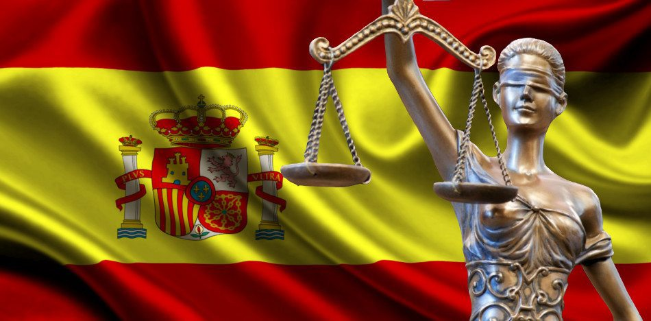

# Spanish penal code

So I live in Spain, I and my ex girlfriend are without any doubt victim of noble games. She is victim from she was a little bit more than a baby and I'm in active subliminal messages and visual auditory cortex injections from November 2017 but I think I'm victim of child trafficking between twos Marquees families from Catalunya to Liguria. Also the church probably is implied. The church and a lot of Italians that I tough they were friends of mine.

But they're not. They bet over my suicide, my virginity from when I was opened and if I masturbate. She is victim of sexual harassment and also of parimutuel betting system exactly on the contrary. How many times she fucks. Or something like that.

I've bought the Spanish penal code to find laws articles that apply in an eventual  great criminal trial against all these horrible criminals who only dared to masturbate on the body of the most beautiful woman I have ever seen: Saray.  I love you.

Those are the articles of the penal code that could be applied to defend to me and Saray in the **persecution ministry** [[1]](https://en.wikipedia.org/wiki/Prosecution_Ministry), some of them I'm not totally conscious because I'm only speaking with her in this hell network. I really don't know, but yes she is probably one of the biggest target individual in this country.

Articles or paragraphs (Spanish language):

- Delitos contra la libertad e indemnidad sexuales.
  - De las agresiones sexuales.
  - De los abusos sexuales.
  - De los abusos y agresiones sexuales a menores de diceséis años.
  - Del acoso sexual.
  - De los delitos relativos a la prostitución y a la explotación sexual y corrupción de menores.
- Delitos de la omisión del dever de soccorro.
- Delitos contra la intimidad, el derecho a la propia imagen y la inviolabilidad del domicilio.
  
  - Del descubrimiento y revelación de secretos
- Delitos contra el honor.
  - De la calumnia.
  - De la injuria.
- Delitos contra le patrimonio y contra el orden socioeconómico.
  - De los hurtos.
  - De los robos.
  - De la extorsión.
  - Del robo y hurto de uso de vehículos.
  - De la usurpación.
  - De las defraudaciones.
    - De las estafas.
- Delitos de los daños.
- Delitos relativos a la propiedad intelectual e industrial, al mercado y los consumidores.
- Delitos societarios.
- Delitos de la receptación y el blanqueo de capitales.
- Delitos relativos a la protección de la flora, fauna y animales domésticos.
- Delitos contra la salud pública.
- Delitos de las falsedades documentales.
- Delitos de la prevaricación de los funcionarios públicos y otros comportamientos injustos.
- Delitos de la desobediencia y denegación de auxilio.
- Delitos del cohecho.
- Delitos de la omisión de los deberes de impedir delitos o de promover su persecución.
- Delitos del encubrimiento.
- De la acusación y denuncia falsas y de la simulación de delitos.
- De la obstrución a la Justicia y la deslealtad profesional.
- De los delitos cometidos por los funcionarios públicos contra las garantías constitucionales.
  - De los cometidos por los funcionarios publicos contra la libertad individual.
  - De los delitos cometidos por los funcionarios públicos contra la inviolavilidad domiciliaria y demás garantías de la intimidad.
  - De los delitos cometidos por los funcionarios públicos contra otros derechos individuales.
- Delitos de las organizaciones y grupos criminales.
- Delitos de lesa humanidad.

### External links

1. https://en.wikipedia.org/wiki/Prosecution_Ministry

