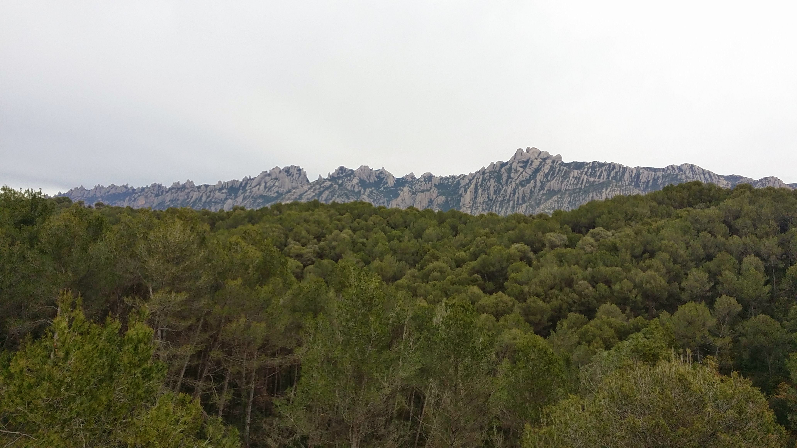

# The systematic destruction of my life

I start living in Spain in 2007. Italy start to decline in **2001** [[1]](https://en.wikipedia.org/wiki/2001_Italian_general_election) with the second electoral victory of the right wing coalition **house of freedom** [[2]](https://en.wikipedia.org/wiki/House_of_Freedoms) summit by **Silvio Berlusconi** [[3]](https://en.wikipedia.org/wiki/Silvio_Berlusconi). So i decide to go out of my country. 

In Spain from 2008 i start working in a service to customer department of a local telecommunication equipment provider, it name was **34Telecom** [[4]](http://www.34t.com/). Next i build a wireless network composed by 3500 nodes, it name is **Meswifi** [[5]](https://web.archive.org/web/20160814135328/http://meswifi.com/). But i lost it. Why? That is one of the reasons why I'm under remote neural control. 

> *And I will public explain it without any problems because of this I've lost also the love of my life.*

Those was my possessions that I've lost in this systematic destruction plot by some high end users of the worldwide remote neural control network. Some high end Spanish users and a girl from Genoa that pertain to the **Lion club** [[6]](https://en.wikipedia.org/wiki/Lions_Clubs_International) and probably to the masonic **Gran Lògia de Catalunya** [[7]](http://www.glc.cat/). For this plot my ex girlfriend, the women that I'm in love to, is victim of **sexual harassment** [[8]](https://en.wikipedia.org/wiki/Sexual_harassment) and probably her baby also. But she doesn't call me, we speak in this hell network and she was bound to induct to me to suicide acting in a fascist theater called "luz de gas" like I've already write.

> *Saray need help, please it is urgent.*

- A **wireless Internet service provider** [[9]](https://en.wikipedia.org/wiki/Wireless_Internet_service_provider) with more than 3500 clients. A business where i was legal administrator from 2013 to 2016.
  - https://boe.es/borme/dias/2013/03/26/pdfs/BORME-A-2013-58-08.pdf (search for RICCARDO GIUNTOLI)
  - https://boe.es/borme/dias/2016/11/28/pdfs/BORME-A-2016-226-08.pdf (search for RICCARDO GIUNTOLI)
- A house where i got all my possessions including a lot of computer data located in **Av. de les Palmeres, 12, 08811 Canyelles, Barcelona, Spain** [[10]](https://goo.gl/maps/9u4pJv5835CL6B1t5). The house was privately rented.
- Four motorbikes. Two registered with my name, one in Italy and the other in Spain, one that I've payed in cash and is registered to the name of the girlfriend of a man that i know, and one without registration number. 

### External links

1. https://en.wikipedia.org/wiki/2001_Italian_general_election
2. https://en.wikipedia.org/wiki/House_of_Freedoms
3. https://en.wikipedia.org/wiki/Silvio_Berlusconi
4. http://www.34t.com/
5. https://web.archive.org/web/20160814135328/http://meswifi.com/
6. https://en.wikipedia.org/wiki/Lions_Clubs_International
7. http://www.glc.cat/
8. https://en.wikipedia.org/wiki/Sexual_harassment
9. https://en.wikipedia.org/wiki/Wireless_Internet_service_provider
10. https://goo.gl/maps/9u4pJv5835CL6B1t5