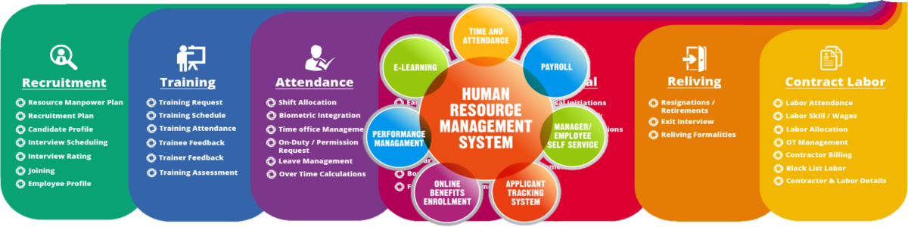

# An articulated plot

What I've lived from November 2017 is without any doubt the systematically destruction of my life. It was certainly designed by an engineer, and my father is. But here there is also an engineer, theoretically a good friend, who also works for the Italian navy. The French noble family who currently lives in Genoa is absolutely closely connected with this part of the Italian army having in his grandfather a hero of the Second World War, although certainly a fascist.

This plot has a tremendous recovery of funds both in the black market, as a source of inspiration in the world of great cinema, as a material for lower-level audiovisuals, as well as in the world of betting and pornography, as well as in the big technologies. So that is a plan or better said a completely self-sufficient although totally illegal business process. But where public figures take part who should not be involved in illegality. There is certainly talk of billions of positives. A flood of submerged markets ready to be reported to the European tax police. 

**Economia sommersa** [[1]](https://it.wikipedia.org/wiki/Economia_sommersa) in Italian.

The good part is that like there is in this virtual radio chat room and co working ambient a lot of public figures, if the victims, that I'm and also my ex girlfriend is, speak in public and denunciate this enormous black market machine them lives are not in danger. 

> Possibly I'm saving your life my love. Don't be afraid sweetie. 

Remember that they are engineer, theoretically everything should have been foreseen, and my father is an engineer who in his life has traveled all over the world and visited important international clients on behalf of three large companies:

- **Italimpianti** [[2]](https://it.wikipedia.org/wiki/Italimpianti)
- **Ansaldo** [[3]](https://it.wikipedia.org/wiki/Ansaldo)
- **Registro italiano navale** [[4]](https://it.wikipedia.org/wiki/Registro_italiano_navale)

So that a possibility even if remote once entered this terrible machine is the fact of being subjected to a kind of **sieve** [[5]](https://en.wikipedia.org/wiki/Sieve). But a sieve that once chosen the public road could cost a life. It's like a terrible **human resource management system** [[6]](https://en.wikipedia.org/wiki/Human_resource_management_system). 

### External links

1. https://it.wikipedia.org/wiki/Economia_sommersa
2. https://it.wikipedia.org/wiki/Italimpianti
3. https://it.wikipedia.org/wiki/Ansaldo
4. https://it.wikipedia.org/wiki/Registro_italiano_navale
5. https://en.wikipedia.org/wiki/Sieve
6. https://en.wikipedia.org/wiki/Human_resource_management_system

