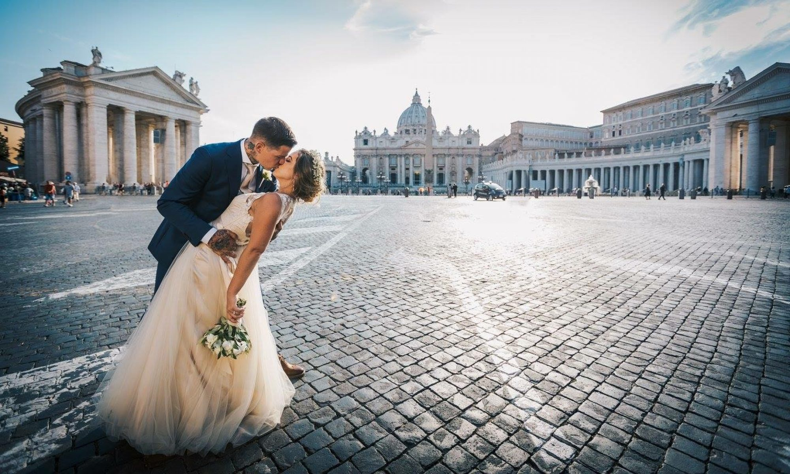

# Possible solutions

Solutions to a complex problem like what I've lived are various and touch various state, Church and nobility levels. The first solutions is to keep calm and not loose mental lucidity. To not fall in the gang stalking washing machine to not pass from an abused to an abuser. This is absolutely imperative.

### Catholic Church

My persecution start when I was 35 years old. 

From when I was fifteen years I always have been with a girlfriend. In my life I've said I love you to three girls.

In the **hypothesis** [[1]](https://en.wikipedia.org/wiki/Hypothesis) that all is about the Catholic Church and is because my mother have decided that I've to be a priest the first and more beautiful solution that I can think about is **marriage** [[2]](https://en.wikipedia.org/wiki/Marriage) using the Catholic **sacrament** [[3]](https://en.wikipedia.org/wiki/Sacrament). 

Now it's obvious that I don't have any girlfriend because of this persecution, but I'm still in love with the woman that I've try to catch up. Her name, as you know, is Saray.

She is already married but not in the Church. If your read me, sweetie, I will like to say to you that I love you. 

> Would you married me?

If this is not possible, now, after **COVID-19 pandemic** [[4]](https://en.wikipedia.org/wiki/COVID-19_pandemic) and after I finish to write about what happen to me in Spain from 2017, a democratic European state, I will rejoin normal life and society and without any doubt I will find a job a start a new life. 

> Without any doubt sure monarchy of Spain?

.jpg)

Another possible solution to go away from the neural network could be present to the Catholic Church a petition to be **excommunicated** [[5]](https://en.wikipedia.org/wiki/Excommunication). 

First of all I live in Spain but I'm Italian. But I've got  residence and nation identification document of Spain. 

### External links

1. https://en.wikipedia.org/wiki/Hypothesis
2. https://en.wikipedia.org/wiki/Marriage
3. https://en.wikipedia.org/wiki/Sacrament
4. https://en.wikipedia.org/wiki/COVID-19_pandemic
5. https://en.wikipedia.org/wiki/Excommunication