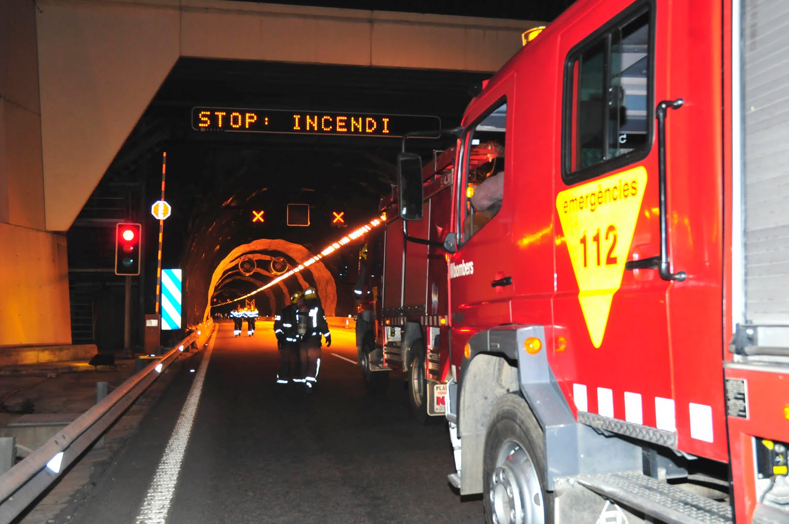

# A provoked motorbike accident

On 19 of May 2015 i privately buy a motorcycle **Yamaha** [[1]](https://en.wikipedia.org/wiki/Yamaha_Corporation) **YZF-R6** [[2]](https://en.wikipedia.org/wiki/Yamaha_YZF-R6). Fell the wind on my face is one of my favorites passions of my life, it's like sex.

Six months after on 28 of November 2015 I've got a very strange and dangerous motorbike **traffic collision** [[3]](https://en.wikipedia.org/wiki/Traffic_collision) provoked **accident** [[4]](https://en.wikipedia.org/wiki/Accident). In reality was an **attempted murder** [[5]](https://en.wikipedia.org/wiki/Attempted_murder).

> *In the "Illuminati" network they speak about bet over my life when this accident happen. They say that they have violated my ex girlfriend when I've got the accident.* 

In the afternoon i was going out from my old house in **Canyelles** [[6]](https://ca.wikipedia.org/wiki/Canyelles) in direction to Barcelona doing like usual the payment highway **C32** [[7]](https://ca.wikipedia.org/wiki/C-32).  After the last exit to **Sitges** [[8]](https://ca.wikipedia.org/wiki/Sitges) there's four tunnels that pass under the **Garraf Massif** [[9]](https://en.wikipedia.org/wiki/Garraf_Massif), a natural park.

After the highway payment system an **Opel** [[10]](https://en.wikipedia.org/wiki/Opel) **Astra G** [[11]](https://en.wikipedia.org/wiki/Opel_Astra#Astra_G_(1998%E2%80%932004)), probably of 1998 because the vehicle **Spanish registration plate** [[12]](https://en.wikipedia.org/wiki/Vehicle_registration_plates_of_Spain#1971_to_2000) that start with a B, with an high performance motor probably a **GM ecotec** [[13]](https://en.wikipedia.org/wiki/GM_Ecotec_engine) **Z22SE** [[14]](https://en.wikipedia.org/wiki/GM_Ecotec_engine#L61) went in parallel with my motorbike daring me in a highway competition. And I accept. And yes this is my fault. We start running through the tunnels and at the end of the last, the fourth, i pass in front of him. 

Next I decelerate cause him pass another time me on the right side in the **emergency lane** [[15]](https://en.wikipedia.org/wiki/Shoulder_(road)) because his shunting was very mad and in the next kilometers there was too much cars and it is all straight. And i became to decelerate arriving near the 80 km/h permitted by the traffic laws in this part of the Catalan highway.

After less than five kilometers after the highway exit near the Catalan road **C-234** [[16]](https://es.wikipedia.org/wiki/C-234_(Catalu%C3%B1a)) i've got a very strange accident. A van type **Fiat Fiorino** [[17]](https://en.wikipedia.org/wiki/Fiat_Fiorino) immediately stop in front of me and i crash with my moto. I rapidly push with an enormous pressure the front brake of the motorbike doing a parabolic jump straight beating my head near the **guard rail** [[18]](https://en.wikipedia.org/wiki/Guard_rail). And i break my left **forearm** [[19]](https://en.wikipedia.org/wiki/Forearm). And I swoon. Next police arrives to the point of the traffic accident and they take me to an **hospital** [[20]](https://es.wikipedia.org/wiki/Hospital_de_Viladecans) in the near **Viladecans** [[21]](https://en.wikipedia.org/wiki/Viladecans).

### External links

1. https://en.wikipedia.org/wiki/Yamaha_Corporation

2. https://en.wikipedia.org/wiki/Yamaha_YZF-R6

3. https://en.wikipedia.org/wiki/Traffic_collision

4. https://en.wikipedia.org/wiki/Accident

5. https://en.wikipedia.org/wiki/Attempted_murder

6. https://ca.wikipedia.org/wiki/Canyelles

7. https://ca.wikipedia.org/wiki/C-32

8. https://ca.wikipedia.org/wiki/Sitges

9. https://en.wikipedia.org/wiki/Garraf_Massif

10. https://en.wikipedia.org/wiki/Opel

11. https://en.wikipedia.org/wiki/Opel_Astra#Astra_G_(1998%E2%80%932004)

12. https://en.wikipedia.org/wiki/Vehicle_registration_plates_of_Spain#1971_to_2000

13. https://en.wikipedia.org/wiki/GM_Ecotec_engine

14. https://en.wikipedia.org/wiki/GM_Ecotec_engine#L61

15. https://en.wikipedia.org/wiki/Shoulder_(road)

16. https://es.wikipedia.org/wiki/C-234_(Catalu%C3%B1a)

17. https://en.wikipedia.org/wiki/Fiat_Fiorino

18. https://en.wikipedia.org/wiki/Guard_rail

19. https://en.wikipedia.org/wiki/Forearm

20. https://es.wikipedia.org/wiki/Hospital_de_Viladecans

21. https://en.wikipedia.org/wiki/Viladecans

    