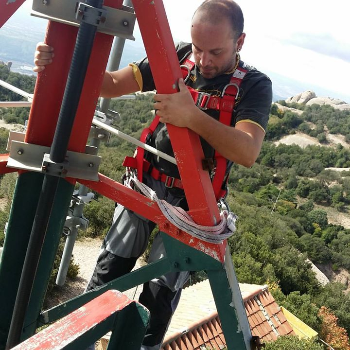
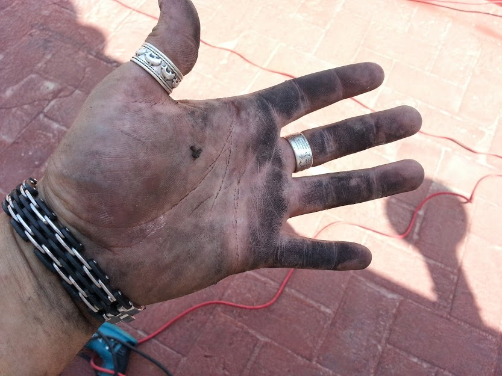
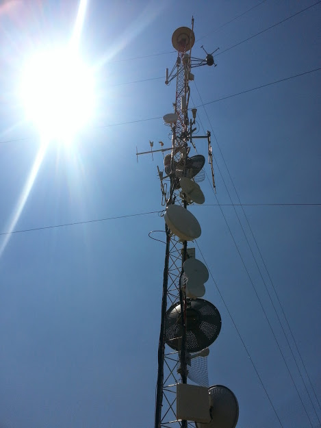
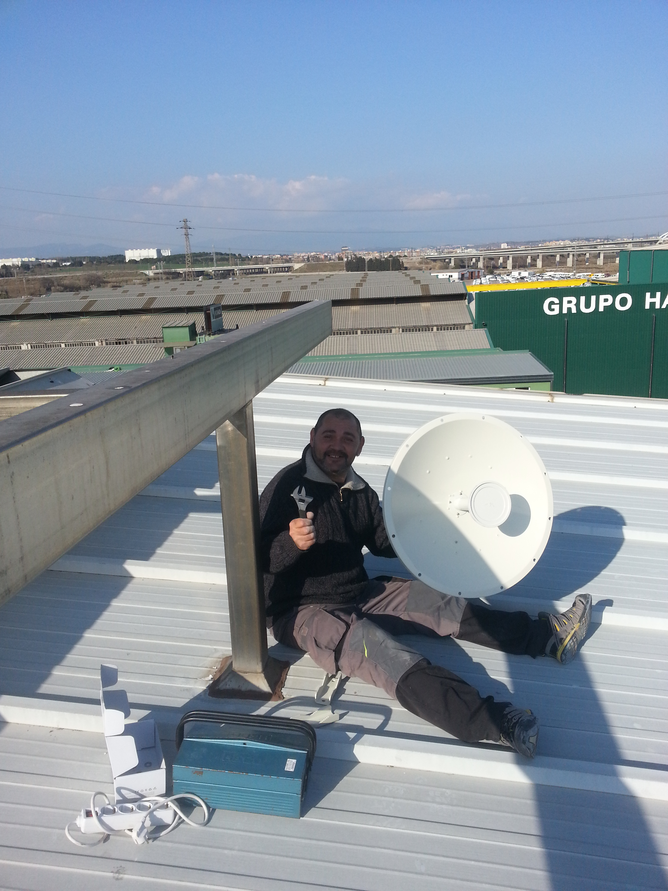
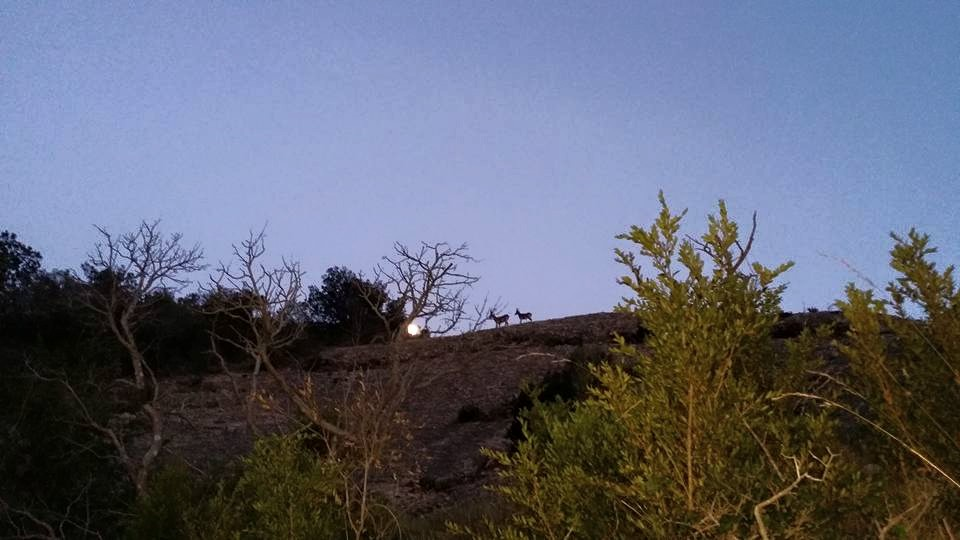

# My work, my passion and experience.

Here I'm doing my job. Job that they have stole me. Job that I've created. Job where people work in a legal way. Job that i create to join my passion for telecommunications and my passion for nature. It's not simple. I was so happy.

Above the **sant Jeroni** [[1]](https://ca.wikipedia.org/wiki/Sant_Jeroni_(Montserrat)) **Montserrat** [[2]](https://ca.wikipedia.org/wiki/Montserrat) **massif** [[3]](https://en.wikipedia.org/wiki/Massif) in the image above. 

I am a recognized entrepreneur in the world of wireless IP telecommunications both in Spain and throughout South America. I deal with **infrastructure** [[4]](https://en.wikipedia.org/wiki/Infrastructure) in areas where large ISP do not have service. I'm also a good professor about this specific technology. But I'm also a wild nature lover. 

> *They break my forearm to deny me access to this telecommunications niche.* 

In three years I gain 3500 clients. Like three hundred of big accounts. Then, after my sun flower was forced to go away, i fall in depression and they systematically destroy my life. And I have to demonstrate it. 

All was about a fiber optic connected from a rack of mine in the **Axion** [[5]](http://www.stam.cat/portfolio-posts/torre-axion/) **Tibidabo** [[6]](https://ca.wikipedia.org/wiki/Tibidabo) tower to a **Vodafone** [[7]](https://en.wikipedia.org/wiki/Vodafone) LTE rack. All was because a service contracted without my knowledge. All was about the access of my wireless Internet service provider to this world, the remote neural control network. With my infrastructure a Genoa's woman start to do what is known as the open. The "Illuminati" pseudo dictatorship start here in Catalunya six years ago. And my sweetie was sold as prostitute and i suffer the worst mental brain washing and gas lighting that humankind can image. Also my parents are involved. This is a billionaire affair. 

The grow in Catalunya of suicide is like 25% in the last 8 years. All of those or almost those suicides are caused by the "Illuminati" pseudo dictatorship. All for this fiber cable. These people that i know personally all have to be accused of crimes against humanity. They have created to digital mafia. They bet on suicide. They are terrorist. They have changed Catalunya. They have changed Italy. They have changed **Copenhagen** [[8]](https://en.wikipedia.org/wiki/Copenhagen). They are fomenting populism. And i don't know what so ever.

> *And I and Saray will not commit suicide. We need help.* 

### Chronological events in Meswifi the name of the provider

In December 2011 i was doing presential courses for the company 34Telecom. Here i know who would have been my partner in the Internet service provider. 

A closed Catalan man, from the interior. A good man, a business man. Not very cultural but with apparently good intentions. We're different, but we work together six years, like every days in remote and a lot of side by side. He went to a class of mine where i explained the use of a proprietary system operative that it's used in router and wireless equipment, **RouterOS** [[9]](https://en.wikipedia.org/wiki/MikroTik). Next he speaks to me in private and tell me to join him in his town, **Palau-solità i Plegamans** [[10]](https://en.wikipedia.org/wiki/Palau-solit%C3%A0_i_Plegamans). He wanted to start for some friends a wireless Internet service provider and yes, it is my business. Build infrastructure of services in rural zones. Where the biggest doesn't arrive. It only about give good services where the big national calculate that incomes doesn't pass in a determinate time the inversion. This is how the great ones work. In this way you don't compete with their market that theoretically it's free but in reality it's a **monopoly** [[11]](https://en.wikipedia.org/wiki/Monopoly) of a few. 

In the year 2012 i follow to work in 34Telecom and start to configure privately the WISP. At the end of the year I know Saray. In a year I've got a good patron to configure all the machines, study the correct way to install and the best method to guaranty a "work like a charm" service, secure and guarantor of privacy of my clients. The best service wireless service provider in Spain without any doubt, but also very good at European level. I've got a real good reputation in this niche market.

The first service was a simple copper **VDSL** [[12]](https://en.wikipedia.org/wiki/VDSL) dynamically divided between one hundred clients in the rural zone of **Valles Occidental** [[13]](https://ca.wikipedia.org/wiki/Vall%C3%A8s_Occidental) using first the roof of a private house in a hill near the town and interconnecting roof by roof building a start type network.

Then we start to connect to official towers. At north we decide to grow up with an old radio ham private tower in the town of **Caldes de Montbui** [[14]](https://ca.wikipedia.org/wiki/Caldes_de_Montbui) in the mountain of **Farell** [[15]](https://ca.wikipedia.org/wiki/Fort_Farell). Next was the **serralada de Marina** [[16]](https://ca.wikipedia.org/wiki/Serralada_de_Marina) tower in **sant Fost de Campsentelles** [[17]](https://ca.wikipedia.org/wiki/Sant_Fost_de_Campsentelles) a tower from the municipality.

Look at the summit antenna. It's for the magnetic steam machine. And other cable, this time **ethernet** [[18]](https://en.wikipedia.org/wiki/Ethernet), is culpable of all my adventure.

My partner was a **plumber** [[19]](https://en.wikipedia.org/wiki/Plumber). And with his experience I start to learn something about installations. Was a good professor. And in a year I start to mount point of presence and customer premises equipment like an operator, but I was the chief, but it's so important in my opinion have a complete vision of the business. And I love it, because you stay in nature all the day. We normally do three hundred kilometers for day. So thank you Adam, and thank you Miguel. 

Next was the most important one for our grow up. Sant Jeroni in Montserrat. It permit coverage on **Bages** [[20]](https://ca.wikipedia.org/wiki/Bages), **Lluçanes** [[21]](https://ca.wikipedia.org/wiki/Llu%C3%A7an%C3%A8s), **Anoia** [[22]](https://ca.wikipedia.org/wiki/Anoia), **Moianes** [[23]](https://ca.wikipedia.org/wiki/Moian%C3%A8s), **Alt Penedes** [[24]](https://ca.wikipedia.org/wiki/Alt_Pened%C3%A8s), **Llobregat** [[25]](https://ca.wikipedia.org/wiki/Llobregat). We go up the mountain with forty kilograms of goods every one. I do this fantastic walk like thirty times. Was like a dream, work but doing a mountain trip. And they stole it from me. 

> *They stole my dreams. And with the steam machine they write my dreams. They have to be stopped.* 

### External Links

1. https://ca.wikipedia.org/wiki/Sant_Jeroni_(Montserrat)

2. https://ca.wikipedia.org/wiki/Montserrat

3. https://en.wikipedia.org/wiki/Massif

4. https://en.wikipedia.org/wiki/Infrastructure

5. http://www.stam.cat/portfolio-posts/torre-axion/

6. https://ca.wikipedia.org/wiki/Tibidabo

7. https://en.wikipedia.org/wiki/Vodafone

8. https://en.wikipedia.org/wiki/Copenhagen

9. https://en.wikipedia.org/wiki/MikroTik

10. https://en.wikipedia.org/wiki/Palau-solit%C3%A0_i_Plegamans

11. https://en.wikipedia.org/wiki/Monopoly

12. https://en.wikipedia.org/wiki/VDSL

13. https://ca.wikipedia.org/wiki/Vall%C3%A8s_Occidental

14. https://ca.wikipedia.org/wiki/Caldes_de_Montbui

15. https://ca.wikipedia.org/wiki/Fort_Farell

16. https://ca.wikipedia.org/wiki/Serralada_de_Marina

17. https://ca.wikipedia.org/wiki/Sant_Fost_de_Campsentelles

18. https://en.wikipedia.org/wiki/Ethernet

19. https://en.wikipedia.org/wiki/Plumber

20. https://ca.wikipedia.org/wiki/Bages

21. https://ca.wikipedia.org/wiki/Llu%C3%A7an%C3%A8s

22. https://ca.wikipedia.org/wiki/Anoia

23. https://ca.wikipedia.org/wiki/Moian%C3%A8s

24. https://ca.wikipedia.org/wiki/Alt_Pened%C3%A8s

25. https://ca.wikipedia.org/wiki/Llobregat

    