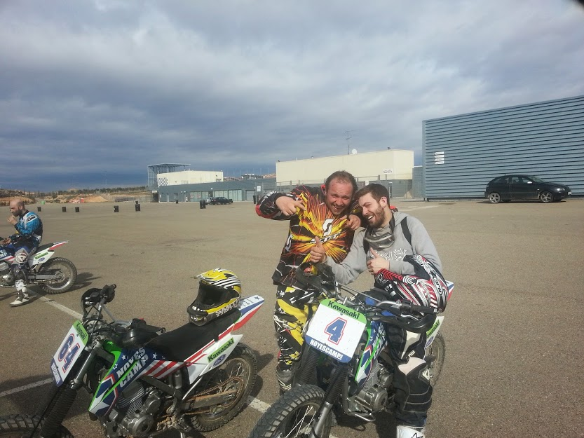

# Massimo

Massimo the boy on the right, is who I was calling brother. Why I was calling him brother? I don't know, it's only about feelings. 

He participates at the start of the fascist practice of gang stalking that I live in Barcelona. It was a machined situation extremely sad and full of tears. We was very good friends until this disaster that was  provoked by my parents and two nobles families. He participated an he preferred money to friendship. Very sad. But totally true. This was the most ridiculous but complex theater that I've seen in Barcelona and was in his house  when I had no fixed abode where to sleep. Always I've helped him to go ahead when he cannot do it. But he preferred money to friendship. Very sad.

He is a mere worker of this sick system probably led by the Genoese who devastated the freedom of Barcelona through semi-mafia rules of black market control. Barcelona was destroyed by the the noble family of Genoa that I describe in another not public chapter. The streets of Barcelona are continuously cleaned with a bad-smelling oily substance to make us forget, foreigners but well-rooted in the city, the true soul of this wonderful city. 

Someone said, completely wrong, that Barcelona is **mediocre** [[1]](http://www.treccani.it/vocabolario/mediocre/). This boy and I, who by now cannot be called brother because of various horrible gestures even to my ex-girlfriend Saray, normally said that we liked to dream in Spanish. In saying this, we simply wanted to forget the Italian language, its cadences, and those cropped pants that distinguish a completely ruined generation of uneducated boys ready to betray the best of friends. But he wasn't like that. Yes, he has always been very worried about some serious personal situations such as the loss of an old girlfriend, a loss that, at least I think, was caused by a death due to a culpable accident, that is surely an extra life destroyed by this the same system that he preferred to serve in order to avoid problems in his own family since he is fortunate to have a beautiful baby girl. The reason for being a **father** [[2]](https://en.wikipedia.org/wiki/Father) is probably a fairly important mitigating factor in his choices to betray my trust. But not enough compared to what I experienced since it was a full-blown attempted murder. I'm sorry. Betray is something related to the verb "to bet", a synonym of bet is **gambling** [[3]](https://en.wikipedia.org/wiki/Gambling).

Massimo got some dependencies problems but the worst one is gambling addiction. **Problem gambling** [[4]](https://en.wikipedia.org/wiki/Problem_gambling) is an impulse control disorder, a mental illness. Problem gambling is a **pathology** [[5]](https://en.wikipedia.org/wiki/Pathology) amplified and utilized by the owners of the remote neural monitoring network. They use people's weaknesses in order to harm third parties by using them as a link. The result of the work of these **serial killers** [[6]](https://en.wikipedia.org/wiki/Serial_killer), because they are people who dedicate themselves to suicide for economic purposes, who operate in these concessions of a masked form of state and church probably unaware of the real use of this **spectrum** [[7]](https://en.wikipedia.org/wiki/Spectrum), is the manipulation of masses more and more large citizens with key points indicated in:

- destruction of emotional ties.
- destruction of family ties.
- destruction of economic stability.
- obligations induced through fears and insecurities.
- inducement to commit crimes in order to use them as a pressure point for the obligation to commit other horrible **treason** [[8]](https://en.wikipedia.org/wiki/Treason) and sexual violence.

Massimo is victim of the noble family from Genoa from when he was an adolescent. Massimo in reality is a great barman and an incredible **juggler** [[9]](https://en.wikipedia.org/wiki/Juggling). Very clever and active he has been spoiled by the Machine. But he doesn't speak. But he doesn't sleep he has got fear that they apply dream injection to him obviously by showing him scenes of violence to his daughter or with this probably deceased girl.

> *Massimo is very similar to Saray. In reality I love them.* 

But this has to finish and they don't have the power to do this. And I will do it for them. They have divided us, but not for them. They want that I commit suicide and for them  two deaths is nothing. In this system in radio frequency they say that an enormous number of citizen have die.  

### External Links

1. http://www.treccani.it/vocabolario/mediocre/
2. https://en.wikipedia.org/wiki/Father
3. https://en.wikipedia.org/wiki/Gambling
4. https://en.wikipedia.org/wiki/Problem_gambling
5. https://en.wikipedia.org/wiki/Pathology
6. https://en.wikipedia.org/wiki/Serial_killer
7. https://en.wikipedia.org/wiki/Spectrum
8. https://en.wikipedia.org/wiki/Treason
9. https://en.wikipedia.org/wiki/Juggling

