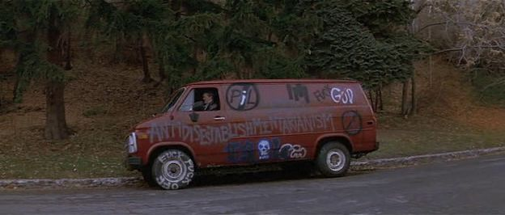
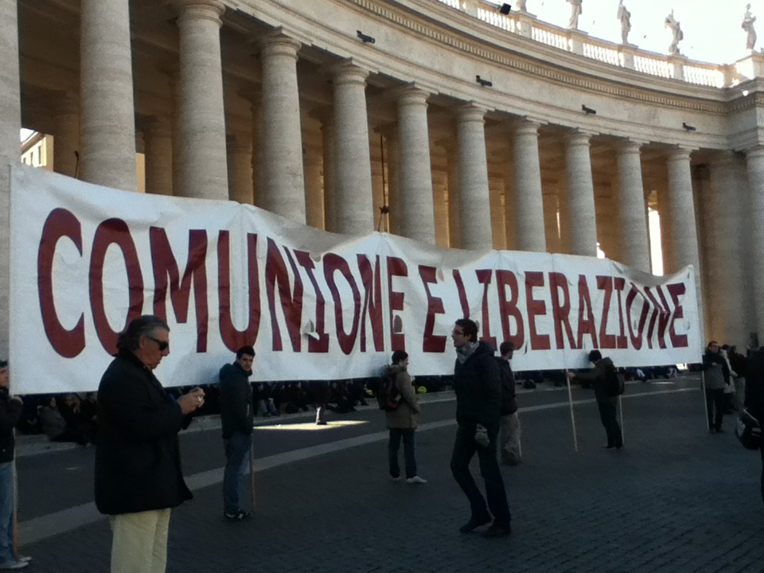

# Fatal randomness

In my life a some times someone have tried to kill me. And until now I don't understand why and I didn't start to investigate. But now I know and now I'm doing it.

All is about the remote neural monitoring network. But not the one build in Barcelona to do a "game", that is not a game is a pseudo dictatorship, the one from the governments and military forces. But I don't know exactly why I've got to die. And who want that I've to die. 

Obviously it's something connected to money, power and secrets. The Machine, the real one, I think that is assigned when you born from Vatican. Or from military and masonic lodges.

*But my parents never tell me nothing. So I don't know it.*

 Do you know **rage against the machine** [[1]](https://en.wikipedia.org/wiki/Rage_Against_the_Machine)? Machine it's this system but also **capitalism** [[2]](https://en.wikipedia.org/wiki/Capitalism).

I'll try to explain better what is exactly the arguments Vatican related, but esoteric is touched and I don't want to fall on them like all others the websites speaking about this system do.

They say that my Machine, but I don't know where it is, what kind of system is and who host it, it's identify by the **number 9**. I think that it is related to the **Italian republic** [[3]](https://en.wikipedia.org/wiki/Italy) government related, but i really don't know.

*A couple of friends of mine have die in unknown or very little documented circumstances.* 

### Bergolo fraction of Cortemilia, Italy

Look at this playbill it's from 1998 from a little fraction of **Cortemilia** [[4]](https://it.wikipedia.org/wiki/Cortemilia) **province of Cuneo** [[5]](https://it.wikipedia.org/wiki/Provincia_di_Cuneo) in **Piemonte** [[6]](https://it.wikipedia.org/wiki/Piemonte).

The name of the fraction is **Bergolo** [[7]](https://it.wikipedia.org/wiki/Bergolo) and the playbill it's from a festival, it's name was **Canté Magg** [[8]](http://www.stpauls.it/ga01/0121ga/0121ga06.htm). The literally meaning is **sing of may** [[9]](https://it.wikipedia.org/wiki/Canti_del_Maggio).

First of all look at the wikipedia article. This fraction has got only 68 residents but the article is translated in 29 languages! Next look at the "g" letter in the playbill, it's without any doubt a "9"; the "C" capital letter it's a crescent moon, the **herald** [[10]](https://en.wikipedia.org/wiki/Herald) from the important noble surname in Catalunya got the same symbol.

Here something terrible happen to me and to one of the two brothers of Francesca, the owner of the "Illuminati" game, the pseudo dictatorship facility that is killing a lot of people in Catalunya nowadays in 2019. His name was Alessandro.

*What happen to me?*

In Bergolo there was a festival, a live music festival, **country stile** [[11]](https://en.wikipedia.org/wiki/Country_music). In the country side below the summit where the old fraction got it little middle age street done with artisan old rocks people mount a **hippie** [[12]](https://en.wikipedia.org/wiki/Hippie) stile meeting. Also full of **punk** [[13]](https://en.wikipedia.org/wiki/Punk_ideologies) and others **underground culture** [[14]](https://en.wikipedia.org/wiki/Underground_culture) movements.  

Remember what I'm saying about this hell network? I speak about virtual rape, something that is described in "**a rape in cyberspace**" [[15]](https://en.wikipedia.org/wiki/A_Rape_in_Cyberspace) a novel that describe this crime done by a **cyberpunk** [[16]](https://en.wikipedia.org/wiki/Cyberpunk). 

In this festival people arrive with punk van and mount tend and some one product **LSD** [[17]](https://en.wikipedia.org/wiki/Lysergic_acid_diethylamide) papers on site. We was young and from 1996 to 1999 I use to consume trip with my friends. 

This time something was going bad the taste of the paper was not normal was a **Freddy cat** [[18]](http://www.sorted.org/diy/DIYwarnings/FFC.htm) one. I was experience a **bad trip** [[19]](https://psychonautwiki.org/wiki/Bad_trip) very intense. About eight hours of overdose like travel. And overdose of LSD is almost impossible. At the end of the bad trip i stay totally in another site with my brain, i was seeing another place. At that time I was thinking about only LSD. But no, it wasn't. It was a provoked overdose with something extremely strong that put me in bad trip but then it was a visual  and auditive brain injection with radio waves. It was what I'm calling now "deep immersion". But was the late nineties. 

Military technology evolved. Alessandro like Francesca are nephew of a second world war hero, Luigi. And I just survived, a friend of mine hid me from an ambulance that called another person and I have the exact memory. I could not move and he kept me on the ground with one foot instead of showing me to the medical staff.

*What happen to Alessandro at Cortemilia on 10 of September 2001?*

> Un lungo rettilineo affrontato a grande velocità e poi quel tornante improvviso, inaspettato, il ragazzo che perde il controllo della maximoto e vola oltre il guardrail: è morto così, all' una di sabato notte, sull' asfalto del paesino piemontese di Cortemilia, il venticinquenne genovese Alessandro [...]. Era il nipote dell' eroico ammiraglio, Luigi, che ad Alessandria d' Egitto nel dicembre del ' 41 con i mitici «maiali» della Marina Militare aveva affondato due navi inglesi (Queen Elisabeth, Vailant) ed una petroliera da sedicimila tonnellate. Alessandro, studente universitario, terzo di tre figli, poco meno di un anno fa aveva perduto il padre, Renzo, stroncato da una malattia improvvisa. Aveva deciso di trascorrere il sabato sera in compagnia di alcuni vecchi amici come Patrick Dinner, che con la fidanzata lo aveva accompagnato ad una sagra nell' entroterra, a poca distanza da Cairo Montenotte ma già in provincia di Cuneo. Secondo la ricostruzione fatta dai carabinieri della Compagnia di Alba, intervenuti sul luogo della tragedia, terminata la festa i due giovani _ entrambi in sella a moto di grossa cilindrata _ a grande velocità si sarebbero lasciati alle spalle il paese. Quasi una gara, terminata all' altezza di quella curva: entrambi sono volati a terra, ma mentre Patrick è uscito quasi illeso dall' incidente, Alessandro nonostante il casco integrale ha riportato un gravissimo trauma cranico ed è deceduto pochi minuti dopo. Ieri mattina è toccato ai militari rintracciare a Genova, nel quartiere di Sturla, la madre del ragazzo, per comunicarle la terribile notizia. Simpatico, estroverso, generoso ed amatissimo da tutti, grande appassionato di moto, Alessandro era uno dei nipoti preferiti dell' ammiraglio Luigi, medaglia d' oro e parlamentare, deceduto nel gennaio del ' 92 a 78 anni.   

A fatal motorbike accident tragedy. Near the same fraction. Three years later. An accident like what I've lived on 28 November of 2015, the start of my systematic disruption of my life in Barcelona. They say in radio frequency that they bet over my death. And I personally know all of them.

*It's this normal? I really don't think so.* 

### Communion and Liberation

From 1994 to 2001 I go to high school **Martin Luther King** [[20]](https://www.liceoking.it/) in Genoa, my born city. The normal curse was of five years of study. But I repeat two times; I never been a great scholar but I'm clever so I finish. The worst think is that the two years that I've lost was not really my fault, even if I repeat when I was eighteen I didn't study a lot.

**Communion and Liberation** [[21]](https://en.wikipedia.org/wiki/Communion_and_Liberation) is a **Catholic movement** [[22]](https://en.wikipedia.org/wiki/Catholic_movements), I call them a **sect** [[23]](https://en.wikipedia.org/wiki/Sect), very present actually in Italy and Spain. In my opinion and for my experience they work like an octopus in our democratic society. They are very dangerous in front of the ignorance deliberately cultivated in the last twenty years. Who is part of this sect legally recognized by **Opus Dei** [[24]](https://en.wikipedia.org/wiki/Opus_Dei) silently inserts itself as an insect in the fundamental links of civil society. Schools, churches, gyms, politics, associations, music clubs, activity groups, municipal infrastructure, hospitals, professional orders for example. These elements of democracy infection serve to have key points in the democracy pillars. Infiltrators, that can be interpreted as **double agents** [[25]](https://en.wikipedia.org/wiki/Double_agent) spying an enemy organization. These criminals legally recognized for a good part of the Catholic Church are what I call with the right noun, **adept** [[26]](https://en.wikipedia.org/wiki/Adept). 

*In reality those looser are only a think, fascist.* 

I frontally collide with this sept when I go to this high school, but *in reality my family is*. And no, I'm not obviously. I'm not a stupid, I'm an **atheist** [[27]](https://en.wikipedia.org/wiki/Atheism), and in **parliament** [[28]](https://en.wikipedia.org/wiki/Parliament) a sit down in the left side. As usual, in this network but i was not conscious because probably only I was under neural monitoring but I don't listen to subliminal voices messages, all was a plot. A **plot plan** [[29]](https://en.wikipedia.org/wiki/Plot_plan) is something used in **engineering** [[30]](https://en.wikipedia.org/wiki/Engineering), and my father belongs to the **order of the engineer** [[31]](https://en.wikipedia.org/wiki/Order_of_the_Engineer). A **professional order** [[32]](https://en.wikipedia.org/wiki/Professional_order) got something similar to a ritual to get in, but those are only my two cents.

In this high school i know a person that I consider like my best professor, **Liliana Boccalatte** [[33]](https://www.elencogiornalisti.it/giornalisti/scheda_giornalista/boccalatte-giuseppina-liliana/36504) teaching history and philosophy. She helps me to understand our society and real meaning of the **myth of the cave** [[34]](https://en.wikipedia.org/wiki/Myth_of_the_Cave), something very important to survive in the remote neural monitoring network, to not going mad. I love her. 

*Cheers Liliana I know that you're reading me.*

### External Links

1. https://en.wikipedia.org/wiki/Rage_Against_the_Machine
2. https://en.wikipedia.org/wiki/Capitalism
3. https://en.wikipedia.org/wiki/Italy
4. https://it.wikipedia.org/wiki/Cortemilia
5. https://it.wikipedia.org/wiki/Provincia_di_Cuneo
6. https://it.wikipedia.org/wiki/Piemonte
7. https://it.wikipedia.org/wiki/Bergolo
8. http://www.stpauls.it/ga01/0121ga/0121ga06.htm
9. https://it.wikipedia.org/wiki/Canti_del_Maggio
10. https://en.wikipedia.org/wiki/Herald
11. https://en.wikipedia.org/wiki/Country_music
12. https://en.wikipedia.org/wiki/Hippie
13. https://en.wikipedia.org/wiki/Punk_ideologies
14. https://en.wikipedia.org/wiki/Underground_culture
15. https://en.wikipedia.org/wiki/A_Rape_in_Cyberspace
16. https://en.wikipedia.org/wiki/Cyberpunk
17. https://en.wikipedia.org/wiki/Lysergic_acid_diethylamide
18. http://www.sorted.org/diy/DIYwarnings/FFC.htm
19. https://psychonautwiki.org/wiki/Bad_trip
20. https://www.liceoking.it/
21. https://en.wikipedia.org/wiki/Communion_and_Liberation
22. https://en.wikipedia.org/wiki/Catholic_movements
23. https://en.wikipedia.org/wiki/Sect
24. https://en.wikipedia.org/wiki/Opus_Dei
25. https://en.wikipedia.org/wiki/Double_agent
26. https://en.wikipedia.org/wiki/Adept
27. https://en.wikipedia.org/wiki/Atheism
28. https://en.wikipedia.org/wiki/Parliament
29. https://en.wikipedia.org/wiki/Plot_plan
30. https://en.wikipedia.org/wiki/Engineering
31. https://en.wikipedia.org/wiki/Order_of_the_Engineer
32. https://en.wikipedia.org/wiki/Professional_order
33. https://www.elencogiornalisti.it/giornalisti/scheda_giornalista/boccalatte-giuseppina-liliana/36504
34. https://en.wikipedia.org/wiki/Myth_of_the_Cave