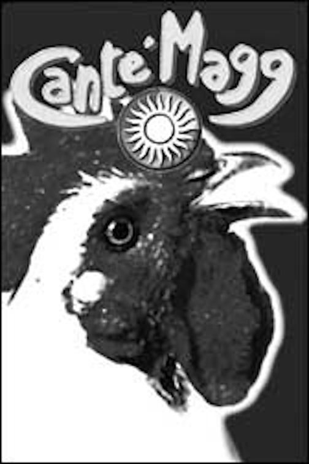

# Fatal randomness

In my life a some times someone have tried to kill me. And until now I don't understand why and I didn't start to investigate. But now I know and now I'm doing it.

All is about the remote neural monitoring network. But not the one build in Barcelona to do a "game", that is not a game is a pseudo dictatorship, the one from the governments and military forces. But I don't know exactly why I've got to die. And who want that I've to die. 

Obviously it's something connected to money, power and secrets. The Machine, the real one, I think that is assigned when you born from Vatican. Or from military and masonic lodges.

*But my parents never tell me nothing. So I don't know it.*

 Do you know **rage against the machine** [[1]](https://en.wikipedia.org/wiki/Rage_Against_the_Machine)? Machine it's this system but also **capitalism** [[2]](https://en.wikipedia.org/wiki/Capitalism).

I'll try to explain better what is exactly the arguments Vatican related, but esoteric is touched and I don't want to fall on them like all others the websites speaking about this system do.

They say that my Machine, but I don't know where it is, what kind of system is and who host it, it's identify by the **number 9**. I think that it is related to the **Italian republic** [[3]](https://en.wikipedia.org/wiki/Italy) government related, but i really don't know.

*A couple of friends of mine have die in unknown or very little documented circumstances.* 

### Bergolo fraction of Cortemilia, Italy

Look at this playbill it's from 1998 from a little fraction of **Cortemilia** [[4]](https://it.wikipedia.org/wiki/Cortemilia) **province of Cuneo** [[5]](https://it.wikipedia.org/wiki/Provincia_di_Cuneo) in **Piemonte** [[6]](https://it.wikipedia.org/wiki/Piemonte).

The name of the fraction is **Bergolo** [[7]](https://it.wikipedia.org/wiki/Bergolo) and the playbill it's from a festival, it's name was **Canté Magg** [[8]](http://www.stpauls.it/ga01/0121ga/0121ga06.htm). The literally meaning is **sing of may** [[9]](https://it.wikipedia.org/wiki/Canti_del_Maggio).

First of all look at the wikipedia article. This fraction has got only 68 residents but the article is translated in 29 languages! Next look at the "g" letter in the playbill, it's without any doubt a "9"; the "C" capital letter it's a crescent moon, the **herald** [[10]](https://en.wikipedia.org/wiki/Herald) from the important noble surname in Catalunya got the same symbol.

Here something terrible happen to me and to one of the two brothers of Francesca, the owner of the "Illuminati" game, the pseudo dictatorship facility that is killing a lot of people in Catalunya nowadays in 2019. His name was Alessandro.

*What happen to me?*

In Bergolo there was a festival, a live music festival, **country stile** [[11]](https://en.wikipedia.org/wiki/Country_music). In the country side below the summit where the old fraction got it little middle age street done with artisan old rocks people mount a **hippie** [[12]](https://en.wikipedia.org/wiki/Hippie) stile meeting. Also full of **punk** [[13]](https://en.wikipedia.org/wiki/Punk_ideologies) and others **underground culture** [[14]](https://en.wikipedia.org/wiki/Underground_culture) movements.  

Remember what I'm saying about this hell network? I speak about virtual rape, something that is described in "**a rape in cyberspace**" [[15]](https://en.wikipedia.org/wiki/A_Rape_in_Cyberspace) a novel that describe this crime done by a **cyberpunk** [[16]](https://en.wikipedia.org/wiki/Cyberpunk). 

In this festival people arrive with punk van and mount tend and some one product **LSD** [[17]](https://en.wikipedia.org/wiki/Lysergic_acid_diethylamide) papers on site. We was young and from 1996 to 1999 I use to consume trip with my friends. 

This time something was going bad the taste of the paper was not normal was a **Freddy cat** [[18]](http://www.sorted.org/diy/DIYwarnings/FFC.htm) one. I was experience a **bad trip** [[19]](https://psychonautwiki.org/wiki/Bad_trip) very intense. About eight hours of overdose like travel. And overdose of LSD is almost impossible. At the end of the bad trip i stay totally in another site with my brain, i was seeing another place. At that time I was thinking about only LSD. But no, it wasn't. It was a provoked overdose with something extremely strong that put me in bad trip but then it was a visual  and auditive brain injection with radio waves. It was what I'm calling now "deep immersion". But was the late nineties. 

Military technology evolved. Alessandro like Francesca are nephew of a second world war hero, Luigi. And I just survived, a friend of mine hid me from an ambulance that called another person and I have the exact memory. I could not move and he kept me on the ground with one foot instead of showing me the medical staff.

*What happen to Alessandro?*  

### External Links

1. https://en.wikipedia.org/wiki/Rage_Against_the_Machine
2. https://en.wikipedia.org/wiki/Capitalism
3. https://en.wikipedia.org/wiki/Italy
4. https://it.wikipedia.org/wiki/Cortemilia
5. https://it.wikipedia.org/wiki/Provincia_di_Cuneo
6. https://it.wikipedia.org/wiki/Piemonte
7. https://it.wikipedia.org/wiki/Bergolo
8. http://www.stpauls.it/ga01/0121ga/0121ga06.htm
9. https://it.wikipedia.org/wiki/Canti_del_Maggio
10. https://en.wikipedia.org/wiki/Herald
11. https://en.wikipedia.org/wiki/Country_music
12. https://en.wikipedia.org/wiki/Hippie
13. https://en.wikipedia.org/wiki/Punk_ideologies
14. https://en.wikipedia.org/wiki/Underground_culture
15. https://en.wikipedia.org/wiki/A_Rape_in_Cyberspace
16. https://en.wikipedia.org/wiki/Cyberpunk
17. https://en.wikipedia.org/wiki/Lysergic_acid_diethylamide
18. http://www.sorted.org/diy/DIYwarnings/FFC.htm
19. https://psychonautwiki.org/wiki/Bad_trip