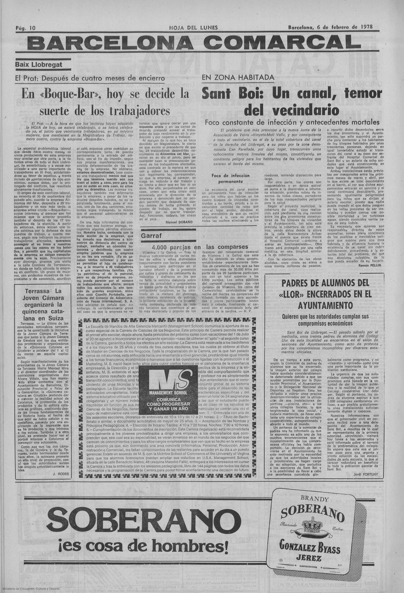
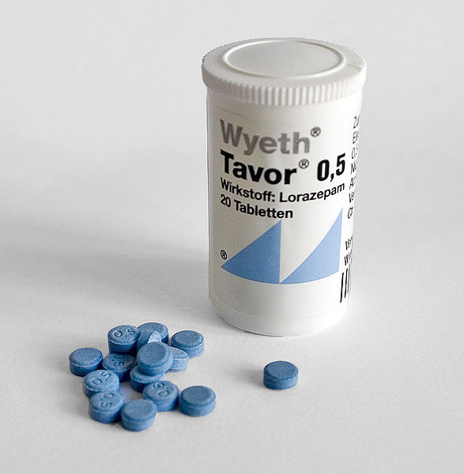
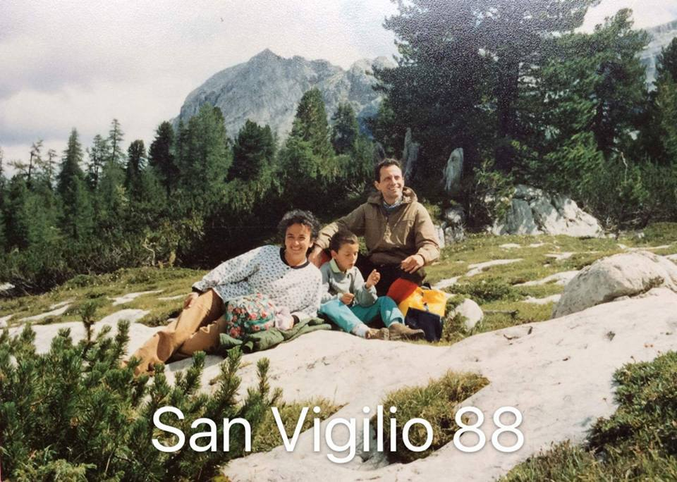
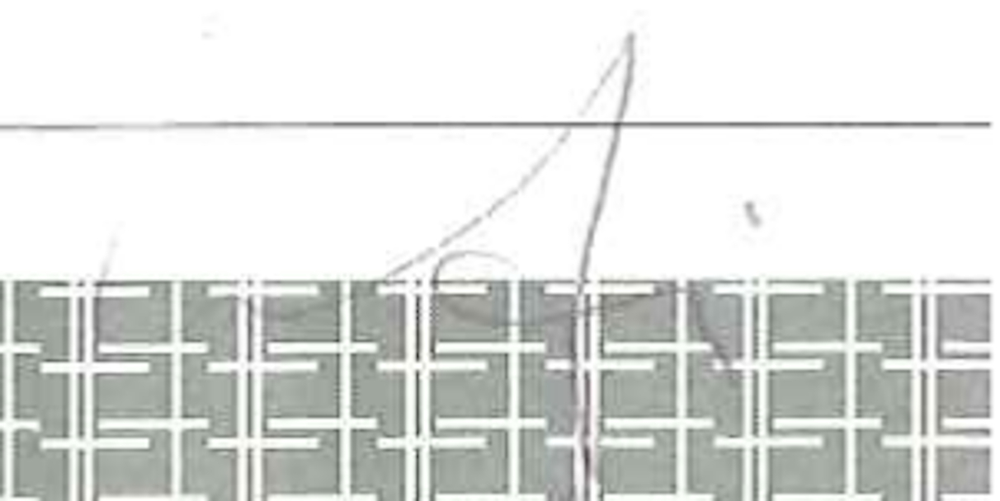
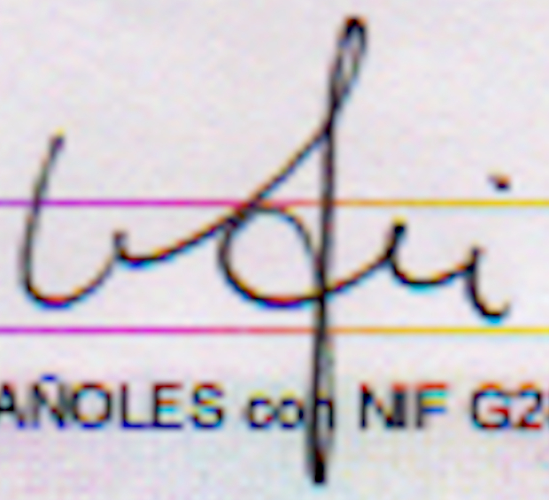

# Fatal randomness

In my life a some times someone have tried to kill me. And until now I don't understand why and I didn't start to investigate. But now I know and now I'm doing it.

All is about the remote neural monitoring network. But not the one build in Barcelona to do a "game", that is not a game is a pseudo dictatorship, the one from the governments and military forces. But I don't know exactly why I've got to die. And who want that I've to die. 

Obviously it's something connected to money, power and secrets. The Machine, the real one, I think that is assigned when you born from Vatican. Or from military and masonic lodges.

*But my parents never tell me nothing. So I don't know it.*

 Do you know **rage against the machine** [[1]](https://en.wikipedia.org/wiki/Rage_Against_the_Machine)? Machine it's this system but also **capitalism** [[2]](https://en.wikipedia.org/wiki/Capitalism).

I'll try to explain better what is exactly the arguments Vatican related, but esoteric is touched and I don't want to fall on them like all others the websites speaking about this system do.

They say that my Machine, but I don't know where it is, what kind of system is and who host it, it's identify by the **number 9**. I think that it is related to the **Italian republic** [[3]](https://en.wikipedia.org/wiki/Italy) government related, but i really don't know.

*A couple of friends of mine have die in unknown or very little documented circumstances.* 

### My parents' honeymoon

My parents honeymoon was a cruise in the Mediterranean, the year was '78 like the newspaper above. Remember the figure of the butcher that I've got described? He is known also as the owl. In radio frequency in the subliminal message voice system of the synthetic telepathy network they know each other. What I know is that my parents went to Barcelona when they got married by the church. I don't really know if they went here others times. They have always been very cryptic.

My father has always speak in a very bad way about Spanish people. But I think that in reality they are very connected. 

*Markets and merchandise? Probably but I really don't know.*

### When I was born

From when I was born on 31 of March of 1981, in Genova at 17:50:28 at **Galliera hospital** [[4]](https://it.wikipedia.org/wiki/Ente_ospedaliero_Ospedali_Galliera), my mother fall in deep psychosis. Anxiety, depression and insomnia. She take benzoziapepine at industrial levels from about thirty five years! Yes she is a drugs addicted. 

But why she is addicted and why just after my birth? 

I don't know. Probably is something church related. I know that they thought that i was a girl and my name had to be Jennifer, in English because my grandmother was from Florida, US. I don't know. *Are they my parents*? Or my case is something like this:

https://www.mirror.co.uk/news/world-news/mum-raised-wrong-daughter-30-10632774

### A strange car accident

In 1988 or 1989 in a mountain road near **san Vigilio di Marebbe** [[4]](https://it.wikipedia.org/wiki/San_Vigilio_(Marebbe)) a town in **south Tyrol** [[5]](https://en.wikipedia.org/wiki/South_Tyrol) direction to 
**Pederü** [[6]](https://it.wikipedia.org/wiki/Rifugio_Peder%C3%BC) in the Rudo Valley was winter and the season was very cold. My father was driving a **Fiat Ritmo** [[7]](https://en.wikipedia.org/wiki/Fiat_Ritmo) metallic blue without winter wheel. The road was full of ice. In a left turn the front of the car skated and with and the muzzle positioned itself frontally against the mountain; my father, perhaps without consciousness but the maneuver was very risky, instead of choking frontally at low speed in a safe area that was the side of the mountain on the left, He decided to turn sharply *to the right* on an icy road resulting in a round of one hundred and eighty meters putting the car in the front direction of an **overhang** [[8]](https://en.wikipedia.org/wiki/Overhang_(rock_formation)) of at least twenty meters vertical jump and then end up in a bed of a totally frozen river. That is, he turned completely *in the direction of a sure death*. Chance wanted, and sometimes only in this exact case probably some superior entity, that a small fir wood stake of at least twenty centimeters in diameter parried the machine hovering between the road and the overhang with practically a third of it already outside from the fit. We didn't die for a plume.

Why he went in the cold valley on winter without snow tires or not even chains? Here in winter there's nothing to do. 

*I really don't know.*

> They know what happen to me in Catalunya, they know because I listen to them in radio frequency. What they've done is to take away the possibility of having that smile that they had in this beautiful photo in the mountains. The possibility of having a son like them they had and the possibility of loving the woman who fell in love with me only to see her. This is the truth about my personal tragedy in the neuronal control network. *"brutto coglione"* he humiliates me every second of the day.

### Bergolo fraction of Cortemilia, Italy

Look at this playbill it's from 1998 from a little fraction of **Cortemilia** [[4]](https://it.wikipedia.org/wiki/Cortemilia) **province of Cuneo** [[5]](https://it.wikipedia.org/wiki/Provincia_di_Cuneo) in **Piemonte** [[6]](https://it.wikipedia.org/wiki/Piemonte).

The name of the fraction is **Bergolo** [[7]](https://it.wikipedia.org/wiki/Bergolo) and the playbill it's from a festival, it's name was **Canté Magg** [[8]](http://www.stpauls.it/ga01/0121ga/0121ga06.htm). The literally meaning is **sing of may** [[9]](https://it.wikipedia.org/wiki/Canti_del_Maggio).

First of all look at the wikipedia article. This fraction has got only 68 residents but the article is translated in 29 languages! Next look at the "g" letter in the playbill, it's without any doubt a "9"; the "C" capital letter it's a crescent moon, the **herald** [[10]](https://en.wikipedia.org/wiki/Herald) from the important noble surname in Catalunya got the same symbol.

Here something terrible happen to me and to one of the two brothers of Francesca, the owner of the "Illuminati" game, the pseudo dictatorship facility that is killing a lot of people in Catalunya nowadays in 2019. His name was Alessandro.

*What happen to me?*

In Bergolo there was a festival, a live music festival, **country stile** [[11]](https://en.wikipedia.org/wiki/Country_music). In the country side below the summit where the old fraction got it little middle age street done with artisan old rocks people mount a **hippie** [[12]](https://en.wikipedia.org/wiki/Hippie) stile meeting. Also full of **punk** [[13]](https://en.wikipedia.org/wiki/Punk_ideologies) and others **underground culture** [[14]](https://en.wikipedia.org/wiki/Underground_culture) movements.  

Remember what I'm saying about this hell network? I speak about virtual rape, something that is described in "**a rape in cyberspace**" [[15]](https://en.wikipedia.org/wiki/A_Rape_in_Cyberspace) a novel that describe this crime done by a **cyberpunk** [[16]](https://en.wikipedia.org/wiki/Cyberpunk). 

In this festival people arrive with punk van and mount tend and some one product **LSD** [[17]](https://en.wikipedia.org/wiki/Lysergic_acid_diethylamide) papers on site. We was young and from 1996 to 1999 I use to consume trip with my friends. 

This time something was going bad the taste of the paper was not normal was a **Freddy cat** [[18]](http://www.sorted.org/diy/DIYwarnings/FFC.htm) one. I was experience a **bad trip** [[19]](https://psychonautwiki.org/wiki/Bad_trip) very intense. About eight hours of overdose like travel. And overdose of LSD is almost impossible. At the end of the bad trip i stay totally in another site with my brain, i was seeing another place. At that time I was thinking about only LSD. But no, it wasn't. It was a provoked overdose with something extremely strong that put me in bad trip but then it was a visual  and auditive brain injection with radio waves. It was what I'm calling now "deep immersion". But was the late nineties. 

Military technology evolved. Alessandro like Francesca are nephew of a second world war hero, Luigi. And I just survived, a friend of mine hid me from an ambulance that called another person and I have the exact memory. I could not move and he kept me on the ground with one foot instead of showing me to the medical staff.

*What happen to Alessandro at Cortemilia on 10 of September 2001?*

> Un lungo rettilineo affrontato a grande velocità e poi quel tornante improvviso, inaspettato, il ragazzo che perde il controllo della maximoto e vola oltre il guardrail: è morto così, all' una di sabato notte, sull' asfalto del paesino piemontese di Cortemilia, il venticinquenne genovese Alessandro [...]. Era il nipote dell' eroico ammiraglio, Luigi, che ad Alessandria d' Egitto nel dicembre del ' 41 con i mitici «maiali» della Marina Militare aveva affondato due navi inglesi (Queen Elisabeth, Vailant) ed una petroliera da sedicimila tonnellate. Alessandro, studente universitario, terzo di tre figli, poco meno di un anno fa aveva perduto il padre, Renzo, stroncato da una malattia improvvisa. Aveva deciso di trascorrere il sabato sera in compagnia di alcuni vecchi amici come Patrick Dinner, che con la fidanzata lo aveva accompagnato ad una sagra nell' entroterra, a poca distanza da Cairo Montenotte ma già in provincia di Cuneo. Secondo la ricostruzione fatta dai carabinieri della Compagnia di Alba, intervenuti sul luogo della tragedia, terminata la festa i due giovani _ entrambi in sella a moto di grossa cilindrata _ a grande velocità si sarebbero lasciati alle spalle il paese. Quasi una gara, terminata all' altezza di quella curva: entrambi sono volati a terra, ma mentre Patrick è uscito quasi illeso dall' incidente, Alessandro nonostante il casco integrale ha riportato un gravissimo trauma cranico ed è deceduto pochi minuti dopo. Ieri mattina è toccato ai militari rintracciare a Genova, nel quartiere di Sturla, la madre del ragazzo, per comunicarle la terribile notizia. Simpatico, estroverso, generoso ed amatissimo da tutti, grande appassionato di moto, Alessandro era uno dei nipoti preferiti dell' ammiraglio Luigi, medaglia d' oro e parlamentare, deceduto nel gennaio del ' 92 a 78 anni.   

A fatal motorbike accident tragedy. Near the same fraction. Three years later. An accident like what I've lived on 28 November of 2015, the start of my systematic disruption of my life in Barcelona. They say in radio frequency that they bet over my death. And I personally know all of them.

*It's this normal? I really don't think so.* 

### Communion and Liberation

From 1994 to 2001 I go to high school **Martin Luther King** [[20]](https://www.liceoking.it/) in Genoa, my born city. The normal curse was of five years of study. But I repeat two times; I never been a great scholar but I'm clever so I finish. The worst think is that the two years that I've lost was not really my fault, even if I repeat when I was eighteen I didn't study a lot.

**Communion and Liberation** [[21]](https://en.wikipedia.org/wiki/Communion_and_Liberation) is a **Catholic movement** [[22]](https://en.wikipedia.org/wiki/Catholic_movements), I call them a **sect** [[23]](https://en.wikipedia.org/wiki/Sect), very present actually in Italy and Spain. In my opinion and for my experience they work like an octopus in our democratic society. They are very dangerous in front of the ignorance deliberately cultivated in the last twenty years. Who is part of this sect legally recognized by **Opus Dei** [[24]](https://en.wikipedia.org/wiki/Opus_Dei) silently inserts itself as an insect in the fundamental links of civil society. Schools, churches, gyms, politics, associations, music clubs, activity groups, municipal infrastructure, hospitals, professional orders for example. These elements of democracy infection serve to have key points in the democracy pillars. Infiltrators, that can be interpreted as **double agents** [[25]](https://en.wikipedia.org/wiki/Double_agent) spying an enemy organization. These criminals legally recognized for a good part of the Catholic Church are what I call with the right noun, **adept** [[26]](https://en.wikipedia.org/wiki/Adept). 

*In reality those looser are only a think, fascist.* 

I frontally collide with this sept when I go to this high school. And no, I'm not obviously. I'm not a stupid, I'm an **atheist** [[27]](https://en.wikipedia.org/wiki/Atheism), and in **parliament** [[28]](https://en.wikipedia.org/wiki/Parliament) a sit down in the left side. As usual, in this network but i was not conscious because probably only I was under neural monitoring but I don't listen to subliminal voices messages, all was a plot. A **plot plan** [[29]](https://en.wikipedia.org/wiki/Plot_plan) is something used in **engineering** [[30]](https://en.wikipedia.org/wiki/Engineering), and my father belongs to the **order of the engineer** [[31]](https://en.wikipedia.org/wiki/Order_of_the_Engineer). A **professional order** [[32]](https://en.wikipedia.org/wiki/Professional_order) got something similar to a ritual to get in, but those are only my two cents.

In this high school i know a person that I consider like my best professor, **Liliana Boccalatte** [[33]](https://www.elencogiornalisti.it/giornalisti/scheda_giornalista/boccalatte-giuseppina-liliana/36504) teaching history and philosophy. She helps me to understand our society and real meaning of the **myth of the cave** [[34]](https://en.wikipedia.org/wiki/Myth_of_the_Cave), something very important to survive in the remote neural monitoring network, to not going mad. I love her. 

*Cheers Liliana I know that you're reading me.*

In that ridiculous, as usual because those adept in reality are poor little stupids nothing more, plot I've lost two years fighting in a semi silent mode with those insects that are professors in the institute and in different courses catch new victims to manipulate searching for boys and girls with difficult family situations to recruit new adept or in this way of mean new soldiers. Because those structures are paramilitary. Like in the "Illuminati" pseudo dictatorship. 

I have found three or four totally masked in the organization chart and quickly referred to what was the principal of the institute. 

For me the fraud "Illuminati" that have induct to suicide an enormous number of victims and reduce to be a little narcos  or prostitute another enormous number is something that have been elaborated from this sept.

### My father signs

This is the old sign of my father, this sign is from 2009. You can appreciate an "A" capital cursive letter in the middle of the sign. The "A" is the first letter of the butcher's name.

This is the new sign sign of my father. It's so strange that a very precise engineer has changed his sign. In the middle you can appreciate a "f" cursive letter, but not capital.

  "F" is the first letter of the name of the stupid little bitch that now conduct the "Illuminati" pseudo dictatorship that is changing Europe. A plague in our democracy.

### Friends of mine that have died in strange circumstances

In Genoa in the last thirty years a couple of friends or known people have died in accidents, overdose or suicide:

- Giovanni Tabacco, car accident near **Recco** [[40]](https://it.wikipedia.org/wiki/Recco), Genoa.
- Emanuele, commit suicide in **Acquasola** [[41]](https://it.wikipedia.org/wiki/Spianata_dell%27Acquasola) district Genoa. Brother of the wife of a good friend. He is also in this network. 
- A boy die for **ketamine** [[42]](https://psychonautwiki.org/wiki/Ketamine) overdose in a house in **Corso Aurelio Saffi** [[43]](https://www.google.com/maps/place/Corso+Aurelio+Saffi,+Genova+GE,+Italy/@44.3979061,8.9355303,17z/data=!3m1!4b1!4m5!3m4!1s0x12d343c5a4e06421:0x26cb8b4657199e8a!8m2!3d44.3979061!4d8.937719). Very strange in the nineties and fatal ketamine overdose are particularly rare,  but not unheard of. However, the exact toxic dosage is unknown. So it was something like what I've lived with LSD, this is almost surely not ketamine.  
- **GianMaria Vincenti** [[44]](https://ricerca.repubblica.it/repubblica/archivio/repubblica/2004/12/19/albaro-ventenne-si-schianta-in-moto.html) die for a motorbike accident at very low speed in an intersection in Albaro district, Genoa. We cry a lot, rest in peace my very good friend. He died at 22 years old on 19 of December 2004. 
- Cristian Sessarego commit suicide in a psychiatric hospital. **Clinica Maugeri** [[45\]](https://www.icsmaugeri.it/dove-siamo/ics-genova-nervi). An **article** [[46\]](http://www.genovatoday.it/cronaca/nervi-suicidio-ospedale.html) in a local newspaper say that he was mental sick. *But no he wasn't*. He was a great man. One victim of this criminal system. This is the true. 12 May of 2016 at 9:30.

Now rest in peace of you, my friends.

Let's start with some considerations. First of all I really don't like esotericism, **occultism** [[47]](https://en.wikipedia.org/wiki/Occult) and secrets. Not even **numerology** [[48]](https://en.wikipedia.org/wiki/Numerology), **astrology** [[49]](https://en.wikipedia.org/wiki/Astrology) and **mysticism** [[50]](https://en.wikipedia.org/wiki/Mysticism). But I can find and reveal them. They are all done to create mental confusion, sept, adepts, ignorance and death. But remember if you know the correct interpretation keys you can understand about masonry, clubs and nobles. And save life. And help victims. And help target individuals, the in this key of read are masonry victims lost in **rituals** [[51]](https://en.wikipedia.org/wiki/Ritual). 

> *In those deaths the number 9 is always present. In subliminal messages voice services they say that I've got the Machine number 9. They call this the world backwards the 9 there is the 6 here. 666 is the number of the beast. What I think about? The machine number doesn't exist and who is victim got this number.* 

Me and Saray are victims of a sept. Please help. But what are sept? Games of nobles to obtain money with prostitution, drugs, betting and so son. They call this game and they play with our life.

### External Links

1. https://en.wikipedia.org/wiki/Rage_Against_the_Machine
2. https://en.wikipedia.org/wiki/Capitalism
3. https://en.wikipedia.org/wiki/Italy
4. https://it.wikipedia.org/wiki/Ente_ospedaliero_Ospedali_Galliera
5. https://it.wikipedia.org/wiki/San_Vigilio_(Marebbe)
6. https://en.wikipedia.org/wiki/South_Tyrol
7. [https://it.wikipedia.org/wiki/Rifugio_Peder%C3%BC](https://it.wikipedia.org/wiki/Rifugio_Pederü)
8. https://en.wikipedia.org/wiki/Fiat_Ritmo
9. https://it.wikipedia.org/wiki/Cortemilia
10. https://it.wikipedia.org/wiki/Provincia_di_Cuneo
11. https://it.wikipedia.org/wiki/Piemonte
12. https://it.wikipedia.org/wiki/Bergolo
13. http://www.stpauls.it/ga01/0121ga/0121ga06.htm
14. https://it.wikipedia.org/wiki/Canti_del_Maggio
15. https://en.wikipedia.org/wiki/Herald
16. https://en.wikipedia.org/wiki/Country_music
17. https://en.wikipedia.org/wiki/Hippie
18. https://en.wikipedia.org/wiki/Punk_ideologies
19. https://en.wikipedia.org/wiki/Underground_culture
20. https://en.wikipedia.org/wiki/A_Rape_in_Cyberspace
21. https://en.wikipedia.org/wiki/Cyberpunk
22. https://en.wikipedia.org/wiki/Lysergic_acid_diethylamide
23. http://www.sorted.org/diy/DIYwarnings/FFC.htm
24. https://psychonautwiki.org/wiki/Bad_trip
25. https://www.liceoking.it/
26. https://en.wikipedia.org/wiki/Communion_and_Liberation
27. https://en.wikipedia.org/wiki/Catholic_movements
28. https://en.wikipedia.org/wiki/Sect
29. https://en.wikipedia.org/wiki/Opus_Dei
30. https://en.wikipedia.org/wiki/Double_agent
31. https://en.wikipedia.org/wiki/Adept
32. https://en.wikipedia.org/wiki/Atheism
33. https://en.wikipedia.org/wiki/Parliament
34. https://en.wikipedia.org/wiki/Plot_plan
35. https://en.wikipedia.org/wiki/Engineering
36. https://en.wikipedia.org/wiki/Order_of_the_Engineer
37. https://en.wikipedia.org/wiki/Professional_order
38. https://www.elencogiornalisti.it/giornalisti/scheda_giornalista/boccalatte-giuseppina-liliana/36504
39. https://en.wikipedia.org/wiki/Myth_of_the_Cave
40. https://it.wikipedia.org/wiki/Recco
41. [https://it.wikipedia.org/wiki/Spianata_dell%27Acquasola](https://it.wikipedia.org/wiki/Spianata_dell'Acquasola)
42. https://psychonautwiki.org/wiki/Ketamine
43. https://www.google.com/maps/place/Corso+Aurelio+Saffi,+Genova+GE,+Italy/@44.3979061,8.9355303,17z/data=!3m1!4b1!4m5!3m4!1s0x12d343c5a4e06421:0x26cb8b4657199e8a!8m2!3d44.3979061!4d8.937719
44. https://ricerca.repubblica.it/repubblica/archivio/repubblica/2004/12/19/albaro-ventenne-si-schianta-in-moto.html
45. https://www.icsmaugeri.it/dove-siamo/ics-genova-nervi
46. http://www.genovatoday.it/cronaca/nervi-suicidio-ospedale.html
47. https://en.wikipedia.org/wiki/Occult
48. https://en.wikipedia.org/wiki/Numerology
49. https://en.wikipedia.org/wiki/Astrology
50. https://en.wikipedia.org/wiki/Mysticism
51. https://en.wikipedia.org/wiki/Ritual
