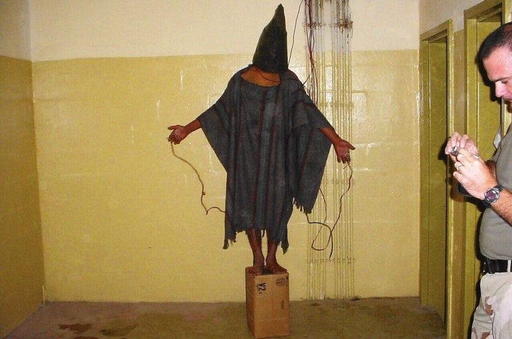

# Tortures and humiliations

This image is taken from the scandal in the **war in Iraq** [[1]](https://en.wikipedia.org/wiki/Iraq_War) about the **Abu Ghraib** [[2]](https://en.wikipedia.org/wiki/Abu_Ghraib) **torture and prisoner abuse** [[3]](https://en.wikipedia.org/wiki/Abu_Ghraib_torture_and_prisoner_abuse). Where **United States Army** [[4]](https://en.wikipedia.org/wiki/United_States_Army) and the **Central Intelligence Agency** [[5]](https://en.wikipedia.org/wiki/Central_Intelligence_Agency) commit a series of **human right violations** [[6]](https://en.wikipedia.org/wiki/Human_rights#Violations).

Here in Spain, in my beloved country, I suffered the same but less physical violations but all in remote in the neural monitoring network. This facility is used by **Guardia Civil** [[7]](https://en.wikipedia.org/wiki/Civil_Guard_(Spain)), the **Spanish National Intelligence Center** [[8]](https://en.wikipedia.org/wiki/National_Intelligence_Centre) and the military forces. Obviously also nobility has got access to it. The infrastructure that I've perfectly described is opened and is from the Franco dictatorship.

What I've suffered has been visualized by almost all the people that I've known in my life. But no one help me, nor who I've been considered my parents. They was thinking that I will commit suicide or I will go crazy. I'm in perfect health and mental state. God bless you.

### External Links

1. https://en.wikipedia.org/wiki/Iraq_War
2. https://en.wikipedia.org/wiki/Abu_Ghraib
3. https://en.wikipedia.org/wiki/Abu_Ghraib_torture_and_prisoner_abuse
4. https://en.wikipedia.org/wiki/United_States_Army
5. https://en.wikipedia.org/wiki/Central_Intelligence_Agency
6. https://en.wikipedia.org/wiki/Human_rights#Violations
7. https://en.wikipedia.org/wiki/Civil_Guard_(Spain)
8. https://en.wikipedia.org/wiki/National_Intelligence_Centre
