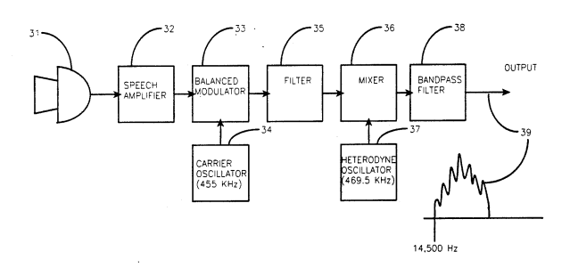

# Subliminal messages service

Voice to skull or v2k is not an invention of psychotic, but it's a technology and it's public from 1989. And people doesn't talk about and many have committed suicide for an available patent that you can retrieve in the **US patent office** [[1]](https://en.wikipedia.org/wiki/United_States_Patent_and_Trademark_Office). It's incredible how cultivated ignorance could destroy nowadays life of people. Incredible how in the XXI century there's senior citizen that for betting and sadism destroy our life. Incredible how a corrupted false democracy could jail in a psychiatric hospital victim of a known technology from about forty years.

*The biggest battle it's the war against ignorance*. It's a phrase from **Mustafa Kemal Atatürk** [[2]](https://en.wikipedia.org/wiki/Mustafa_Kemal_Atat%C3%BCrk), a revolutionary that have lived in the first decades of the last century. 

I'm not an ignorant and I cannot permit that more people of my age die for something that it's only called technology, my passion. They have to be put in jail all. Let's do it.

Start with analysis of those patents and next we can try to launch some open hardware startup and search for help in Internet.

### US5159703

### External links 

1. https://en.wikipedia.org/wiki/United_States_Patent_and_Trademark_Office
2. [https://en.wikipedia.org/wiki/Mustafa_Kemal_Atat%C3%BCrk](https://en.wikipedia.org/wiki/Mustafa_Kemal_Atatürk)