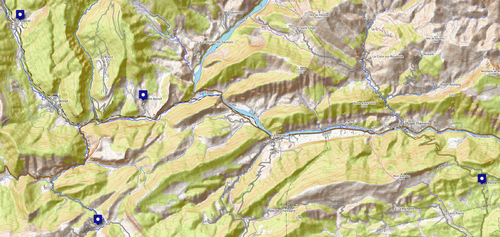

# Noble houses 

> *The word marquess entered the English language from the Frenche marchis ("ruler of a border area") in the late 13th or early 14th century. The French word was derived from marche ("frontier"), itself descended from the Middle Latin marca ("frontier"), from which the modern English words march and mark also descend. The distinction between governors of frontier territories and interior territories was made as early as the founding of the Roman empire when some provinces were set aside for administration by the senate and more unpacified or vulnerable provinces were administered by the emperor. The titles duke and count were similarly distinguished as ranks in the late empire, with dux (literally, "leader") being used for a provincial military governor and the rank of comes (literally "companion," that is, of the Emperor) given to the leader of an active army along the frontier.*

### Durand de la Penne

This is the **escutcheon** [[1]](https://en.wikipedia.org/wiki/Escutcheon_(heraldry)) of the **marquis** [[2]](https://en.wikipedia.org/wiki/Marquess) **Luigi Felice Giuseppe Mario Durand de la Penne** [[3]](https://it.wikipedia.org/wiki/Luigi_Durand_de_la_Penne_(1838)), he was a **general officer** [[4]](https://en.wikipedia.org/wiki/General_officer) in the **Kingdom of Sardinia** [[5]](https://en.wikipedia.org/wiki/Kingdom_of_Sardinia) and also senator of the **senate of Kindom of Italy** [[6]](https://en.wikipedia.org/wiki/Senate_of_the_Kingdom_of_Italy).

This territory in the south of France pertain to the departments of **Alpes-de-Haute-Provence** [[7]](https://en.wikipedia.org/wiki/Alpes-de-Haute-Provence) and **Alpes-Maritimes** [[8]](https://en.wikipedia.org/wiki/Alpes-Maritimes). This last **departments of France** [[9]](https://en.wikipedia.org/wiki/Departments_of_France) is surrounding the **Principality of Monaco** [[10]](https://en.wikipedia.org/wiki/Monaco). But also there's a town near that is called Orange, like the ISP.

https://notes9.senato.it/Web/senregno.NSF/d7aba38662bfb3b8c125785e003c4334/591cf55a86f14ba84125646f005b643e?OpenDocument

In this tab you can appreciate that his address was **via Astalli 15, Rome** [[11]](https://goo.gl/maps/ZR3Ef6kUws5RFgVT9). In this street we've got some point of interest:

- **Society of Jesus** [[12]](https://en.wikipedia.org/wiki/Society_of_Jesus)
- **Weapon of genius** [[13]](https://it.wikipedia.org/wiki/Comando_genio), a very important Italian military division.

Senator Durand de la Penne in an index from "discussions of the senate of the kingdom" from 22 of February  of 1902 to 6 of July of 1904, second session, speak about an high-power **radio-telegraph station** [[14]](https://en.wikipedia.org/wiki/Wireless_telegraphy), **Marconi** [[15]](https://en.wikipedia.org/wiki/Guglielmo_Marconi) system, approved by law of 5 April 1903 in the discussion of the balance of **post and telegraphs** [[16]](https://en.wikipedia.org/wiki/Poste_italiane).

Guglielmo Marconi was an Italian radio pioneer and an **electrical engineer** [[17]](https://en.wikipedia.org/wiki/Electrical_engineering), and my father is also.

One of the child of Senator Durand de la Penne was **Luigi Durand de la Penne** [[18]](https://en.wikipedia.org/wiki/Luigi_Durand_de_la_Penne) born in Genoa on 11 of February 1914 and die on 17 of January 1992. Considered an Italian military hero but in reality *a fascist* belongs to the deadly **Decima Flottiglia MAS** [[19]](https://en.wikipedia.org/wiki/Decima_Flottiglia_MAS).

He is important in the military history because of being a **frogman** [[20]](https://en.wikipedia.org/wiki/Frogman) in the second world war. 

> *The name **frog** [[21]](https://en.wikipedia.org/wiki/Frog), that is an animal, remember me also the swimming style **breaststroke** [[22]](https://en.wikipedia.org/wiki/Breaststroke) that is the only style that swim my mother in open sea, salt water. A frog croak and it could be written as crack. **Crack** [[23]](https://en.wikipedia.org/wiki/Crack_cocaine) is a dope. To crack in computer science is break security with **brute force** [[24]](https://en.wikipedia.org/wiki/Brute-force_attack). In the organization chart of the "Illuminati" facility the frog is the animal that represent who call wife the Catalan head, the butcher. She has destroyed the life of who I was calling brother with exactly this drug, crack. In subliminal message service my mother and the wife of the butcher say that "play" together I think that this could mean that she is the B-side of my mother. She acts like a fascist and my mother is totally church related. But as usual those are only my two cents.* 

Luigi was a **Lieutenant** [[25]](https://en.wikipedia.org/wiki/Lieutenant_(navy)) in the **Italian Navy** [[26]](https://en.wikipedia.org/wiki/Italian_Navy), abbreviated as "MM", *man in the middle or machine but always my two cents*, when on 19 of December 1941 carried out **a raid on Alexandria** [[27]](https://en.wikipedia.org/wiki/Raid_on_Alexandria_(1941)), Egypt, using **manned torpedoes** [[28]](https://en.wikipedia.org/wiki/Human_torpedo), called Maiali that is the animal pig but that can also mean sexual violence, sexual harassment, prostitution. Remember the number 9 always present, masonry, military, nobles, church. Always the same. Was Italy versus Great Britain. Luigi was considered an hero for a great shark attack, under water. The perimeter of the marquisate of this noble family determinate a **shark tooth** [[29]](https://en.wikipedia.org/wiki/Shark_tooth), symbol of **Georgia** [[30]](https://en.wikipedia.org/wiki/Georgia_(country)), a nation with an alphabet composed by hearts (საქართველოს რესპუბლიკა). The perimeter could be interpreted also like an **arrowhead** [[31]](https://en.wikipedia.org/wiki/Arrowhead). The arrowhead is present in the **sagittarius constellation** [[32]](https://en.wikipedia.org/wiki/Sagittarius_(constellation)), Saray is born under the sagittarius. **Gamma2** [[33]](https://en.wikipedia.org/wiki/Gamma2_Sagittarii) in a star in the arrowhead.

> *What does it mean under a noble point of view? Simple this house work with Doe like girls, women who make men fall in love with the ultimate goal of making them lose their mind. To make them lose their business. And with the ultimate goal of ending up in a remote betting system that has as its purpose or well suicide or well the reduction to a small drug dealer of a man, to make him a slave of the Mafia which in turn they use to subjugate the subject. Remember that also Mafia soldiers are utilized by those big noble houses. But this are my two cents nothing more nothing less dear Francesca.*

Luigi was also an Italian political, member of parliament for the **Italian Liberal Party** [[34]](https://en.wikipedia.org/wiki/Italian_Liberal_Party) from 1936 to 1976. On this year he goes out probably because the new secretary of the party called **Valerio Zanone** [[35]](https://en.wikipedia.org/wiki/Valerio_Zanone) opened to the **Socialists** [[36]](https://en.wikipedia.org/wiki/Italian_Socialist_Party). Next in 1983 this party join a **coalition** [[37]](https://en.wikipedia.org/wiki/Coalition) called **Pentapartito** [[38]](https://en.wikipedia.org/wiki/Pentapartito) with names like **Gulio Andreotti** [[39]](https://en.wikipedia.org/wiki/Giulio_Andreotti) one of the most important and controversial political man in Italy. From here the connection with **Silvio Berlusconi** [[40]](https://en.wikipedia.org/wiki/Silvio_Berlusconi). Luigi Durand de la Penne was undersecretary of State for the **Merchant Navy** [[41]](https://it.wikipedia.org/wiki/Marina_mercantile) in the second Andreotti government. 

I want to underline that the number 5 is very important in this family speaking about politics like the number 9 is for military.

Luigi got a son his name was Renzo, my father call him a "*very good man*". I don't know, I've seen him one time in them house in a **crêuza** [[42]](https://it.wikipedia.org/wiki/Cr%C3%AAuza) in the department of Vernazzola an ancient fishing port. Houses pastel harmful colors. Ligurian style. From a newspaper article I know that he fatally dies on 2000 for a sudden illness. Rest in peace.

 So we've got understand how the Durand family in the course of a middle century change their physical position from France east territory to the old **Genoese maritime republic** [[43]](https://en.wikipedia.org/wiki/Republic_of_Genoa), a site full of history and nobles families. They are conquerors and strong promoters of joint venture between Italy and France. Obviously works with Monaco and San Marino without any doubt.

Who is under my crosshair because is guilty of all what I've passed in Barcelona from the loose of my business, my house, my girlfriend, my puppies, my motorbikes and my economic stability to gas lighting, gang stalking, suicide induction, remote betting system, public humiliations and electronic tortures taht had systematically destroy my life and the life of my ex girlfriend, Saray, is her son, Francesca.

Francesca was born in 1981 and probably in March but i really don't remember. Went in my same elementary school in Genoa, **Ettore Vernazza** [[44]](https://www.icsturla.edu.it/pvw/app/default/pvw_sito.php?sede_codice=GEME0058&page=2108518) in **Vittorino Era 1B** [[45]](https://goo.gl/maps/RgkH34F6ovd74WH99) postal code 16147 Genoa; was from 1986 to 1991. I went to section B and she went to section A. All of those children are now in the remote neural monitoring network build by Francesca playing in Carcelona or simply victim of her system. I really don't know if they gain money in the Monopoly board virtual game or not.

> *About Francesca there is totally no information in Internet and this is very strange. Because she is without any doubt the head of this network and this network got clients like Elon Munsk. She is a telecommunication monster and she has got actions from Orange and Yoigo without any doubt. She obviously use covers to hide her. She is very strong and she has changed all Barcelona but she destroy also our life so I decide to fight against her. Sorry Francesca when we was child we was in good relations but you know, my dear, that you took the longest step of the leg and also my parents are guilty. This is a tragedy, I'm so sad Francesca but what you're doing are crimes against humanity. I'm so sorry, you have got a very important surname that I don't have but I've written sufficient pages to put you in jail forever and you know. In subliminal voice service we speak every day and you don't accept to come down to an informal compromise with me after you've tried to kill me for four years. I'm so sad because I was a child with you Francesca, but I'm not a daddy's son and also my parents are at risk of being reported for the same crimes and I don't stop. That's not a game. You destroyed the lives of everyone who called me stupid for four years and led me to suicide. All absolutely all will be judged for the crimes you have forced them to commit. I'm sorry Francesca, I'm very sorry. I respect you, however, you are absolutely not capable of running a business, you are bringing it to the public pillory as you did with me through a fascist persecution that you learned from your family's logbooks. I'm sorry.*

What type of A-side business does they do in the Mediterranean? 

- Head of **Lloyd Italiano** [[46]](https://it.wikipedia.org/wiki/Lloyd_Italiano) and **Lloyd Sabaudo** [[47]](https://it.wikipedia.org/wiki/Lloyd_Sabaudo). **Shipping line** [[48]](https://en.wikipedia.org/wiki/Shipping_line) service, connections with south America.
- From the early '900 hands on radio systems. Probably also related with Vatican radio.
- **Navy** [[49]](https://en.wikipedia.org/wiki/Navy) military forces development. The Italian Navy got two retired **guided missile destroyers** [[50]](https://en.wikipedia.org/wiki/Guided_missile_destroyer) dedicated to them. **Durand de la Penne-class destroyer** [[50]](https://en.wikipedia.org/wiki/Guided_missile_destroyer). Now what is in production take the name of **Horizon project** [[51]](https://en.wikipedia.org/wiki/Horizon-class_frigate), a joint venture between Italy, France and Great Britain but this country go out in 1999. A point of interest speaking about the remote neural monitoring network is the electronic warfare equipment that those military project mount in them **frigates** [[52]](https://en.wikipedia.org/wiki/Frigate). 
- Probably computer science and IT tech support and development for the Jesuits.
- Construction sector.

A couple of informations more that can retrieved on the Internet about the family:

- **Ceremony** [[53]](https://www.gazzettadellaspezia.it/cronaca/item/18645-consegnai-sei-nuovi-baschi-verdi) of conferment of patents of **raiders** [[54]](https://en.wikipedia.org/wiki/Comando_Raggruppamento_Subacquei_e_Incursori_Teseo_Tesei) to the students of the course "Luigi Durand de la Penne".
- History of the **Lloyd Sabaudo** [[55]](https://www.italianliners.com/#!lloyd-sabaudoit/c21ha).
- A construction **company** [[56]](https://www.impresaitalia.info/mstdb80608103/progettazioni-e-costruzioni-durand-de-la-penne-di-sofia-salvetti-e-c-sas/conegliano.aspx).
- Other important **business and sports loads** [[57]](http://www.ilgiornale.it/news/l-ammiraglio-che-non-voleva-titoli.html).
- Her mother registered also like an **autonomous worker** [[58]](https://www.elenchitelefonici.it/GE/GENOVA/ALISA_FEDELINI/ELENCO/0103992857.html).
- An **article** [[59]](http://www.treccani.it/enciclopedia/durand-de-la-penne-luigi) from the institute of the **Italian encyclopedia** [[60]](https://it.wikipedia.org/wiki/Istituto_dell%27Enciclopedia_Italiana).  

Speaking about the family Durand de la Penne I want to demonstrate that they are very connected with my natural family, especially with Mauro Giuntoli my father. I think that he was and is who deals with the management of the underground economy of the family. But i really don't know until now, he is a layer,he lied to me all my life; that is, I'm probably the son of a mobster and I didn't know it. Secondly this person took care of destroying my life in order to prove that I am a great genius of this world full of junk, the techno or better said the neuronal control network that ruined the life of me, Riccardo Giuntoli and love of my life Saray Linares Hervas. 

### Albergo dei nobili

In the middle Age in Liguria and Piemonte nobles family start to create **consortium** [[61]](https://en.wikipedia.org/wiki/Consortium) under the name of "**alberghi**" [[62]](https://it.wikipedia.org/wiki/Albergo_dei_Nobili), the same name used in the Monopoly board game. Small families join "fat nobles" and sometimes acquired their surname. The rules in 1528 from the **Doria family** [[63]](https://en.wikipedia.org/wiki/Doria_(family)) say that a family had the right to open one if they had at least six houses. If they had twelve they could opened a "doppio albergo". The name of this entity took the same of the square where it resided. 

In the Treccani **article** [[64]](http://www.treccani.it/enciclopedia/albergo-dei-nobili_(Enciclopedia-Italiana)/) about it's not clear what is the exact meaning of "house". Because we're speaking about nobles and we're speaking about the old **Republic of Genoa** [[65]](https://en.wikipedia.org/wiki/Republic_of_Genoa) where there was full of **merchants** [[66]](https://en.wikipedia.org/wiki/Merchant). I really don't want to underline it but it is obvious that is also black market related but in those times where not illegal; nowadays yes it is. But why I speak about today? Because what I'm writing about the division of houses in Barcelona in the remote neural monitoring network injected in the audio visual cortex is exactly this. In the encyclopedia we can appreciate that "alberghi" stop on 1576 but I think that they are in use today. And citizens doesn't know it.

The term "alberghi" was created by the ancient order of the **Jerusalem Knights** [[67]](https://it.wikipedia.org/wiki/Cavalieri_gerosolimitani). But why this knight order is important in the middle age Genoa? Because the Republic was present in **Malta** [[68]](https://en.wikipedia.org/wiki/Malta), **Cyprus** [[69]](https://en.wikipedia.org/wiki/Cyprus) and **Jerusalem** [[70]](https://en.wikipedia.org/wiki/Jerusalem). Its **Saint George** [[71]](https://en.wikipedia.org/wiki/Saint_George) **herald** [[72]](https://en.wikipedia.org/wiki/Herald) white with a red cross is present in all the garments of the **crusaders** [[73]](https://en.wikipedia.org/wiki/Crusades).

The 28 "alberghi" open in the XVI century where:

1. Calvi
2. Cattaneo
3. Cicala
4. Cybo
5. De Fornari
6. De Franchi
7. De Marini
8. Di negro
9. Doria
10. Fieschi
11. Gentile
12. Giustiniani
13. Grillo
14. Grimaldi
15. Imperiale
16. Interiano
17. Lercari
18. Lomellini
19. Negrone
20. Pallavicino
21. Pinelli
22. Promontorio
23. Salvago
24. Sauli
25. Spinola
26. Uso di Mare
27. Vivaldi

I personally know some representative from many of those nobles from old nobles from middle Age and also from Republic. Like you can appreciate in this list of old nobles families there isn't the name Durand de la Penne. Francesca Durand de la Penne have rebuild this concept in radio waves.

### The AB/BA Genoese mask

So how does it work this hidden Genoese mafia? First of all it embrace normally two families and it touches both legal stores and black market. The two progenitors work in both AB / BA stores, normally are totally bipolar because live two life, one with a normal with an honest citizen's suit the other like a criminal on radio frequency. Commanding as **Bernardo Provenzano** [[74]](https://en.wikipedia.org/wiki/Bernardo_Provenzano) did with notes, however, this time instead of being written they are in subliminal messages. A totally untold way of commanding a mafia. Bernardo when Italian police broke into his country house he was reading a book, **Roberto Saviano**'s [[75]](https://en.wikipedia.org/wiki/Roberto_Saviano) **Gomorrah** [[76]](https://en.wikipedia.org/wiki/Gomorrah_(book)). My father and his shoulder will do the same, but Bernardo was not the father of Roberto. And another think, and more complex. In the remote neural control network my father and his shoulder are boss, so is reading on real time what I'm writing about. I only need to see the love of my life, but they have sold her like a prostitute.

Who is my family? Coworkers with Durand de la Penne. And probably with a lot of families more, because it seems to be that he is the head of the black market. But I really don't know. 

In reality in Catalunya he's got a shoulder but I've already say this.

Do you know what they're saying just now in subliminal messages? That is a film. Do you know why? Because in this mafia, the digital one, people are like human camera for remote viewing. What is the meaning? That there's a techno mafia network where bosses see whatever i'm doing in real time. What does it mean? That my life is in danger, and you know why? For my father. 

> *But yes, my father is. But what have done my father? Connect this mafia network to international police and to space agencies. So I go all straight.* 

### Casadesús

Catalunya is a territory full of history. A  border territory, where the inhabitants were shaped by history and time in a very special way. They had to adapt to the continuous political and territorial changes, to the different crowns, to the various periods of resistance and to Franco's terror. The Catalans are very complex people, of an enormous culture of which they do not publicly show off anything. You find them immersed in small shops as insignificant as they are actually very ancient noblemen. The Catalans are cryptic and fascinating with their language result of a fusion of territories, a very complicated language; many times they appear to the stranger as rude, haughty, not very open to understanding the foreigner. In reality they are wonderful people, people who struggle, sometimes stupidly preferring the big shopping centers to the traditions of Spain, due to their own cultural identity which however is and remains a Mediterranean culture unlike the Basques who do not even denote the same somatic traits of Europeans . Middle ground is a description that fits perfectly. Hopping from one side of the Pyrenees to the other, the Catalans make agreements between the French Republic and the Spanish monarchy. Unfortunately, however, as always, not all Catalans are aware of these agreements, in reality those who tighten them are few wealthy Catalans from numerous families, ancient and inexhaustible nobles. These numerous families usually have an elegant and reserved public side, entrepreneurs of big names, and another that also mixes among the beggars to control their capital, traffic, tourists and the black market very closely. They look like beggars. They are very rich nobles. It looks like a play on words with the Bourbon dynasty, in Italian the beggars are called barboni only a vocal changes. **Anagrams** [[74]](https://en.wikipedia.org/wiki/Anagram) and **polysemy** [[75]](https://en.wikipedia.org/wiki/Polysemy) are typical of noble houses. 

The Catalan Casdesus **lineage** [[76]](https://en.wikipedia.org/wiki/Lineage_(anthropology)) is widely studied in a web page from an important member of the **family name** [[77]](https://en.wikipedia.org/wiki/Surname), **Enrnest Casadesús Anfrons** [[78]](http://www.casadesus.org/index.php).

As you can appreciate by the vision of the family's distribution in the territory what seems to display is a man with a **walking stick** [[79]](https://en.wikipedia.org/wiki/Walking_stick) crying. This accessory can be considered a weapon, an help to climb mountains, an aid to old age and part of a **ceremonial dress** [[80]](https://en.wikipedia.org/wiki/Ceremonial_dress), speaking of church is typical in the **Eastern Christianity** [[81]](https://en.wikipedia.org/wiki/Eastern_Christianity).

The family tree is public and it's clear that this ancient family are landowners, politicians, merchants, entrepreneurs, workers, artisans and above all connected with the **Benedictine order** [[82]](https://en.wikipedia.org/wiki/Benedictines) unlike Durand de la Penne which is closely connected with the Jesuit order.

The family tree is full of surnames that I've known in Barcelona in the past and they have to be considered also part of the plot that have systematically destroy my life in Spain. But I will not go out from this awesome country, I don't play with life of no one and I thirst for justice. **And justice for all** [[83]](https://www.youtube.com/watch?v=-BG1Ng2pU-8). Connections are:

- Carbonell
- Franco
- Domenech
- Aguilar
- Castells

But this lineage has got relations with others so important surnames in Catalunya but not only so this very numerous family is extremely powerful in this cryptic territory:

- **Pujol** [[84]](https://ca.wikipedia.org/wiki/Jordi_Pujol_i_Soley)
- **Mas** [[85]](https://ca.wikipedia.org/wiki/Artur_Mas_i_Gavarr%C3%B3)
- **Guardiola** [[86]](https://ca.wikipedia.org/wiki/Guardiola)
- **Coma** [[87]](https://ca.wikipedia.org/wiki/Marc_Coma_i_Camps)
- Canaleta 

This last surname it's very important because give it name to the homonym **font** [[88]](https://ca.wikipedia.org/wiki/Font_de_Canaletes) and **Rambla** [[89]](https://ca.wikipedia.org/wiki/La_Rambla) in Barcelona. 

The herald is a mixed between the Catalan **Estelada** [[90]](https://en.wikipedia.org/wiki/Estelada) and saint George, that is present in the herald of Genoa, my born city.

Now the true, who I'm calling "butcher" is from this very important noble family, but he is a genius in hide his real identity. And play a lot of terrific games in a perfect execution. First of all he is playing like a squat, and when I meet him I see him live without any comfort, but he is millionaire. Without any doubt. He is the B-side of this family. Secondly he acts like an hacker, a sadomasochist, a dancer, a motorist, a criminal and so on. He is the most cryptic person that I've known in my life. But I understand him in couple of months and then in remote in this hell network. He is one of the most important figure in this network. At worldwide level. 

Speaking about "alberghi" I can remember that he says that he is from the motorclub Centurioni. But this club it's from Italy! That's all folks! Centurioni in reality is an "albergo" from Genoa **Renaissance** [[91]](https://en.wikipedia.org/wiki/Renaissance). So i deduct that he is very present in the injected augmented reality monopoly created theoretically by the Durand de la Penne family. But he could be also the inventor. I really don't know. I love him but he do stalk to me for two years and he is a professional in **chaos** [[92]](https://en.wikipedia.org/wiki/Chaos_(cosmogony)). Very dangerous mind and very clever. Be careful if you know him, he is a cross-dressing master. Everything he shows you is false at first glance, but very true at second, third or fourth meaning.

> *His real work like a noble it's to be a guardian of this network, his work is put your mind in total confusion to go directly to the psychiatric hospital!*

### Luz de gas discotheque and Casdesus connections

This is the oldest discotheque of Barcelona. In the symbol there is an angel, something that recall the church symbolism, and below light generated by any gas lighting system. But there is something more hidden in this historic club. 

What does it mean "luz de gas"? As usual when we speak about nobles there is a multiple significance:

- **"Luz de gas"** [[93]](https://es.wikipedia.org/wiki/Luz_de_gas_(obra_de_teatro)) is the name of a couple of theater works. The plot is about an husband that try to go crazy his wife. About harassment.
- **Gaslight** [[94]](https://en.wikipedia.org/wiki/Gas_Light) an American **psychological thriller** [[95]](https://en.wikipedia.org/wiki/Psychological_thriller) film adapted from the theater work where the husband slowly manipulate his wife to going her crazy. It reminds me my parents. In my opinion my father have done the same to my mother. Using the remote neural control network. And is what have done my father to me now but using my ex girlfriend Saray. She is harassing me every day in this network where also my parents and a lot of friend of mine are present. In reality I don't go crazy and Saray is going crazy controlling me every thing that I'm doing. She is insane and she needs help. My father is the real **stalker** [[96]](https://en.wikipedia.org/wiki/Stalking). Saray and my mother are victims of this mad the twos are addicted to sedatives.
- **Gaslighting** [[97]](https://en.wikipedia.org/wiki/Gaslighting) or "hacer luz de gas" it's psychological manipulation used in the practice of gang stalking in which a person seeks to sow seeds of doubt in a targeted individual or in members of a targeted group, making them question their own memory, perception, or sanity. Normally the activity of gaslighting got the final goal to manipulate a woman and create a slave. Next this woman is used to harm others mans creating a chain of pain where stalkers gain money with parimutuel betting system. With the remote neural monitoring facility all is remote and very difficult to demonstrate. Womans that fall down sadism normally suffer of bipolarity, sadism and do it because they have suffered, it's very difficult that they admit to perpetuate this crime to third parties. All of those chains started for personal diseases, normally jealousy. Someone, those nobles families, utilize this weak points on people and start a chain of death.

*Please Saray, I love you sweetie, my father has to be put in jail. Please. But in reality he is a victim of those two nobles families. He is mad and he is a sadist.* 

We have speak about theater. **Street theater** [[98]](https://en.wikipedia.org/wiki/Street_theatre) is a sort of performance done by **buskers** [[99]](https://en.wikipedia.org/wiki/Street_performance) in public spaces. But it can be also part of the gaslighting system. Organized stalking is like a coordinate street performance obtained by the use of the remote neural monitoring network, almost undetectable but absolutely true.

Speaking about the connection with Casedesus family and other surnames that I've known in Catalunya I cannot remember Carbonell that is the second surname of man that work with in my in the past in a wireless telecommunication facility in the Sarrià-Sant Gervasi district that is a noble neighborhood of Barcelona. He always go to dance to the Luz de Gas **discotheque** [[100]](https://www.en.luzdegas.com/).

### Considerations

So we speak about coats of arms. And we know what **bloodlines** [[101]](https://en.wikipedia.org/wiki/Heredity) are alive nowadays from public registries. 

What happen in this network? Nobles fish, yes they use this verb to fish, citizen and assign them a coat of arm to use as identification in this network. Who? In transposition. Those coat of arms are used with this diamond technology, that yes it exist, to obtain a pass in certain magnetic areas obviously delimited by some kind of perimeter magnetic control access list. I think, but this only my two cents as usual, that those identifier are applied to our hologram like some kind of virtual tattoo. Those that are fished normally are special persons condemned to forced labor by nobles and church. Why? Probably because they are like zombies. What does I mean? That they pertain to some big family and they don't even know. They have been sold at born in the black market with the purpose to be a black market worker. They are paid, if they are, with a percent on the revenue. Of what? Drug, human and weapons market.

Those bigs work in this market in transposition. But they even don't do this normally, they use slavery to do this. And nowadays is active and is active in Europe.

Coats of arms en reality are public registry of legal **drug cartel** [[102]](https://en.wikipedia.org/wiki/Drug_cartel). If we want to investigate more deeply we've to understand in middle ages the different purposes of every type of nobility present at those times. Man and woman who are enslaved by this technology to work under a shield pertain to an "albergo". This is the real work of Durand de la Penne in Europe, to sell drug, guns and people. And this the B-side. The A-side is all about money cleaning companies useful to inject money obtained from blood to the normal bank circuit. It's all a cycle.

Nobility like what we call as letter soap. Assign different meanings to first key lecture. My parents live in Raffaele Pratolongo 11/B 16131 Genova. At the intersection with Massone and Bernabò Brea.

At the first key of lecture this is only a street address. But no, it isn't:

- 11 is two ones. It could mean a great power or something very important.
- B. B-side. Black market.
- 31. In radio that they define it as the world backwards it could mean 13. This number is death.
- Massone, means **freemasonry** [[103]](https://en.wikipedia.org/wiki/Freemasonry) in Italian.
- Bernabo Brea it's a strange site in them neighborhood. It's a popular neighborhood just near medium class one. Also B.B. could mean B-side.

Why I give to interpretation to what is the first key of lecture. Because this is masonry and nobility. Thinks are behind what we see. All of this network is build upon this concept.

My parents could work without any question at high level in the black market in transposition probably for the Durand de la Penne drug cartel.

### External links

1. https://en.wikipedia.org/wiki/Escutcheon_(heraldry)
2. https://en.wikipedia.org/wiki/Marquess
3. https://it.wikipedia.org/wiki/Luigi_Durand_de_la_Penne_(1838)
4. https://en.wikipedia.org/wiki/General_officer
5. https://en.wikipedia.org/wiki/Kingdom_of_Sardinia
6. https://en.wikipedia.org/wiki/Senate_of_the_Kingdom_of_Italy
7. https://en.wikipedia.org/wiki/Alpes-de-Haute-Provence
8. https://en.wikipedia.org/wiki/Alpes-Maritimes
9. https://en.wikipedia.org/wiki/Departments_of_France
10. https://en.wikipedia.org/wiki/Monaco
11. https://goo.gl/maps/ZR3Ef6kUws5RFgVT9
12. https://en.wikipedia.org/wiki/Society_of_Jesus
13. https://it.wikipedia.org/wiki/Comando_genio
14. https://en.wikipedia.org/wiki/Wireless_telegraphy
15. https://en.wikipedia.org/wiki/Guglielmo_Marconi
16. https://en.wikipedia.org/wiki/Poste_italiane
17. https://en.wikipedia.org/wiki/Electrical_engineering
18. https://en.wikipedia.org/wiki/Luigi_Durand_de_la_Penne
19. https://en.wikipedia.org/wiki/Decima_Flottiglia_MAS
20. https://en.wikipedia.org/wiki/Frogman
21. https://en.wikipedia.org/wiki/Frog
22. https://en.wikipedia.org/wiki/Breaststroke
23. https://en.wikipedia.org/wiki/Crack_cocaine
24. https://en.wikipedia.org/wiki/Brute-force_attack
25. https://en.wikipedia.org/wiki/Lieutenant_(navy)
26. https://en.wikipedia.org/wiki/Italian_Navy
27. https://en.wikipedia.org/wiki/Raid_on_Alexandria_(1941)
28. https://en.wikipedia.org/wiki/Human_torpedo
29. https://en.wikipedia.org/wiki/Shark_tooth
30. https://en.wikipedia.org/wiki/Georgia_(country)
31. https://en.wikipedia.org/wiki/Arrowhead
32. https://en.wikipedia.org/wiki/Sagittarius_(constellation)
33. https://en.wikipedia.org/wiki/Gamma2_Sagittarii
34. https://en.wikipedia.org/wiki/Italian_Liberal_Party
35. https://en.wikipedia.org/wiki/Valerio_Zanone
36. https://en.wikipedia.org/wiki/Italian_Socialist_Party
37. https://en.wikipedia.org/wiki/Coalition
38. https://en.wikipedia.org/wiki/Pentapartito
39. https://en.wikipedia.org/wiki/Giulio_Andreotti
40. https://en.wikipedia.org/wiki/Silvio_Berlusconi
41. https://it.wikipedia.org/wiki/Marina_mercantile
42. [https://it.wikipedia.org/wiki/Cr%C3%AAuza](https://it.wikipedia.org/wiki/Crêuza)
43. https://en.wikipedia.org/wiki/Republic_of_Genoa
44. https://www.icsturla.edu.it/pvw/app/default/pvw_sito.php?sede_codice=GEME0058&page=2108518
45. https://goo.gl/maps/RgkH34F6ovd74WH99
46. https://it.wikipedia.org/wiki/Lloyd_Italiano
47. https://it.wikipedia.org/wiki/Lloyd_Sabaudo
48. https://en.wikipedia.org/wiki/Navy
49. https://en.wikipedia.org/wiki/Guided_missile_destroyer
50. https://en.wikipedia.org/wiki/Durand_de_la_Penne-class_destroyer
51. https://en.wikipedia.org/wiki/Horizon-class_frigate
52. https://en.wikipedia.org/wiki/Frigate
53. https://www.gazzettadellaspezia.it/cronaca/item/18645-consegnai-sei-nuovi-baschi-verdi
54. https://en.wikipedia.org/wiki/Comando_Raggruppamento_Subacquei_e_Incursori_Teseo_Tesei
55. https://www.italianliners.com/#!lloyd-sabaudoit/c21ha
56. https://www.impresaitalia.info/mstdb80608103/progettazioni-e-costruzioni-durand-de-la-penne-di-sofia-salvetti-e-c-sas/conegliano.aspx
57. http://www.ilgiornale.it/news/l-ammiraglio-che-non-voleva-titoli.html
58. https://www.elenchitelefonici.it/GE/GENOVA/ALISA_FEDELINI/ELENCO/0103992857.html
59. http://www.treccani.it/enciclopedia/durand-de-la-penne-luigi
60. [https://it.wikipedia.org/wiki/Istituto_dell%27Enciclopedia_Italiana](https://it.wikipedia.org/wiki/Istituto_dell'Enciclopedia_Italiana)
61. https://en.wikipedia.org/wiki/Consortium
62. https://it.wikipedia.org/wiki/Albergo_dei_Nobili
63. https://en.wikipedia.org/wiki/Doria_(family)
64. http://www.treccani.it/enciclopedia/albergo-dei-nobili_(Enciclopedia-Italiana)/
65. https://en.wikipedia.org/wiki/Republic_of_Genoa
66. https://en.wikipedia.org/wiki/Merchant
67. https://it.wikipedia.org/wiki/Cavalieri_gerosolimitani
68. https://en.wikipedia.org/wiki/Malta
69. https://en.wikipedia.org/wiki/Cyprus
70. https://en.wikipedia.org/wiki/Jerusalem
71. https://en.wikipedia.org/wiki/Saint_George
72. https://en.wikipedia.org/wiki/Herald
73. https://en.wikipedia.org/wiki/Crusades
74. https://en.wikipedia.org/wiki/Bernardo_Provenzano
75. https://en.wikipedia.org/wiki/Roberto_Saviano
76. https://en.wikipedia.org/wiki/Gomorrah_(book)
77. https://en.wikipedia.org/wiki/Anagram
78. https://en.wikipedia.org/wiki/Polysemy
79. https://en.wikipedia.org/wiki/Lineage_(anthropology)
80. https://en.wikipedia.org/wiki/Surname
81. http://www.casadesus.org/index.php
82. https://en.wikipedia.org/wiki/Walking_stick
83. https://en.wikipedia.org/wiki/Ceremonial_dress
84. https://en.wikipedia.org/wiki/Eastern_Christianity
85. https://en.wikipedia.org/wiki/Benedictines
86. https://www.youtube.com/watch?v=-BG1Ng2pU-8
87. https://ca.wikipedia.org/wiki/Jordi_Pujol_i_Soley
88. [https://ca.wikipedia.org/wiki/Artur_Mas_i_Gavarr%C3%B3](https://ca.wikipedia.org/wiki/Artur_Mas_i_Gavarró)
89. https://ca.wikipedia.org/wiki/Guardiola
90. https://ca.wikipedia.org/wiki/Marc_Coma_i_Camps
91. https://ca.wikipedia.org/wiki/Font_de_Canaletes
92. https://ca.wikipedia.org/wiki/La_Rambla
93. https://en.wikipedia.org/wiki/Estelada
94. https://en.wikipedia.org/wiki/Renaissance
95. https://en.wikipedia.org/wiki/Chaos_(cosmogony)
96. https://es.wikipedia.org/wiki/Luz_de_gas_(obra_de_teatro)
97. https://en.wikipedia.org/wiki/Gas_Light
98. https://en.wikipedia.org/wiki/Psychological_thriller
99. https://en.wikipedia.org/wiki/Stalking
100. https://en.wikipedia.org/wiki/Gaslighting
101. https://en.wikipedia.org/wiki/Street_theatre
102. https://en.wikipedia.org/wiki/Street_performance
103. https://www.en.luzdegas.com/
104. https://en.wikipedia.org/wiki/Heredity
105. https://en.wikipedia.org/wiki/Drug_cartel
106. https://en.wikipedia.org/wiki/Freemasonry

